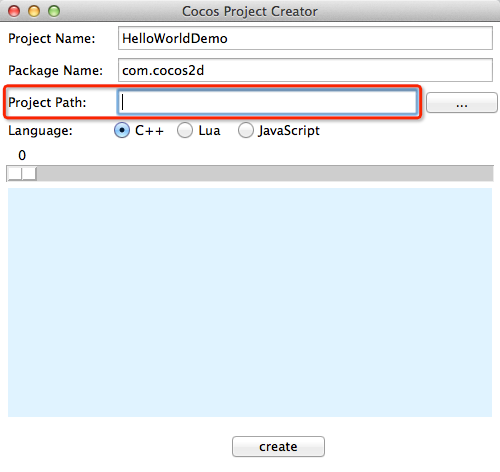

#Xcode下运行HelloWorld

##准备工作

到Cocos2d-x官方网站下载最新版本[v3.0beta2](http://cocos2d-x.org/download)


##创建HelloWorld项目

将刚才下载的压缩包解压到你指定的文件夹里。

进入到目录**cocos2d-x-3.0beta2/tools/project-creator**

打开终端运行**create_project.py**脚本创建文件

```
./create_project.py

或者

python create_project.py
```

此版本项目创建脚本支持图形界面方式创建项目，执行以上脚本后会出现图形界面:


填写项目名称，包名称以及项目路径后选择开发语言，即可点击**create**开始创建项目:




##运行项目

项目创建完成后，用Xcode打开**HelloWorldDemo/proj.ios_mac**里的Xcode项目文件，运行项目


