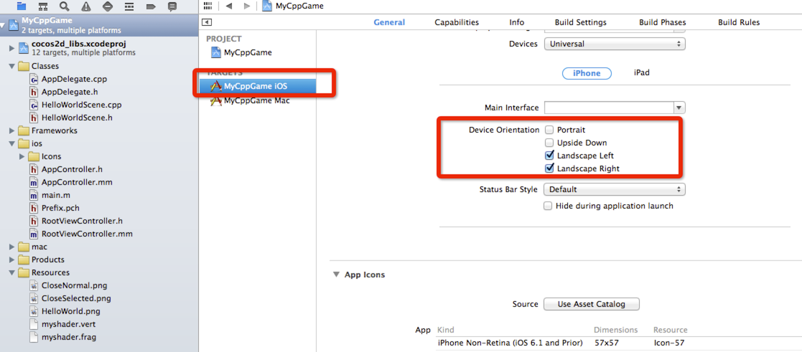
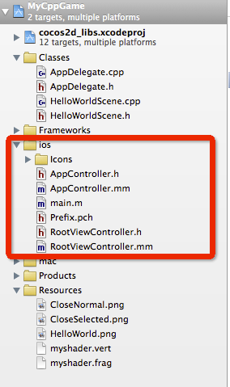
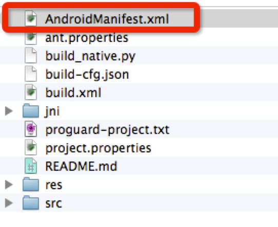
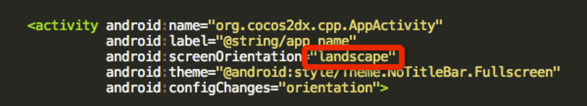

# 设备方向(Device Orientation)

## 设置iOS设备方向

iOS设备有四种方向:

- Portrait
- Upside Down
- Landscape Left
- Landscape Right


你也可以在你的项目的目标的General选项卡中查看它们，看看下面的截图：（要特别注意红色的轮廓）



当你创建一个新的 Cocos2d-x, 默认设置支持 **Landscape Left** 和 **Landscape Right**.

现在修改默认横屏为竖屏。

打开ios组下面的 RootViewController.mm:



然后找到下面代码:

```
- (BOOL)shouldAutorotateToInterfaceOrientation:(UIInterfaceOrientation)interfaceOrientation {
    return UIInterfaceOrientationIsLandscape( interfaceOrientation );
}

// For ios6, use supportedInterfaceOrientations & shouldAutorotate instead
- (NSUInteger) supportedInterfaceOrientations{
#ifdef __IPHONE_6_0
    return UIInterfaceOrientationMaskAllButUpsideDown;
#endif
}
```

你应该用下面的替换它，如果你想强制设备方向为竖屏模式：

```
- (BOOL)shouldAutorotateToInterfaceOrientation:(UIInterfaceOrientation)interfaceOrientation {
    return UIInterfaceOrientationIsPortrait( interfaceOrientation );
}

// For ios6, use supportedInterfaceOrientations & shouldAutorotate instead
- (NSUInteger) supportedInterfaceOrientations{
#ifdef __IPHONE_6_0
    return UIInterfaceOrientationMaskPortrait;
#endif
}
```


你可以保存命令，然后单击宏** UIInterfaceOrientationMaskPortrait**看其他选项。 

现在，编译并在Xcode中运行它，它现在应该是竖屏模式。

##Set Device Orientation for Android
查找并打开 **AndroidManifest.xml** 文件在你的 **proj.android** 文件夹下:



找到下面代码:



此次我们仅仅需要将横屏改为竖屏。它是不是很简单。
