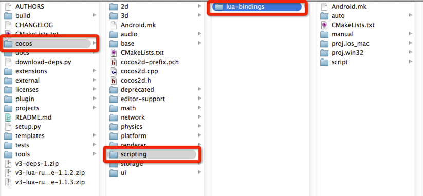

#Lua 绑定的文件结构

Cocos2d-X包自带Cocos2d-X Lua 绑定。你可以从我们的下载界面下载它。然后解压它，你会看见如下的文件结构：

所有的Lua绑定代码在`cocos/scripting/lua-bindings/auto`和`cocos/scripting/lua-bindings/manual`目录下。

如文件名所说的，auto文件夹包含所有[bindings generator](https://github.com/cocos2d/bindings-generator)生成的绑定代码。 manual文件夹包含所有手写绑定代码。由于bindings generator的限制。这里还有一些 粘(glue)Lua代码放在script目录下。

如果你是好奇的实现细节，不要犹豫，潜入这些文件。

