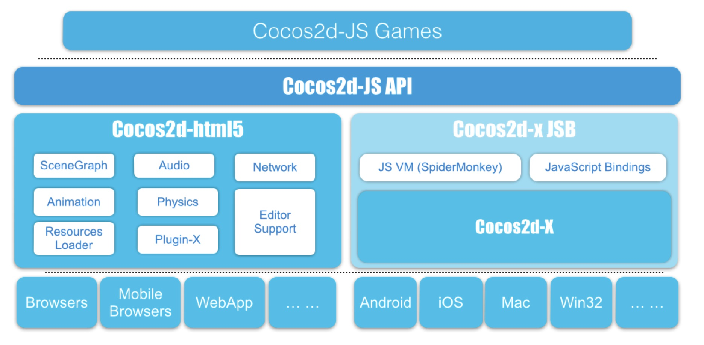

#开始使用Cocos2d-JS

##介绍

Cocos2d-JS是从Cocos2D-X团队最新分拆的。它是用Javascript编写针对HTML5标准的浏览器和Cocos2d-x的JavaScript绑定（JSB）。该API是从Cocos2d-x派生的，为此，如果你有Cocos2d游戏引擎的使用经验，你已经知道如何使用Cocos2d-HTML5。如果你以前从未使用Cocos2d的游戏引擎，不用担心，本文将教给你一切你需要知道的开始的一切。 

Cocos2d-JS包含Cocos2d-HTML5和Cocos2d-x JSB。因为Cocos2d-HTML5是基于Web的，你可以在任何平台上写你的应用程序，只要你有机会到一个文本编辑器，因为它的基于Web的，你的应用程序可以在所有可访问到Web浏览器（ HTML5兼容的）的任何设备上运行！非常方便，奇妙，“未来是在你的浏览器中”。

Cocos2d-JS提供一个发布到任何平台一致的开发经验，Web和本地。 “编码一次，到处运行”是非常容易和自然在Cocos2d-JS中。用单一的JavaScript代码库，你可以在Web浏览器和本地平台包括Mac OS，Windows，IOS，Android上运行游戏。这将为你的游戏带来巨大的商机，发布到几乎所有的渠道。

##初学者动手
- [Cocos2d-JS的文件结构](http://www.cocos2d-x.org/wiki/Folder_Structure_of_Cocos2d-JS)
- [如何创建一个Cocos2d-JS的新项目](http://cocos2d-x.org/docs/manual/framework/html5/v2/cocos-console/en)

###Cocos2d-JS v3.x Parkour 游戏教程

- [Cocos2d-JS 教程 1: 搭建 Cocos2d-JS 开发环境](http://cocos2d-x.org/docs/tutorial/framework/html5/parkour-game-with-javascript-v3.0/chapter1/en)
- [Cocos2d-JS 教程 2: 你好Cocos2d-JS世界](http://cocos2d-x.org/docs/tutorial/framework/html5/parkour-game-with-javascript-v3.0/chapter2/en)
- [Cocos2d-JS 教程 3: 制作你的第一个游戏场景](http://cocos2d-x.org/docs/tutorial/framework/html5/parkour-game-with-javascript-v3.0/chapter3/en)
- [Cocos2d-JS 教程 4: 设计并制作你的游戏场景](http://cocos2d-x.org/docs/tutorial/framework/html5/parkour-game-with-javascript-v3.0/chapter4/en)
- [Cocos2d-JS 教程 5: 让角色动起来](http://cocos2d-x.org/docs/tutorial/framework/html5/parkour-game-with-javascript-v3.0/chapter5/en)
- [Cocos2d-JS 教程 6: 添加 Chipmunk 物理引擎到我们的游戏](http://cocos2d-x.org/docs/tutorial/framework/html5/parkour-game-with-javascript-v3.0/chapter6/en)
- [Cocos2d-JS 教程 7: 制作瓦片地图资源并显示](http://cocos2d-x.org/docs/tutorial/framework/html5/parkour-game-with-javascript-v3.0/chapter7/en)
- [Cocos2d-JS 教程 8: 添加 金币和障碍到我们的游戏](http://cocos2d-x.org/docs/tutorial/framework/html5/parkour-game-with-javascript-v3.0/chapter8/en)
- [Cocos2d-JS 教程 9: 实现游戏结束逻辑和更多](http://cocos2d-x.org/docs/tutorial/framework/html5/parkour-game-with-javascript-v3.0/chapter9/en)
- [Cocos2d-JS 教程 10: 添加音效到 Parkour 游戏](http://cocos2d-x.org/docs/tutorial/framework/html5/parkour-game-with-javascript-v3.0/chapter10/en)

###Cocos2d-html5 v2.2.x Parkour 游戏教程
Cocos2d-HTML5
- [Cocos2d-HTML5 教程 1: 搭建 Cocos2d-HTML5 开发环境](http://cocos2d-x.org/docs/tutorial/framework/html5/parkour-game-with-javascript/chapter1/en)
- [Cocos2d-HTML5 教程 2: 你好 Cocos2d-HTML5世界](http://cocos2d-x.org/docs/tutorial/framework/html5/parkour-game-with-javascript/chapter2/en)
- [Cocos2d-HTML5 教程 3: 制作你的第一个游戏场景](http://cocos2d-x.org/docs/tutorial/framework/html5/parkour-game-with-javascript/chapter3/en)
- [Cocos2d-HTML5 教程 4: 设计并制作你的游戏场景](http://cocos2d-x.org/docs/tutorial/framework/html5/parkour-game-with-javascript/chapter4/en)
- [Cocos2d-HTML5 教程 5: 让角色动起来](http://cocos2d-x.org/docs/tutorial/framework/html5/parkour-game-with-javascript/chapter5/en)
- [Cocos2d-HTML5 教程 6: 添加 Chipmunk 物理引擎到我们的游戏](http://cocos2d-x.org/docs/tutorial/framework/html5/parkour-game-with-javascript/chapter6/en)
- [Cocos2d-HTML5 教程 7: 制作瓦片地图资源并显示](http://cocos2d-x.org/docs/tutorial/framework/html5/parkour-game-with-javascript/chapter7/en)
- [Cocos2d-HTML5 教程 8: 添加 金币和障碍到我们的游戏](http://cocos2d-x.org/docs/tutorial/framework/html5/parkour-game-with-javascript/chapter8/en)
- [Cocos2d-HTML5 教程 9: 实现游戏结束逻辑和更多](http://cocos2d-x.org/docs/tutorial/framework/html5/parkour-game-with-javascript/chapter9/en)
- [Cocos2d-HTML5 教程 10: 添加音效到 Parkour 游戏](http://cocos2d-x.org/docs/tutorial/framework/html5/parkour-game-with-javascript/chapter10/en)

##进阶
- [使用Firefox远程调试Cocos2d-JS](http://cocos2d-x.org/docs/manual/framework/native/v3/js-remote-debugger/en)
- [理解Cocos2d-html5 2.2.2中的分辨率策略](http://www.cocos2d-x.org/wiki/Understand_the_Resolution_Policy_in_Cocos2d-html5_222)

## 3.0版本中新特性和API变化
- [新的事件管理](http://www.cocos2d-x.org/wiki/Getting_Started_Cocos2d-JS)

##结束语

我希望这个简短的Cocos2d-JS介绍对你有帮助。希望你觉得的Cocos2d-JS是一个易于安装，易于学习，易于使用的框架。你可以使用Cocos2d-JS高效的完成你的游戏，并跨浏览器运行它。 

如果您喜欢这个让我知道。可以通过Twitter关注：[http://www.twitter.com/cocos2dx](http://www.twitter.com/cocos2dx)！
