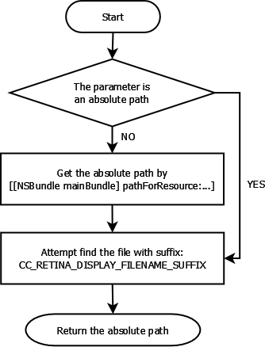

# CCFileUTils::fullPathForFilename 是如何工作的

##概述

- 本文档的目的是向你展示`FileUtils::fullPathForFilename()`在不同的平台是如何工作的。 
- 该文档基于引擎版本：Cocos2d-X2.1 
- `FileUtils::fullPathForFilename()` 在某些平台上不返回绝对路径。 
- 如果你想获得一个可写的路径，尝试使用接口`FileUtils::getWritablePath()`。

##iOS 

## android

该函数直接返回参数。.apk文件的绝对路径。

##win32

