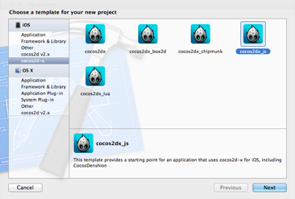
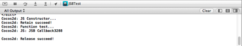

# 如何将C++绑定至Javascript

## 简介

Cocos2d JS API接口与Cocos2d-x、Cocos2d-iphone及Cocos2d-html5相同。Cocos2d-html5是通过浏览器在移动设备上运行，Cocos2d-iphone和Cocos2d-x内的JSB可以大幅提升引擎性能。所有图形、渲染及物理库代码都会在本地运行，只有游戏逻辑会在Java脚本中运行。

将游戏代码移植到脚本语言不仅仅是基于跨平台角度，还有很多其他的优势。因为代码是未编译的，所有在运行时期可以替换，从而加快测试周期。

## 为什么选择Javascript？

Javascript脚本优点如下：

- 更快开发速度
- 非常适合原型
- 比其他编译语言简单易懂
- 可移植性

支持JSB绑定的项目：

- Cocos2d-x
- Chipmunk
- CocosBuilder Reader

这意味着你可以使用CocosBuilder作为实际诶编辑器创建Cocos2d-x+Chipmunk游戏。Cocos2D附带“Watermelon With Me”样本游戏，该游戏用到了cocos2d、chipmunk物理库及CocosBuilder。

## Javascript性能

Cocos2d-X使用SpiderMonkey和Firefox JS virtual machine (VM)来执行JS代码。
JS VM可扩展支持所有cocos2d引擎、Chipmunk库以及CocosBuilder Reader API接口。所以用JS创建“CCSprite”时，实际上是在创建C++“CCSprite”。用JS创建动作时，实际上是在创建C++动作。在用JS创建粒子系统时，实际是在创建C++粒子系统以此类推。
这种方法的速度要比HTML5快10到20倍，即便HTML5采用“directCanvas”等加速器。

基本上所有cocos2d、Chipmunk库或CocosBuilder Reader API接口几乎都会以本地速度运行。但是应该注意以下情况：
- 当垃圾收集器（garbage collector）运行时性能可能会降低。解决方法：不要创建很多JS对象，尽可能重复利用。
- 如果主循环太复杂可能会降低性能。解决方法：profile（绘出轮廓）你的JS代码，如果无法优化代码，可在C++中编写昂贵（expensive）的部分，然后为这些函数创建JSB绑定。

## 绑定生成器

### 如何工作

绑定生成器（Bindings-generator）是一个Java脚本绑定生成器，会生成自动绑定spidermonkey目标Java脚本的C/C++代码。
GitHub资源库工具下载：[https://github.com/cocos2d/bindings-generator](https://github.com/cocos2d/bindings-generator)

### 要求

1. 下载绑定生成器，本机路径/Users/iven/Dev/bindings-generator
2. 为了在Mac OS X中安装运行MacPort端口，系统必须要已经安装苹果的“Command Line Developer Tools”（命令行开发者工具）。Xcode 4及以后版本的用户首先需要通过启动或运行Xcode接受Xcode EULA。

	```
	xcodebuild -license
	```
3. 下载安装MacPort：[http://www.macports.org/install.php](http://www.macports.org/install.php)。
	注意：如果是Homebrew用户，应该先卸载Homebrew。因为Homebrew不兼容MacPort。
	同时执行MacPort的“selfupdate”命令以确保安装最新的发布版本。

	```
	sudo port -v selfupdate
	```

	当更新完成之后，使用MacPort在命令行中安装python依赖（dependencies）

	```
	sudo port install python27 py27-yaml py27-cheetah 
	```
	你会看到如下所示：
	
4. 下载llvm-3.3：[http://llvm.org/releases/download.html#3.3](http://llvm.org/releases/download.html#3.3)，解压至$HOME/bin目录。如果没有bin目录，请创建一个bin目录，将未解压的ZIP压缩包重命名为“clang+llvm-3.3”。
	最后目录如下所示：/Users/guanghui/bin/clang+llvm-3.3（guanhui是本机的主目录名字）
5. 下载Android-NDKR8 [http://dl.google.com/android/ndk/android-ndk-r8e-darwin-x86_64.tar.bz2](http://dl.google.com/android/ndk/android-ndk-r8e-darwin-x86_64.tar.bz2)并解压。
## 样本代码
绑定生成器资源库中包括一个样本测试用例。打开bindings-generator/test/simple_test文件夹。

### 配置

- 根据自己的环境个性化设置“test/userconf.ini”和“test/user.cfg”文件。
	注意：应该移除后缀为“.sample”的文件如“user.cfg.sample”和“userconf.ini.sample”

	```
	[DEFAULT]
	androidndkdir=/Users/iven/Dev/android-ndk-r8c
	clangllvmdir=/Users/iven/Dev/clang+llvm-3.1-x86_64-apple-darwin11
	cxxgeneratordir=/Users/iven/Dev/bindings-generator-master
	```

	user.cfg配置如下所示

	```
	PYTHON_BIN=/opt/local/Library/Frameworks/Python.framework/Versions/2.7/bin/	python2.7
	```
- 运行测试样本
	```
	./test.sh
	```

	如果环境设置正确，你会看到如下所示：
	```
	Errors in parsing headers:
	1. <severity = Warning,
    location =<SourceLocation file None, line 0, column 0>,
	details = "argument unusedduring compilation: '-nostdinc++'"> 
	```
不用担心这个警告，你已完成运行，测试用例会创建一个包含3个文件的“simple_test_bindings”目录。

- 一个绑定类的.hpp头文件
- 一个实现绑定类的.cpp文件
- 一个介绍如何（从Java脚本）调用C++类暴露方法的.js文件。
### 运行测试
- Create a JS base Cocos2d-x project. 创建基于JS的Cocos2d-x项目
	
- 将“simple_Test folder”文件夹和“simple_test_binding”文件夹添加到项目中

- 修改“autogentestbindings.cpp”中的注册函数如下：

	```
	void register_all_autogentestbindings(JSContext* cx, JSObject* obj) {
	    jsval nsval;
	    JSObject *ns;
	    JS_GetProperty(cx, obj, "ts",&nsval);
	    if (nsval == JSVAL_VOID) {
	        ns = JS_NewObject(cx, NULL, NULL, NULL);
	        nsval = OBJECT_TO_JSVAL(ns);
 	       JS_SetProperty(cx, obj, "ts",&nsval);
	    } else {
 	       JS_ValueToObject(cx,nsval, &ns);
 	   }
 	   obj = ns;
 	   js_register_autogentestbindings_SimpleNativeClass(cx, obj);
	}
	```
	注意：如果你将“ts”添加到“test.ini”文件中的“target_namespace”变量里，便会自动生成代码。无需修改。
	
	```
	 target_namespace =ts
	```
		
- 在“AppDelegate”中注册

	包含头文件“autogentestbindings.hpp”然后注册回调函数：

	```
	sc->addRegisterCallback(register_all_autogentestbindings); 
	```

- 在“hello.js”文件适当地方增加以下代码。本机将“init f”函数放在第一个场景。

	```
	var myClass=new ts.SimpleNativeClass();
	var myStr=myClass.returnsACString();     
	var label = cc.LabelTTF.create(myStr, "Helvetica", 20.0);
	```
	
### 限制

绑定生成器存在以下两个限制

- 自变量数字参数无法工作，所以需要手动编写包装器
- 代表类无法工作，所以需要手动绑定，详见下一部分。

## 手动 JSB 绑定
本指南将介绍利用Cocos2d-x 2.14模板如何在自己的项目中实现JSB绑定。
首先用Cocos2d-js模板创建项目。其次，我们会介绍如何一步一步从JS调用本地函数。最后你便会学会如何从本地代码调用JS代码了。
现在让我们开始！本机使用的Mac OS X作为开发环境。

**步骤1**. 用Cocos2dx-js模板创建新项目，同时新建一个即将绑定至JS的C++类。

将项目命名为“JSBinding”然后点击“Next”、“ Create”


新建一个类然后实现这个类，等会再将其绑定至JS。
按“command+N”新建一个C++类并命名为“JSBinding”，路径为“OS X\C and C++\C++ Class”。

将以下代码添加到“JSBinding.h”文件中。
```
#include "cocos2d.h" 
#include "ScriptingCore.h" 
// Define a namespace to manage your code and make your code clearly
namespace JSB {
    class JSBinding: public cocos2d::CCObject
    {
    public:
        static cocos2d::CCScene* scene();
        virtual bool init();
        CREATE_FUNC(JSBinding);
        void functionTest();
    };
}
```
现在实现JSBinding.cpp中的类。如下所示：
```
bool JSB::JSBinding::init(){
    bool bRef = false;
    do{
        cocos2d::CCLog("JSB init...");
        bRef = true;
    } while (0);
    return bRef;
}
void JSB::JSBinding::functionTest(){
    cocos2d::CCLog("Function test...");
}
```
**步骤2**. 将C++代码绑定至Java脚本代码

按“command+N”新建C++类，然后命名“JSB_AUTO”路径“OS X\C and C++\C++ Class”。

往“JSB_AUTO.h”文件中增加一些代码
```
#include "jsapi.h" 
#include "jsfriendapi.h" 
#include "ScriptingCore.h" 
#include "JSBinding.h" 
void register_all(JSContext* cx, JSObject* obj);
```

然后注意“JSB_AUTO.cpp”的实现。

```
#include "jsapi.h" 
#include "jsfriendapi.h" 
#include "ScriptingCore.h" 
#include "JSBinding.h" 
void register_all(JSContext* cx, JSObject* obj);
```
然后注意“JSB_AUTO.cpp”的实现。
```
#include "cocos2d.h" 
#include "cocos2d_specifics.hpp" 
// Binding specific object by defining JSClass
JSClass*        jsb_class;
JSObject*       jsb_prototype;
// This function is mapping the function “functionTest” in “JSBinding.cpp”
JSBool js_functionTest(JSContext* cx, uint32_t argc, jsval* vp){
    JSBool ok = JS_TRUE;
    JSObject* obj = NULL;
    JSB::JSBinding* cobj = NULL;
    obj = JS_THIS_OBJECT(cx, vp);
    js_proxy_t* proxy = jsb_get_js_proxy(obj);
    cobj = (JSB::JSBinding* )(proxy ? proxy->ptr : NULL);
    JSB_PRECONDITION2(cobj, cx, JS_FALSE, "Invalid Native Object");
    if (argc == 0) {
        cobj->functionTest();
        JS_SET_RVAL(cx, vp, JSVAL_VOID);
        return ok;
    }
    JS_ReportError(cx, "Wrong number of arguments");
    return JS_FALSE;
}
JSBool js_constructor(JSContext* cx, uint32_t argc, jsval* vp){
    cocos2d::CCLog("JS Constructor...");
    if (argc == 0) {
        JSB::JSBinding* cobj = new JSB::JSBinding();
        cocos2d::CCObject* ccobj = dynamic_cast<cocos2d::CCObject*>(cobj);
if (ccobj) {
            ccobj->autorelease();
        }
        TypeTest<JSB::JSBinding> t;
        js_type_class_t* typeClass;
        uint32_t typeId = t.s_id();
        HASH_FIND_INT(_js_global_type_ht, &typeId, typeClass);
        assert(typeClass);
        JSObject* obj = JS_NewObject(cx, typeClass->jsclass, typeClass->proto, typeClass->parentProto);
        JS_SET_RVAL(cx, vp, OBJECT_TO_JSVAL(obj));
        js_proxy_t* p = jsb_new_proxy(cobj, obj);
        JS_AddNamedObjectRoot(cx, &p->obj, "JSB::JSBinding");
        return JS_TRUE;
    }
    JS_ReportError(cx, "Wrong number of arguments: %d, was expecting: %d", argc, 0);
    return JS_FALSE;
}
// This function is mapping the function “create” when using JavaScript code
JSBool js_create(JSContext* cx, uint32_t argc, jsval* vp){
    cocos2d::CCLog("js is creating...");
    if (argc == 0) {
        JSB::JSBinding* ret = JSB::JSBinding::create();
        jsval jsret;
        do{
            if (ret) {
                js_proxy_t* proxy = js_get_or_create_proxy<JSB::JSBinding>(cx, ret);
                jsret = OBJECT_TO_JSVAL(proxy->obj);
            }
            else{
                jsret = JSVAL_NULL;
            }
        } while(0);
        JS_SET_RVAL(cx, vp, jsret);
        return JS_FALSE;
    }
JS_ReportError(cx, "Wrong number of arguments");
    return JS_FALSE;
}
void js_finalize(JSFreeOp* fop, JSObject* obj){
    CCLOGINFO("JSBindings: finallizing JS object %p JSB", obj);
}
// Binding JSB type
void js_register(JSContext* cx, JSObject* global){
    jsb_class = (JSClass *)calloc(1, sizeof(JSClass));
    jsb_class->name = "JSBinding";
    jsb_class->addProperty = JS_PropertyStub;
    jsb_class->delProperty = JS_PropertyStub;
    jsb_class->getProperty = JS_PropertyStub;
    jsb_class->setProperty = JS_StrictPropertyStub;
    jsb_class->enumerate = JS_EnumerateStub;
    jsb_class->resolve = JS_ResolveStub;
    jsb_class->convert = JS_ConvertStub;
    jsb_class->finalize = js_finalize;
    jsb_class->flags = JSCLASS_HAS_RESERVED_SLOTS(2);
    static JSPropertySpec properties[] = {
        {0, 0, 0, JSOP_NULLWRAPPER, JSOP_NULLWRAPPER}
    };
    // Binding functionTest function
    static JSFunctionSpec funcs[] = {
        JS_FN("functionTest", js_functionTest, 1, JSPROP_PERMANENT | JSPROP_ENUMERATE),
        JS_FS_END
    };
    // Binding create() function
    static JSFunctionSpec st_funcs[] = {
        JS_FN("create", js_create, 0, JSPROP_PERMANENT | JSPROP_ENUMERATE),
        JS_FS_END
    };
    // Binding constructor function and prototype
 jsb_prototype = JS_InitClass(
                                 cx, global,
                                 NULL,
                                 jsb_class,
                                 js_constructor, 0,
                                 properties,
                                 funcs,
                                 NULL,
                                 st_funcs);
    JSBool found;
    JS_SetPropertyAttributes(cx, global, "JSB", JSPROP_ENUMERATE | JSPROP_READONLY, &found);
    TypeTest<JSB::JSBinding> t;
    js_type_class_t* p;
    uint32_t typeId = t.s_id();
    HASH_FIND_INT(_js_global_type_ht, &typeId, p);
    if (!p) {
        p = (js_type_class_t* )malloc(sizeof(_js_global_type_ht));
        p->type = typeId;
        p->jsclass = jsb_class;
        p->proto = jsb_prototype;
        p->parentProto = NULL;
        HASH_ADD_INT(_js_global_type_ht, type, p);
    }
}
// Binding JSB namespace so in JavaScript code JSB namespce can be recognized
void register_all(JSContext* cx, JSObject* obj){
    jsval nsval;
    JSObject* ns;
    JS_GetProperty(cx, obj, "JS", &nsval);
    if (nsval == JSVAL_VOID) {
        ns = JS_NewObject(cx, NULL, NULL, NULL);
        nsval = OBJECT_TO_JSVAL(ns);
        JS_SetProperty(cx, obj, "JSB", &nsval);
    }
    else{
        JS_ValueToObject(cx, nsval, &ns);
    }
obj = ns;
    js_register(cx, obj);
}
```

现在已经完成了大部分工作，但是我们需要在“SpiderMonkey”进行注册。
打开“AppDelegate.cpp”增加以下代码

```
ScriptingCore* sc = ScriptingCore::getInstance();
sc->addRegisterCallback(register_all);                //add this line
```
**步骤3**. 内存管理
在register_all函数前增加两个新函数。
```
JSBool JSB_cocos2dx_retain(JSContext* cx, uint32_t argc, jsval *vp){
    JSObject* thisObj = JS_THIS_OBJECT(cx, vp);
    if (thisObj) {
        js_proxy_t* proxy = jsb_get_js_proxy(thisObj);
        if (proxy) {
            ((CCObject* )proxy->ptr)->retain();
    CCLog("Retain succeed!");
            return JS_TRUE;
        }
    }
    JS_ReportError(cx, "Invaild native object");
    return JS_FALSE;
}
JSBool JSB_cocos2dx_release(JSContext* cx, uint32_t argc, jsval *vp){
    JSObject* thisObj = JS_THIS_OBJECT(cx, vp);
    if (thisObj) {
        js_proxy_t* proxy = jsb_get_js_proxy(thisObj);
        if (proxy) {
            ((CCObject* )proxy->ptr)->release();
            CCLog("Release succeed!");
            return JS_TRUE;
        }
    }
JS_ReportError(cx, "Invaild native object");
    return JS_FALSE;
}
```
在register_all函数中增加以下代码：
```
JS_DefineFunction(cx, jsb_prototype, "retain", JSB_cocos2dx_retain, 0, JSPROP_READONLY | JSPROP_PERMANENT);
JS_DefineFunction(cx, jsb_prototype, "retain", JSB_cocos2dx_release, 0, JSPROP_READONLY | JSPROP_PERMANENT);
```
**步骤4**. 使用C++代码回调Java脚本代码
在C++代码回调Java脚本代码之前增加一些代码至“hello.js”文件。
```
var testJSB = new JSB.JSBinding();
testJSB.callback = function(i, j){
    log("JSB Callback" + i + j);
};
```
然后打开“JSBinding.cpp”在“functionTest”中增加一些代码。
```
js_proxy_t* p = jsb_get_native_proxy(this);
    jsval retval;
    jsval v[] = {
        v[0] = UINT_TO_JSVAL(32),
        v[1] = UINT_TO_JSVAL(88)
    };
ScriptingCore::getInstance()->executeFunctionWithOwner(OBJECT_TO_JSVAL(p->obj),
                                                          "callback", 2, v, &retval);
```
使用“executeFunctionWithOwner()”函数简化函数调用程序
**步骤5**. 绑定测试
在“hello.js”文件中增加以下代码。
```
var testJSB = new JSB.JSBinding();
testJSB.retain();
testJSB.functionTest();
testJSB.release();
```
**步骤6**. 现在取出（check out）项目
如果你的绑定程序正确无误，将会在调试窗口看到如下界面：

恭喜你成功将JS绑定至本地代码！
你可以从[https://github.com/iTyran/Tutorials/tree/master/jsb/JSBTest](https://github.com/iTyran/Tutorials/tree/master/jsb/JSBTest)下载项目源码。