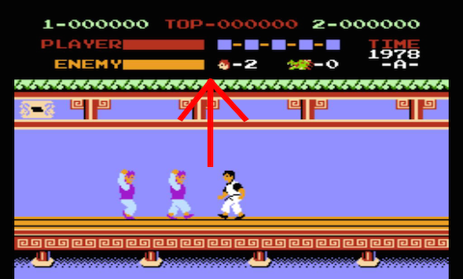
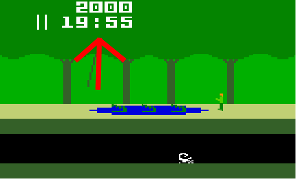
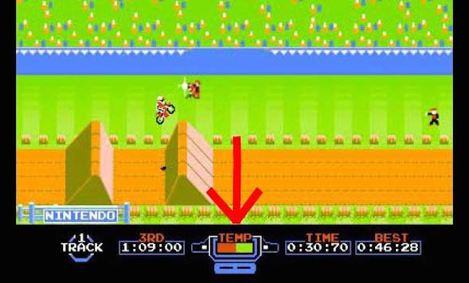
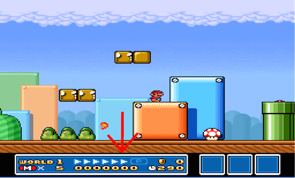

#如何创建一个指示器(HUD)

##什么是一个指示器(HUD)

一个指示器(HUD)，或“顶部用户信息显示”是一种显示用户数据的方式，用户他们无需将视线从当前正在的游戏中转移。的HUD几乎肯定是用在大多数每个游戏。这里是一些大家都知道的HUD游戏的例子：













## HUD表示什么信息？

任何事！得分，生命值，信息，成就，UPS-电源，进度指示，定时器等！

## 如何创建一个HUD?

将HUD想作 `Layer*` 的类型，更具体的是 Cocos2d-x中的`LayerColor*`类型。[LayerColor API](http://www.cocos2d-x.org/reference/native-cpp/V3.0/d1/de8/classcocos2d_1_1_layer_color.html#ab130d18f75bae5aab246f43f87a00034)

让我们创建一个简单的HUD例子，调用时通知用户的消息。

头文件如下：

```
#ifndef  _MESSAGEHUD_HPP_
#define  _MESSAGEHUD_HPP_

#include "cocos2d.h"

class MessageHUD : public cocos2d::LayerColor
{
    public:
        MessageHUD();
        ~MessageHUD();

        MessageHUD* createLayer(const std::string& _message);
        void initOptions(const std::string& _message);

        virtual void draw (cocos2d::Renderer * renderer, const cocos2d::Mat4 & transform,
                         bool transformUpdated); 

        inline virtual cocos2d::LabelBMFont* getMessageLabel() { return _messageLabel; };

    private:
        cocos2d::LabelBMFont* _messageLabel;
};

#endif // _MESSAGEHUD_HPP_
```

实现代码：

```
#include "MessageHUD.hpp"

MessageHUD::MessageHUD() {}

MessageHUD::~MessageHUD() {}

MessageHUD* MessageHUD::createLayer(const std::string& _message)
{   
    MessageHUD* a = new MessageHUD();
    a->create();
    a->setColor(cocos2d::Color3B(0, 0, 0));

    a->setContentSize(cocos2d::Size::Size(1, 1));
    a->setAnchorPoint(cocos2d::Vec2(0, 0)); 

    a->initOptions(_message);

    return a;
}

void MessageHUD::initOptions(const std::string& _message)
{
    _messageLabel = cocos2d::LabelBMFont::create(_message.c_str(), "Marker Felt Small.fnt");
    _messageLabel->setColor(cocos2d::Color3B(255, 215, 0));

    addChild(_messageLabel, 1);

    _messageLabel->setPosition(cocos2d::Vec2(Director::getInstance()->getVisibleSize().width, 
        Director::getInstance()->getVisibleSize().height));


}

void MessageHUD::draw(cocos2d::Renderer * renderer, const cocos2d::Mat4 & transform,
                         bool transformUpdated) {}
```

创建HUD

```
MessageHUD* _hud = MessageHUD::createLayer("The Enemy is approaching!");
this->addChild(_hud, 2);
```