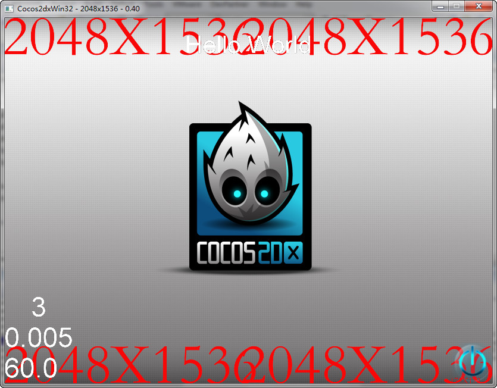

#如何在低分辨的电脑上调试视网膜ipad的游戏

当调试手机游戏，有时移动设备的分辨率超过显示器的开发人员使用的分辨率。例如：Retina显示屏ipad拥有2048×1536的分辨率。 

`GLView:: setFrameZoomFactor`功能诞生来解决这个问题。

##原则 
`EGLView:: setFrameZoomFactor`重置游戏窗口的大小和投影乘以缩放因子。 

在Win32：

```
void GLView::setFrameZoomFactor(float fZoomFactor)
    {
        m_fFrameZoomFactor = fZoomFactor;
        resize(m_obScreenSize.width * fZoomFactor, m_obScreenSize.height * fZoomFactor);
        centerWindow();
        Director::getInstance()->setProjection(Director::getInstance()->getProjection());
    }
```

`GLView`在Win32，Mac和Linux还重写两个函数，`setViewPortInPoints`和`setScissorInPoints`。 

当投影复位，`GLView::setViewPortInPoints`将被调用。 
的`GLView::setViewPortInPoints`的实施是从`GLView::setViewPortInPoints`不同。 
所有的参数都是乘法与`m_fFrameZoomFactor`。

```
    void GLView::setViewPortInPoints(float x , float y , float w , float h)
    {
        glViewport((GLint)(x * m_fScaleX * m_fFrameZoomFactor + m_obViewPortRect.origin.x * m_fFrameZoomFactor),
            (GLint)(y * m_fScaleY  * m_fFrameZoomFactor + m_obViewPortRect.origin.y * m_fFrameZoomFactor),
            (GLsizei)(w * m_fScaleX * m_fFrameZoomFactor),
            (GLsizei)(h * m_fScaleY * m_fFrameZoomFactor));
    }

    void GLView::setScissorInPoints(float x , float y , float w , float h)
    {
        glScissor((GLint)(x * m_fScaleX * m_fFrameZoomFactor + m_obViewPortRect.origin.x * m_fFrameZoomFactor),
                  (GLint)(y * m_fScaleY * m_fFrameZoomFactor + m_obViewPortRect.origin.y * m_fFrameZoomFactor),
                  (GLsizei)(w * m_fScaleX * m_fFrameZoomFactor),
                  (GLsizei)(h * m_fScaleY * m_fFrameZoomFactor));
    }
```

此外，虽然的Cocos2d-X得到系统的触摸事件，我们把`x`现在的位置是和`y`由`m_fFrameZoomFactor`。

```
    LRESULT EGLView::WindowProc(UINT message, WPARAM wParam, LPARAM lParam)
    {
        BOOL bProcessed = FALSE;

        switch (message)
        {
        case WM_LBUTTONDOWN:
    .....
            if (m_pDelegate && MK_LBUTTON == wParam)
            {
                POINT point = {(short)LOWORD(lParam), (short)HIWORD(lParam)};
                Point pt(point.x, point.y);
                pt.x /= m_fFrameZoomFactor;  // added this line
                pt.y /= m_fFrameZoomFactor;  // added this line
                Point tmp = ccp(pt.x, m_obScreenSize.height - pt.y);
                if (m_obViewPortRect.equals(CCRectZero) || m_obViewPortRect.containsPoint(tmp))
                {
                    m_bCaptured = true;
                    SetCapture(m_hWnd);
                    int id = 0;
                    handleTouchesBegin(1, &id, &pt.x, &pt.y);
                }
            }
            break;
    ................
```

##在哪里调用GLView:: setFrameZoomFactor？ 
此功能只能在平台相对应的代码调用。例如`proj.win32/main.cpp`，`proj.mac/ AppController.mm`和`proj.linux/ main.cpp`。 
只需添加一行代码就能使这个有用的功能。 

例如，在Win32

```
    int APIENTRY _tWinMain(HINSTANCE hInstance,
                           HINSTANCE hPrevInstance,
                           LPTSTR    lpCmdLine,
                           int       nCmdShow)
    {
        UNREFERENCED_PARAMETER(hPrevInstance);
        UNREFERENCED_PARAMETER(lpCmdLine);

        // create the application instance
        AppDelegate app;
        GLView* eglView = Director::getInstance()->getOpenGLView();
        eglView->setFrameSize(2048, 1536);
        // The resolution of ipad3 is very large. In general, PC's resolution is smaller than it.
        // So we need to invoke 'setFrameZoomFactor'(only valid on desktop(win32, mac, linux)) to make the window smaller.
        eglView->setFrameZoomFactor(0.4f);
        return Application::sharedApplication()->run();
    }
```

结果：



现在，您就可以在低分辨率桌面上调试大分辨率游戏。期待你的加入。