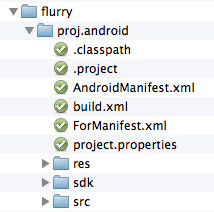

#如何整合第三方SDK到Plugin-X

##前言
本文将为您展示如何实现一个插件.首先你应该手动创建一个插件工程.
我们会开发工具来帮助你完成以下大部分工作.

##插件框架介绍
plugin-x的核心代码在 `/protocols`目录下。

现在我们有4套协议：`ProtocolAds`, `ProtocolAnalytics`, `ProtocolIAP`, `ProtocolSocial`.

如果你的SDK实现了相应的功能这将很简单。

你不需要编写任何C++代码。我们已经在核心代码中实现了它。你只需做下面的：

- 创建一个新的Android、iOS工程
- 编写java或OC代码实现我们已经定义的接口、协议。

##插件目录介绍
请保持你的插件目录结构如下: 


proj.android : 插件的android项目文件夹.

proj.ios : 插件的ios项目文件夹.

注意：实现的发布工具依赖文件结构

##实现插件

也许你的插件会支持多个平台。你需要在不同的平台做不同的事。

###Android平台

1. 导入人Android项目的插件协议到Eclipse
	
	
	
	
2. 新建一个Android库项目，并使他依赖libPluginProtocol项目

	
	
	项目目录如下：
	
	
	
	* build.xml : 被发布工具使用. 可以复制其他的插件, 也可以编辑项目名字. 比如:
	
	```
<?xml version="1.0" encoding="UTF-8"?>
<project name="libPluginFlurry" default="plugin-publish">
...
</project>
	```


	* ForManifest.xml : 在`tools/gameDevGuide.sh` 里调用. 如果你的插件里需要AndroidManifest.xml里面声明 activity，或者设置用户权限 . 在这个文件里添加他们.

	- sdk : 第三方SDK的.jar文件放到这里.
	- src : java代码放到这里. 在Java代码里，你要实现相关接口. Java类也需要一个带Context 参数的构造函数. 例子:
	
	```
package org.cocos2dx.plugin;
public class AnalyticsFlurry implements InterfaceAnalytics {
        ...
        public AnalyticsFlurry(Context context) {
        mContext = context;
    }
}
	```
	
	1. 你可以编写你想要的自定义方法。我们已经在C++核心代码实现了简单的反射。游戏开发者可以通过名字调用自定义方法。这里有一些规则使它正确工作。
	2. 自定义方法可以有0或1个参数。如果需要超过1个参数，你需要使用JSON对象类型封装传递多个参数。参数传递带关键字` "Param1", "Param2" ...`。你应该让游戏开发者知道如何传递参数。例如：
	
	```
// C++ code in game, developer invoke method like this:
PluginParam event1("book");
PluginParam dura1(12000);
g_pAnalytics->callFuncWithParam("logEventWithDuration", &event1, &dura1, NULL);
	```
	
	
	```
// Java code in plugin, the method of plugin implement like this:
protected void logEventWithDuration(JSONObject eventInfo) {
        LogD("logEventWithDuration invoked! event : " + eventInfo.toString());
        if (!isValid()) return;
        try{
            String eventId = eventInfo.getString("Param1");  // get param eventID by key "Param1"
            int duration = eventInfo.getInt("Param2");          // get param duration by key "Param2"
            MobclickAgent.onEventDuration(mContext, eventId, duration);
        } catch(Exception e){
            LogE("Exception in logEventWithDuration", e);
        }
}
	```
	
	* 现在只支持下列参数类型： int, float, boolean, String, JSONObject.
	* 同样你也可以编写带返回基本类型值的自定义方法。现在支持的返回值类型：int, float, boolean, String, JSONObject.
	
###iOS平台

1. 新建一个库工程，修改头文件搜索路径： ` /protocols/platform/ios`
2. 编写一个类实现相关的协议，例如：

```
@interface AnalyticsFlurry : NSObject 
    {

    }
```

1. 你可以编写你想要的自定义方法。这里有一些规则使它正确工作。
2. 自定义方法可以有0或1个参数。如果需要超过1个参数，你需要使用**NSMutableDictionary**类型。参数传递带关键字` "Param1", "Param2" ...`。你应该让游戏开发者知道如何传递参数。例如：

```
    // C++ code in game, developer invoke method like this:
    PluginParam event1("book");
    PluginParam dura1(12000);
    g_pAnalytics->callFuncWithParam("logEventWithDuration", &event1, &dura1, NULL);

    // Objective-C code in plugin. The method implement like this:
    - (void) logEventWithDuration: (NSMutableDictionary*) params
    {
        OUTPUT_LOG(@"Umeng logEventWithDuration invoked(%@)", [params debugDescription]);
        NSString* eventId = (NSString*) [params objectForKey:@"Param1"];         // get param eventID by key "Param1"
        NSNumber* duration = (NSNumber*) [params objectForKey:@"Param2"]; // get param duration by key "Param2"
        long numDur = [duration longValue];
        [MobClick event:eventId durations:numDur];
    }
```

- 因为Objective-C限制反射。方法的参数必须是`id` 类型。 所以自定义方法只能通过**id**类型获取参数。转换列表如下：

开发者传递类型|自定义方法获得的类型
------------ | ------------- 
int	|NSNumber
float	|NSNumber
bool	|NSNumber
const |char*	NSString*
std::map<std::string, std::string>	|NSMutableDictionary


* 你可以编写带返回基本类型值的自定义方法。现在支持的返回值类型： **int, float, BOOL, NSString**。因为Objective-C限制反射。所以自定义方法只能通过**id**类型获取参数。转换列表如下：

开发者传递类型|自定义方法获得的类型
------------ | ------------- 
int	|NSNumber
float	|NSNumber
bool	|NSNumber
const char*	|NSString


##编译插件

1. 修改  `tools/config.sh`文件，添加插件目录名到变量`ALL_PLUGINS`。

```
export ALL_PLUGINS=(“protocols” “flurry” “umeng” “alipay” “nd91”)
```

2. 运行 `tools/publish.sh`脚本，然后插件将会被编译。
