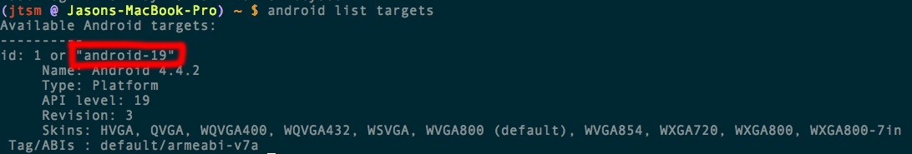

#如何在Android上运行cpp-tests

##环境要求

- 支持的操作系统 (Ubuntu 12.10+, OS X 10.7+, Windows 7+)
- Cocos2d-x 3.0版本 ([https://github.com/cocos2d/cocos2d-x/](https://github.com/cocos2d/cocos2d-x/))
- JDK/SDK 1.6+
- NDK r9d+
- Apache Ant
- Python 2.7.5

在本示例中我们将使用OS X 系统。该操作在win32 和 Linux上基本相同。

##先决条件

###下载Cocos2d-x

下载[cocos2d-x](http://cocos2d-x.org/download)并解压。我们可以简单地将它解压缩在你的主文件夹的根目录下。解压后，双击的cocos2d-X文件夹，你应该有这样的结构：


###下载JDK, SDK 和 NDK

进行Android游戏开发，java是必须的工具组件。

- 检查你的java 版本

```
java -version
```

- 希望你看到类似的结果：（虽然你的版本可能略有不同。）

```
java version "1.8.0_05"
Java(TM) SE Runtime Environment (build 1.8.0_05-b13)
Java HotSpot(TM) 64-Bit Server VM (build 25.5-b02, mixed mode)
```

- 如果没有，你需要在处理[JDK](http://www.oracle.com/technetwork/java/javase/downloads/index.html)之前，下载和安装Java.
- 现在Android SDK

[ADT Bundle For Mac](http://dl.google.com/android/adt/22.6.2/adt-bundle-mac-x86_64-20140321.zip)

[ADT Bundle For Windows (32-bit)](http://dl.google.com/android/adt/22.6.2/adt-bundle-windows-x86-20140321.zip)

[ADT Bundle For Windows (64-bit)](http://dl.google.com/android/adt/22.6.2/adt-bundle-windows-x86_64-20140321.zip)

[ADT Bundle For Linux (32-bit)](http://dl.google.com/android/adt/22.6.2/adt-bundle-linux-x86-20140321.zip)

[ADT Bundle For Linux (64-bit)](http://dl.google.com/android/adt/22.6.2/adt-bundle-linux-x86_64-20140321.zip)

该软件包包括了最新的Android SDK版本加上一个Eclipse版本的Android开发工具包括在内。这是你所需要的。 

下载后，解压包在`~/AndroidDev`目录。该文件夹包含两个文件夹：**SDK**和**eclipse**。 

你可以启动Eclipse并安装其他的SDK版本，如果需要的话。下面是一个示例：


- 下载[NDK](https://developer.android.com/tools/sdk/ndk/index.html),总是使用最新的版本。本文当时使用的版本是r9d。

###检查你的环境

- 检查 **Python 2.7** 是否已经安装，它是必须的。

在你的终端执行 `python --version` (或者在win32的cmd下)，它将得到如下结果：
```
$ python --version
Python 2.7.5
```

- 如果不是，在进行其他操作之前你需要下载并安装Python。

[Hombrew](http://brew.sh/) `brew install python`

[Python.org](https://www.python.org/download/)

- 安装并检查 `Apache Ant`

[Hombrew](http://brew.sh/) brew install ant

[Apache.org](http://ant.apache.org/bindownload.cgi)

- 检查Ant已经安装可以简单的执行：

```
$ ant
Buildfile: build.xml does not exist!
Build failed
```
### 安装环境变量

- 运行`setup.py`配置您的Android开发环境。这将需要设置必要的环境变量。如果你以前没有配置这样的环境中，你将被提示输入路径未找到变量。 

注意：你不能使用〜符号。使用完整路径到你的home目录。否则，脚本将失败归因于错误的路径值。 

- 在你的`cocos2d-X`目录`run python setup.py`，你会得到如下结果：


** COCOS2D_CONSOLE_ROOT** 环境变量 指向~/cocos2d-x/tools/cocos2d-console目录下的bin目录。 

**NDK_ROOT**环境变量 指向你存放NDK的位置。 （即 android-ndk-r9d/） 

**ANDROID_SDK_ROOT** 环境变量 指向你存放 `adt-bundle` 的位置。例如`/Users/guanghui/AndroidDev/adt-bundle-mac-x86_64-20130522/sdk/`。在adt-bundle-mac-x86_64-xxxx，XXXX的数字可能不同。所以，请注意，这不繁琐的差异。 

**ANT_ROOT**环境变量指向你存放`apache-ant-x.x.x`的位置,`apache-ant-x.x.x`，XXX的数字可能不同。所以，请注意，这不繁琐的差异。

**当所有的环境变量配置正确，你应该让他们发挥作用。**

在unix系统，你可通过下面命令解决该问题

```
source ~/.bash_profile
```

在win32系统，你可以简单的关闭命令行窗口并重新打开。

###使用 `android-build.py` 来构建 cocos2d-x例子

- 切换你的目录进入 `android-build.py` 脚本所在的目录。(一般在`cocos2d-x/build`)

```
cd build
```

然后

```
android list targets
```

注意下面截图的`id`


现在你可以执行：

```
python android-build.py -p 19 cpp-tests
```

就是这样！该脚本会处理一切你所需要的。完成后，你应该得到以下信息：


###如何通过命令行部署到你的Android手机

- 在你的手机上启用 [USB 调试](http://stackoverflow.com/questions/16707137/how-to-find-and-turn-on-usb-debugging-mode-on-nexus-4)然后通过USB连接你的手机。

- 切换你的目录进入Android的testcpp项目的bin目录

```
cd ~/cocos2d-x/tests/cpp-tests/proj.android/bin
```

(注意：如果你的当前目录是build,你可以使用一些像这样的相对路径`cd ../tests/cpp-tests/proj.android/bin`)

- 然后你可以使用adb安装apk到你的手机。

```
adb install TestsDemo-debug.apk
```

- 如果提示你，adb不是一个命令，你必须重新查询你的`~/.bashrc`文件。确保它包含了上面设置的4个环境变量。你也可以手动执行： 
 
```
 export PATH=$PATH:$ANDROID_SDK_ROOT/tools:$ANDROID_SDK_ROOT/platform-tools
``` 

你应该会看到下面的截图！你执行成功。


##问题排除

- 在完成 `setup.py`文件配置以后，你依然遇到 `NDK_ROOT` 找不到的问题。 你可能没有执行 `source ~/.bash_profile`

- 如果你工作在windows的电脑上，你可能需要注意文件系统习惯的不同。