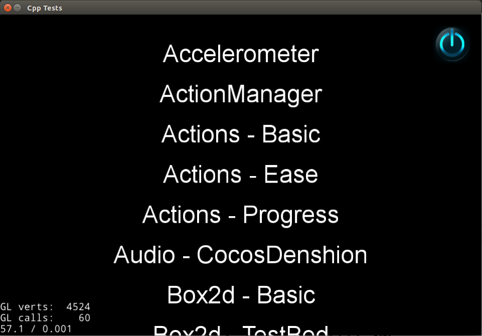

#如何在Linux(NetBeans)上运行cpp-tests

##环境要求

- Ubuntu 12.10+
- cocos2d-x 3.0版本 (https://github.com/cocos2d/cocos2d-x/)
- CMake 2.6+
- NetBeans IDE v8 C/C++ ([https://netbeans.org/downloads/](https://netbeans.org/downloads/))
- 完整教程 ([如何在Linux上运行cpp-tests](./how-to-run-cpp-tests-on-linux/zh.md))

完成这些，让我们安装NetBeans。

##安装NetBeans

它可能需要指定`--javahome`指向你的JRE安装位置。

```
sh netbeans-8.0-cpp-linux.sh --javahome 
```

##创建新项目

```
 File -> New Project
 Category -> C/C++ and Projects: C/C++ Project With Existing Sources
 Browse and select your source tree
 NetBeans will recognise it is a `CMake` based project and setup the rest for you
 Build Project (from toolbar)
 Run Project (from toolbar)
```

应用程序运行结果如下：

