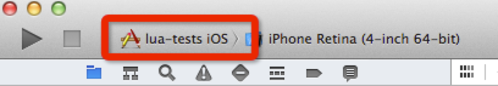

#如何运行Lua的例子

运行所有Cocos2d-X Lua 例子的过程或多或少和运行Cocos2d-X 自己一样。

所以，请参考以下链接获取更多信息：

[在Android上如何运行cpp-tests(使用终端)](http://www.cocos2d-x.org/wiki/How_to_run_cpp-tests_on_Android)  
[在Android上如何运行cpp-tests (使用Eclipse)](http://www.cocos2d-x.org/wiki/How_to_Build_an_Android_Project_with_Eclipse)  
[在iOS上如何运行cpp-tests](http://www.cocos2d-x.org/wiki/How_to_run_cpp-tests_on_iOS)  
[在Linux上如何运行cpp-tests](http://www.cocos2d-x.org/wiki/How_to_run_cpp-tests_on_Linux)  
[在Linux上如何运行cpp-tests (Netbeans)](http://www.cocos2d-x.org/wiki/How_to_run_cpp-tests_on_Linux_Netbeans)  
[在OS X上如何运行cpp-tests](http://www.cocos2d-x.org/wiki/How_to_run_cpp-tests_on_Mac_OS_X)  
[在Windows上如何运行cpp-tests](http://www.cocos2d-x.org/wiki/How_to_run_cpp-tests_on_Windows)  
[在Windows Phone 8上如何运行cpp-tests](http://www.cocos2d-x.org/wiki/How_to_Run_cpp-tests_on_WP8)  

**注意：在开始前，你应该注意所有的`cpp-tests`关键字，运行这些教程时你应该选择`Lua-tests`选项.**

让我们以: [在Android上如何运行cpp-tests(使用终端)](http://www.cocos2d-x.org/wiki/How_to_run_cpp-tests_on_Android) 教程作为示例:

当你读到下列句子:

```
python android-build.py -p 19 cpp-tests
```
如果你尝试运行Lua,你应该简单的使用`lua-tests`替换`cpp-tests`。

```
python android-build.py -p 19 lua-tests
```
如果你查看的是这个教程: [在iOS上如何运行cpp-tests](http://www.cocos2d-x.org/wiki/How_to_run_cpp-tests_on_iOS)

你应该按照下图选择合适的目标：

;