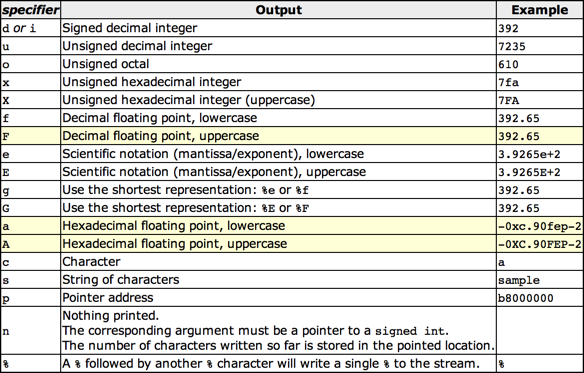

#如何使用 CCLOG

##简介

`CCLOG`可以选择性地包含由在随后的附加参数指定的值替换，格式为请嵌入格式说明符。

注意：在OS X  `CCLOG`没有`NSLOG`强大。如果你不知道如何格式化输出，你不能使用CCLog。

## 打开宏

```
#define COCOS2D_DEBUG 1
```

##Visual Studio

适合那些想在Visual Studio中检查预处理宏，右键单击`project manager-> click properties-> select configuration properties-> C/C++ -> Preprocessor`。你会在右边的预处理器定义。

##Parameters(参数)

凡在最后的说明符字符是最重要的组成部分，因为它定义的类型及其相应参数的解释：



##示例代码

C++

```
CCLOG("Characters: %c %c", 'a', 65);
CCLOG("Decimals: %d %ld", 1977, 650000L);
CCLOG("Preceding with blanks: %10d", 1977);
CCLOG("Preceding with zeros: %010d", 1977);
CCLOG("Some different radixes: %d %x %o %#x %#o", 100, 100, 100, 100, 100);
CCLOG("Floats: %4.2f %.0e %E", 3.1416, 3.1416, 3.1416);
CCLOG("%s","A string");
```

Lua

CCLOG未绑定到Lua中，你可以使用print来代替或定义一个新的函数来实现相同的效用。

```
cclog = function(...)
    print(string.format(...))
end

cclog("float and int and string: %4.2f, %#x, %s", 3.1415926, 2014, "Cocos2d-x");
print("you can use either print or cclog as you want");
print("another float is " .. 3.14 .. " another int is " .. 1024);
```

##输出

C++

```
cocos2d: Characters: a A
cocos2d: Decimals: 1977 650000
cocos2d: Preceding with blanks:       1977
cocos2d: Preceding with zeros: 0000001977
cocos2d: Some different radixes: 100 64 144 0x64 0144
cocos2d: Floats: 3.14 3e+00 3.141600E+00
cocos2d: A string
```

Lua

```
cocos2d: [LUA-print] float and int and string: 3.14, 0x7de, Cocos2d-x
cocos2d: [LUA-print] you can use either print or cclog as you want
cocos2d: [LUA-print] another float is 3.14 another int is 1024
```