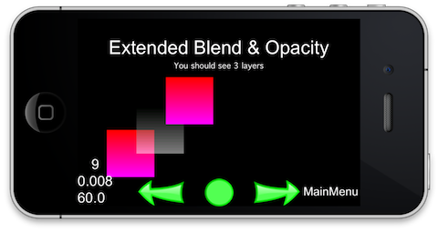

#Layer 层

### Layers 层

“CCLayer”层是一个“CCNode”节点，知道如何处理触摸事件。层知道如何画图，可能是半透明的，允许玩家看到背后的其他层级。“CCLayers”在定义游戏画面和活动时非常有用，所以预计你会花很多时间来编码“CCLayer”子类。

“CCLayer”也是你定义触摸事件处理器（handler）的地方。“CCLayer”会通过调用某种方法（ccTouchBegan、 ccTouchMoved、ccTouchEnded或ccTouchCancelled）来处理触摸事件以回应用户的交互。这些触摸事件几乎布满一个场景的所有层级，前前后后，直到一些层级捕获了该捕获并接受了该触摸时间。

复杂的应用会要求你定义特定的“CCLayer”子类，cocos2d提供了几个预设的子类，例如“CCMenu”（一个简单的菜单层）、“CCColorLayer”（一个绘制纯色的颜色层）以及“CCLayerMultiplex”（一个允许你复用子类的层，一次激活一个子类时会关闭其他子类）。

层可能会把任何“CCNode”节点当作子类包含进去，包括“CCSprite”、“CCLabels”甚至“CCLayer”对象。因为层是“CCNode”的一个子类，因此可以手动转换或者使用“CCAction”转换。欲了解更多信息，请参考动作章节。

####  多层样例：

    CCLayerGradient* layer1 = CCLayerGradient::create(ccc4(255, 0, 0, 255), ccc4(255, 0, 255, 255));
    layer1->setContentSize(CCSizeMake(80, 80));
    layer1->setPosition(ccp(50,50));
    addChild(layer1);

    CCLayerGradient* layer2 = CCLayerGradient::create(ccc4(0, 0, 0, 127), ccc4(255, 255, 255, 127));
    layer2->setContentSize(CCSizeMake(80, 80));
    layer2->setPosition(ccp(100,90));
    addChild(layer2);

    CCLayerGradient* layer3 = CCLayerGradient::create();
    layer3->setContentSize(CCSizeMake(80, 80));
    layer3->setPosition(ccp(150,140));
    layer3->setStartColor(ccc3(255, 0, 0));
    layer3->setEndColor(ccc3(255, 0, 255));
    layer3->setStartOpacity(255);
    layer3->setEndOpacity(255);
    ccBlendFunc blend;
    blend.src = GL_SRC_ALPHA;
    blend.dst = GL_ONE_MINUS_SRC_ALPHA;
    layer3->setBlendFunc(blend);
    addChild(layer3);

