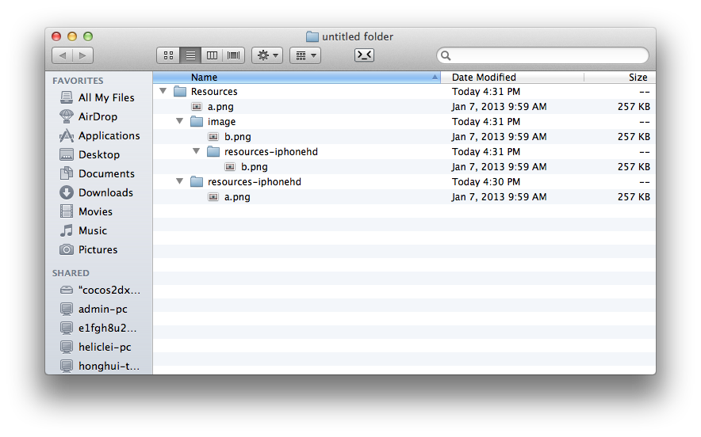

# 资源加载机制

## 集中化策略

这一策略把所有视网膜资源投入到一个单独的目录。

这种策略不适合多分辨率适配，因为分辨率在Android上有太多的差异。你不太可能每个分辨率提供一套资源，然后设置这些资源的搜索顺序。 资源搜索顺序的代码如下：

```
std::vector resDirOrders;
if (resolution is reslution1)
{
    resDirOrders->push_back("path1");
    resDirOrders->push_back("path2");
    ...
}
else if (resolution is resolution2)
{
    resDirOrders->push_back("path-a");
    resDirOrders->push_back("path-b");
    ...
}
...

FileUtils::getInstance()->setSearchPaths(resDirOrders);
```

## 新的机制

当寻找一张图片资源的时候，首先搜索`FileUtils::setSearchPaths()`文件夹，如果没找到，再在`Resources/`下寻找。

```
// set searching paths to "/mnt/sd/example" and "/data/data/org.cocos2dx.example"
vector searchPaths;
searchPaths.push_back("/mnt/sd/example");
searchPaths.push_back("/data/data/org.cocos2dx.example");
FileUtils::setSearchPaths(searchPaths);  
// engine will find "1.png" in /mnt/sd/example, if there it is not found, then engine will find "1.png" in /data/data/org.cocos2dx.example
// if not found, engine will find "1.png" in Resources/ (this path is platform dependent)
Sprite *pSprite = Sprite::create("1.png");  
```

使用上面的方法，很容易添加搜索路径到引擎，引擎会按照你的设定去找到想要的资源。


## 开发指南

如果你想分享不同分辨率之间的一些资源，那么你可以把所有的共享资源放到`Resources/`。

你可以在`samples/HelloCpp`中找到参考用法。

例如：

```
    * resources/
    *** ipad/
    ***** background.png
    *** iphone4/
    *** background.png
    ** sharedResource.png
    * classes/

```

