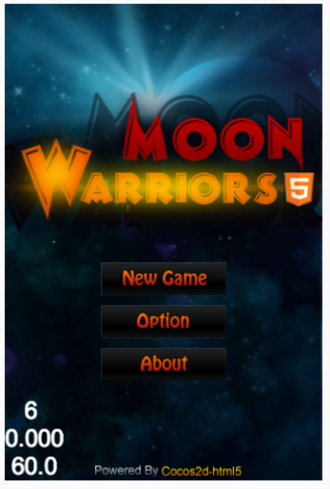

# Cocos2d-js MoonWarriors游戏示例

这是一个Cocos2d-js构建的示例，包括许多如下的特性：

- 背景滚动
- 瓦片地图
- 动作
- 渐变
- 帧动画 
- 调度 
- 标签 
- 键盘派发 
- 场景转换。

艺术和音频的版权属于 Enigmata Genus Revenge，未经允许你不得使用任何版权相关的材料。

这个示例是GPL许可的。欢迎你使用它作为一个简单的教程进入你的HTML5游戏旅程。

下面是游戏截图：



游戏试玩地址：[http://cocos2d-x.org/MoonWarriors/index.html](http://cocos2d-x.org/MoonWarriors/index.html)

(控制: 使用 W A S D 移动你的飞船)


你可以在Cocos2d-JS发布包中找到这个游戏，在游戏的根目录使用`cocos console`启动它，在web或本机平台上运行。

```
cocos run -p web|iOS|android|mac
```