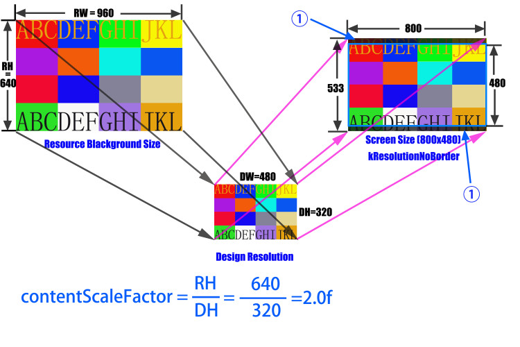
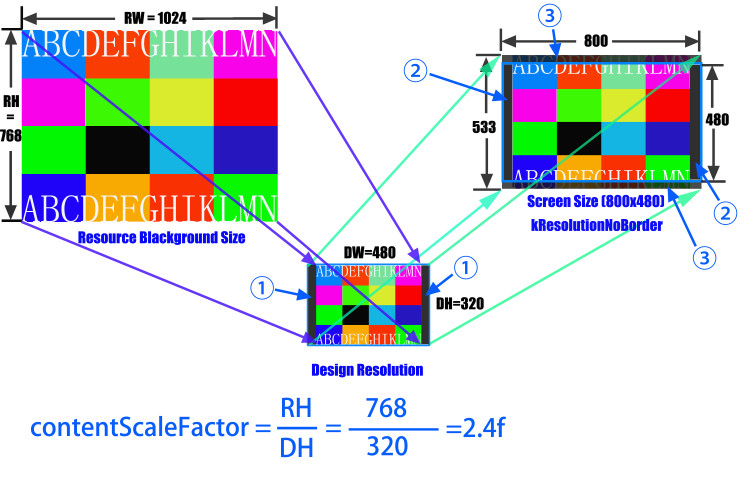
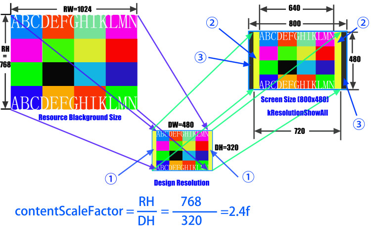

#多分辨率的支持

这篇涉及到的API只适用于Cocos2d-x 2.0.4

android的分辨率由于太多了很难来适配。但是Cocos2d-x提供了CCEGLView::setDesignResolutionSize() 和 CCDirector::setContentScaleFactor()来帮助你使用最小的工作量来让你的的游戏运行在不同分辨率下。

##基本原则

自从2.0.4版本之后我们已经把所有和enableRetina方法相关的代码移除了。因此从Cocos2d-2.0-x-2.0.4开启高清模式就消失了。在ios平台上，假如设备支持retian显示，我们是默认支持的。

你可以通过CCEGLView::sharedOpenGLView()->getFrameSize()方法来得到屏幕的真实分辨率大小。例如以上那个函数在Iphone4S的横屏状态下返回“960*640”。

但是怎么样使用非retina坐标和retina设备相关起来？这有两个概念你不得不知道。一个是designResolutionSize，一个是contentScaleFactor。


##designResolutionSize

所有你游戏的坐标都依赖设计分辨率，不用去关心设备屏幕大小。假如你游戏的UI布局在所有的分辨率下都是相同的，那么你只需要设置这个坐标就可以了。设计分辨率是通过CCEGLView::sharedOpenGLView()->setDesignResolutionSize(width, height, policy)方法来设置的，第一，二个参数分别是设计分辨率的宽度和高度，第三个参数是你想要的模式。后面将会解释第三个变量。

你也可以使用好几套资源在不同设备上，这样你可以有更好的显示效果。你可以调用CCFileUtils::sharedFileUtils()->setResourceDirectory(path_string)这个方法来设置资源所在的文件夹，与此相应的你就需要设置contentScaleFactor。

下面就是HelloCpp项目里的代码片段。

```
typedef struct tagResource
    {
        cocos2d::CCSize size;
        char directory[100];
    }Resource;

    static Resource smallResource  =  { cocos2d::CCSizeMake(480, 320),   "iphone" };
    static Resource mediumResource =  { cocos2d::CCSizeMake(1024, 768),  "ipad"   };
    static Resource largeResource  =  { cocos2d::CCSizeMake(2048, 1536), "ipadhd" };
    static cocos2d::CCSize designResolutionSize = cocos2d::CCSizeMake(480, 320);
    
       bool AppDelegate::applicationDidFinishLaunching() {
        // initialize director
        CCDirector* pDirector = CCDirector::sharedDirector();
        CCEGLView* pEGLView = CCEGLView::sharedOpenGLView();

        pDirector->setOpenGLView(pEGLView);

        // Set the design resolution
        pEGLView->setDesignResolutionSize(designResolutionSize.width, designResolutionSize.height, kResolutionNoBorder);

        CCSize frameSize = pEGLView->getFrameSize();

        // In this demo, we select resource according to the frame's height.
        // If the resource size is different from design resolution size, you need to set contentScaleFactor.
        // We use the ratio of resource's height to the height of design resolution,
        // this can make sure that the resource's height could fit for the height of design resolution.

        // if the frame's height is larger than the height of medium resource size, select large resource.
        if (frameSize.height > mediumResource.size.height)
        { 
            searchPath.push_back(largeResource.directory);
            pDirector->setContentScaleFactor(largeResource.size.height/designResolutionSize.height);
        }
        // if the frame's height is larger than the height of small resource size, select medium resource.
        else if (frameSize.height > smallResource.size.height)
        { 
            searchPath.push_back(mediumResource.directory);
            pDirector->setContentScaleFactor(mediumResource.size.height/designResolutionSize.height);
        }
        // if the frame's height is smaller than the height of medium resource size, select small resource.
        else
        { 
            searchPath.push_back(smallResource.directory);
            pDirector->setContentScaleFactor(smallResource.size.height/designResolutionSize.height);
        }
        ...................
        ...................
    }
```

##contentScaleFactor

ContentScaleFactor是指ResourcesSize 和 designResolutionSize的比例系数。一般的，你可以通过’ResourceBackGround.height/DesignResolution.height’ 或 ‘ResourceBackGround.width/DesignResolution.width’的做法来设置。选择怎么样的方式是依靠你游戏的设计。
下面就用插图的方式来说明一下，我们这里使用的高度来计算这个比例值。



图表1：资源大小=960*640，设计分辨率大小=480*320，目标设备屏幕大小=800*480，RH/DH=RW/DW=2.0f，第三个参数选择的是NoBorder模式。

当使用NoBorder模式的时候，有一些背景区域显示到屏幕以外去了。假如你使用绝对坐标在设计分辨率大小（480*320），你游戏的一些UI可能会显示不全。为了解决这个问题，你不得不设置这个坐标依据’visible rectangle’（可见矩形）的。你可以得到可见矩形的起点，通过CCDirector::sharedDirector()->getVisibleOrign()方法。调用CCDirector::sharedDirector()->getVisibleSize()方法你就可以确定屏幕上面的9个点， 左边，右边，上面，下面，中间，左上角，右上角，左下角，右下角。

假如你的游戏的所有坐标就是依靠这9个点，那么你的游戏就可以全屏展示了。

关于怎么计算这些点，你可以参考TestCpp项目里面的“VisibleRect”类。




图表2：资源大小=1024*768，设计分辨率大小=480*320，目标设备屏幕大小=800*480，RH/DH！=RW/DW=，第三个参数选择的是NoBorder模式。

当RH/DH不等于RW/RH的时候，你就需要选择的是相对于设计分辨率的宽度比例还是高度比例。

在图表2中，我们仍然使用高度比例来计算contentScaleFator，因此资源背景的高度将会适应设计分辨率

在将设计分辨率绘制到屏幕上之后，标记① –> 标记②, 和标记③将会在屏幕外面。

现在，你有两个选择来让你的游戏全部显示出来。一种是让你的背景图变宽点。另外一种是去设置contentScaleFactor为宽度的比例。

##模式

现在Cocos2d-x支持三种模式

##Exact fit

整个应用程序的内容都会在特殊区域可见，并且不用提供这些比例系数。可能会出现形变，所有的应用程序看起来可能会是拉伸或者压缩的。

##No border

当设置了屏幕高宽比之后，整个应用程序将会显示在这个特殊区域，但是没有形变，但是可能一些裁剪。

##Show all

当设置了屏幕高宽比之后，整个应用程序也是会显示在这个特殊的区域内，没有形变，不过可能会出现两条黑边。




图表3：资源大小 = 1024*768；设计分辨率大小 = 480*320；目标设备屏幕大小 = 800*480；RH/DH != RW/DW; ShowAll Policy

标记② 和标记③都是黑色的矩形区域。但是他们不同的，标记③是在Opengl可视区域外面的，因此你不能把任何的游戏元素放在上面。标记②的出现是因为RW/RH不等于DW/DH，但是在Opengl可视区域，你可以放置你的游戏元素在那里。

假如开发者为了更好的游戏显示使用NoBorder模式，那么你需要使用相对坐标。