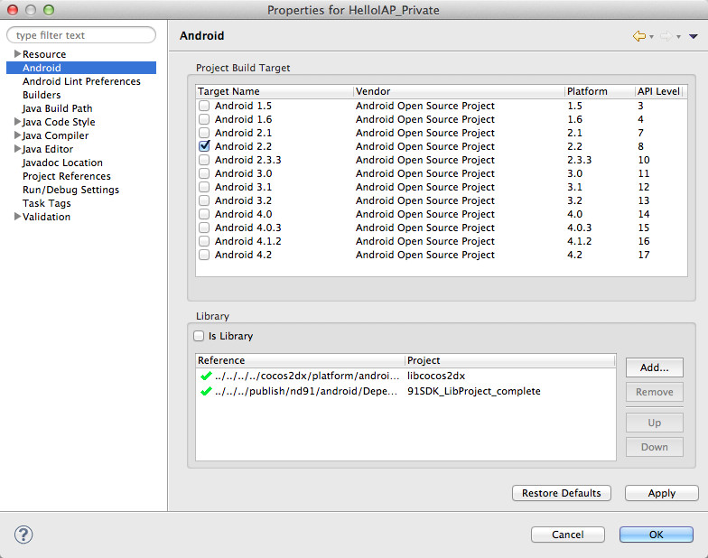

#Plugin-X Integration Guide for Android

#Plugin-X 在android下的整合

[集成第三方SDK](http://www.cocos2d-x.org/wiki/Third_Party_SDK_Integration)

##环境需求

1. python 2.7。 [http://www.python.org/](http://www.python.org/)
2. Apache Ant build tool. http://ant.apache.org/
3. 如果你的操作系统是Windsws,你需要安装Cygwin环境.

##编译Plugin-X 项目
1. 运行 publish.sh脚本 ，路径为plugin-x/tools/publish.sh. 这个脚本在 Mac OSX Mountain Lion v10.8.2 和 Cygwin on Windows 7下测试良好. 在脚本第一次运行的时候, 它会让你输入一些参数来设置环境, 如下

	

	在Windows上, 你输入的路径应该以Linux的路径形式输入. 示例 : 你可以输入 C:/adt-bundle-windows/sdk, 而不是C:\adt-bundle-windows\sdk

2. 编译完成后, 名为 publish  的文件夹会生成在plugin-x 项目的根目录下. 如果你的 publish 文件夹如下图, 那意味着你的编译成功.

	
	
3.  publish 文件夹包含如下文件:
- plugin头文件(*.h)
- C++ 静态库 (*.a)
- java 库 (*.jar)
- makefiles for android (*.mk)
- 一些插件需求的android 项目

##在使用插件之前编辑游戏项目
###我们需要做什么?

Plugin-x 为第三方android的SDK封装C/C++ 接口. 所以我们需要编辑游戏项目设置以便能使用它:

- 编辑 .mk 文件(Android.mk & Application.mk) 来链接由 plugin-x创建的静态库.
- 编辑android项目设置来链接由 plugin-x 创建的库 和 第三方sdk库. (.jar 文件)
- 编辑AndroidManifest.xml, 添加 activities的声明, 和游戏使用权限.
- 对于个别插件, 我们需要添加额外的设置和资源文件.

###游戏开发者引导工具
有个名为 gameDevGuide.sh 的脚本，路径 plugin-x/tools/gameDevGuide.sh.
此脚本将帮助你编辑你的游戏项目.

1. 在终端运行该脚本 (在Windows上, 你应该使用Cygwin来运行它). UI界面如下:
	
	
	在edit-box里面输入你的游戏的android项目的路径. 请保证路径没有空格. （译者注：windows下的路径"\"改为"/"，不然的话，它也能正常到下一步，但是再继续会出错）然后点击 'Next' 按钮.

2. 选择你需要的插件. UI界面如下:

	
	选择插件之后, 点击 'Finish' 按钮. 该脚本将会编辑你的android项目里的几个配置文件.
	
以下配置文件将被编辑:

- Android.mk -------------- 添加游戏依赖的C++ 库
- Application.mk ----------- 为ndk build添加参数
- .project ----------------- 链接publish目录到游戏工程作为资源
- .classpath --------------- 添加游戏依赖的java 库
- AndroidManifest.xml ------ 添加游戏所需的插件的activity的声明 和 用户权限

##手动编辑
1. 编辑ndk-build 命令参数 : 添加 publish 目录到 NDK_MODULE_PATH 参数下, 如下 :
`NDK_MODULE_PATH=${PLUGIN_ROOT}/publish`

2. 添加代码到JNI_OnLoad方法下, 如下 :

	```
	#include “PluginJniHelper.h”
jint JNI_OnLoad
{
 JniHelper::setJavaVM;
 PluginJniHelper::setJavaVM; // for plugins
 return JNI_VERSION_1_4;
}
	```
	
3. 在游戏的main activity被创建的时候，调用 PluginWrapper.init()方法 :

	```
	import org.cocos2dx.plugin.PluginWrapper;
import org.cocos2dx.lib.Cocos2dxGLSurfaceView;
public class HelloIAP extends Cocos2dxActivity{
 protected void onCreate{
 super.onCreate();
 PluginWrapper.init(); // for plugins
 // If you want your callback function can be invoked in GL thread, add this line:
 PluginWrapper.setGLSurfaceView();
 }
 static {
 System.loadLibrary;
 }
}
	```
	
4. 特别的插件修改项
如果你的游戏使用的一下插件, 你可能需要一些特殊的修改.
我们已经计划添加这些修改项到开发者指导工具里.

	- 对于nd91
		1. 导入android 工程 `91SDK_LibProject_complete` 到eclipse里. 工程路径为 `plugin-x/publish/nd91/andriod/DependProject`
	
		2. 设置你的游戏工程依赖于`91SDK_LibProject_complete`工程, 如下图:
		
		
		
##在你的C++ 代码里使用plugin-x
###加载和卸载插件

所有的插件由 class PluginManager 管理. 你可以通过插件的类名加载/卸载插件 , 示例代码 :

```
    // load plugin AnalyticsFlurry
    s_pFlurry = dynamic_cast
    (PluginManager::getInstance()->loadPlugin("AnalyticsFlurry"));

    // unload plugin AnalyticsFlurry
    PluginManager::getInstance()->unloadPlugin("AnalyticsFlurry");
    s_pFlurry = NULL;
```

建议 : 当游戏开始的时候加载插件, 游戏结束的时候卸载插件.
###使用插件
你可以调用在协议中声明的方法. 示例代码:

```
    // enable the debug mode
    s_pFlurry->setDebugMode(true);

    // log an event
    s_pFlurry->logEvent("music");

    // log an event with params
    LogEventParamMap paramMap;
    paramMap.insert(LogEventParamPair("type", "popular"));
    paramMap.insert(LogEventParamPair("artist", "JJLin"));
    s_pFlurry->logEvent("music", ¶mMap);
```

一些插件拥有自定义方法。我们在plugin-x中实现了一个简单的反射。
你可以通过名字调用自定义方法。像这样：

```
    // invoke setAge() method in plugin Flurry
    PluginParam pParam3(20);
    s_pFlurry->callFuncWithParam("setAge", &pParam3, NULL);

    // invoke logTimedEventBeginWithParams() method in plugin Flurry
    PluginParam event3("music-kv");
    LogEventParamMap paramMap;
    paramMap.insert(LogEventParamPair("type", "popular"));
    paramMap.insert(LogEventParamPair("artist", "JJLin"));
    PluginParam mapValue(paramMap);
    s_pFlurry->callFuncWithParam("logTimedEventBeginWithParams", &event3, &mapValue, NULL);
```

同样，这里有一些反射接口定义返回基础类型值。方法列表如下：

```
    // return string value for developers
    const char* callStringFuncWithParam(const char* funcName, PluginParam* param, ...);

    // return int value for developers
    int callIntFuncWithParam(const char* funcName, PluginParam* param, ...);

    // return bool value for developers
    bool callBoolFuncWithParam(const char* funcName, PluginParam* param, ...);

    // return float value for developers
    float callFloatFuncWithParam(const char* funcName, PluginParam* param, ...);
```

注意： 

- 你可以在方法中传递参数，参数的类型必须是`PluginParam`指针。
-  插件中的参数必须按顺序传递
-  如果方法在插件中找不到，什么都不会发生。


##参考
1. 截图和示例代码来自plugin-x的例子工程 HelloIAP
2. 如果你有任何问题，请不要不愿意在这篇wiki上评论, 或者创建issues在github.com/chukong/plugin-x/ 工程上.