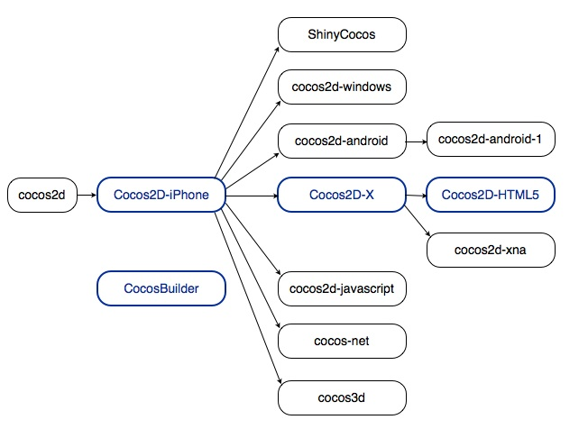

# Cocos2d家族之间的关系
自从cocos2d-iphone成功开始，cocos2d家族有了很多自工程。大部分出名的分支我们都列再这里了。

用蓝色矩形框起来的分支(Cocos2d-iPhone, Cocos2d-x, Cocos2d-HTML5, Cocos Builder)有相同的发展路线和协调发布版本。这意味着开发人员可以拥有使用一套相同的工具链来开发web和移动平台的游戏。

如你所见，不同的分支支持不同的目标平台，并且使用不同的编程语言。
分支	      编程语言	    目标平台
cocos2d	Python	Desktop OSes
cocos2d-iphone	Objective-C, JavaScript	iOS
cocos2d-x	C++, Lua, JavaScript	See Supported Platforms and Programming Languages
cocos2d-html5	JavaScript	HTML5-ready browsers
ShinyCocos	Ruby	iOS
cocos2d-windows	C++	Windows XP/7
cocos2d-android	Java	Android
cocos2d-android-1	Java	Android
cocos2d-xna	C#	Microsoft and MonoGame platforms
cocos2d-javascript	JavaScript	HTML5-ready browsers
cocos-net	C#	Mono-supported platforms
cocos3d	Objective-c	iOS
如果你在开发这个页面上没有的分支，请编辑当前页面，把它添加进去