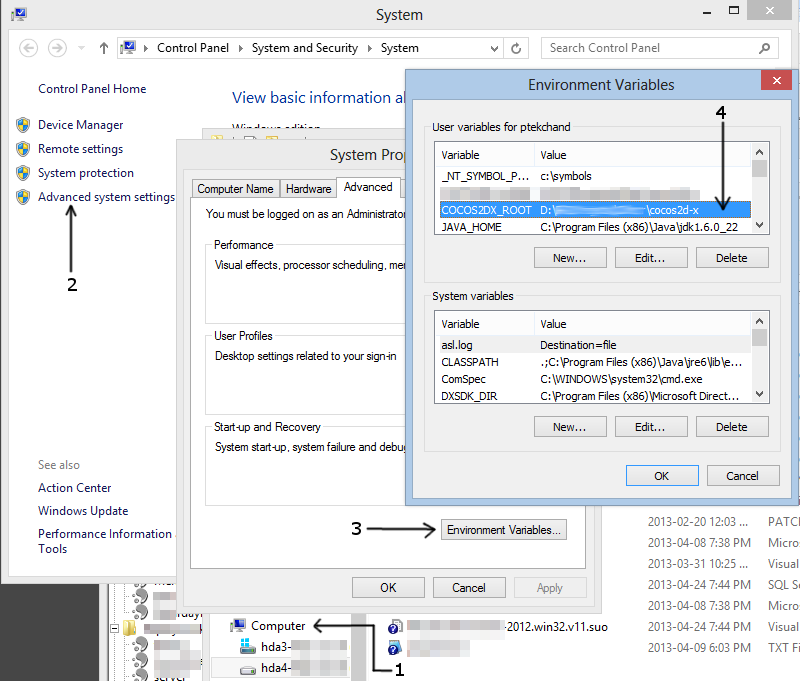

# 迁移Visul Studio工程和解决方案

本文描述了如何将Visual Studio的工程文件(.vcproj,.vcxproj)和/或(.sln)到cocos2d-x之外的文件夹中。

通常来说，当你运行创建工程脚本`create-android-project.bat`/@sh@或者使用MSVC模板(参考:[cocos2d-x的应用工程向导)时，你创建的工程再cocos2d-x的根目录下。

比如，如果你把cocos2d-x安装(或clone)到如下目录：

	C:\cocos2d-x
	
你创建的工程(TestProject)被创建到相同的目录下(C:\cocos2d-x\TestProject)。

If you wished to keep the cocos2d-x directory as it is and mover your personal projects to another location, for example:
如果你想要保持cocos2d-x目录没有变动，并且把自己的工程移到其他路径，比如：

	C:\Projects

你可以通过改变你工程中的某些值或者链接来做。我推荐创建一个`COCOS2DX_ROOT`的环境变量

	@ COCOS2DX_ROOT = C:\2d-x@

接下来把它加到工程的包include和library搜索路径中。

	project点右键 > Properties > Configuration Properties
      > C++ > Additional Include Directories
      
改为：

	@“.;..;..2dx;..2dx\include;..2dx\kazmath\include;..2dx\platform\win32;..2dx\platform\third_party\win32;..2dx\platform\third_party\win32\OGLES;..;%(AdditionalIncludeDirectories)”@
	
把`..\..\`改为`$(COCOS2DX_ROOT)\`

在library路径中执行相同的操作:

	project点右键 > Properties > Configuration Properties
      > Linker > Additional Library Directories
添加：

	$(COCOS2DX_ROOT)\$(Configuration).win32\
	
同样的，你也要更改你的输出目录：

	project点右键 > Properties > Configuration Properties
      > General > Output Directory
      
设置`$(COCOS2DX_ROOT)\$(Configuration).win32\`避免你的解决方案(.sln)不在`COCOS2DX_ROOT`目录(这样是为了再你的.exe运行时能找到dll文件)。设置这些会忽略你再上面修改的Library路径。

当然，记得设置 `Configuration Properties`:

  	projecty点右键 > Properties > Configuration Properties
      > Debugging > Working Directory

设置为：

	..\Resources
	
想要更多有关设置环境变量的信息，可以参考附件图片或者[KB的文章](http://support.microsoft.com/kb/310519)。如果你是W7SP1的受限用户，那么你需要通过控制面板来进行设置。

