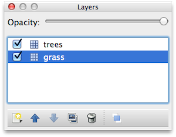
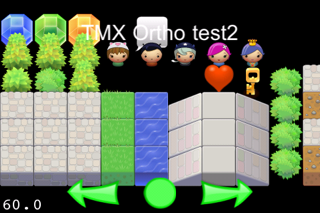

#瓦片地图

##瓦片地图(Tiled Map)

瓦片地图(Tile Map) 不但生成简单，并且可以灵活的用于Cocos2d-x引擎。不论你的游戏是角色扮演游戏, 平台动作游戏或仿打砖块游戏，这些游戏地图可以使用开源的瓦片地图编辑器Tiled Map Editor生成并保存为TMX文件格式，被Cocos2d-x支持。


##TMX 瓦片地图格式
Cocos2d 支持被Tiled创建的地图文件(TMX)。

 

##Tiled 的2个版本：
 

* Java版较为稳定，可以在Mac OS X, Windows 以及Linux运行。
 

* QT(native)版本支持绝大多数Java版本的功能。在此帮助文档建立时，最新的QT版本为0.4.0并支持除六边形地图(hexagonal maps)以外的所有功能。
 

开发者可以自由的选择使用Tiled的两种不同版本，我们建议你使用Tiled团队主要开发的QT版本以保证你获得最好的支持及更新。但因为目前Java版一些特性还未完全移植到QT版本中，一些开发者仍然喜欢使用Java版本的Tiled。

##地图形式（Tiles）:

* 被嵌套的瓦片地图不被支持（如 使用瓦片素材组与其他图片）

* 仅支持封装瓦片地图组（仅有瓦片素材组被导入地图文件）

* 每个Layer最多支持1套瓦片素材组。

## 地图层（Layers）：

* Tiles中Layer的数量没有上限。

* 每一个Layer可以被CCTMXLayer类表示( 为CCSpriteSheet的子类)

* 每一个单一的瓦片被CCSprite表示（父节点为CCTMXLayer）

##对象组 （Object Groups）：
* 瓦片地图支持对象组
 
##坐标(Coordinates) 和 全局标识(GIDS)
* 坐标

64*32的Tiled瓦片地图文件的坐标系统为：

(0,0): 左上角
(63,31): 右下角


## 全局标识(GIDS)
 

瓦片的GID是一个全局标识量，他的范围从正整数1开始，到瓦片地图中tile的总量。


如果你的地图中有5个不同的瓦片，那么：

瓦片0的GID为1
瓦片1的GID为2
瓦片3 的GID为3
以此类推
 

瓦片的GID 为 0 被用来表示此瓦片为空。

## 如何建立一个TMX节点

```
 // create a TMX map
    TMXTiledMap *map = TMXTiledMap::create("TileMaps/iso-test-vertexz.tmx");

    addChild(map, 0, kTagTileMap);

    // All the tiles by default will be aliased. If you want to create anti-alias tiles, you should do:

    // iterate over all the "layers" (atlas sprite managers)

    // and set them as 'antialias' 

    Array * pChildrenArray = map->getChildren();

    SpriteBatchNode* child = NULL;

    Ref* pObject = NULL;

    CCARRAY_FOREACH(pChildrenArray, pObject)
    {
            child = (CCSpriteBatchNode*)pObject;

            if(!child)
                break;

            child->getTexture()->setAntiAliasTexParameters();
    }
```

## 如何获取/添加/删除/修改一个瓦片

指定坐标获取Tile:

```
    TMXLayer* layer = map->layerNamed("Layer 0");

    Sprite *tile0 = layer->tileAt(ccp(1,63));
```

指定坐标获取GID

```
 unsigned int m_gid = layer->tileGIDAt(ccp(0,63));
```

指定坐标设置一个新的GID

```
layer->setTileGID(m_gid, ccp((float)3, (float)3));

    // To remove a tile at a certain coordinate

    layer->removeTileAt( ccp(5.0, 5.0) );
```

遍历Layer中的瓦片

```
Size s = layer->getLayerSize();

    for( int x=0; xtileGIDAt(ccp(x,y));

                    layer->setTileGID(tmpgid+1,ccp(x,y));

            }

    }
```

##Z序列和深度缓冲

 

以下信息仅针对俯视地图（ Orthogonal）和斜视地图(Isometric)。对六边形地图(Hexagonal)无效。

 

如果你的游戏需要根据精灵的Y坐标把精灵放置到一些特定瓦片的前面或后面（在斜视地图中常见，同时出现在一些俯视地图中），那么你有2个选择：

* 使用OpenGL ES 深度缓冲
* 使用多Layer的TMX设置Z序列

## 深度缓冲(Depth Buffer)
 

建立一个含有至少2个TMX Layer层的瓦片地图很重要：

* 一个背景层，例如草地
* 一个前景层，例如树木



草地层会显示在精灵之后，所以他的z序列应该为最小的值，例如-1000. 树木层中的每一个单一瓦片应该有不同的Z序列值，在底部的瓦片的Z序列应该大于顶部的瓦片序列。

   

因此，为了实现分层显示，你只需要做如下步骤：

打开Tiled编辑器
选择背景层（如草地）
选择 Tiled → Layer → Layer Properties  设置Layer的属性
添加: cc_vertexz = -1000
选择前景层（如草地）
选择 Tiled → Layer → Layer Properties
添加 cc_vertexz = automatic 让其根据坐标自动排Z序列。
 

 

##范例:

斜视地图Z顶点范例。 地图有2个层，”树木“层和”草地“层。 对“树木”设置属性 cc_vertex=automatic。然后对“草地”层添加 cc_vertexz=-1000。

 

俯视地图Z顶点范例。 地图同样有2个层，”树木“层和”草地“层。对“树木”设置属性 cc_vertexz=automatic 并且cc_alpha_func=0.5。 然后对“草地”层添加属性cc_vertexz=-1000。

 

## 使用多层TMX地图和Z序列

在TXM地图中，每一个层(Layer)都被自动赋值了一个Z序列（zOrder），因此不需要添加任何层的z序列属性在TMX编辑器中。将你的精灵添加为TXMMap的子节点可以让你自动的替换当前Layer上的对象。
 
```
Sprite m_tamara = Sprite::create(tamara.png);

    Point p = m_tamara->getPosition();

    p = CC_POINT_POINTS_TO_PIXELS;

    float newZ = -(p.y+32) /16;

    m_tamara->setVertexZ( newZ );
```

 

##屏幕截图

俯视地图用了3D的投影和抗锯齿瓦片，瓦片被spritesheet-fixer工具处理过，使用3D投影和抗锯齿也不会有人为变化的痕迹。

 

俯视地图,地图上瓦片尺寸小于实际瓦片大小。

 

斜视地图 2D投影与抗锯齿瓦片


六边形地图，2D投影和抗锯齿瓦片。边界界定为瓦片的左右边界。以上下为边界的界定暂不支持。


## 参考

[cocos2d-iphone tiled_maps](http://www.cocos2d-iphone.org/wiki/doku.php/prog_guide:tiled_maps)

[Creating a simple map with Tiled](http://sourceforge.net/apps/mediawiki/tiled/index.php?title=Creating_a_simple_map_with_Tiled)

[how to make a tile based game with cocos2d](http://www.raywenderlich.com/1163/how-to-make-a-tile-based-game-with-cocos2d)