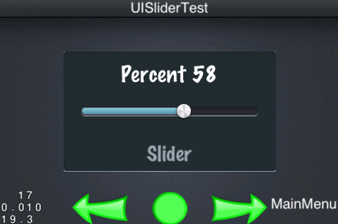
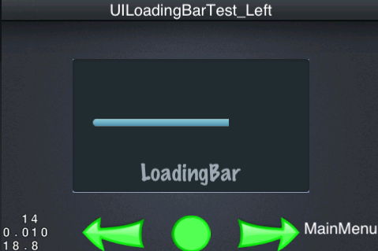
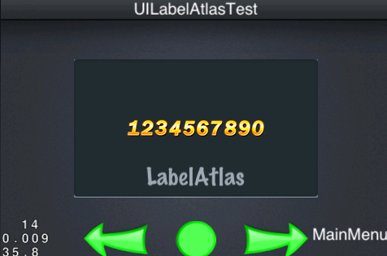
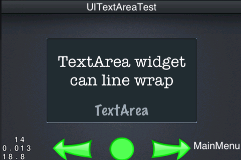

## 常用控件介绍

前面我们介绍过 UIButton 的简单使用方法，用以控制一个 UILabel 的显示内容。UIImageView 的使用还很简单，除此之外 GUI 系统里面还为我们提供了很多有用的控件，如 UITextButton，UICheckBox，UISlider 等等。

### UITextButton

``` c++
	UIButton* textButton = UIButton::create();
	textButton->setTouchEnabled(true);
	textButton->loadTextures("cocosgui/backtotopnormal.png", "cocosgui/backtotoppressed.png", "");
	textButton->setTitleText("Text Button");
	textButton->setPosition(Point(widgetSize.width / 2.0f, widgetSize.height / 2.0f));
	textButton->addTouchEventListener(this, toucheventselector(UITextButtonTest::touchEvent));        
	m_pUiLayer->addWidget(textButton);

```


既然是按钮，肯定需要支持可触摸操作，然后调用 `loadTextures` 方法加载按钮图片，注意第三个参数是按钮禁用时显示的图片，可根据自己的选择是否设置，这里要提一下的是第四个参数，请看如下方法原型：

`void loadTextures(const char* normal,const char* selected,const char* disabled,TextureResType texType = UI_TEX_TYPE_LOCAL);`

最后一个参数代表着图片类型，默认为 `UI_TEX_TYPE_LOCAL`，着意味使用的是普通图片，还有另一种类型 `UI_TEX_TYPE_PLIST`，这表示使用的图片自来来自于 plist 文件的打包资源，内部会依此决定使用 `Sprite` 创建还是 `SpriteFrame` 来创建实际的显示精灵，可以设置显示的文字内容以及按钮的回调函数，按钮回调函数的使用方式和普通按钮相同，除了使用一般图片之外，我们还可以使用 九宫格 图片，注意设置 `Size`。

``` c++
	UIButton* textButton = UIButton::create();
	textButton->setTouchEnabled(true);
	textButton->setScale9Enabled(true);
	textButton->loadTextures("cocosgui/button.png", "cocosgui/buttonHighlighted.png", "");
	textButton->setSize(Size(180, textButton->getContentSize().height * 1.5f));
	textButton->setTitleText("Text Button scale9 render");
	textButton->setPosition(Point(widgetSize.width / 2.0f, widgetSize.height / 2.0f));
	textButton->addTouchEventListener(this, toucheventselector(UITextButtonTest::touchEvent));        
	m_pUiLayer->addWidget(textButton);
        

```


### UICheckBox

我们经常在上网提交表单的时候，经常看到一种控件，复选框，它可以完成多个项目的 "勾选" 操作。并且有两种状态，"选中" 和 "非选中"。

``` c++
	UICheckBox* checkBox = UICheckBox::create();
	checkBox->setTouchEnabled(true);
	checkBox->loadTextures("cocosgui/check_box_normal.png",
	                       "cocosgui/check_box_normal_press.png",
	                       "cocosgui/check_box_active.png",
	                       "cocosgui/check_box_normal_disable.png",
	                       "cocosgui/check_box_active_disable.png");
	checkBox->setPosition(Point(widgetSize.width / 2.0f, widgetSize.height / 2.0f));
	
	checkBox->addEventListenerCheckBox(this, checkboxselectedeventselector(UICheckBoxTest::selectedEvent));
	
	m_pUiLayer->addWidget(checkBox);

```


看到这里，属性没多少，但是图片却加载了很多，两种状态，两种状态的禁用图片，还有一个按下时显示的图片，有了这五张图片，才能算是一个完整的复选框控件。通过 `addEventListenerCheckBox` 方法设置回调函数：

``` c++
	void UICheckBoxTest::selectedEvent(Object* pSender,CheckBoxEventType type)
	{
	    switch (type) {
	        case gui::CHECKBOX_STATE_EVENT_SELECTED:
	            m_pDisplayValueLabel->setText(CCString::createWithFormat("Selected")->getCString());
	            break;
	        case gui::CHECKBOX_STATE_EVENT_UNSELECTED:
	            m_pDisplayValueLabel->setText(CCString::createWithFormat("Unselected")->getCString());
	            break;
	        default:
	            break;
	    }
	    
	}

```

对于一个复选框来说，有选中和未选中状态，当我们点击它状态发生改变的时候，我们通过回调函数来做一些逻辑上的处理，比如记录当前控件的选中状态，或者如上面所示，设置一个标签的显示内容，以通知当前的状态已经修改。


### UISlider

如果你想控制系统的声音大小，或者类似的操作时，滑动条是非常合适的选择。

``` c++
	UISlider* slider = UISlider::create();
	slider->setTouchEnabled(true);
	slider->loadBarTexture("cocosgui/sliderTrack.png");
	slider->loadSlidBallTextures("cocosgui/sliderThumb.png", "cocosgui/sliderThumb.png", "");
	slider->loadProgressBarTexture("cocosgui/sliderProgress.png");
	slider->setPosition(Point(widgetSize.width / 2.0f, widgetSize.height / 2.0f));
	slider->addEventListenerSlider(this, sliderpercentchangedselector(UISliderTest::percentChangedEvent));
	m_pUiLayer->addWidget(slider);

```



我们分别使用不同的方法加载图片，`loadBarTexture` 所加载的是滑动条背景图，`loadSlidBallTextures` 方法所加载的是可滑动部件的三种状态下图片，也就是我们可以拖动的中间那个圆球。 而 `loadProgressBarTexture` 方法则显示了滑动条的具体进度。当然最后不要忘了，它也有回调函数，我们可能需要实时的记录它的当前状态值：

``` c++
	void UISliderTest::percentChangedEvent(Object *pSender, SliderEventType type)
	{
	    if (type == SLIDER_PERCENTCHANGED)
	    {
	        UISlider* slider = dynamic_cast<UISlider*>(pSender);
	        int percent = slider->getPercent();
	        m_pDisplayValueLabel->setText(CCString::createWithFormat("Percent %d", percent)->getCString());
	    }
	}

```

通过 `pSender` 向下转型获取到 UISlider ，然后获取其百分比即可，UISlider 可以使用九宫格图片来节省 UI 资源大小。

### UILoadingBar

与滑动条相反的是进度条，为什么这么说呢？一个是手动控制进度，返回当前值，一个是手动设置值，后更新其显示，所以说它们是相反的，比如我们自动加载一些图片资源，我们就可以使用进度条来标示它的加载进度，一下是它的使用方法：

``` c++
	UILoadingBar* loadingBar = UILoadingBar::create();
	loadingBar->setName("LoadingBar");
	loadingBar->loadTexture("cocosgui/sliderProgress.png");
	loadingBar->setPercent(0);
	
	loadingBar->setPosition(Point(widgetSize.width / 2.0f, widgetSize.height / 2.0f + loadingBar->getSize().height / 4.0f));
	m_pUiLayer->addWidget(loadingBar);

```



以上的代码当然仅仅是初始化，想要实时的跟新显示其值，我们需要需要不停的为它通过 `setPercent` 方法更新属性值。在启动一个场景的时候，我们调用 `scheduleUpdate();` 并实现 `update` 方法，以保证每一帧都调用，然后我们在此 `update` 方法里面实现更新进度条的方法：

``` c++
	void UILoadingBarTest_Left::update(float delta)
	{
	    m_nCount++;
	    if (m_nCount > 100)
	    {
	        m_nCount = 0;
	    }
	        
	    UILoadingBar* loadingBar = dynamic_cast<UILoadingBar*>(m_pUiLayer->getWidgetByName("LoadingBar"));
	    loadingBar->setPercent(m_nCount);
	}

```

这是由 0 开始递增的值，所以显示的效果是从左到右的进度效果。如果你想让它显示从右到左的加载效果呢。递减操作 `m_nCount--` 么？当然不是，这只是进度条的值递减，而不是从右到左的进度递增，如果想要从右到左，需要设置 " loadingBar->setDirection(LoadingBarTypeRight);" 属性，此控件也支持九宫格图片的显示。

### UILabelAtlas

UILabelAtlas 控件可以显示由图片拼接而成的数字标签:

``` c++
	UILabelAtlas* labelAtlas = UILabelAtlas::create();
	labelAtlas->setProperty("1234567890", "cocosgui/labelatlas.png", 17, 22, "0");
	labelAtlas->setPosition(Point((widgetSize.width) / 2, widgetSize.height / 2.0f));        
	
	m_pUiLayer->addWidget(labelAtlas);

```



这个控件的使用比较简单，在老的版本中，使用 Label 的效率不高，使用 LabelAtlas 是非常好的替代方案，但是 3.0 版本优化了  Label 的内部实现机制，提高了很多效率。这里使用 Atlas 的另一个好处是可以使用自定义的丰富的显示效果。


### UILabelBMFont

除了上面的 UILabelAtlas 控件之外，要显示一个标签，还可以通过 UILabelBMFont 控件创建。

``` c++
	UILabelBMFont* labelBMFont = UILabelBMFont::create();
	labelBMFont->setFntFile("cocosgui/bitmapFontTest2.fnt");
	labelBMFont->setText("BMFont");
	labelBMFont->setPosition(Point(widgetSize.width / 2, widgetSize.height / 2.0f + labelBMFont->getSize().height / 8.0f));
	m_pUiLayer->addWidget(labelBMFont);

```


UILabelBMFont 和 UILabelAtlas 一样，都是通过一张图片来保存需要显示的信息，但是 Atlas 更为小巧，图片裁剪的参数可以直接设置，而 BMFont 则不然，每张图片配合一个以 ".fnt" 为后缀的文件，里面记录了文字信息到图片的映射，所以我们可以很容易的使用它，并且同样提供了很多丰富的显示效果。


### UITextArea

文本域控件可以帮我们自动处理一些区域性的问题，如自动换行等，这对灵活的 UI 布局尤为重要：

``` c++
	UILabel* textArea = UILabel::create();
	textArea->setTextAreaSize(Size(280, 150));
	textArea->setTextHorizontalAlignment(TextHAlignment::CENTER);
	textArea->setText("TextArea widget can line wrap");
	textArea->setFontName("AmericanTypewriter");
	textArea->setFontSize(32);
	textArea->setPosition(Point(widgetSize.width / 2, widgetSize.height / 2 - textArea->getSize().height / 8));
	m_pUiLayer->addWidget(textArea);        
        
```



一个文本域，需要知道它的大小，对齐方式(每一行所显示的文字，根据单子的长短，可能每行的长度不一，使用 `setTextHorizontalAlignment` 来设置，有： 左对齐，右对齐 和 剧中对齐)，文本显示内容，字体大小和字体等信息。

### UITextField

文本输入框是一个非常重要的控件，它可以调用设备的输入系统，接受用户输入的文字内容。如一个登录界面的用户名，密码等信息。

``` c++
	UITextField* textField = UITextField::create();
	textField->setTouchEnabled(true);
	textField->setFontName(font_UITextFieldTest);
	textField->setFontSize(30);
	textField->setPlaceHolder("input words here");
	textField->setPosition(Point(widgetSize.width / 2.0f, widgetSize.height / 2.0f));
	textField->addEventListenerTextField(this, textfieldeventselector(UITextFieldTest::textFieldEvent));
	m_pUiLayer->addWidget(textField);

```


我们设置好属性，启用可触摸选项，等待用户的触摸，以执行文字录入操作。 `setPlaceHolder` 可以作为提示文字而存在，当控件没有显示的文字内容时。注意这里的回调函数有很多中状态：

``` c++
	void UITextFieldTest::textFieldEvent(Object *pSender, TextFiledEventType type)
	{
	    switch (type)
	    {
	        case TEXTFIELD_EVENT_ATTACH_WITH_IME:
	        {
	            UITextField* textField = dynamic_cast<UITextField*>(pSender);
	            Size screenSize = CCDirector::getInstance()->getWinSize();
	            textField->runAction(CCMoveTo::create(0.225f,
	                                                  Point(screenSize.width / 2.0f, screenSize.height / 2.0f + textField->getContentSize().height / 2.0f)));
	            m_pDisplayValueLabel->setText(CCString::createWithFormat("attach with IME")->getCString());
	        }
	            break;
	            
	        case TEXTFIELD_EVENT_DETACH_WITH_IME:
	        {
	            UITextField* textField = dynamic_cast<UITextField*>(pSender);
	            Size screenSize = CCDirector::getInstance()->getWinSize();
	            textField->runAction(CCMoveTo::create(0.175f, Point(screenSize.width / 2.0f, screenSize.height / 2.0f)));
	            m_pDisplayValueLabel->setText(CCString::createWithFormat("detach with IME")->getCString());
	        }
	            break;
	            
	        case TEXTFIELD_EVENT_INSERT_TEXT:
	            m_pDisplayValueLabel->setText(CCString::createWithFormat("insert words")->getCString());
	            break;
	            
	        case TEXTFIELD_EVENT_DELETE_BACKWARD:
	            m_pDisplayValueLabel->setText(CCString::createWithFormat("delete word")->getCString());
	            break;
	            
	        default:
	            break;
	    }
	}

```

首先它会有四种事件类型，如下：

| 事件类型 								| 说明			|
|---------------------------------------|---------------|
| TEXTFIELD_EVENT_ATTACH_WITH_IME		| 激活输入时触发	|
| TEXTFIELD_EVENT_DETACH_WITH_IME		| 输入结束时触发	|
| TEXTFIELD_EVENT_INSERT_TEXT			| 插入文字时触发	|
| TEXTFIELD_EVENT_DELETE_BACKWARD		| 删除文字时触发	|

根据事件的类型，我们能实时的获取控件内容或者对控件的属性修改等其它逻辑操作。我们可以通过 ` textField->setMaxLength(3);` 来设置控件的最大文字长度。

通常在一个登录界面，我们会设一个用户名框以及一个密码框，以上可以用作用户名框，当然此控件也支持密码框的特性：

``` c++
	textField->setPasswordEnabled(true);
	textField->setPasswordStyleText("*");

```

首先设置启用密模式，然后设置一个替换符即可。
    
    

