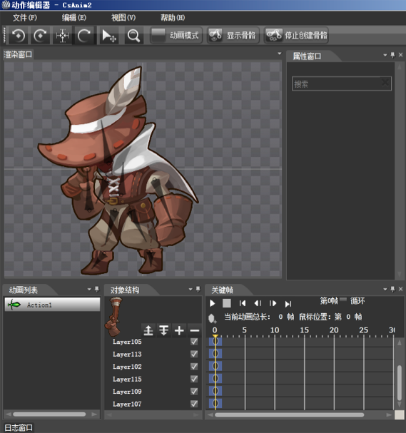

#使用 CocoStudio 创建 Cocos2d-x 序列帧和骨骼动画
---

##1 CocoStudio 简介
CocoStudio 是由 Cocos2d-x 官方推出的一个专门针对 Cocos2d-x 游戏开发的免费工具集，目前正在开发阶段，且日益完善之中！既是工具集，当然集成了现有各零零散散工具的功能，并且不断扩充，包含动画编辑器，UI编辑器，场景编辑器和数据编辑器。具体内容及其特性欢迎访问 CocoStudio 官网 [http://cocostudio.org/](http://cocostudio.org/) 。在这里，我们通过动画编辑器来快速体验一下 CocoStudio 为我们开发带来的便捷~

##2 环境搭建与配置
本文章所使用的系统环境为 win7 系统，CocoStudio-0.2.0 版本。

在当前最新稳定版 Cocos2d-x-2.1.4 的 TestCpp 中已经有例子展示了一些相关骨骼动画的效果。

##3 序列帧动画的创建步骤
帧动画，顾名思义！就是将一张张设计好的图片，依次展示出来，就像放胶片电影一样，多帧组成动画效果。不多介绍了，直接看 CocoStudio 的使用方法。

- 打开 CocoStudio 启动动画编辑器
- 点击文件新建项目，并确定

- 在资源窗口选择添加资源，序列帧原图（这里不支持使用plist作为资源，但可以导出plist）
- 选择第一帧图片，拖进“渲染窗口”，选择工具栏第三项，居中显示。（居中可选操作）

 
- 我们看见在“对象结构”视图中多出一个层，这就是序列帧动画层，在资源视图多选文件（除首帧之外），之后拖动到“对象结构”视图中刚才那个层之上，我们将能够看见“关键帧”视图的变化，当前帧根据图片数量自动变化，注意“对象结构”视图中鼠标的位置。

  
- 点击“关键帧”视图“播放”即可播放，也可循环播放动画 

- 保存项目后，可以导出大图，自动打包资源图片，在本例中生成了 “CsAnim.ExportJson”,”CsAnim0.plist” 和 “CsAnim0.png” 三个文件，然后我们就能拿着这三个文件在 Cocos2d-x 中使用了。

##4 如何在 Cocos2d-x 中运行其动画
上面我们生成了一些文件，动画的资源文件，此时我们需要在 Cocos2d-x 中加载这些资源，并运行之，我们将以上文件放在项目 “Resources” 的 “Export” 目录之中。 然后使用如下关键代码，创建动画。例子代码可以从这里下载学习使用：[http://www.cocostudio.org/detail.php?id=4062](http://www.cocostudio.org/detail.php?id=4062)

	// 加载资源文件 png 图片，plist 文件和 ExportJson 动画文件，一般而言可以在场景运行之初加载此资源
	cs::ArmatureDataManager::sharedArmatureDataManager()-&gt;addArmatureFileInfo("Export/CsAnim0.png", "Export/CsAnim0.plist", "Export/CsAnim.ExportJson");
	 
	// 这里直接使用 CsAnim ，而此信息保存在 CsAnim.ExportJson 中，与其创建的项目属性相对应  
	cs::Armature* armature = cs::Armature::create("CsAnim");
	// 设置当前运行动画的索引，一个“工程”可以建立多个动画
	armature-&gt;getAnimation()-&gt;playByIndex(0);
	// 设置位置信息
	armature-&gt;setPosition(VisibleRect::center());
	// 添加到容器，当前运行的场景之中
	addChild(armature);

##5 骨骼动画的创建
前面我们使用了 CocoStudio 动画编辑器创建并在游戏中使用了序列帧动画，那么我们现在看看怎么使用其创建骨骼动画，相比序列帧动画，其导出的文件使用方法和序列帧相同，这里详细介绍下怎么使用动画编辑器创建骨骼动画。

骨骼动画创建步骤稍微复杂，请注意版本变化，操作可能不同
[http://bbs.cocostudio.org/forum.php?mod=viewthread&tid=168&extra=page%3D1](http://bbs.cocostudio.org/forum.php?mod=viewthread&tid=168&extra=page%3D1)

> 首先创建项目，把准备好的资源图片导入 

> 我们需要得资源一个个拖动到“渲染视图”并摆放好位置关系，注意“对象视图”可以上下移动层次，以改变显示的位置关系（前后关系）Ctrl+鼠标滚轮可以放大或是缩小“渲染视图”，空格加拖动可以拖动渲染视图，方便编辑

> 位置摆好，我们就开始创建骨骼体系了，我们以身体作为基准创建
> 修改编辑模式，默认是动画模式，点击工具栏“动画模式”，然后会转变成“体型模式”，然后点击“停止创建骨骼”会转变为“创建骨骼模式”，然后就可以添加骨骼，我们在身体的部位用鼠标画出骨骼！可以连续画出多个。 

> 退出“创建骨骼模式”至“停止创建骨骼”模式，我们看到骨骼已经画出，现在要做的就是资源素材与骨骼的绑定，和骨骼的结构关系设定。
> 右击渲染场景的资源，选择“绑定到骨头”，然后选择骨骼（选择的骨头高亮显示），依次设定绑定所有 

> “如果绑定，可能会丢失图层帧信息，是否继续？”直接是即可。
> 右击骨骼“绑定到父亲”，依次根据身体部位设定好。
依照以上方法设定好资源图片与骨骼的对应关系，当然还有各骨骼之间的“父子”关系。 至此骨骼体系已经创建完成，下面则是基于此创建动画效果

>> 首先切换到“动画模式”，不同的模式功用不同
>> 选中当前帧的所有层，并且复制 

>>>复制之后，在“如”第十五帧之处右击粘贴 

>> 以上的复制粘贴的目的是为了使动画的首帧与尾帧相同，完成一个动画循环效果 

>> 有了首尾帧，我们便可在中间帧编辑动画，选中“如”第六帧，然后拖动如图“手枪”骨骼 

>> 点击播放就能看见动画效果了，我们可以在定位到其它帧，然后编辑骨骼的位置关系，最终创建出达到我们预期效果的骨骼动画

使用 CocoStudio 的动画编辑器来创建动画的简单步骤如上过程，这里只是简单快速的 “预览” 了一下其功能，但是更多的需要用户动手的实际操作~