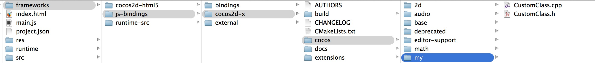
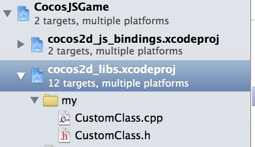
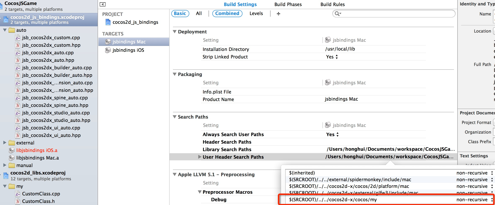
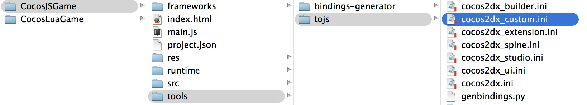
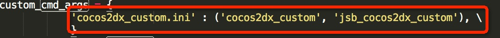
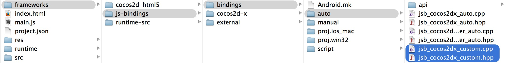
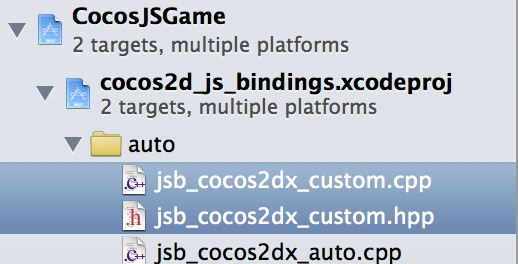

How to bind a custom class to js runtime
===
---

This document targets to show how to bind a custom cpp class to js runtime. **Not for details of jsbinding**.

Processes of all platforms are similar, to facilitate this, let's choose Mac runtime as example.

### Generate source code for runtime
This assumes you have a cocos lua project in Cocos Code IDE named CocosJsGame.

* Source code of runtime is stored in < projectLocation >/frameworks/runtime-src, if this directory exist, skip next step.
* Otherwise, you need generate source code for runtime by following steps:
  * Right click CocosJSGame project
  * Cocos Tools->Build Runtime...
  * **Next** and **Next** until Runtime Builder Wizard is shown
  * Now the source code have been generated, click **Close**

### Add CustomClass class in project


```

// CustomClass.h

#ifndef __CUSTOM__CLASS

#define __CUSTOM__CLASS

#include "cocos2d.h"

namespace cocos2d {
class CustomClass : public cocos2d::Ref
{
public:
    
    CustomClass();

    ~CustomClass();

    bool init();

    CREATE_FUNC(CustomClass);
};
} //namespace cocos2d

#endif // __CUSTOM__CLASS

```

```
// CustomClass.cpp
#include "CustomClass.h"

USING_NS_CC;

CustomClass::CustomClass(){
    
}

CustomClass::~CustomClass(){
    
}

bool CustomClass::init(){
    return true;
}

std::string CustomClass::helloMsg() {
    return "Hello from CustomClass::sayHello";
}

```

add CustomClass.h/CustomClass.cpp to Xcode project:



add search path


### Add cocos2dx_custom.ini

open `tools/tojs` directory and add `cocos2dx_custom.ini` file:


content of this file is:

```
[cocos2dx_custom]

[cocos2dx_custom]
# the prefix to be added to the generated functions. You might or might not use this in your own
# templates
prefix = cocos2dx_custom

# create a target namespace (in javascript, this would create some code like the equiv. to `ns = ns || {}`)
# all classes will be embedded in that namespace
target_namespace = cc

android_headers = -I%(androidndkdir)s/platforms/android-14/arch-arm/usr/include -I%(androidndkdir)s/sources/cxx-stl/gnu-libstdc++/4.7/libs/armeabi-v7a/include -I%(androidndkdir)s/sources/cxx-stl/gnu-libstdc++/4.7/include
android_flags = -D_SIZE_T_DEFINED_ 

clang_headers = -I%(clangllvmdir)s/lib/clang/3.3/include 
clang_flags = -nostdinc -x c++ -std=c++11

cocos_headers = -I%(cocosdir)s/cocos -I%(cocosdir)s/my -I%(cocosdir)s/cocos/2d -I%(cocosdir)s/cocos/base -I%(cocosdir)s/cocos/physics -I%(cocosdir)s/cocos/2d/platform -I%(cocosdir)s/cocos/2d/platform/android -I%(cocosdir)s/cocos/math/kazmath
cocos_flags = -DANDROID -DCOCOS2D_JAVASCRIPT

cxxgenerator_headers = 

# extra arguments for clang
extra_arguments = %(android_headers)s %(clang_headers)s %(cxxgenerator_headers)s %(cocos_headers)s %(android_flags)s %(clang_flags)s %(cocos_flags)s %(extra_flags)s 

# what headers to parse
headers = %(cocosdir)s/cocos/my/CustomClass.h

# what classes to produce code for. You can use regular expressions here. When testing the regular
# expression, it will be enclosed in "^$", like this: "^Menu*$".
classes = CustomClass.*

# what should we skip? in the format ClassName::[function function]
# ClassName is a regular expression, but will be used like this: "^ClassName$" functions are also
# regular expressions, they will not be surrounded by "^$". If you want to skip a whole class, just
# add a single "*" as functions. See bellow for several examples. A special class name is "*", which
# will apply to all class names. This is a convenience wildcard to be able to skip similar named
# functions from all classes.

skip = 

rename_functions = 

rename_classes = 

# for all class names, should we remove something when registering in the target VM?
remove_prefix = 

# classes for which there will be no "parent" lookup
classes_have_no_parents = 

# base classes which will be skipped when their sub-classes found them.
base_classes_to_skip = Ref Clonable

# classes that create no constructor
# Set is special and we will use a hand-written constructor
abstract_classes = 

# Determining whether to use script object(js object) to control the lifecycle of native(cpp) object or the other way around. Supported values are 'yes' or 'no'.
script_control_cpp = no

```

### Change tools/tojs/genbindings.py

find `cmd_args` in tools/tojs/genbindings.py and add a line:

```
  'cocos2dx_custom.ini' : ('cocos2dx_custom', 'jsb_cocos2dx_custom'), \
```


### Run tools/tojs/genbindings.py

run tools/tojs/genbindings.py, then you would find `jsb_cocos2dx_custom_auto.cpp` and `jsb_cocos2dx_custom_auto.h` in frameworks/js-bindings/bindings/auto directory:


add them in Xcode project:


### Register it to js

open `jsb_cocos2dx_custom_auto.hpp`, that is a global function declare --> 

`register_all_cocos2dx_custom(JSContext* cx, JSObject* obj);`

call this function before CustomClass is used, for example, in AppDelegate.cpp before run `main.js`:

```
    ...
    #include "jsb_cocos2dx_custom.hpp"
    ...
    
	sc->addRegisterCallback(register_all_cocos2dx_custom);
    
#ifdef COCOS2D_DEBUG
    if (startRuntime())
        return true;
#endif

    ScriptingCore::getInstance()->start();
    auto engine = ScriptingCore::getInstance();
    ScriptEngineManager::getInstance()->setScriptEngine(engine);
    ScriptingCore::getInstance()->runScript("main.js");     
```

### Build runtime
In Cocos Code IDE:

 * Right click CocosJSGame project
 * Cocos Tools->Build Runtime...
 * Select target platforms then **build**

### Using CustomClass in js
Edit main.js, using CustomClass where you want:

```
	var customClass = cc.CustomClass.create();
    var msg = customClass.helloMsg()
    cc.log("customClass's msg is : " + msg)
```

### Test
Run/Debug this project with new runtime named `CocosJSGame`, you would see log in console:

`customClass's msg is : Hello from CustomClass::sayHello`


