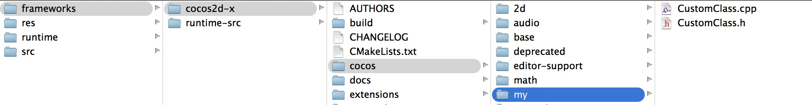
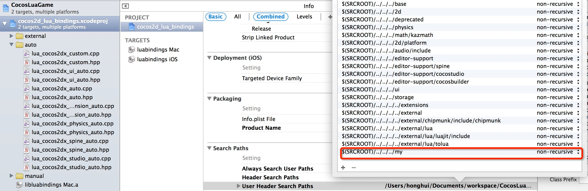
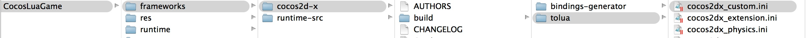
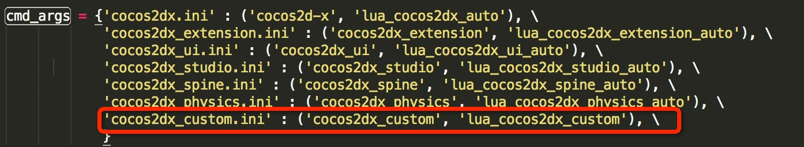
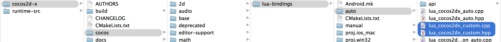
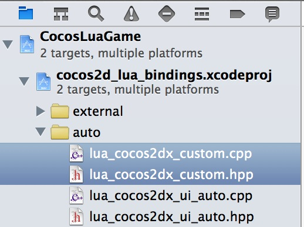
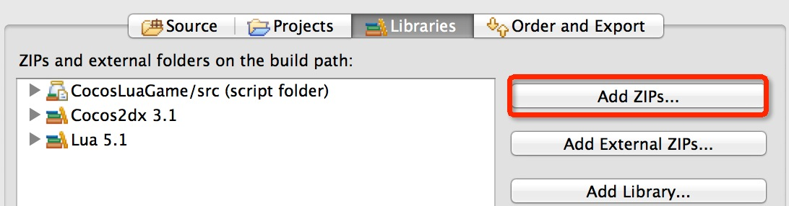

How to bind a custom class to lua runtime
===
---

This document targets to show how to bind a custom cpp class to lua runtime. **Not for details of luabinding**.IF you need more details for luabinding, reference to [Lua binding for custom class][Lua binding for custom class].

Processes of all platforms are similar, to facilitate this, let's choose Mac runtime as example.

### Generate source code for runtime
This assumes you have a cocos lua project in Cocos Code IDE named CocosLuaGame.

* Source code of runtime is stored in < projectLocation >/frameworks/runtime-src, if this directory exist, skip next step.
* Otherwise, you need generate source code for runtime by following steps:
  * Right click CocosLuaGame project
  * Cocos Tools->Build Runtime...
  * **Next** and **Next** until Runtime Builder Wizard is shown
  * Now the source code have been generated, click **Close**


### Add CustomClass class in project


```

// CustomClass.h

#ifndef __CUSTOM__CLASS

#define __CUSTOM__CLASS

#include "cocos2d.h"

namespace cocos2d {
class CustomClass : public cocos2d::Ref
{
public:
    
    CustomClass();

    ~CustomClass();

    bool init();
    
    std::string helloMsg();

    CREATE_FUNC(CustomClass);
};
} //namespace cocos2d

#endif // __CUSTOM__CLASS

```

```
// CustomClass.cpp
#include "CustomClass.h"

USING_NS_CC;

CustomClass::CustomClass(){
    
}

CustomClass::~CustomClass(){
    
}

bool CustomClass::init(){
    return true;
}

std::string CustomClass::helloMsg() {
    return "Hello from CustomClass::sayHello";
}

```

add CustomClass.h/CustomClass.cpp to Xcode project, Please check **cocos2dx iOS** on the bottom:


then you will see the new project structure: 


add search path:



### Add cocos2dx_custom.ini

open `tools/tolua` directory and add `cocos2dx_custom.ini` file:



content of this file is, please leave `target_namespace` blank, embed custom class in a namespace’s code auto-complete is not yet supported by Cocos Code IDE:

```
[cocos2dx_custom]
# the prefix to be added to the generated functions. You might or might not use this in your own
# templates
prefix = cocos2dx_custom

# create a target namespace (in javascript, this would create some code like the equiv. to `ns = ns || {}`)
# all classes will be embedded in that namespace
target_namespace =

android_headers = -I%(androidndkdir)s/platforms/android-14/arch-arm/usr/include -I%(androidndkdir)s/sources/cxx-stl/gnu-libstdc++/4.7/libs/armeabi-v7a/include -I%(androidndkdir)s/sources/cxx-stl/gnu-libstdc++/4.7/include
android_flags = -D_SIZE_T_DEFINED_ 

clang_headers = -I%(clangllvmdir)s/lib/clang/3.3/include 
clang_flags = -nostdinc -x c++ -std=c++11

cocos_headers = -I%(cocosdir)s/cocos -I%(cocosdir)s/my -I%(cocosdir)s/cocos/base -I%(cocosdir)s/cocos/platform/android
cocos_flags = -DANDROID

cxxgenerator_headers = 

# extra arguments for clang
extra_arguments = %(android_headers)s %(clang_headers)s %(cxxgenerator_headers)s %(cocos_headers)s %(android_flags)s %(clang_flags)s %(cocos_flags)s %(extra_flags)s 

# what headers to parse
headers = %(cocosdir)s/cocos/my/CustomClass.h

# what classes to produce code for. You can use regular expressions here. When testing the regular
# expression, it will be enclosed in "^$", like this: "^Menu*$".
classes = CustomClass.*

# what should we skip? in the format ClassName::[function function]
# ClassName is a regular expression, but will be used like this: "^ClassName$" functions are also
# regular expressions, they will not be surrounded by "^$". If you want to skip a whole class, just
# add a single "*" as functions. See bellow for several examples. A special class name is "*", which
# will apply to all class names. This is a convenience wildcard to be able to skip similar named
# functions from all classes.

skip = 

rename_functions = 

rename_classes = 

# for all class names, should we remove something when registering in the target VM?
remove_prefix = 

# classes for which there will be no "parent" lookup
classes_have_no_parents = 

# base classes which will be skipped when their sub-classes found them.
base_classes_to_skip = 

# classes that create no constructor
# Set is special and we will use a hand-written constructor
abstract_classes = 

# Determining whether to use script object(js object) to control the lifecycle of native(cpp) object or the other way around. Supported values are 'yes' or 'no'.
script_control_cpp = no

```

### Change tools/tolua/genbindings.py

find `cmd_args` in tools/tolua/genbindings.py and add a line:

```
  'cocos2dx_custom.ini' : ('cocos2dx_custom', 'lua_cocos2dx_custom'), \
```


### Run tools/tolua/genbindings.py

run tools/tolua/genbindings.py, then you would find `lua_cocos2dx_custom.cpp` and `lua_cocos2dx_custom.h` in cocos/scripting/lua-bindings/auto directory, and `CustomClass.lua` in cocos/scripting/lua-bindings/auto/api:



add .h/.cpp in Xcode project:



### Add CustomClass auto completion for Cocos Code IDE(1.0.1.beta or above)
zip `CustomClass.lua` to a zip file, such as CustomClass.zip by follow command:

```
zip CustomClass.zip CustomClass.lua
```

In Cocos Code IDE:

* Right click CocosLuaGame project
* Build Path->Configure Build Path...->Libraries->Add ZIPS...
* 
* Select the `CustomClass.zip` and **OK**

### Register it to lua

open `lua_cocos2dx_custom.h`, that is a global function declare --> `register_all_cocos2dx_custom(lua_State* tolua_S);`

call this function before CustomClass is used, for example, in AppDelegate.cpp before run Lua entry file:

```
    ...
    #include "lua_cocos2dx_custom.hpp"
    ...
    
	// register custom function
    LuaStack* stack = engine->getLuaStack();
    auto state = stack->getLuaState();
    lua_getglobal(state, "_G");
    register_all_cocos2dx_custom(state);
    lua_pop(state, 1);
    
#if (COCOS2D_DEBUG>0)
    if (startRuntime())
        return true;
#endif

    engine->executeScriptFile(ConfigParser::getInstance()->getEntryFile().c_str());
    return true;        
```

### Build runtime
In Cocos Code IDE:

 * Right click CocosLuaGame project
 * Cocos Tools->Build Runtime...
 * Select target platforms then **build**

### Using CustomClass in lua
Edit main.lua, using CustomClass where you want:

```
	local customClass = CustomClass:create()
    local msg = customClass:helloMsg()
    cclog("customClass's msg is : " .. msg)
```

### Test
Run/Debug this project with new runtime named `CocosLuaGame`, you would see log in console:

`customClass's msg is : Hello from CustomClass::sayHello`

[Lua binding for custom class]: ../../../framework/native/scripting/lua/lua-binding-for-custom-class/zh.md


