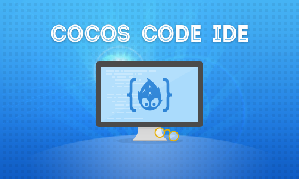

Cocos Code IDE入门指南
=========================

{{toc}}

Cocos Code IDE 是一个基于 Eclipse 的跨平台 IDE ，专门为 Cocos2d-x Lua & JavaScript 开发人员准备，通过此工具，你可以方便的创建游戏工程、编写并且调试代码、实时查看代码被改变后的效果，最终直接发布成一个可上架的安装包。当前发布的是第一个 alpha 版本，我们有信心将它打造成众多X-man的开发神器。

**已实现的功能（1.0-beta）：**

* 简单地创建 Cocos2d-x Lua & JavaScript 工程
* 提供 Cocos2d-x Lua & JavaScript 代码提示
* 可以方便地在iOS/Mac/Android/Windows 平台上调试代码，包括iOS/Android的设备和模拟器
* 不需要进行耗时巨长的native编译就可以运行游戏代码
* 保存代码后不需要重启游戏就可以看到改动后的效果
* 打包并发布apk

**暂未实现的功能（1.0-beta）：**

* 将工程打包成 ipa
* 与现有的编辑器（如CocoStudio等）集成

**不会支持的特性**

* Code IDE 是为 Lua 和 Javascript 等脚本语言设计的，不支持也不打算做对C++等其他语言的支持

下载
----------
| 平台        | 充分测试版本 | 主站下载（国内较慢）| 国内镜像（较快） |
| ----------- |:--------------:| ----------------------:|-------------------------:|
| Mac OS X      | 10.9 		| [Mac OS X 64][mac ide global link] |[Mac OS X 64][mac ide Chinese link] 
| Windows       | Win7/Win8     | [Windows x86 64Bit][windows ide 64 global link], [Windows x86 32Bit][windows ide 32 global link]) | [Windows x86 64Bit][windows ide 64 Chinese link], [Windows x86 32Bit][windows ide 32 Chinese link]|

如何安装
------------

### 基本需求

+ 安装 [JDK][JDK link]并把<jdkhome>/bin 添加到的系统变量中。如果你使用的是 Mac OS X 10.9，你可能需要安装这个 [苹果修改版本][Apple modified Java package link]。
+ 安装 [Python][Python link], 最好是2.7版本，windows用户还需要手动的将 python 路径加入到系统环境变量中。
+ 开发 Cocos2d-x Lua binding 游戏请下载Cocos2d-x 3.0 stable ( [主站下载（国内较慢）][cocos2d-x global link] | [国内镜像（较快）][cocos2d-x Chinese link] )
+ 开发 Cocos2d-x JavaScript binding 游戏请下载 Cocos2d-js alpha2 ( [主站下载（国内较慢）][cocos2d-js global link] | [国内镜像（较快）][cocos2d-js Chinese link]）

	**Note : **
	
	**1、Cocos Code IDE(1.0-beta)是基于Cocos2d-x 3.0 stable/Cocos2d-js alpha2 的引擎版本做的开发，其他版本的引擎在该版本的IDE上将无法工作，所以为了使用IDE请下载相应的版本的引擎。**
	
	**2、引擎和所创建的工程所在的路径都不能包含非英文字符，即路径中不能包含中文。**
	
### 额外需求

* 如果要在 iOS Simulator 上调试，需要

    保证你的 Mac 上安装了 iOS Simulator

* 如果你要在 android 设备上调试，需要

    安装 [android sdk][Android SDK link]

* 如果你想要定制自己的 runtime，你需要：

	| 目标平台      | 工具 |
	| ------------- |:----------------------------:|
	| Mac OS X/iOS      | XCode 		|
	| Windows       | VS2012 或更高版本     |
	| Android       | [Android SDK][Android SDK link], [NDK][NDK link], [ANT][ANT link] |

如何使用
----------

+ [使用Code IDE调试Cocos2d-x Lua游戏](../debug-Lua/zh.md)
+ [使用Code IDE调试Cocos2d-x JavaScript游戏](../debug-js/zh.md)

[JDK link]: http://www.oracle.com/technetwork/java/javase/downloads/index.html
[Android SDK link]: https://developer.android.com/sdk/index.html?hl=sk
[NDK link]: https://developer.android.com/tools/sdk/ndk/
[ANT link]: http://ant.apache.org/
[Apple modified Java package link]: http://support.apple.com/kb/dl1572
[Python link]: http://www.python.org/download
[cocos2d-x global link]: http://cdn.cocos2d-x.org/cocos2d-x-3.0.zip
[cocos2d-x Chinese link]: http://cocos2d-x.org/filedown/cocos2d-x-3.0-zip-cncdn
[cocos2d-js global link]: http://cdn.cocos2d-x.org/Cocos2d-JS-v3.0-alpha2.zip
[cocos2d-js Chinese link]: http://cocos2d-x.org/filedown/cocos2d-js-v3.0-alpha2-zip-cncdn
[mac ide global link]: http://cdn.cocos2d-x.org/cocos-code-ide-mac64-1.0.0-beta.zip
[mac ide Chinese link]: http://cocos2d-x.org/filedown/cocos-code-ide-mac64-1.0.0-beta-zip-cncdn
[windows ide 64 global link]: http://cdn.cocos2d-x.org/cocos-code-ide-win64-1.0.0-beta.zip
[windows ide 64 Chinese link]: http://cocos2d-x.org/filedown/cocos-code-ide-win64-1.0.0-beta-zip-cncdn
[windows ide 32 global link]: http://cdn.cocos2d-x.org/cocos-code-ide-win32-1.0.0-beta.zip
[windows ide 32 Chinese link]: http://cocos2d-x.org/filedown/cocos-code-ide-win32-1.0.0-beta-zip-cncdn
