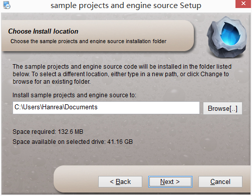
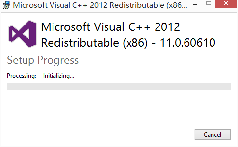

# 安装

## 获取  

前往[Cocos中文下载站](http://cn.cocos2d-x.org/download)下载最新版本，包括Windows和Mac版本。

## "Windows"系统安装

- 选择Windows版本安装包，点击下载到本地硬盘。  
   
- 下载完成后，双击打开"Cocostudio_v1.4.0.1.exe"文件。   
   
- 许可协议
	- 请选择"I accept the agreement" 后点击"Next(N)>"继续。
	- 如果选择"I do not accept the agreement",则表明您不同意该许可协议，您将智能选择"Cancel(C)"取消安装
   
- 设置安装路径
   
- 设置示例工程和默认资源路径
   
- 安装运行时
   
- 等待安装
   
- 安装成功
   

## 常见问题

- Q：安装失败如何解决？    
	A：安装失败建议检查是否有足够的硬盘空间，是否正确输入密码。如果您启动编辑器后无法正常运行，建议卸载后再次安装。如果重新安装未能解决问题，请从发送邮件至[cocostudio@chukong-inc.com](cocostudio@chukong-inc.com)获取帮助。