#Notes on Self-defined Expansion Functions of UI Control

###Introduction 
In the latest UI Editor 1.3, the editing support for self-defined UI control is added, with which the user can integrate the UI controls written by himself in the existing UI editor, and use the editing UI interface with the existing UI controls. The following describes the procedures for integrating the self-defined controls with such function. 

Writing the self-defined control plugin of UI includes the following steps: 

  1. Writing self-defined control; 
  2. Writing packaging code and realizing editor stipulated interface;
  3. Writing Swig generation script; 
  4. Compiling generated project;
  5. Copying generated dynamic library to plugin directory;
  6. Starting UI editor, editing UI with new control and saving it;
  7. Writing parsing code of self-defined control attribute;
  8. Loading UI interface display in game.

Before the above steps, let’s see an example of expanding UI self-defined control. Install the new version CocoStudio 1.3, and you can see the Plugin Sample under directory CocoStudio in My File, i.e. CustomImageView plugin. Open CustomImageView solution, we can see the following 2 projects:   

CustomImageView is a C++ project, including the source code of the self-defined control (CustomImageView type), C++ package provided to the editor for use (CSCustomImageView type) and the configuration script for the Swig tool (SwigCustomImageView.i). Swig is a development tool used for enabling imbedded connection of software written with C or C++ and other advanced programming languages. The executable program of Swig has been integrated in the installation kit. For details, please visit the official website http://www.swig.org/.

CustomImageViewWrap is a C# project, including C# packaging code automatically generated by Swig tool, provided to the editor for calling by dynamic mount. The above are all the contents required for completing the self-defined control of UI, and the following show the procedures for realization. 

###Writing self-defined control 
Now we first analyze CustomImageView project. The self-defined UI, i.e. CustomImageView, is a simple expansion of ImageView, to allow ImageView to display a text while displaying photos, so 2 methods, i.e. setText and getText, are disclosed, for setting the text to be displayed. 

The self-defined control of the user shall be inherited from coco2d: : gui: : widget, or the expansion function can be inherited from the existing control, e.g. button, slider, etc. 

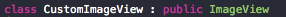
The static method for creating CustomImageView: 

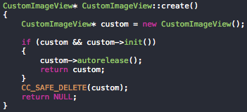
 
The reflective method for creating CustomImageView: 

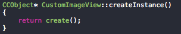

The initiation method for the node of the display text of the self-defined expansion attribute: 

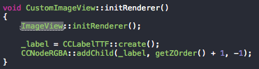

The set and get method for the self-defined expansion attribute setting and obtaining the text: 

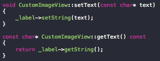

###Writing packaging code and realizing editor stipulated interface

The CSCustomImageView class is the packaging of CustomImageView, and for differentiation, the prefix “CS” is added. Such class is inherited from CSImageView, corresponding to the inheritance of CustomImageView. For other control types as Button, etc., there is the packaging CSButton. When writing CustomButton, CSCustomButton shall be inherited from the corresponding CSButton class. All the default CocoStudio packaging types are in the naming space of CocoStudio::EngineAdapter. The following shows how to realize the construction function of CSCustomImageView: 

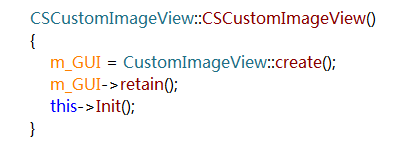

m_GUI is the Widget type pointer defined in CSWidget, and the subtype shall be initiated and Init（）shall be called to complete initiation. All the subtypes must undergo the 2 steps to achieve the normal mounting. Some paired Get/Set methods with the “CS_” prefix are also defined in CSCustomImageView, shown as follows:
 
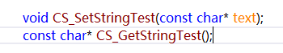

Such methods are used for the editor to retrieve the configurable attributes, so there are some requirements for such methods as follows: 
	
  1. The methods must be named with “CS_Set” or “CS_Get” as the prefix, case sensitive. 
  2.  The Set/Get methods must be in pairs, i.e. except the prefix, the remaining parts of the method names must be the same. The Set method now only supports single parameters, but it must be of the same type as the return value of the Get method. 
  3. Now they support  string, figure , color and resource type.In the "Particle" demo ,there have one resource type to set particle resource. 

The internal realization of CS_SetStringTest is shown as follows: 

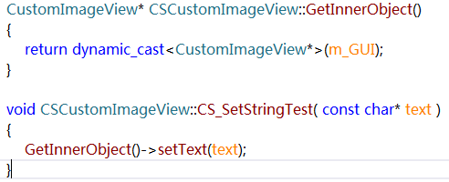

Conduct the type transformation of m_GUI, directly call the setText method disclosed in CustomImageView, and set the attributes of the self-defined control. 
	
To sum up, the editor packaging class shall be written in the following 2 steps: 
	
  1. Initiate m_GUI in the construction, and call the Init method of the parent class. 
  2. According to the pre-determined naming rules, package the self-defined attributes of the control to be disclosed. 

###Writing parsing code for self-defined control attribute 

Sample code of CustomImageViewReader:   
     The self-defined class shall be inherited from cocos2d::CCOject. 
     

    
 The method for static creation of the single object of CustomImageViewReader: 
 
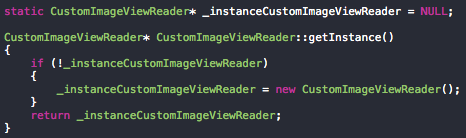  

The callback method of CustomImageViewReader parsing the self-defined attribute of CustomImageView: 

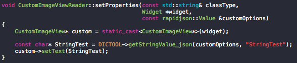

  For the notes on Part 1 and 2, see CustomImageView.cpp and CustomImageViewReader.cpp in Cocos2d-x TestCpp project.

 After completing the above work，please regist the analytical functions。

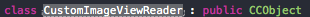

###Writing Swig generation script 
Double click to open Swig script, with the following contents: 

Add the head file manifestation   
Add the type to be exported  
Designate as the self-defined control  
Import the default configuration and assist parsing  
Define the name of the program set generated   

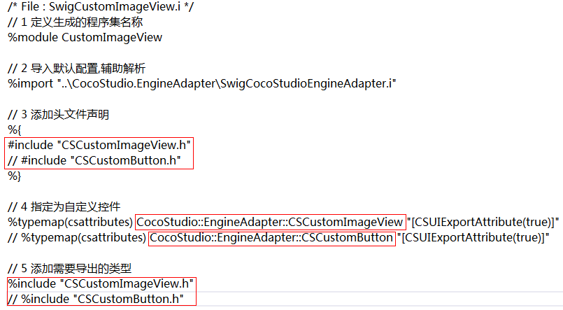

Such Swig script file includes 5 parts:   
Part 1 and 2 are default configurations, requiring no amendment. When adding the self-defined control, only Part 3, 4 and/or 5 shall be amended.   
Part 3 shall be added with the head file manifestation of the self-defined control, when the expansion of CSCustomButton was written, #include “CSCustomButton.h” shall be written in another line of the subsequent red box. If there are multiple self-defined controls, each one shall be written in a separate line. Pay attention to “%}” at the end.   
In Part 4, add the manifestation of the exported control type, chiefly amending the red portion in the diagram. Pay attention to the full name of the designated type, i.e. the class name including the naming space.   
At the end, add export in Part 5. It is to be noted that it is “ %include” here, while it is “%” in the previous one, different from Part 3. Then writing of Swig script has been completed. 

###Compiling generated project

After writing the Swig script, right click the file (SwigCustomImageView.i) in “Solution resource manager” of VisualStudio, choose Compile, “Invoking SWIG...” will appear from the output window, which means calling Swig is successful. When there is any error in writing the script, e.g. syntactic error, relevant prompt will appear here.   

If the execution is successful, 3 CS files shall be generated under the directory of CustomImageViewWarp project. Include the 3 files into CustomImageViewWarp project, 

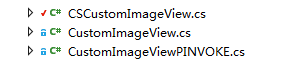

and SwigCustomImageView_wrap.cxx file will be generated under the directory of CustomImageView project. Include the file in CustomImageView project. In the Compile options of Swig script, set the output path. 

After completing the above operations, choose the Release configuration, and compile CustomImageView project and CustomImageViewWrap project, to generate CustomImageView.dll and CustomImageViewWrap.dll in the output directory. 

Pay attention to the following settings: 
 
 1. Set the release mode for compiling. 
 2. Enable the signature in C# project, and use Plugins.snk file (default as configured) in the CustomImageViewWrap project. 
 3. Only support the self-defined plugins developed based on Coco2d-x 2.2.2 now, and not support the self-defined controls developed based on Coco2d-x 3.0. 

###Copying generated dynamic library to plugin directory 

After installing the new version CocoStudio, such a path will appear in Windows 7 system: C:\Users\’UserName’\Documents\CocoStudio\Plugins\1.3. Create the directory of the plugin, and copy the 2 dll files generated in Step 4 under the directory. 

Pay attention to the following: 

  1. Put in the 2 DLL files at the same time, do not directly change the name of the Dll files, but only rename them in VisualStudio, and amend Swig script files. 
  2. The editor of different version shall correspond to the different plugin directory, as the editor will update with the Cocos2d-x engine, and the editor plugin of the different version shall link with the corresponding engine for compiling separately. 

###Editing UI project

After putting in the plugin, start the UI editor. If the plugin is successfully configured, the corresponding self-defined control will directly appear at the left side menu bar.

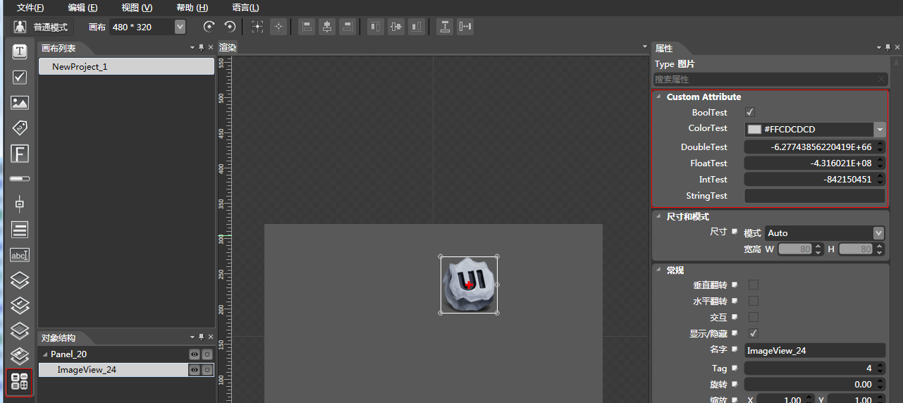

When the mouse is placed on the last icon, the class name of the self-defined control will appear, then the control can be directly dragged to the canvas for use, similar to the use of other controls. Choose the control, and the configurable attributes disclosed before the display in the CSCustomImageView class shall appear in the attribute window at the right. Directly make the settings and editing, and save the project. 

###Loading UI interface display in game

Sample code CustomImageTest:

   Notes on registerTypeAndCallBack method:   
   Notes on parameters:   
  	“CustomImageView”  
    Register the name of the self-defined control.   
    &CustomImageView::createInstance   
    Self-defined control creates method function pointer by reflection.   
    CustomImageViewReader::getInstance()   
    Self-defined control CustomImageView self defines the parsing object of expansion attribute.    
    parseselector(CustomImageViewReader::setProperties)  
    The callback method of parsing self-defined control CustomImageView self defining the expansion attribute.    
    

Before reading json, call the interface of GUIReader registerTypeAndCallBack, register the object and attribute parsing method of the self-defined control class and the self-defined attribute parsing class (the attribute parsing method must be the member method of the self-defined attribute parsing class); then call widgetFromJsonFile of GUIReader and create the node of UI control, and in widgetFromJsonFile method, create the self-defined control by reflecting the registered self-defined control name (e.g. “CustomImageView”), and call the object of the registered self-defined attribute parsing class and the callback function parsing self-defined attribute. 

The sample codes are shown in CustomImageTest.cpp of Cocos2d-x TestCpp. 

