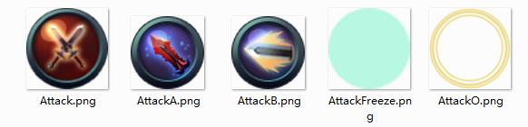

## 怎样用Cocos2d-html5制作一款横版动作游戏 (1)

源码下载[地址](../action-html5.zip)

这是一个简单的游戏打斗场景，一个英雄，一个怪物，可以控制英雄来回走动并且攻击，怪物实现简单 AI 并且自动攻击，有着不同的血量槽，控制系统，可以使用触摸，但为了操作的体验，同样实现了 键盘映射 ，可以使用 W、A、S、D 来控制人物的走动，J、U、I 实现一个普通攻击和两个特效攻击。

### 项目组织

为了使项目的代码结构清晰，前期规划好功能是必须的，先从整体看一下，项目的组织结构，然后会对其中内部实现做些必要的解说：

如上所示， Arthur为游戏项目的主目录，与它同级的目录，是 H5 的库目录，当然截图中，为了发布，删除了一些不必要的文件，在 Arthur 目录下，包含一般项目都包含的结构组织。

- index.html : 这是游戏的展示界面，其中包含 “gameCanvas” ，作为游戏绘制的所在，它引用加载了 cocos2d.js。
- cocos2d.js : 项目初始化在这里进行，并完成系统库和项目源码的 js 加载，最后将控制权交给 main.js 文件。
- main.js : 当 H5 库加载完毕，执行内中代码，完成项目资源加载，并运行第一个场景。
- src : 此目录包含了游戏中编写的 js 源代码文件。
- res : 游戏所需的资源，如图片，字体等。

在这个游戏中相对复杂一点的就是控制系统了，其中在 HudLayer 中添加实现了 ActionButton 普通攻击按钮； Joypad中实现了可触摸360度摇杆功能和KeyMap游戏控制键盘映射方案；Characters 实现了人物和怪物的功能，包括各种动作控制；Loading 替换了 H5 的默认加载界面，使用了一个进度条显示加载进度；GameLayer 作为游戏的主场景，各种游戏的流程控制在这里进行。

### 360度可触摸摇杆实现

这里的摇杆，默认是为了触摸实现，之后添加的键盘映射，只是为了让操作更为方便而已（在 PC 浏览器中），触摸不同于摇杆的所在，是这里的摇杆可以在 360 度以内的任意角度遥控角色移动，这是键盘所不具备的，上下左右四个键，再加上每两个方向的组合也就八个方向。

	var Joypad = cc.Layer.extend({
		_winSize: null,
		_pCenter: null,
		_pControlSprite: null,
		_pDefaultPoint: null,
	
		_pDefaultRotation: null,
		_pRotation: null,
	
		_pDelegate: null,
		_pKeyDown: false,
		ctor:function(){
			this._super();
	
			_winSize = cc.Director.getInstance().getWinSize();
			_pCenter = cc.p(_winSize.width / 2, _winSize.height / 2);
	
		},
		init:function(){
			var bRet = false;
			if (this._super()){
				cc.log("Joypad init ..");
				// 控制杆所在位置
				this._pDefaultPoint = cc.p(110, 110);
				// 默认旋转角度，以使开口正对右侧
				this._pDefaultRotation = 26;
				// 实际旋转角度
				this._pRotation = 0;
	
				this.setPosition(this._pDefaultPoint);			
	
				this.addChild(cc.Sprite.create(s_Joypad1));
				this.addChild(cc.Sprite.create(s_Joypad2));
				this._pControlSprite = cc.Sprite.create(s_Joypad3);
				this.addChild(this._pControlSprite);
				this.addChild(cc.Sprite.create(s_Joypad4));
				
				this.updateRotation();
	
				bRet = true;
			}
			return bRet;
		},
		keyStart:function(degrees){
			if (this._pDelegate)			
				this._pDelegate.actionJoypadStart(this._pRotation);
		},
		keyUpdate:function(degrees){
			this._pRotation = degrees;
			this.updateRotation();
			if (this._pDelegate)
				this._pDelegate.actionJoypadUpdate(this._pRotation);				
		},
		keyEnded:function(degrees){
			if (this._pDelegate)			
				this._pDelegate.actionJoypadEnded(this._pRotation);		
		},
		onEnter:function(){
			this._super();
			// cc.Director.getInstance().getTouchDispatcher().addTargetedDelegate(this, 0, true);
			// 2.1.5 to 2.1.6
			cc.registerTargetedDelegate(0, true, this);
		},
		onExit:function(){
			cc.unregisterTouchDelegate(this);
		},
		onTouchBegan:function (touch, event){
			// 点击点的范围判断
			var curPoint = touch.getLocation();
			if (curPoint.x > _winSize.width / 2 || curPoint.y > _winSize.height / 2 ){
				return false;
			}
			
			// var sp = cc.pSub(this._pDefaultPoint, curPoint);
			// var angle = cc.pToAngle(sp);
			
			this.updateTouchRotation(touch, event);
			this.updateRotation();
			if(this._pDelegate)
				this._pDelegate.actionJoypadStart(this._pRotation);
			else
				cc.log('_pDelegate is null ... ');
	
			// cc.log("Joypad touch ...");
			return true;
		},
		onTouchMoved:function (touch, event){
			this.updateTouchRotation(touch, event);
			this.updateRotation();
	
			if (this._pDelegate)
				this._pDelegate.actionJoypadUpdate(this._pRotation);
			else
				cc.log('_pDelegate is null ... ');
			
			// var a = cc.pAngleSigned( curPoint, this._pDefaultPoint);
			// cc.log("Joypad touch mvove ..." + rotation) ;
		},
		onTouchEnded:function (touch, event){
			this.updateTouchRotation(touch, event);
			this.updateRotation();
			if (this._pDelegate)
				this._pDelegate.actionJoypadEnded(this._pRotation);
			else
				cc.log('_pDelegate is null ... ');
		},
		updateTouchRotation:function(touch, event){
			var curPoint = touch.getLocation();
			var sp = cc.pSub(curPoint, this._pDefaultPoint);
			var angle = cc.pToAngle(sp) ;// * -57.29577951;
			var rotation = angle * -57.29577951;
			rotation = rotation < 0 ? 360 + rotation: rotation;
			this._pRotation = rotation;		
		},
		updateRotation:function(){
			this._pControlSprite.setRotation(this._pDefaultRotation + this._pRotation);
		},
		setDelegate:function(dg){
			this._pDelegate = dg;
		}
	});

在初始化方法中，加载了摇杆资源文件，它分解成几个组成部分，以便于很好的控制，并且保存了可旋转元素精灵的引用**this._pControlSprite**，以便于随时控制它的旋转角度，如图中 **Joypad3.png** 图片。

以触摸的动作来控制动作的执行，Joypad 中包含了一个名为 _**pDelegate** 的属性，它作为控制摇杆的代理，以通知其它 （如 人物），摇杆现在变动了，分别在 **onTouchBegan** 中调用，`this._pDelegate.actionJoypadStart(this._pRotation);`，**onTouchMoved** 中调用`this._pDelegate.actionJoypadUpdate(this._pRotation);` 和在 **onTouchEnded** 中调用`this._pDelegate.actionJoypadEnded(this._pRotation);`。

只需要在传入的 _**pDelegate** 中实现此三种函数，就可以通过摇杆来控制其操作了，H5 使用 javascript 相比如 C++ 倒也省去了接口定义等繁杂的操作。可以看见，在三个函数调用中，所传入的参数为触摸的角度，在触摸是通知控制显示摇杆中 “罗盘” 的旋转。Joypad 对内通过触摸控制显示，对外通过触摸调用代理，以达到显示和控制相一致的目的。通过触摸的点相对摇杆原点的位置关系，很容计算出其角度。

由于这里的摇杆设计是 360 度任意角度，所以在 delegate 中传出一个参数，以标示角度关系，如果并不需要那么复杂的控制，如前文所言，只需固定八个方向的控制，那么这里传出的参数可以使用 枚举 类型，代表八个不同的方向，也会使得游戏逻辑变得稍微简单。

最后可以为 Joypad 层封装一个简单好用的调用方式：

	Joypad.create = function(){
		var joypad = new Joypad();
		if (joypad && joypad.init()){
			return joypad;
		}
		return null;
	};

### 攻击与特效攻击

在这个游戏中，有一个普通攻击和两个特效攻击，这两个不同，但很显然，他们都是攻击，却又相同，先看看他们的共同点：

	// ActionButton.js
	
	var ActionButton = cc.Node.extend({
		_sprite: null,
		_rect: null,
		_delegate: null,
		_attackType: null,
	
		_childObj: null,
		rect:function(){
			var size = this._sprite.getContentSize();
			return cc.rect(-size.width / 2, -size.height / 2, size.width, size.height);
		},
		setChindObj:function(obj){
			this._childObj = obj;
		},
		init:function(image){
			this._super();
	
			this._sprite = cc.Sprite.create(image);
			this.addChild(this._sprite);
			return true;
		},
		setDelegate:function(delegate){
			this._delegate = delegate;
		},
		setAttackType:function(at){
			this._attackType = at;
		},
		getAttackType:function(){
			return this._attackType;
		},
		onEnter:function(){
			this._super();
			// cc.Director.getInstance().getTouchDispatcher().addTargetedDelegate(this, 0, false);
			// 2.1.5 to 2.1.6		
			cc.registerTargetedDelegate(0, true, this);
		},
		onExit:function(){
			this._super();
			// cc.Director.getInstance().getTouchDispatcher().removeDelegate(this);
			cc.unregisterTouchDelegate(this);
		},
		containsTouchLocation:function(touch){
			return cc.rectContainsPoint(this.rect(), this.convertTouchToNodeSpace(touch));
		},
		onTouchBegan:function(touch, event){
			// 区域判断
			if (!this.containsTouchLocation(touch))
				return false;
			this.click();
			// 播放点击动画
			return true;
		},
		click:function(){
			if(this._delegate && this._childObj.isCanClick()){
				this._delegate.attackButtonClick(this.getAttackType());
				this.beganAnimation();			
			}
		},
		onTouchEnded:function(touch, event){
			this.endedAnimation();
		},
		beganAnimation:function(){
		},
		endedAnimation:function(){
		},
		isCanClick:function(){
			return true;
		}
	});

定义了一个 ActionButton 攻击按钮类型，它实现了 onTouchBegan 作为按钮点击的触发场所，触发了 **click**事件，再由 click 处理调用代理的事件，传出一个参数，以标示攻击的类型 **AttackType** , 在判断点击的时候还需要检测点击区域是否在按钮的可点击范围之内,当然再触发攻击动作之时，按钮本身也实现了一些动画特效，如点击效果，技能冷却效果，它由**beganAnimation** 方法实现。

但我们看见在 ActionButton 并没有实现 **beganAnimation** ，在方法里面并没有实现任何代码，这因为 ActionButton 只是作为 攻击按钮 的抽象，它只定义了攻击按钮具体由那些功能，能做哪些事情，如可以播放点击时的动画，但具体的动画内容，需要根据具体的攻击按钮有着不同的实现。

  

	var AttackButton = ActionButton.extend({
		_pt: null,
		_ac: null,
	
		_defaultScale: 0.35,
		_maxScale: 0.5,
	
		_inAction: null,
		_outAction: null,
	
		_timestamp: null,
		ctor:function(){
			this._super();
			this._pt= cc.Sprite.create(s_AttackO);
			this._pt.setScale(this._maxScale);
			this.setChindObj(this);
	
			// this.addChild(this._pt);
	
			var aScale = cc.ScaleTo.create(0.1, this._defaultScale);
			var aFadein = cc.FadeIn.create(0.1);
			this._inAction = cc.Spawn.create(aScale, aFadein);
	
			var oScale = cc.ScaleTo.create(.2, this._maxScale);
			var oFade = cc.FadeOut.create(0.2);
			this._outAction = cc.Spawn.create(oScale, oFade);
		},
		beganAnimation:function(){
			var timestamp = (new Date()).valueOf();		
			this._timestamp = timestamp;
	
			this.removeChild(this._pt);
			this.addChild(this._pt);
			this._pt.runAction(this._inAction);
			
		},	
		endedAnimation:function(){
			this._pt.stopAllActions();
			this._pt.runAction(this._outAction);
		},
		clickUp:function(){
			this.endedAnimation();
		},
		isCanClick:function(){
			var timestamp = (new Date()).valueOf();		
			return timestamp - this._timestamp > 600;
		}
	});

普通攻击按钮的效果，初始化设置图片素材，播放动画为一个光圈放大缩小显示，它 继承 自 ActionButton ，同样实现了 beganAnimation 方法。另外一种是特效攻击的实现：

	var AttackEffect = ActionButton.extend({
		_pt: null,
		_ac: null,
		_isCanClick: true,
		ctor:function(){
			this._super();
			var h = cc.Sprite.create(s_AttackFreeze);
			this._pt = cc.ProgressTimer.create(h);
			this._pt.setType(cc.PROGRESS_TIMER_TYPE_RADIAL);
			this._pt.setReverseDirection(true);
			this._pt.setScale(0.43);
	
			var to = cc.ProgressTo.create(0, 99.999);
			var to1 = cc.ProgressTo.create(2, 0);
			var ac2 = cc.CallFunc.create(this.callBack, this);
			this._ac = cc.Sequence.create(to, to1, ac2);
			this.setChindObj(this);
		},
		beganAnimation:function(){
			this.removeChild(this._pt);
			this.addChild(this._pt);
			this._pt.runAction(this._ac);
			this._isCanClick = false;
		},
		endedAnimation:function(){
		},
		callBack:function(){
			// cc.log("call back");
			this._isCanClick = true;
		},
		isCanClick:function(){
			return this._isCanClick;
		}
	});

特效攻击有个冷却效果，不能在一定时间范围内连续攻击，使用一个 旋转的 Progress 来达到这样的效果。   

