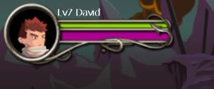
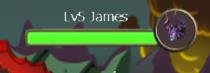
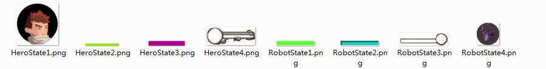

## 怎样用Cocos2d-html5制作一款横版动作游戏 (2)

源码下载[地址](../action-html5.zip)

在 [《怎样用Cocos2d-html5制作一款横版动作游戏 (1)》](../part1/zh.md) 中，实现了触摸摇杆和按钮点击的实现，这里继续。

### 游戏中的操作控制

使用 H5 来开发 Cocos2d-x 游戏的一个优势是它可以在浏览器中运行，这意味着，你无需安装部署到客户端即可发布运行，这时我们可以将一些游戏当中的触摸操作转换成键盘映射，就像我们平时玩 PC 游戏一样，比如跑动，跳跃等操作。

在之前，我们已经实现了一个摇杆和攻击按钮的实现，但是并没有一个统一的控制管理，以让它们很好的协同工作，这也是我们现在所要做的事情，首先我们有一个游戏层，里面包含了一个控制操作实现：

	var GameLayer = cc.Layer.extend({
	 
	    init:function(){
	        var bRef = false;
	        if(this._super()){
	            // ..........
	 
	            // 添加控制层
	            var hudLayer = HudLayer.create();
	            this.addChild(hudLayer);
	            hudLayer.setDelegate(this);
	 
	            // ...........
	 
	            bRef = true;
	        }
	        return bRef;
	    },
	    actionJoypadStart:function(degrees){
            // ...........
	    },
	    actionJoypadUpdate:function(degrees){
            // ...........
	    },
	    actionJoypadEnded:function(degrees){
            // ...........
	    },
	    attackButtonClick:function(button){
            // ...........
	    }
	});  

我们在 GameLayer 里面定义了**四个操作控制方法** ，包括摇杆控制和按钮点击。我们实现的这四个方法，将会由 HudLayer 层来进行控制，显然对于 HudLayer 来说，它需要知道什么时候去调用这些方法，而对于 GamerLayer 本身来说，它**只关心** 当触发了这些控制操作之时，需要多哪些操作，如触发摇杆操作，我们移动一个人物的走动，点击攻击，触发人物的攻击等。至于什么时候被触发，怎么被触发的，那它完全不关心。那么谁关心呢？显然不是你我 ~~

HudLayer 完成了这样一个功能，它包含了三个攻击按钮和一个摇杆控件，而且将由它**直接或者间接** 完成对**四个操作控制方法** 的调用。为什么说是直接或者间接？实际上这就是**委托机制** ，**四个操作控制方法** 就是回调函数，在 GameLayer 将回调函数委托给了 HudLayer ，当然 HudLayer 也可以继续委托给别人做，或者由自己来做。

还记得前文中**ActionButton** 实现的**click** 方法么！如果忘了，可以回头看看，有一句关键代码`this._delegate.attackButtonClick(this.getAttackType());`，它便是调用委托回调函数，而_**delegate**是谁，这不重要，重要的是它一定实现了 **attackButtonClick** 方法。至于什么时候 click 被触发，我想这里可以从前文代码看出来，在**onTouchBegan**达成点击触摸操作时，当然包括了一些其它判断，如点击区域检测。这里的_**delegate** 是谁:

	var HudLayer = cc.Layer.extend({
	    _winSize: null,
	    _pCenter: null,
	    _delegate: null,
	 
	    mJoypad: null,
	 
	    mAttack: null,
	    mAttackA: null,
	    mAttackB: null,
	    ctor:function(){
	        this._super();
	        _winSize = cc.Director.getInstance().getWinSize();
	        _pCenter = cc.p(_winSize.width / 2, _winSize.height / 2);
	    },
	    init:function(){
	        cc.log("Hud layer init ..");
	        var bRet = false;
	 
	        if(this._super()){
	 
	            // 添加控制器
	            this.mJoypad = Joypad.create();
	            this.addChild(this.mJoypad);
	 
	            // 添加攻击按钮
	            this.mAttack = AttackButton.initWithImage(s_Attack);
	            this.mAttack.setPosition(cc.p(mWinSize.width - 80,  80));
	            this.mAttack.setDelegate(this);		// 设置攻击按钮的 delegate
	            this.mAttack.setAttackType(AT.ATTACK);
	            this.addChild(this.mAttack);
	 
	            // 其它攻击 ...
	            // ..........
	 
	            bRet = true;
	        }
	        return bRet;
	    },
	    setDelegate: function(delegate){
	        this._delegate = delegate;
	        this.mJoypad.setDelegate(delegate);
	    },
	 
	    attackButtonClick:function(button){
	        if (this._delegate){
	            this._delegate.attackButtonClick(button);
	        }
	    },
	    keyAttack:function(btnType){
	       //.........................
	    },
	    keyAttackUp:function(btnType){
	       //.......................... 
	    }
	});

攻击按钮的_**delegage**就是 HudLayer 本身，所以在攻击按钮的 click 触发之时，HudLayer 的 **attackButtonClick** 方法被触发，而 HudLayer 本身的 _delegate 是谁呢，当然是 GameLayer 了，所以最终 GaleLayer 的 **attackButtonClick** 方法被触发，以达到攻击按钮点击作用于游戏控制的目的。这便是由 HudLayer 直接控制 GameLayer 的 **attackButtonClick**，别被 攻击按钮的 _delegate 和 HudLayer 的 _delegate 相通方法名 **attackButtonClick** 给骗了，它们完全可以不同，所以说是直接的。

我们已经注意到，在 HudLayer 虽然实现了调用 _delegate 的 **attackButtonClick** 方法，但是并没有看见摇杆控制的调用，如 **actionJoypadStart** 方法。这是因为在 HudLayer 的 **setDelegate** 方法中，在设置其本身 _delegate 的时候，也同样将它通过 `this.mJoypad.setDelegate(delegate)`; 设置给了 Jodpad，这就意味着，在 Joypad 中，我们可以通过调用它的 _delegate 来控制 GameLayer 的操作，它将直接作用于 GameLayer，由 HudLayer 间接的传递委托（js 中没有明文的规定，所以你可以任意的将委托传递，这同样也是 js 的灵活之处，如果运用得当：否则不应该称之它为“灵活”了）。

HudLayer 的存在是为了托管控制操作，以便很容易的进行控制或者扩展，我们当然可以将所有的内容都一股脑的放在 GameLayer 中去实现，让它去接受触摸事件，去判断点击，去进行游戏的控制，但那样做，不利于我们后期的维护与扩展。例如，我想通过扩展，实现键盘操作控制，再如在游戏中，我可以通过网络发送命令来控制主角的走动，而对于 GameLayer 来说，显然它可以不用知道谁控制它，全部交由 HudLayer 来完成，下面对游戏进行简单的扩展，实现通过键盘来操作游戏。

### 操作控制之键盘映射
在使用键盘之前，我们需要先检测键盘是否可用，并且启用它，后通过一个数组（更准确的说是字典）来保存按键信息：

	// GameConfig.js
	// AC.KEYS 的定义

	var AC = AC || {};	 
	AC.KEYS = [];
	---------------------------  
	// GameLayer.js init 方法

	if (sys["capabilities"].hasOwnProperty('keyboard'))
	    this.setKeyboardEnabled(true);	 
	// 保存按键信息
	onKeyDown:function(e){
	    // 保存所有的按键信息
	    AC.KEYS[e] = true;
	},
	onKeyUp:function(e){
	    AC.KEYS[e] = false;
	},

通过以上方式，将按键的信息保存在了 AC.KEYS 里面，用以在任何失去判断我们关系的按键是否被按下，以便完成一些操作。

	var KeyMap = cc.Layer.extend({
	    _delegateJoypad: null,
	    _delegateAttack: null,
	    _pJoyKeyDown: false,
	    _pJKeyDown: false,
	    _pUKeyDown: false,
	    _pIKeyDown: false,
	    init:function(){
	        this._super();
	        this.scheduleUpdate();
	        return true;
	    },
	    setDelegateJoypad:function(delegate){
	        this._delegateJoypad = delegate;
	    },
	    setDelegateAttack:function(delegate){
	        this._delegateAttack = delegate;
	    },
	    update:function(dt){
	        this._super();
	 
	        // 控制杆键盘映射处理
	        var au = false;
	        var al = false;
	        var ad = false;
	        var ar = false;
	 
	        // 属性值的判断操作
	        // ...
	 
	        var newDegrees = -1;
	        // 通过按键判断摇杆方向，具体实现细节请看源码
	 
	        if (this._delegateJoypad){
	            if (au || al || ad || ar){
	                if (!this._pJoyKeyDown)
	                    this._delegateJoypad.keyStart(newDegrees);                  
	                this._pJoyKeyDown = true;
	            }
	            else if(this._pJoyKeyDown){
	                this._pJoyKeyDown = false;
	                this._delegateJoypad.keyEnded(newDegrees);
	            }
	            if (newDegrees != -1 && this._pJoyKeyDown){
	                this._delegateJoypad.keyUpdate(newDegrees);
	            }           
	        }
	 
	        // 攻击按钮控制映射
	        var keyJ = false;
	        var keyU = false;
	        var keyI = false;
	        if (AC.KEYS[cc.KEY.j])
	            keyJ = true;
	        if (AC.KEYS[cc.KEY.u])
	            keyU = true;
	        if (AC.KEYS[cc.KEY.i])
	            keyI = true;
	 
	        var pressJ = false;
	        var pressU = false;
	        var pressI = false;
	 
	        if (keyJ){
	            if (!this._pJKeyDown){
	                this._pJKeyDown = true;
	                pressJ = true;
	            }           
	        }else{
	            if (this._pJKeyDown){
	                // 发送一个攻击键松开的操作
	                this._delegateAttack.keyAttackUp(AT.ATTACK);
	            }               
	            this._pJKeyDown = false;
	        }
	        // 其它按键的判断
	        // ...
	 
	        if (this._delegateAttack){
	            if (pressJ)
	                this._delegateAttack.keyAttack(AT.ATTACK);
	            if (pressU)
	                this._delegateAttack.keyAttack(AT.ATTACK_A);
	            if (pressI)
	                this._delegateAttack.keyAttack(AT.ATTACK_B);
	        }
	 
	    }
	});

以上，我们通过 _**delegateJoypad** 和 _**delegateAttack** 来分别完成不同功能的调用，至于调用时机，由内部判断完成，也就是根据按钮的点击做出相应的响应，再作用于两个 delegate。

	// 在  HudLayer 中 init 方法添加如下：
	var keyMap = KeyMap.create();
	keyMap.setDelegateJoypad(this.mJoypad);
	keyMap.setDelegateAttack(this);
	this.addChild(keyMap);
	----------------------------------

	// HudLayer 添加实现
	keyAttack:function(btnType){
	    if (btnType == AT.ATTACK_A && this.mAttackA.isCanClick())
	        this.mAttackA.click();
	    if (btnType == AT.ATTACK_B && this.mAttackB.isCanClick())
	        this.mAttackB.click();
	    if (btnType == AT.ATTACK && this.mAttack.isCanClick())
	        this.mAttack.click();
	 
	    // this.attackButtonClick(bunType);
	},
	keyAttackUp:function(btnType){
	    if (btnType == AT.ATTACK) //  && this.mAttack.isCanClick())
	        this.mAttack.clickUp();     
	}

而 _**delegateJoypad.keyStart** 等方法的实际调用则在 Joypad 中完成，从而在去控制 GameLayer 的操作。在添加这样一个新的功能时，我们并没有对 GameLayer 进行太大的修改，只是在已有的实现，多添加一种触发条件而已，让 KeyMap 去调用 HudLayer 的 keyAttack，并且判断实际的攻击按钮，最终再去调用按钮的 click，完成按钮操作所应有的功能，如按钮再点击时的一些特效之类。而 Joypad 的调用异曲同工 ~

### 用户信息更新

为用户添加状态信息，如角色名称，血条等，我们最终显示的效果是这样的：

为此我们需要准备一系列素材。

开发之时，这里只实现了，血条的改变，而并没有添加其它 值 的状态改变，但这并不影响实现它们。对于英雄和机器人（系统人物）来说，它们都有血量状态，都能改变，为此，设定一个抽象的数据类型来标示状态，让代码得到重用：

	var State = cc.Node.extend({
	    _bloodSprite: null,
	    _roleType: null,
	    ctor:function(){
	        this._super();
	    },
	    setBloodSprite:function(obj){
	        this._bloodSprite = obj;
	    },
	    init:function(){
	        var bRet = false;
	 
	        if(this._super()){
	            cc.NotificationCenter.getInstance().addObserver(this, this.notifyChangeStatus, "status", null);
	 
	            bRet = true;
	        }
	 
	        return bRet;
	    },
	    notifyChangeStatus:function(obj){
	        if (obj.getRoleType() == this._roleType){
	            cc.log("notify status ...");
	            this.setBlood(obj.getBloodPercent());
	        }
	    },
	    setBlood:function(value){
	        // 显示血量百分比
	        if (value < 0)
	            value = 0;
	        if (value > 1)
	            value = 1;
	        this._bloodSprite.setScaleX(value);
	    },
	    setRoleType:function(type){
	        this._roleType = type;
	    }
	});
	 
	State.create = function(){
	    var state = new State();
	    if (state && state.init()){
	        return state;
	    }
	    return null;
	};

这里使用通知机制，来完成对状态的更新，需要注意的是，在当前使用的版本 H5 – 2.1.5 中，默认并没有启用 NotificationCenter，你可以将 “[H5]/cocos2d/support/CCNotificationCenter.js” 添加到 “[H5]/cocos2d/CCLoader.js” 中去。
	
	State.createHero = function(){
	    var state = State.create();
	 
	    var s1 = cc.Sprite.create(s_HeroState1);
	    var s2 = cc.Sprite.create(s_HeroState2);
	    var s3 = cc.Sprite.create(s_HeroState3);
	    var s4 = cc.Sprite.create(s_HeroState4);
	 
	    s1.setPosition(cc.p(-80, 3));
	    s2.setPosition(cc.p(33, 15));
	 
	    s3.setPosition(cc.p(-45, -12));
	    s3.setAnchorPoint(cc.p(0, 0));
	 
	    state.setBloodSprite(s3);
	 
	    state.addChild(s1);
	    state.addChild(s2);
	    state.addChild(s3);
	    state.addChild(s4);
	    state.setRoleType(AC.ROLE_HERO);
	 
	    var title = cc.LabelTTF.create("Lv7 David", "Tahoma", 14);
	    title.setPosition(cc.p(-15, 30));
	    state.addChild(title);
	 
	    return state;
	};
	 
	State.createRobot = function(){
	    var state = State.create();
	    var s1 = cc.Sprite.create(s_RobotState1);
	    var s2 = cc.Sprite.create(s_RobotState2);
	    var s3 = cc.Sprite.create(s_RobotState3);
	    var s4 = cc.Sprite.create(s_RobotState4);
	 
	    s1.setPosition(cc.p(50, -16));
	    state.setBloodSprite(s1);
	    s1.setAnchorPoint(cc.p(1, 0));
	 
	    // s1.ignoreAnchorPointForPosition(true);
	 
	    s2.setPosition(cc.p(-20, -7));
	    s4.setPosition(cc.p(65, 1));
	 
	    state.setRoleType(AC.ROLE_ROBOT);
	 
	    state.addChild(s2);
	    state.addChild(s1);
	    state.addChild(s3);
	    state.addChild(s4);
	 
	    var title = cc.LabelTTF.create("Lv5 James", "Tahoma", 14);
	    title.setPosition(cc.p(-15, 12));
	    state.addChild(title);
	 
	    return state;
	};
上面使用两个方法创建了玩家状态和机器人状态，两者有类似的功能，唯一需要注意的是，血量的锚点设置，基于百分比的血量展示，用基于百分比的放大缩小控制。设置好锚点才能保证显示的效果。