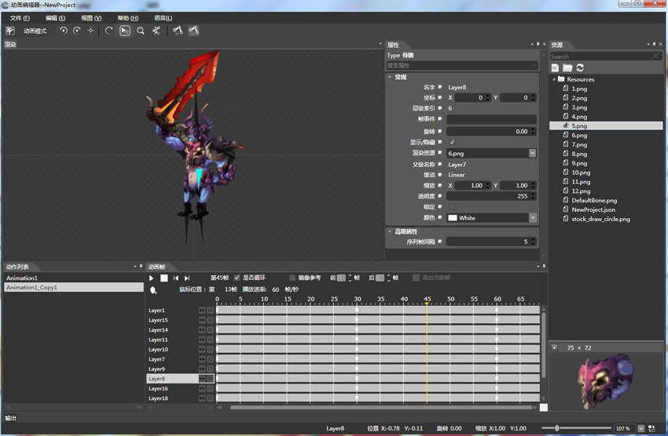

## 怎样用Cocos2d-html5制作一款横版动作游戏 (3)

源码下载[地址](../action-html5.zip)

### 动作，帧动画 VS 骨骼动画

游戏中人物的走动，跑动，攻击等动作是必不可少，实现它们的方法一般采用帧动画或者骨骼动画。在本文的两个角色里，一个采用帧动画，另一个采用骨骼动画(使用Cocos Studio 的动画编辑器)，同时也能很清楚的区别，两种方式的优劣，以及使用方式 ~ 有以下几个角度。

**图片资源**：首先对比一下使用帧动画和骨骼动画的所需要的图片资源。

  

 

如上图所示，角色英雄使用了帧动画（实际上图没有显示全，因为较多），他有各种动作，站立，跑动，攻击等效果，我们要为每一个动作创建几个“帧”，而动画的流畅性，取决于“帧数”的多少，但要知道，图片资源的大小也取决于你“帧数”的多少(浪费比特是不对的 ～)，需要什么效果，需要多少帧，有多少动画，都需要自己权衡 ~

而怪物图片资源采用骨骼动画，资源是一块块小的“骨骼”，这无疑节省了资源大小，而动作信息则保存在一个 json 文件里面，后文会提到，而此时，随着动作的增加，所增加的比特(Byte)几可忽略不计。

**使用方式**：对于两者的使用方式，关键代码如下 ~

	// *********************帧动画加载与调用************************
	 
	// 动作的加载
	initAction:function(){
	    // 站立动作
	    var sa = cc.Animation.create();
	    for (var si = 1; si < 4; si++){
	        var frameName1 = "res/Hero" + si + ".png";
	        sa.addSpriteFrameWithFile(frameName1);
	    }
	    sa.setDelayPerUnit(5.8 / 14);
	    sa.setRestoreOriginalFrame(true);
	    this._actionStand = cc.RepeatForever.create(cc.Animate.create(sa));
	 
	    // 跑动动作
	    var animation = cc.Animation.create();
	    for (var i = 1; i < 12; i++){
	        var frameName = "res/HeroRun" + i + ".png";
	        animation.addSpriteFrameWithFile(frameName);
	    }
	    animation.setDelayPerUnit(2.8 / 14);
	    animation.setRestoreOriginalFrame(true);
	    this._actionRunning = cc.RepeatForever.create(cc.Animate.create(animation));
	 
	    // 普通攻击
	    var anAttack = cc.Animation.create();
	    for (var attackIndex = 1; attackIndex < 6; attackIndex ++){
	        var attackFrame = "res/HeroAttack" + attackIndex + ".png";
	        anAttack.addSpriteFrameWithFile(attackFrame);
	    }
	    anAttack.setDelayPerUnit(1.8 / 14);
	    // anAttack.setRestoreOriginalFrame(false);
	    this._actionAttack = cc.Animate.create(anAttack);
	 
	    // 跳跃攻击 ...
	 
	    // 突刺攻击 ...
	 
	    // 其它动作，如果有 ~
	 
	}
	 
	// 动作的调用
	this._sprite.runAction(this._actionStand);      // 站立
	this._sprite.runAction(this._actionRunning);    // 跑动
	// ...
	 
	// *********************骨骼动画加载与调用************************
	 
	// 加载骨骼资源
	var s_Robot_png = "res/armature/Robot.png";
	var s_Robot_plist = "res/armature/Robot.plist";
	var s_Robot_json = "res/armature/Robot.json";
	 
	cc.ArmatureDataManager.getInstance().addArmatureFileInfo(
	    s_Robot_png,
	    s_Robot_plist,
	    s_Robot_json);
	 
	this._armature = cc.Armature.create("Robot");
	 
	// 使用方法
	this._armature.getAnimation().play("stand");    // 站立
	this._armature.getAnimation().play("run");  // 跑动
	// ...

如上代码，对于动作的初始化，可以看到对于帧动画来说，非常繁琐，需要加载每一帧的图片，组合成一个动作动画，而骨骼动画则不然，资源的加载非常简单，调用方式也很简单。实际，在 Cocos Studio 中也能够使用帧动画，并且使得动画的加载过程变得简单！

**显示效果**： 就显示效果而言，帧动画有如播放电影同样，只有帧率很高的时候才能达到不错的显示效果，然而骨骼动画，其帧率和游戏的帧率同样，唯一的区别，就是需要制作骨骼动画，但是对于这里英雄角色帧动画的制作过程而言，也是先制作成每一块骨骼，然后为每一帧调节其位置关系，并且少了骨骼节点，位置角度等也都不好控制。这里从制作过程到显示，都可以发现骨骼动画的优势所在。

 

### 项目版本库升级

为了得到更好的骨骼动画支持，将这个小项目所使用的 H5 版本库，从 2.1.5 升级到了 2.1.6，这其中修复了些 骨骼动画中的 Bug，并且也对核心库的一些 API 做了修改，如：

	// 新的触摸注册方式 ~
	cc.Director.getInstance().getTouchDispatcher().addTargetedDelegate(this, 0, false);
	cc.registerTargetedDelegate(0, true, this);
	 
	cc.Director.getInstance().getTouchDispatcher().removeDelegate(this);
	cc.unregisterTouchDelegate(this);
	 
	// 精灵翻转
	// 2.1.5
	sprite.setFlipX
	// 2.1.6
	sprite.setFlippedX

### 角色动作组织

游戏中，对于英雄和怪物来说，有一些通用的方法或者代码结构，为此提取出一个 ActionSprite 以标示这样一个角色：

	var ActionSprite = cc.Node.extend({
	    // 初始化方法
	    init:function(obj){...},
	    // 攻击
	    acceptAttack:function(obj){...},
	    // 是否翻转，图片“左右”走动
	    isFlip:function(){...},
	    // 设置精灵
	    setSprite:function(image, pos){...},
	    // 开始跑动 附带方向，方向是一个小于 360 的角度
	    runWithDegrees:function(degrees){...},
	    // 跑动，改变方向
	    moveWithDegrees:function(degrees){...},
	    // 停止跑动
	    idle:function(){...},
	    // 每帧更新
	    update:function(dt){...},
	    // 简单 ai 实现
	    ai:function(){...},
	    // 屏幕检测，人物不能走出屏幕之外 并且只能在下方
	    checkLocation:function(){...},
	    // 站立
	    hStand:function(){...},
	    // 跑动
	    hRunning:function(){...},
	 
	    // ...
	});

对于英雄和怪物的实现来说，有所不同，除了前文中繁杂的动作初始化方法之外，其它实现如下：

	hAttack:function(at){
	    var aa = null;
	    if (at == AT.ATTACK){
	        aa = this._actionAttack;
	        this._attackRangt = 150;            
	    }else if (at == AT.ATTACK_A){
	        aa = this._actionAttackJump;
	        // 当前位置跳跃
	        var jump = cc.JumpTo.create(
	            0.6, cc.pSub(this.getPosition(), cc.p(this._flipX ? 200: -200)), 120, 1);
	        this.runAction(jump);
	        this._attackRangt = 300;
	    }else if (at == AT.ATTACK_B){
	        aa = this._actionAttackT;
	        // 当前位置移动
	        var move = cc.MoveTo.create(0.3, cc.pSub(this.getPosition(), cc.p(
	                this._flipX ? 200:-200, 0)));
	        this.runAction(move);
	        this._attackRangt = 300;            
	    }
	 
	    if (aa){
	        this._sprite.stopAllActions();
	        var action = cc.Sequence.create(
	            aa,
	            cc.CallFunc.create(this.callBackEndAttack, this));
	        this._sprite.runAction(action);
	        this._state = AC.STATE_HERO_ATTACK;
	        this.postAttack();
	    }
	},
	attack:function(at){
	    this.hAttack(at);
	},
	callBackEndAttack:function(){
	    if (this._isRun){
	        this.hRunning();
	    }else{
	        this.hStand();
	    }
	}

对于怪物，实现如下：

	var Robot = ActionSprite.extend({
	    _armture:null,
	 
	    init:function(){
	        var bRet = false;
	        if (this._super()){
	 
	            cc.ArmatureDataManager.getInstance().addArmatureFileInfo(
	                s_Robot_png,
	                s_Robot_plist,
	                s_Robot_json);
	 
	            this._armature = cc.Armature.create("NewProject");
	            this.setSprite(this._armature, cc.p(500, 300));
	            this.setZLocatoin(-90);
	            this.hStand();
	 
	            this.runWithDegrees(180);
	 
	            this.setRoleType(AC.ROLE_ROBOT);
	            this._imageflipX = true;
	            bRet = true;
	            this._speed = 150;
	        }       
	        return bRet;
	    },
	    setSprite:function(armature, pos){
	        this._sprite = armature;
	        this.addChild(this._sprite);
	        this.setPosition(pos);      
	    },  
	    hAttack:function(at){
	        this._attackRangt = 150;                    
	        this._sprite.stopAllActions();
	        this._sprite.getAnimation().play("attack");
	        this._sprite.getAnimation().setMovementEventCallFunc(this.callBackEndAttack,this);
	        this._state = AC.STATE_HERO_ATTACK;
	        this.postAttack();
	    },
	    hStand:function(){
	        this._sprite.getAnimation().play("stand");
	        this._state = AC.STATE_HERO_STAND;
	    },
	    hRunning:function(){
	        this._sprite.getAnimation().play("run");
	        this._state = AC.STATE_HERO_RUNNING;        
	    },
	    attack:function(button){
	        this.hAttack(button);
	    },
	    callBackEndAttack:function(armature, movementType, movementID){
	        if (movementType == CC_MovementEventType_LOOP_COMPLETE) {
	            if (this._isRun){
	                this.hRunning();
	            }else{
	                this.hStand();
	            }
	        }
	    },
	    _timestamp: (new Date()).valueOf(),
	    _attackIndex: 0,
	    _moveIndex: 0,
	    ai:function(){
	        var newTs = (new Date()).valueOf();
	        var value = newTs - this._timestamp;
	 
	        if (this._moveIndex < value / 3000){
	            this._moveIndex += 1;
	            var r = Math.random() * 360;
	            this.moveWithDegrees(r);
	        }
	        if (this._attackIndex < value / 6000){
	            this._attackIndex += 1;
	            this.attack();
	        }
	 
	    }
	});

看到上面代码中的最后一小段，一个不是 AI 的 AI，每三秒钟做一次随机方向的走动，每六秒钟做一次攻击操作。

**攻击判断**：我们知道，只有在英雄和怪物站在一起时，才能攻击的到，表现在游戏画面中，那便是脚部所在的位置，在同一个 Y 坐标上，或者 Y 坐标的值在一个范围之内才能有效，所以在初始化的时候，设定了一个属性来标示它 （setZLocation），在攻击的时候，会去判断它们是否在有效的 Y 坐标之内，如下图中脚下的青色线条(这线条素材不过时其它素材借来一用而已：D)，除了上下位置关系的判断，当然也还有距离判断，则在代码中的 ActionSprite 实现：

 

在攻击之时，攻击者，发送一个消息，所有的可被攻击者都会收到这个消息，然后判断是否被攻击到，而后做相应的操作，如掉血等 ~