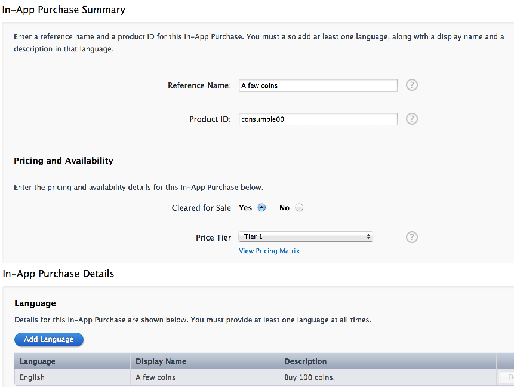

# Cocos2d-x使用iOS游戏内付费IAP(C++篇)

## 前期准备

### 设备与账号

在开始编码之前我们需要准备测试环境。

* IAP只能真机测试，准备一台iOS设备是必须的。
* 真机调试与IAP沙盒(SandBox)测试需要IDP(IOS Developer Program)账号。
* MAC开发机一台.

本文不涉及IDP申请流程和真机调试设置，重点解析IAP相关的设置。

### 新建IAP付费条目

#### 新建app ID

登录[iOS Dev Center](https://developer.apple.com/devcenter/ios/index.action), 点击“Certificates, Identifiers & Profiles->Identifiers->App IDs”，切换到App IDs界面，再点击“+”新建用于测试的AppID，默认设置"In-App-Purchase"已开启，如下图所示：


#### 创建发布程序

无IAP的iOS App的真机测试是不需要下面的步骤的，而有IAP的则不同，需要先建立发布程序，设置好IAP信息才能测试相关的功能。

登录[iTunes Connect](http://itunesconnect.apple.com/), 切换到“Manage Your Apps ”，点击“Add New App”新建一个待发布程序， Bundle ID选择刚才创建的App ID。

接下来的程序信息界面可随意填写，截图可使用符合大小要求的假图，先保证能创建成功、可测试，等到需要正式提交审核的时候再修改成最终截图。

#### 为发布程序新建IAP付费项目

点击刚才创建完成的App进入“App Information”界面，再点击“Manager In-App Purchases”进入IAP管理界面。

我们点击左上角的“Create New”来新建一个IAP付费项目，接下来的Select Type界面会有5中IAP类型可供选择。如图：


前两种是主类型：

类型 | Consumable | Non-Consumable
------------ | ------------- | ------------
购买次数 | 多次  | 一次
收据 | 每次都有  | 一次
同步 | 不同步  | 系统完成
恢复 | 不恢复 | 系统完成

游戏中使用得最多的就是“购买游戏币”了，我们这里只关注**Consumable**类型，可多次购买。

更多其他类型的信息可查询[StoreKitGuide.pdf](https://developer.apple.com/library/ios/DOCUMENTATION/NetworkingInternet/Conceptual/StoreKitGuide/StoreKitGuide.pdf)。

选择“Consumable”，进入详细信息设置界面。



**Product ID**全服唯一，起个自己觉得舒服的名称， 一般建议：Bundle ID + IAP description.

**Language**需要至少一种，选择“English”，方便测试。

当完成IAP付费项目的新建后，回到“Manager In-App Purchases”界面，可以看到下面的信息。


你可以随时修改已存在的项目，即使在游戏上线后也能修改（Product ID除外），这样可以在不发布新程序的情况下，做一些促销活动。

#### 新建IAP付费测试账号

IAP的测试至关重要，你肯定不想给钱测试，被苹果扣掉30%。苹果的SandBox提供了一整套测试相关的服务。依然在**iTunes Connect**中设置。

点击“Manage Users->Test User”进入测试账号添加界面，点击左上交的“Add New User”，填入Email等信息。

> Note:Email地址必须是未注册过Apple ID的email，注册过的无法使用。
> Select iTunes Store必须选“United States”，错选为中国区不能测试不要怪我没提醒。

到此，前期准备工作都已完成，你也许需要等待几个小时让iTunes Connect设置生效，以便代码能获取到IAP信息，接下来我们正式进入代码阶段。

## IAP的C++封装

### 新建项目

使用tool下的create_project.py创建项目，注意project ID 必须填写为上面我们申请的APP ID，这样真机调试才能取到我们设置的IAP信息。

C++开发的游戏，付费点直接使用Object-c的IAP接口会有诸多不便，在StoreKit基础上再封装一层C++接口会方便很多。新建IOSiAP.h和IOSiAP.mm两个文件，加入到Xcode工程。mm文件为C++和Object-c混编文件，可在里面实现两种语言的互相调用。

### IAP付费流程与接口抽象

如下图所示：


首先，IAP付费首先需要客户端发起请求，获取服务器上的IAP条目信息。之所用需要这个步骤，是因为iTunes Connect后台可以修改付费条目的价格、说明等信息。

然后，客户端根据获取到的IAP条目信息展示UI，当用户点击支付后发起payment请求。

最后，等待payment的回调响应。如果成功，游戏币增加；如果失败，UI提示给用户。

从付费流程，我们可以看出需要3个接口：

1. 发起products information请求，并等待数据回来。
2. 获取每个product的information。
3. 请求购买product，并等待响应。

具体在IOSiAP.h中的抽象如下：

```
class IOSiAP
{
public:
    IOSiAP();
    ~IOSiAP();
    void requestProducts(std::vector <std::string> &productIdentifiers);
    IOSProduct *iOSProductByIdentifier(std::string &identifier);
    void paymentWithProduct(IOSProduct *iosProduct, int quantity = 1);
        
    IOSiAPDelegate *delegate;
    // ===  internal use for object-c class ===
    void *skProducts;// object-c SKProduct
    void *skTransactionObserver;// object-c TransactionObserver
    std::vector<IOSProduct *> iOSProducts;
};
```

其中的identifier是IAP付费项目的“Product ID”。

IOSProduct是一个简单的数据类，存放Product information。

```
class IOSProduct
{
public:
    std::string productIdentifier;
    std::string localizedTitle;
    std::string localizedDescription;
    std::string localizedPrice;// has be localed, just display it on UI.
    bool isValid;
    int index;//internal use : index of skProducts
};
```

IOSiAPDelegate是消息回调通知类，由具体的调用者来实现。

```
typedef enum {
    IOSIAP_PAYMENT_PURCHASING,// just notify, UI do nothing
    IOSIAP_PAYMENT_PURCHAED,// need unlock App Functionality
    IOSIAP_PAYMENT_FAILED,// remove waiting on UI, tall user payment was failed
    IOSIAP_PAYMENT_RESTORED,// need unlock App Functionality, consumble payment No need to care about this.
    IOSIAP_PAYMENT_REMOVED,// remove waiting on UI
} IOSiAPPaymentEvent;

class IOSiAPDelegate
{
public:
    virtual ~IOSiAPDelegate() {}
    // for requestProduct
    virtual void onRequestProductsFinish(void) = 0;
    virtual void onRequestProductsError(int code) = 0;
    // for payment
    virtual void onPaymentEvent(std::string &identifier, IOSiAPPaymentEvent event) = 0;
};
```
其中的前两个消息是**requestProducts()**的消息回调，最后一个是payment的回调。而payment又分5种状态。

### requestProducts的实现

首先我们要包含StoreKit的头文件

```
#import <StoreKit/StoreKit.h>
```

然后，需要把StoreKit.framework加入到工程里面，如下图：


requestProducts的具体实现如下：

```
void IOSiAP::requestProducts(std::vector <std::string> &productIdentifiers)
{
	// 1.
    NSMutableSet *set = [NSMutableSet setWithCapacity:productIdentifiers.size()];
    std::vector <std::string>::iterator iterator;
    for (iterator = productIdentifiers.begin(); iterator != productIdentifiers.end(); iterator++) {
        [set addObject:[NSString stringWithUTF8String:(*iterator).c_str()]];
    }
    // 2.
    SKProductsRequest *productsRequest = [[SKProductsRequest alloc] initWithProductIdentifiers:set];
    // 3.
    iAPProductsRequestDelegate *delegate = [[iAPProductsRequestDelegate alloc] init];
    delegate.iosiap = this;
    productsRequest.delegate = delegate;
    // 4.
    [productsRequest start];
}
```

要点如下：

1. 转换C++的数组为Object-c的数组。
2. 新建一个SKProductsRequest，用product identifiers来初始化。
3. iAPProductsRequestDelegate是内部抽象的一个桥接Object-c类，用来接受StoreKit的回调，并转换到C++的回调。
4. 一切准备就绪，启动request。

下面我们看下iAPProductsRequestDelegate是如何桥接的。
声明protocol：SKProductsRequestDelegate，
在interface里面定义了一个iosiap，引用到C++对象实例。

```
@interface iAPProductsRequestDelegate : NSObject<SKProductsRequestDelegate>
@property (nonatomic, assign) IOSiAP *iosiap;
@end
```
实现SKProductsRequestDelegate的协议接口。

```
@implementation iAPProductsRequestDelegate

// 1.
- (void)productsRequest:(SKProductsRequest *)request
     didReceiveResponse:(SKProductsResponse *)response
{
    // release old
    if (_iosiap->skProducts) {
        [(NSArray *)(_iosiap->skProducts) release];
    }
    // record new product
    _iosiap->skProducts = [response.products retain];
    
    for (int index = 0; index < [response.products count]; index++) {
        SKProduct *skProduct = [response.products objectAtIndex:index];
        
        // check is valid
        bool isValid = true;
        for (NSString *invalidIdentifier in response.invalidProductIdentifiers) {
            NSLog(@"invalidIdentifier:%@", invalidIdentifier);
            if ([skProduct.productIdentifier isEqualToString:invalidIdentifier]) {
                isValid = false;
                break;
            }
        }
        
        IOSProduct *iosProduct = new IOSProduct;
        iosProduct->productIdentifier = std::string([skProduct.productIdentifier UTF8String]);
        iosProduct->localizedTitle = std::string([skProduct.localizedTitle UTF8String]);
        iosProduct->localizedDescription = std::string([skProduct.localizedDescription UTF8String]);
        
        // locale price to string
        NSNumberFormatter *formatter = [[NSNumberFormatter alloc] init];
        [formatter setFormatterBehavior:NSNumberFormatterBehavior10_4];
        [formatter setNumberStyle:NSNumberFormatterCurrencyStyle];
        [formatter setLocale:skProduct.priceLocale];
        NSString *priceStr = [formatter stringFromNumber:skProduct.price];
        [formatter release];
        iosProduct->localizedPrice = std::string([priceStr UTF8String]);
        
        iosProduct->index = index;
        iosProduct->isValid = isValid;
        _iosiap->iOSProducts.push_back(iosProduct);
    }
}

// 2.
- (void)requestDidFinish:(SKRequest *)request
{
    _iosiap->delegate->onRequestProductsFinish();
    [request.delegate release];
    [request release];
}

// 3.
- (void)request:(SKRequest *)request didFailWithError:(NSError *)error
{
    NSLog(@"%@", error);
    _iosiap->delegate->onRequestProductsError([error code]);
}

@end
```

解析如下：

1. 收到响应，解析出每个product information，再转换为C++数据存储起来。
2. 请求结束通知。
3. 请求失败通知，2和3不会同时出现。

### iOSProductByIdentifier的实现

iOSProductByIdentifier的实现简单很多，在上一个步骤中我们已存储了请求回来的数据，现在只需要查找出对应的数据返回即可。

```
IOSProduct *IOSiAP::iOSProductByIdentifier(std::string &identifier)
{
    std::vector <IOSProduct *>::iterator iterator;
    for (iterator = iOSProducts.begin(); iterator != iOSProducts.end(); iterator++) {
        IOSProduct *iosProduct = *iterator;
        if (iosProduct->productIdentifier == identifier) {
            return iosProduct;
        }
    }

    return nullptr;
}
```

### paymentWithProduct的实现

paymentWithProduct有两个参数，第一个参数是由iOSProductByIdentifier获取的IOSProduct实例，第二个参数是购买数量，本文只涉及Consumable类型的IAP，所以需要这个参数。

```
void IOSiAP::paymentWithProduct(IOSProduct *iosProduct, int quantity)
{
    SKProduct *skProduct = [(NSArray *)(skProducts) objectAtIndex:iosProduct->index];
    SKMutablePayment *payment = [SKMutablePayment paymentWithProduct:skProduct];
    payment.quantity = quantity;
    
    [[SKPaymentQueue defaultQueue] addPayment:payment];
}
```

SKMutablePayment是异步请求，和requestProducts一样自定义了一个叫iAPTransactionObserver的Object-c类来实现桥接。

```
@implementation iAPTransactionObserver

// 1.
- (void)paymentQueue:(SKPaymentQueue *)queue updatedTransactions:(NSArray *)transactions
{
    for (SKPaymentTransaction *transaction in transactions) {
        std::string identifier([transaction.payment.productIdentifier UTF8String]);
        IOSiAPPaymentEvent event;
        
        switch (transaction.transactionState) {
            case SKPaymentTransactionStatePurchasing:
                event = IOSIAP_PAYMENT_PURCHASING;
                return;
            case SKPaymentTransactionStatePurchased:
                event = IOSIAP_PAYMENT_PURCHAED;
                break;
            case SKPaymentTransactionStateFailed:
                event = IOSIAP_PAYMENT_FAILED;
                NSLog(@"==ios payment error:%@", transaction.error);
                break;
            case SKPaymentTransactionStateRestored:
                // NOTE: consumble payment is NOT restorable
                event = IOSIAP_PAYMENT_RESTORED;
                break;
        }
        
        _iosiap->delegate->onPaymentEvent(identifier, event, transaction.payment.quantity);
        // 2.
        if (event != IOSIAP_PAYMENT_PURCHASING) {
            [[SKPaymentQueue defaultQueue] finishTransaction: transaction];
        }
    }
}

// 3.
- (void)paymentQueue:(SKPaymentQueue *)queue removedTransactions:(NSArray *)transactions
{
    for (SKPaymentTransaction *transaction in transactions) {
        std::string identifier([transaction.payment.productIdentifier UTF8String]);
        _iosiap->delegate->onPaymentEvent(identifier, IOSIAP_PAYMENT_REMOVED, transaction.payment.quantity);
    }
}

@end
```

要点如下：

1. payment的状态更新，这里有四个状态，我们一一做了映射。
	* IOSIAP_PAYMENT_PURCHASING不需要做任何处理。
	* IOSIAP_PAYMENT_PURCHAED这个消息里面，游戏需要把金币交付给玩家。
	* IOSIAP_PAYMENT_FAILED则可能需要UI提示错误信息。
	* IOSIAP_PAYMENT_RESTORED，consumble类型的IAP是没有这个消息的。
2. 除了IOSIAP_PAYMENT_PURCHASING消息，其他消息在通知完上层游戏逻辑后，都需要finishTransaction处理。
3. removedTransactions实则是由finishTransaction触发的回调，我们依然要把这个消息映射到上层。

### Where to Go

你可以在这里获取到本文的[源码](./code)，把整个code目录拷贝到Cocos2d-x 3.0 beta下的projects目录下即可运行。

这里没有提及接口测试，我们将在下一章JSB篇中讲解。
