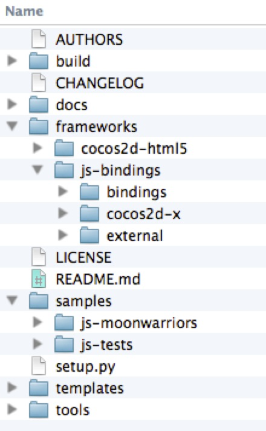
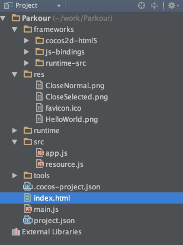
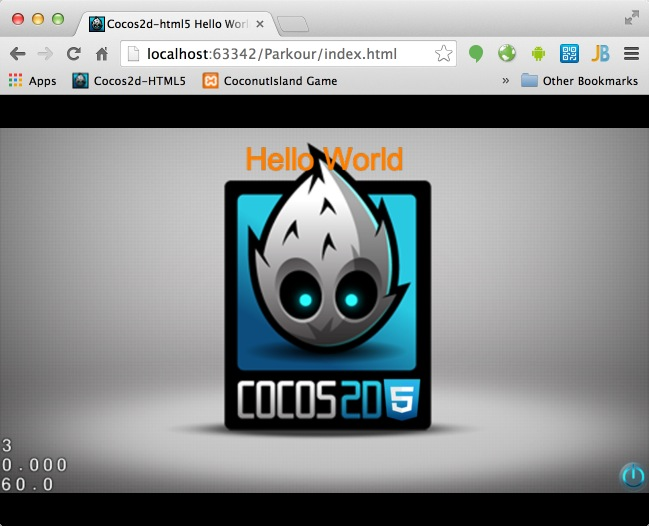

#Hello World of Cocos2d-JS
In the tutorial, I will show you how to setup a new Cocos2d-JS project from scratch. Before that, I want to
give you a brief description of Cocos2d-JS's directory structures.

## Overview of Cocos2d-JS directory structures
Here is the Cocos2d-JS directory structure:

**Figure1**



###Understanding the directory structures

The directory structures can be separated into four parts:

#### Part1: engine related folders

* **frameworks** directory hosts Cocos2d-html5 engine and Cocos2d-x JavaScript Bindings.
    * **cocos2d-html5** directory holds all the engine modules of cocos2d-html5, such as engine core modules, audio module, external physic lib, CocosBuilder Reader, CocoStudio Reader and other modules. All of modules are implemented in JS, and can be run on web.
    * **js-bindings** directory hosts Cocos2d-x engine, project files of bindings and external prebuilt SpiderMonkey lib. The exported API is JS, and the base modules are implemented by Cpp, and can be run on native platform, such as iOS, android, Mac, win32 and so on.
    
#### Part2: tests,sample games and template

* **template** directory is used for creating new Cocos2d-JS projects. It includes HTML5 project and native projects by default. It is used by cocos console to create new project.

* **samples directory** contains all the tests of Cocos2d-JS. It also includes a playable sample game MoonWarriors. All the tests and games can be launched by cocos console and run on web or native platforms with javascript binding.

#### Part3: miscellaneous

* **README** contains some introduction of Cocos2d-JS.
* **LICENSE** as we mentioned before, the license of Cocos2d-JS is MIT, you can refer to the license folder under engine root folder to get more details about the licenses of Cocos2d-html5 and Cocos2d-x.
* **tools** directory includes cocos console tool, and bindings-generator. The template folder contains a build.xml which is a config file for closure compiler, you can package your game into one single file via Ant.
* **build** directory contains project files for built-in samples.
* **docs** directory contains JavaScript coding style guide and release note.
* **CHANGELOG** contains the changed information of all versions.
* **setup.py** is a python script for development environment setup.


## Taking a look at the built-in examples

When you have downloaded and configured your Cocos2d-JS development environment successfully. It is highly recommended  to take a look at the built-in examples. It covers over 90% features of Cocos2d-JS. And it is also the most valuable learning resource that you can get currently. 
 

### Taking a Look at the Tests
Go to the directory of **Cocos2d-JS/samples/js-tests**, and run the tests by cocos console. 

```
    cocos run -p web
```

It will show you the entire tests built-in with Cocos2d-JS. Here is the screenshot:

**Figure 2**


The tests are the best learning resources for you. The tests show nearly every features of Cocos2d-html5. You can tweak these tests files and you will get feedback immediately after refresh browser. It is better to have a taste of Cocos2d-html5 this way than reading a huge documentation at the very beginning.

You also can run the tests on iOS, android or Mac.

```
    cocos run -p ios|android|mac
```


### Taking a Look at the Sample Games

There are a full game samples built-in with Cocos2d-JS. All of the source code are completely free and open to you. Here is a brief introduction about the sample game.

#### MoonWarrior

The name of the sample game is MoonWarrior. You can go the root of the **js-moonwariors** directory to launch it by cocos console.

```
    cocos run -p web|ios|android|mac
```

It is a vertical shooting game. In this game sample, many useful game techniques are applied, including tiled-map, animation, parallax background etc. Here is the screenshot, you can dive into the source code for more information:

**Figure 3**


## Setting up your first "Hello World" Project

Finally, we are reaching the final important part of this tutorial. Here I wil not really create a "Hello World" project. I will take Parkour game as a example. In the future, all of these epic tutorials are about how to make a Parkour game with Cocos2d-JS.

Can't help waiting? Let's do it right now!

### Making Parkour project skeleton

As we talked before, we can create an new project with specified name. Go to your workspace and use cocos console to create the **Parkour** game.

```
    cococs new Parkour -l js
```

Now open your WebStorm and open the Parkour directory. Now the project navigator looks like this:

**Figure 4**



Right click the **index.html** in WebStorm and choose **Debug 'index.html'**. It will open your Chrome automatically and you have successfully setted up a new project. Cheers! The browser address is 

```
http://localhost:63342/Parkour/index.html
```

It gives us the classic **Hello World** screenshot:

**Figure 5**




### Sample game template code analysis

Since the **template** brings us so many things, but we even don't know anything about it.

Such as what is the main entry of the template program. How are these files organized? What does each file do in the sample program? In this section, I will give you some explanation of these questions.

#### Taking a look at all the files of the project

At first, let take a look at all the files and the directory structure of Figure 4:

In the Figure 4, we can see that:

- the **res** directory. It contains all the resource filed needed by our project. Now it only contains some sample pictures. But if you want to add some meta files of your game or some awesome game music files. You should also put them under this folder. You should choose a proper name for each file. 

- The **src** folder. It contains all of your actual game logic code. If there are hundreds of javascript source files, you'd better organized them into small chunks using subfolders. Now our template has two javascript source files. The **app.js** contains the first scene's code of our sample. The **resource.js** defines some global variables of the resource.

- The **index.html** file is the entry point of a HTML5 based web application. It is a HTML5 compatible format. It defines some meta data like setting viewpoint and fullscreen patameters.

- The **project.json** file is the configuration file of our project. Please refer to [project.json](http://www.cocos2d-x.org/docs/manual/framework/html5/v3/project-json/en) for more details.

- The **main.js** is the place to create your first game scene and show it on the browser. You also can define resolution policy and preload your resources in it.

Ok, you have known what these files and folder are for. Now it's time to understand the source code and the execution path.


#### Analysis of the project's execution path

It is very important to know a program's execution path. 

The project is loaded into browser from index.html. Then it moves to **frameworks/cocos2d-html5/CCBoot.js**. In this file, it will try to load the project configuration from the project.json file.

```
{
    "project_type": "javascript",

    "debugMode" : 1,
    "showFPS" : true,
    "frameRate" : 60,
    "id" : "gameCanvas",
    "renderMode" : 0,
    "engineDir":"frameworks/cocos2d-html5",

    "modules" : ["cocos2d"],

    "jsList" : [
        "src/resource.js",
        "src/app.js"
    ]
}

```

Loot at the code piece, there is a object property named **engineDir** which is the key point to decide the execution path of the following program. In the default case, we have specify the engineDir. 

The main.js will be loaded after **frameworks/cocos2d-html5/CCBoot.js** file and it will initilize the configuration and load all the JavaScript files specified by **modules** and **jsList**. It is more clear to read the source code than reading my plain text. 

### Making Some little tweaks of the project

As we known from the previous section, before we actually do some sort of real coding stuff. Let's make some small tweaks to get our hands dirty at first.

#### Hiden the FPS in the left corner of your game screen

The section may be a little bit trivial. We can easily achieve this by modifying **showFPS** property to **false** in **project.json**. 

Here is the code:

```
{
    "project_type": "javascript",

    "debugMode" : 1,
    "showFPS" : false,
    "frameRate" : 60,
    "id" : "gameCanvas",
    "renderMode" : 0,
    "engineDir":"frameworks/cocos2d-html5",

    "modules" : ["cocos2d"],

    "jsList" : [
        "src/resource.js",
        "src/app.js"
    ]
}
```

There are many thing we can tweak by modifying this object's property. I will give your a table of each property's intention.

property name | options | explanation
------------ | ------------- | ------------
debugMode | 0,1,2,3,4,5,6  | 0: close all 1: info level 2: warn level 3: error level 4: info level with web page 5: warn level with web page 6: error level with web page
showFPS | true or false  | toggle FPS visibility
id | "gameCanvas"  | the dom element to run cocos2d on
frameRate | a positive number above 24, usually 60-30  | adjust the frame rate of your game
renderMode | 0,1,2 | Choose of RenderMode: 0(default), 1(Canvas only), 2(WebGL only)
engineDir | the engine directory related to your project  | specify the directory the engine code  
modules | engine modules  | you could customize your engine by modules. Module names are in the module of moduleConfig.json in root of **frameorks/cocos2d-html5** directory
 appFiles | a list of your game source code  | add your own file lists after myApp.js
 
 

#### Modify the design resolution size

Now Cocos2d-JS take web browser as a full screen game canvas. We don't need to manually adjust the canvas size any more. We just need to care about the design resolution size. In order to let our game to run seamlessly on iOS and Android with javascript binding technics. We should change the design resolution size to 480*320. Open you main.js and in function **cc.game.onStart** change Resolution Size to 480, 320.

And you also should make resolution policy to **SHOW_ALL**:

```
    cc.view.setDesignResolutionSize(480, 320, cc.ResolutionPolicy.SHOW_ALL);
```

If you are curious about why  we should do this, please refer to [Resolution Policy Design for Cocos2d-html5](http://www.cocos2d-x.org/docs/manual/framework/html5/v2/resolution-policy-design/en) for more information.

## Summary

In this tutorial, we have talked about the directory structures and the built-in tests and sample game of Cocos2d-JS. We also created our first project based on the template provided by Cocos2d-JS. In the last part, we took effort to analysis the files and the code structures of the template.

## Where to go from here?

In the next tutorial, I will show you how to set up your first game main menu scene. We will do more coding with Cocos2d-JS. 
