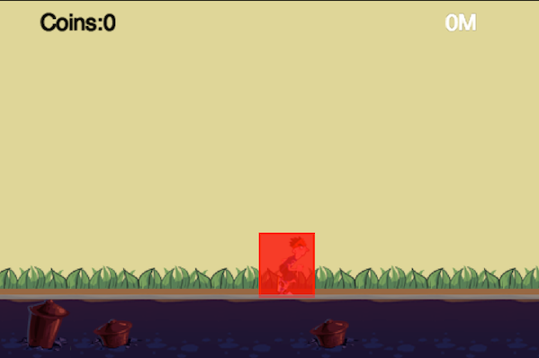

# Explorer with TiledMap and Display

## Introduction
In this tutorial, I will show you how to add TiledMap to the parkour game as the new background.

We will also learn how to make the background to scroll infinitely and the player to run infinitely.

The magic behind these is all about moving the cocos2d layer.

## Do Some Preparation Stuff
Before we get our hands dirty, let's add the resource files and the corresponding names to our game.

### Setup Resource and Globals
Since we will need to refer to other layers within each layers. So the best way to retrieve the layer is via **tag**.

Add the following code into *globals.js*:

```
if(typeof TagOfLayer == "undefined") {
    var TagOfLayer = {};
    TagOfLayer.background = 0;
    TagOfLayer.Animation = 1;
    TagOfLayer.Status = 2;
};
```

Here we give background layer, animation layer and status layer a tag name, thus we can retrieve other layer by tag.

We also need add the resource variables in *resource.js*:

```
//Our two tiled map are named s_map00 and s_map01.
var res = {
    helloBG_png : "res/helloBG.png",
    start_n_png : "res/start_n.png",
    start_s_png : "res/start_s.png",
    PlayBG_png  : "res/PlayBG.png",
    runner_png  : "res/running.png",
    runner_plist : "res/running.plist",
    map_png: "map.png",
    map00_tmx: "map00.tmx",
    map01_tmx: "map01.tmx"
};

var g_resources = [
    //image
    res.helloBG_png,
    res.start_n_png,
    res.start_s_png,
    res.PlayBG_png,
    res.runner_png,
    res.runner_plist,
    res.map_png,
    res.map00_tmx,
    res.map01_tmx
];
```

The above code is self-explanation so let's go to the next section.

### Enable Chipmunk Debug Drawing
If we are doing Chipmunk physics, you'd better to enable debug drawing. So the debug process will be more handy.

Add the following code into *AnimationLayer.js* 's ctor function:

```
this._debugNode = cc.PhysicsDebugNode.create(this.space);
// Parallax ratio and offset
this.addChild(this._debugNode, 10);
```

When you run the game again, you will see a red box above the running player:


## Introduction to TiledMap
TiledMap is a very common used concepts in 2d games. It is useful for building large level map and some parallax scrolling background.

TiledMap consumes less memory than normal PNG file. If you want to build some huge level map, it is definitely your right choice.

Without further ado, let's dive into the TiledMap.

### Design and Make the TiledMap Background
At first, you should download TiledMap. You can download it from [here](http://www.mapeditor.org/download.html). Since TiledMap is a cross platform software.

There are many different kinds of version available. You can choose a version according to your operating system. After downloading the Tiled editor, you should be
familiar with it's usage. You may want to take a look at it's [documentation](https://github.com/bjorn/tiled/wiki).

When you feel comfortable with Tiled, you can design your tiled map with the tilesets we provided.

The detail process of making the two tiled map is out of scope of this tutorial.

(*Note: If you can't make the tiled map by yourself, you can safely skip the process and use the tiled map provided by us.*)


### Replace Previous Background with TiledMap
Now, it's time to replace the old static background image with our new awesome tiled map.

We will do this in *BackgroundLayer.js*. At first, we should add four member variables in BackgroundLayer class:

```
map00:null,
map01:null,
mapWidth:0,
mapIndex:0,
```

The we should delete the old code we needed to create the static background.

(*Note*: Here I uncomment the code snippets, you can safely delete all of them.)

```
//        var winSize = cc.Director.getInstance().getWinSize();
//
//        var centerPos = cc.p(winSize.width / 2, winSize.height / 2);
//        var spriteBG = cc.Sprite.create(s_PlayBG);
//        spriteBG.setPosition(centerPos);
//        this.addChild(spriteBG);
```

At last, we will add the new code snippets to create the tiled map background.

```
this.map00 = cc.TMXTiledMap.create(res.map00_tmx);
this.addChild(this.map00);
this.mapWidth = this.map00.getContentSize().width;
this.map01 = cc.TMXTiledMap.create(res.map01_tmx);
this.map01.setPosition(cc.p(this.mapWidth, 0));
this.addChild(this.map01);
```

Save all the changes and run it:



Here, we add two maps. The *map01* is right beside the *map00* background. In the later section, We will explain why we should add two maps.

## Introduction to Scene Display

Since the physic body will move right infinitely and the sprite will synchronize it's position with the physic body.

A few seconds later, the player will go outside of the screen, just as it is in the last tutorial.

So we need to move the game layer's x position each frame to make it in a visible range. Here is the code snippets of AnimationLayer.js:

```
getEyeX:function () {
    return this.sprite.getPositionX() - g_runnerStartX;
},
```

Here the *getEyeX* function computes the *delta* movement of animation layer. 

We should move the same *delta* movement of *this.gameLayer* which contains background layer and animation layer in opposite direction, so we could call the *update* method each frame by adding the following code at the end of *update* method in PlayScene.js:

```
     update:function (dt) {
        // chipmunk step
        this.space.step(dt);

        // Simulation cpSpaceAddPostStepCallback
        for(var i = 0; i < this.shapesToRemove.length; i++) {
            var shape = this.shapesToRemove[i];
            this.gameLayer.getChildByTag(TagOfLayer.background).removeObjectByShape(shape);
        }
        this.shapesToRemove = [];

        var animationLayer = this.gameLayer.getChildByTag(TagOfLayer.Animation);
        var eyeX = animationLayer.getEyeX();

        this.gameLayer.setPosition(cc.p(-eyeX,0));
    }
    
```


### Move the Background Layer
The process to setup the movement of background layer is almost the same as we do in the last section. But we need to do some calculations of the two tiled map.

So let's do it. Add a new member function *checkAndReload* to BackgroundLayer:

```
    checkAndReload:function (eyeX) {
        var newMapIndex = parseInt(eyeX / this.mapWidth);
        if (this.mapIndex == newMapIndex) {
            return false;
        }
        if (0 == newMapIndex % 2) {
            // change mapSecond
            this.map01.setPositionX(this.mapWidth * (newMapIndex + 1));
        } else {
            // change mapFirst
            this.map00.setPositionX(this.mapWidth * (newMapIndex + 1));
        }
        this.mapIndex = newMapIndex;
        return true;
    },
```

When the eyeX has exceeded the width of the screen, the expression *parseInt(eyeX / this.mapWidth)* will get a value greater than 0.

We will use the *newMapIndex* to decide which map need to move and how many pixels need to move.

Then we should call this function in each frame.

```
    update:function (dt) {
        var animationLayer = this.getParent().getChildByTag(TagOfLayer.Animation);
        var eyeX = animationLayer.getEyeX();
        this.checkAndReload(eyeX);
    }
```

At last, we should call *scheduleUpdate* at the end of background layer's init method:

```
 this.scheduleUpdate();
```

## Wrap it up
Ok. We should do some last ending work.

Modify the *onEnter* method of PlayScene to add **tag** of layers, and add background layer and animation layer to game layer:

```
    onEnter:function () {
        this._super();
        this.initPhysics();
        this.gameLayer = cc.Layer.create();

        //add Background layer and Animation layer to gameLayer
        this.gameLayer.addChild(new BackgroundLayer(), 0, TagOfLayer.background);
        this.gameLayer.addChild(new AnimationLayer(this.space), 0, TagOfLayer.Animation);
        this.addChild(this.gameLayer);
        this.addChild(new StatusLayer(), 0, TagOfLayer.Status);
        
        this.scheduleUpdate();
    },
```

Cheers! You have successfully finish this tutorial. Run and take a look at it.

*Note*: If you don't want to display the debug drawing information of a chipmunk rigid body. You can safely add the following code right after the creation
of the PhysicsDebugNode:

```
this._debugNode.setVisible(false);
```

## Summary
In this tutorial, we have met TiledMap and display. These two concepts are very important ones when you development a physic endless running game.

You can download the entire project from [here](res/Parkour.zip).

## Where to go from here?
In the next tutorial, we will add coins and obstacles into our game. At that tutorial, we will also learn how to refactor our game code and make it more extensible.

We will also do some cleanup work in PlayScene and encapsulate two class named Coin and Rock.

Keep tuning with the next tutorial and happy coding!
