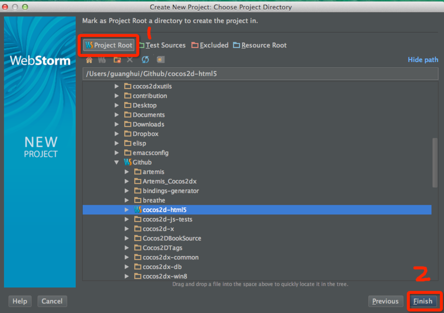
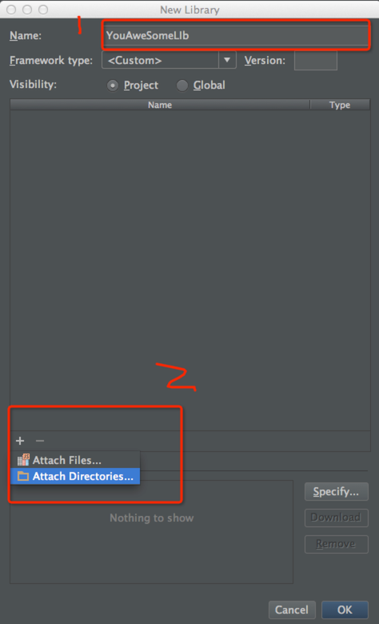

#Setting up Cocos2d-HTML5 Development Environment
In this documentation, I will show you how to setup a cocos2d-html5 development environment on MacOS 10.9 -- Yeah! The Maverics.

## Prerequisites

To follow this tutorials, you should be familiar with the software package  installation process of MacOS.

Don't worry, the process is deadly simple.

Most of the time, the process is something like this:

- Download the DMG.

- Double click to open it.

- Drag and drop the xxx.app to your /Application directory.

In this documentation, I will omit the every details of each software package's installation process.

##Download the required software packages

1. Download and install WebStorm 7. The current stable release of [WebStorm 7](http://www.jetbrains.com/webstorm/download/index.html) is 7.02.  Why do we choose WebStorm? Because it provides many feature like javascript code syntax completion, debugging, syntax highlighting, version system integrated etc. You can go to WebStorm's official website for more information.

2. Download Cocos2d-html5 v2.2 from the offical website of Cocos2d-x. Here is the [Link](http://cocos2d-x.org/download ) .After you downloaded the Cocos2d-html v2.2. You should unzip it to a proper location. In our case, I unzip it at ~/workspace/Cocos2d-html5.The ~ simbol represents your home directory path, which in our case is /Users/guanghui. 

**Note:** 
	
You can also get the cutting edge version of Cocos2d-html5 through github. Here is the [cocos2d-html5 github repository](https://github.com/cocos2d/cocos2d-html5 ) .The active development work are done in **develop** branch.

3.  Download and install Chrome 30 and the [JetBrains-IDE-support ]( https://chrome.google.com/webstore/detail/jetbrains-ide-support/hmhgeddbohgjknpmjagkdomcpobmllji)  extension.

**Note**
	
- Don't try to get the latest beta version of Chrome. Some WebGL APIs has changed and you will suffer the API change problems.

- Since the current stable release of Chrome is 31.0.1650.57. But it doesn't work well with Cocos2d-html5-v2.2. If you do want to use this version due to some mandatory reasons, you should refer to [this post ](http://www.cocos2d-x.org/forums/19/topics/39063 ) for more information.In the near future, the Cocos2d-html5 team will release a new version and at that time you don't need to hack the source code any more to work with Chrome 31.
 
All right, let's see how to configure WebStorm 7.1 to develop and debug our Cocos2d-html5 applications.

## Configure WebStorm to work with Cocos2d-html5

At first, you should launch WebStorm 7. If it is your first time to launch WebStorm, it will ask you to choose your personal preference like choosing key mappings. 

Here is my screenshot of launching WebStorm:

   **Figure 1**

  

**Note:** 
   The section Recent Project should be empty if it is your first time to run WebStorm.

Now, Let's try Cocos2d-html5 within WebStorm.

1. Create a project from Cocos2d-html5

	As we can see from the above picture, you should choose **Create New Project from Exisiting Files** 
	
	Then it will prompt you with the following options:
	
	**Figure 2**
	
	

2. Choose **Source files are in a local directory, no Web server is yet configured** and click **Next** to continue.

	**Figure 3**

	

3. At this step, you should expand the directory tree to specify where you put your Cocos2d-html5 source code. After you have specified the correct directory, note that the **Finish** button is still gray.

4. Now we should set the directory as **Project Root**. Click the **Project Root** button and the **Finish** button will be activate.

	**Figure 4**

	

5. Congratulations! You have successfully configured the Cocos2d-html5 project for WebStorm.

## Play with Cocos2d-html5

Since you have added the entire Cocos2d-html5 directory to WebStorm 7. WebStorm will parse all the Cocos2d-html5 source code. If you open **HelloHTML5World/src/myApp.js**, you can obtain the ability of acurate syntax completion.

**Figure 5**

If you have a third party javascript library in your Cocos2d-html5 game apps, you can also add it to the WebStorm library for parsing and enable realtime syntax autocompletion.

Here is the instructions:

### (Optional) Add a third party library for parsing

1. Click **Settings** to launch your project settings dialog:

	**Figure 6**

	

2. After clicking the **Settings** menu, it will popup the followings dialog:
	
	**Figure 7**
	
	

3. Now you should click **Add...** button and it will prompts you to specify the location of your javascript library. 
	
	**Figure 8**
	
	

### Debug Cocos2d-html5 javascript code within WebStorm
Now it's time for us to debugging Cocos2d-html5 code.

#### Connect WebStorm to Chrome with JB chrome extensions
1. Right click the **index.html** under **~/Github/Cocos2d-html5** and choose **Debug 'index.html'**:
	
	**Figure 9**
	
	
2. Now it will open your Chrome automatically. If you put your mouse above the JB plugin,
it will show you that it has been connected with WebStrom 7.02:

	**Figure 10**
	
	

**Note:** This is step is very straightforward, once you have installed the plugin--"JetBrains IDE support". When you click the debug menu in WebStorm, it will connect to chrome automatically. How convenience it is! You can also click the **JB** icon in the right side of Chrome's side bar and it will bring you to the WebStorm IDE immediately.

#### Debug javascript code in WebStorm
Back to WebStorm and double click **HelloHTML5World/src/myApp.js** to view the source code.

1. Set the break point. Right click the left sidebar of myApp.js source code viewport.

	**Figure 11**
	
	

2. Start debugging. Open your chrome browser and click **HelloHTML5World** link to open the sample project. Then back to your WebStorm by clicking JB icon. And the program will stop at the break point we have just set. And the editor will switch to Debug View:

	**Figure 12**
	
	

3. Now you can do debugging things like step out, step into, step over, continue executing etc. 

## Summary
In this tutorial, I have shown you the basic steps to configure Cocos2d-html5 to work with WebStorm 7, including configuring syntax aware auto complete and debugging. The process is quite simple and straightforward. If you have any questions or suggestion of this tutorials, please let us know. we will appreciate your contribution.

## Where to go from here
In the next tutorial, I will show you how to setup a new Cocos2d-html5 project. And we will walk through the built-in tests and sample games of Cocos2d-html5.
