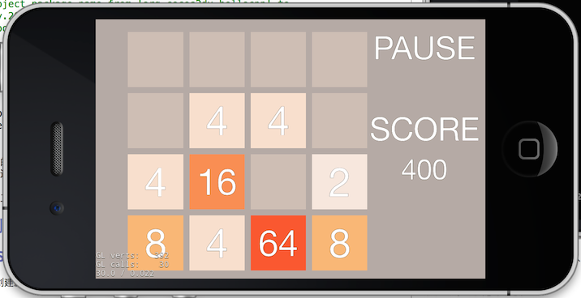
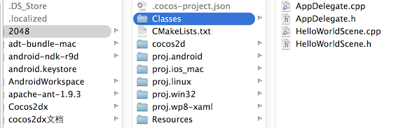
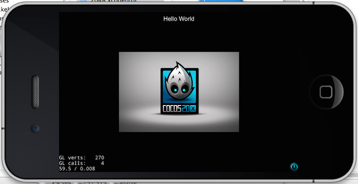
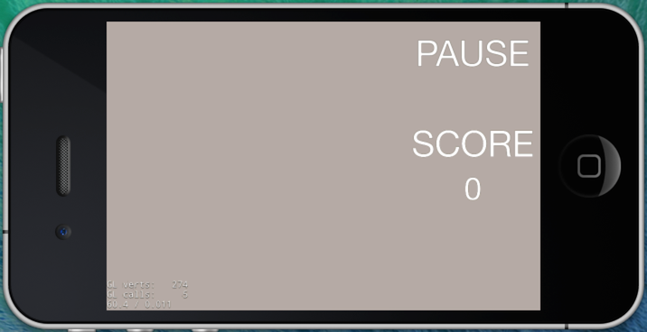
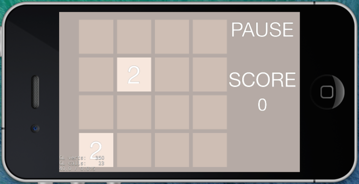

# Cocos2d-x 2048 游戏教程 第一部分

##概述

一个根本停不下来的游戏。。。看看谁能玩到2048。2048 是一款数学游戏，通过上下左右滑动让两两相同的数字碰撞就会诞生一个翻倍的.最近2048游戏火的一塌糊涂！

2048游戏规则很简单：

* 开始时棋盘内随机出现两个数字，出现的数字仅可能为2或4
* 玩家可以选择上下左右四个方向，若棋盘内的数字出现位移或合并，视为有效移动
* 玩家选择的方向上若有相同的数字则合并，每次有效移动可以同时合并，但不可以连续合并
* 合并所得的所有新生成数字想加即为该步的有效得分
* 玩家选择的方向行或列前方有空格则出现位移
* 每有效移动一步，棋盘的空位（无数字处）随机出现一个数字（依然可能为2或4）
* 棋盘被数字填满，无法进行有效移动，判负，游戏结束
* 棋盘上出现2048，判胜，游戏结束

下面我们就来利用Cocos2d-x动手创建一个2048游戏！运行在iOS和Android 上。

##项目介绍

* 引擎版本： Cocos2d-x 3.0
* 开发工具：xcode5
* 效果图：

	

游戏只粗略实现大概逻辑，基本可玩。画面简陋还需小伙伴继续完善。


##工程建立

1. 下载 [Cocos2d-x 3.0](http://www.cocos2d-x.org/download)
2. 解压cocos2d-x-3.0.zip,进入cocos2d-x-3.0，运行 `setup.py`
3. 运行 `cocos` 脚本创建工程

Example:

```
$ cd cocos2d-x
$ ./setup.py
$ source FILE_TO_SAVE_SYSTEM_VARIABLE
$ cocos new MyGame -p com.your_company.mygame -l cpp -d NEW_PROJECTS_DIR
$ cd NEW_PROJECTS_DIR/MyGame

```

按照上面操作执行

```
IvenYangtekiMacBook-Pro-2:Documents zeroyang$ cocos new 2048 -p com.your_company.2048 -l cpp 
Runing command: new
> Copy template into /Users/zeroyang/Documents/2048
> Copying cocos2d-x files...
> Rename project name from 'HelloCpp' to '2048'
> Replace the project name from 'HelloCpp' to '2048'
> Replace the project package name from 'org.cocos2dx.hellocpp' to 'com.your_company.2048'
IvenYangtekiMacBook-Pro-2:Documents zeroyang$ 
```

我们创建了一个基于Cocos2d-x 3.0版本的2048空工程。

进入工程目录查看工程结构如图：



* AppDelegate.cpp是Cocos2d-x自动生成的一个类，它控制着游戏的生命周期。
* HelloWorldScene是Cocos2d-x自动生成的一个类，HelloWorld场景。


使用xcode打开刚创建的工程，proj.ios_mac/2048.xcodeproj，编译运行如下， cocos2d-x 默认为我们创建了一个模板工程。运行结果如图：


接下来，我们动手修改工程，加入自己的游戏场景。

##游戏场景创建

Cocos2d-x 使用Scene表示游戏的场景，类似于电影中的场景。场景大致可以分为以下几类：展示类场景。播放视频或简单的在图像上输出文字，来实现游戏的开场介绍、胜利和失败提示、帮助介绍，选项类场景，主菜单、设置游戏参数等，游戏场景。这是游戏的主要内容。

游戏的内容是通过层Layer,叠加展示的。Layer是写游戏的重点，精灵Sprite、标签Label、菜单Menu等都是add到层上展示。

### 新建GameScene


新建GameScene类，创建游戏的主场景。GameScene 是Layer的子类，负责显示score、pause 菜单，以及 4*4 的数字卡片。管理游戏的交换逻辑和分数更新。

createScene静态方法的实现。

```
	Scene* GameScene::createScene()
	{
    // 'scene' is an autorelease object
    auto scene = Scene::create();
    
    // 'layer' is an autorelease object
    auto layer = GameScene::create();
    
    // add layer as a child to scene
    scene->addChild(layer);
    
    // return the scene
    return scene;
	}
```

GameScene::createScene()方法，首先创建了一个场景，然后创建layer将自己add到该场景。并返回。

在bool GameScene::init()中加入bgLayer 和显示score label 和 pause菜单

```
    Size visibleSize = Director::getInstance()->getVisibleSize();
    
    //加入游戏背景
    //1
    auto layerColorBG = LayerColor::create(Color4B(180, 170, 160, 255));
    this->addChild(layerColorBG);
    
    
    //pause
    //2
    MenuItemFont::setFontName("Consolas");
    MenuItemFont::setFontSize(80);
    auto menuItemPause = MenuItemFont::create("PAUSE", CC_CALLBACK_1(GameScene::onPause, this));
    
    
    auto menu = Menu::create(menuItemPause, NULL);
    addChild(menu);
    menu->setPosition(Point(visibleSize.width - 150, visibleSize.height/2 + 250));
    
    //创建分数
    //3
    auto cardNumberTitle = Label::createWithSystemFont("SCORE","Consolas",80);
    cardNumberTitle->setPosition(Point(visibleSize.width - 150, visibleSize.height/2 + 50));
    addChild(cardNumberTitle);
    
    score = 0;
    cardNumberTTF = Label::createWithSystemFont("0", "Consolas", 70);
    cardNumberTTF->setPosition(Point(visibleSize.width - 150, visibleSize.height/2 - 50));
    addChild(cardNumberTTF);
```

1. 创建了一个LayerColor对象layerColorBG，用于做游戏的背景。 游戏的背景也可以使用精灵通过图片创建
2. 使用MenuItemFont，指定字体和大小，创建了一个menuItemPause 菜单项，菜单的响应函数onPause执行点击菜单的响应。
3. 创建了两个label,一个显示SCORE标题，一个显示分数。当得分变化时时更新分数的显示。


替换HelloWorldScene，加入GameScene
 
打开AppDelegate.cpp，加入头文件#include "GameScene.h"， 在Cocos2d-x的入口bool AppDelegate::applicationDidFinishLaunching()作如下修改，

将

```
  	auto scene = HelloWorld::createScene();
  	director->runWithScene(scene);
```

改为

```
	auto scene = GameScene::createScene();
	director->runWithScene(scene);
```

Cocos2d-x用Director类管理场景，访问和改变场景。通过上面修改，将我的游戏场景运行起来。

运行查看效果

游戏场景基本已经创建好，接下来我们来加入4*4的数字卡片。

### 新建Card 精灵

新建CardSprite类来表示数字方块，CardSprite是Sprite的子类。由显示背景的LayerColor和显示数字的Label组合而成。 负责显示2、4、8...数字方块和不同的背景色。

数字卡片的创建

```
  //初始化
void CardSprite::initCard(int number, int wight, int height, float CardSpriteX, float CardSpriteY)
{
	//初始化数字
	this->number = number;
	//加入卡片背景颜色
	colorBackground = LayerColor::create(Color4B(200,190,180,255),wight-15,height-15);
	colorBackground->setPosition(Point(CardSpriteX,CardSpriteY));
    
	//判断如果大于0就显示，否则就不显示
	if (number > 0)
	{
		//加入字体
		labelCardNumber = Label::createWithSystemFont(__String::createWithFormat("%i",number)->getCString(),"Consolas",100);
		labelCardNumber->setPosition(Point(colorBackground->getContentSize().width/2, colorBackground->getContentSize().height/2));
		labelCardNumber->setTag(8);
		colorBackground->addChild(labelCardNumber);
	}
	else
	{
		//加入字体
		labelCardNumber = Label::createWithSystemFont("","Consolas",100);
		labelCardNumber->setPosition(Point(colorBackground->getContentSize().width/2, colorBackground->getContentSize().height/2));
		labelCardNumber->setTag(8);
		colorBackground->addChild(labelCardNumber);
	}
    
	this->addChild(colorBackground);
}
```

上面代码，通过指定位置和大小创建了一个显示背景的LayerColor对象，然后将创建显示数字的Label对象add到背景上，最后将其add到CardSprite上。

添加更新和获取数字方法

```
  //获取数据
int CardSprite::getNumber()
{
	return number;
}

//设置数据
void CardSprite::setNumber(int num)
{
	number = num;
	//更新显示的数字
	if (num > 0)
	{
		labelCardNumber->setString(__String::createWithFormat("%i",number)->getCString());
	}
	else
	{
		labelCardNumber->setString("");
	}
    
	//设置数字大小
	if (num >= 0)
	{
		labelCardNumber->setSystemFontSize(100);
	}
	.......
	if (num >= 1024)
	{
		labelCardNumber->setSystemFontSize(40);
	}
    
	//判断数字的大小来调整颜色
	if(number == 0){
		colorBackground->setColor(Color3B(200,190,180));
	}
	.....
	if (number == 2048) {
		colorBackground->setColor(Color3B(0,130,0));
	}
}
```

CardSprite的成员变量number保存卡片显示的数字，colorBackground 在不同number下显示不同的颜色。

### 在场景中加入4*4的数字卡片

数字卡片创建好后，就需要在游戏场景中加入。2048游戏中有4*4的数字卡片。加入卡片需要考虑卡片的布局，和屏幕的宽高，间隔。GameScene的成员变量二维指针cardArr保存对数字卡片的引用。根据屏幕显示区域的大小，计算好卡片的大小和布局位置。将创建好的卡片add到GameScene。

```
//根据屏幕大小创建卡片
void GameScene::createCardSprite(Size size)
{
    //求出单元格的宽和高
    int cardSize = (size.height - 36) / 4;
    //绘制出4X4的单元格
    for (int i = 0; i < 4; i++)
    {
        for (int j = 0; j < 4; j++)
        {
            //需要屏幕分辨率适配
            CardSprite *card = CardSprite::createCardSprite(0, cardSize, cardSize, cardSize*i+80, cardSize*j+20);
            cardArr[i][j] = card;
            addChild(card);
        }
    }
}
```

### 随机生成2和4

cocos2d-x中提供了CCRANDOM_0_1()宏

```
/** @def CCRANDOM_0_1
 returns a random float between 0 and 1
 */
#define CCRANDOM_0_1() ((float)rand()/RAND_MAX)
```

生成float范围是[0.f,1.f]。
我们需要在4*4的矩阵上，随机取数字卡片初始为2或4。使用如下方法

```
int i = CCRANDOM_0_1() * 4;        //生成0~3随机数
```

将float转为int，得到0~3的随机数

```
//创建生成随机卡片
void GameScene::createCardNumber()
{

    while (1) {
        int i = CCRANDOM_0_1() * 4;        //生成0~3随机数
        int j = CCRANDOM_0_1() * 4;
        
        log("[%d][%d]",i,j);
        
        if (cardArr[i][j]->getNumber() == 0)
        {
            //2和4的生成率为9:1
            cardArr[i][j]->setNumber(CCRANDOM_0_1()*10 < 1 ? 4 : 2);
            break;
        }
        
        if (!shouldCreateCardNumber()) {
            break;
        }
    }
}
```

### 初始化2048场景

初始化2048游戏场景，就是将创建好的场景中加入4*4的数字卡片和2个显示数值的卡片。
在GameScene::init()方法加入

```
    //创建4X4卡片
    createCardSprite(visibleSize);

    //初始时生成两个2
    createCardNumber();
    createCardNumber();

```

运行效果如图：




##小结

在这节我们已经完成了游戏的主场景和4*4的数字卡片。但是还缺少游戏上下左右滑动移动数字卡片，得分，游戏结束等逻辑。
在下一节我们将加入游戏的逻辑、数据存储和如何在android上运行。

你可以在[这里](https://github.com/iTyran/2048)获取游戏源码。
