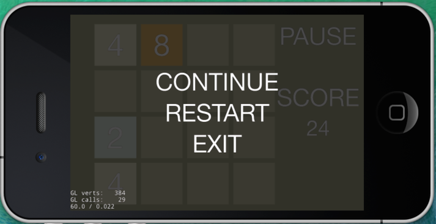
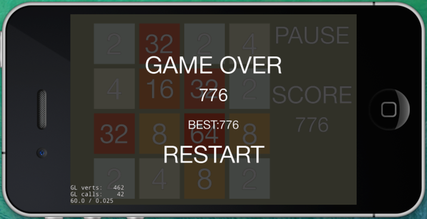
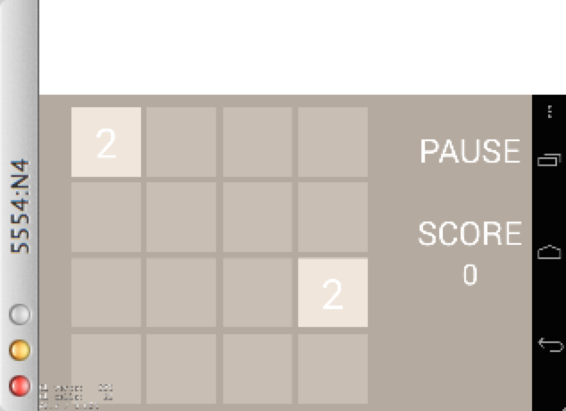

#Cocos2d-x 2048游戏教程2

上一节，我们学习了如何创建一个新工程，并创建自己的游戏场景。2048游戏场景已经创建好，但是还缺少玩家交互，游戏得分，结束等逻辑。下面我们一起来完善。

##游戏操作
游戏中需要加入touch事件来处理，上下左右移动数字卡片的判断。
玩家可以选择上下左右四个方向，若棋盘内的数字出现位移或合并，视为有效移动；玩家选择的方向上若有相同的数字则合并，每次有效移动可以同时合并，但不可以连续合并；合并所得的所有新生成数字相加即为该步的有效得分；玩家选择的方向行或列前方有空格则出现位移；每有效移动一步，棋盘的空位（无数字处）随机出现一个数字（依然可能为2或4）。 直到棋盘内的数字卡片数值达到2048，玩家胜利。或棋盘填满数字，无法合并移动。游戏结束。

###注册触摸事件响应

首先我们需要让Layer能接收Touch事件。所以我们继承Layer处理事件的回调虚函数，并重写，下面是实现过程：

1. 在GameScene.h文件中声明成员函数

	```
	//触摸事件监听回调函数
    virtual bool onTouchBegan(cocos2d::Touch* touch, cocos2d::Event* event);
    virtual void onTouchMoved(cocos2d::Touch* touch, cocos2d::Event* event);
	virtual void onTouchEnded(cocos2d::Touch* touch, cocos2d::Event* event);
	```
2. 在GameScene.cpp文件的init函数中创建绑定触摸事件

	```
	//设置触摸事件监听
    auto touchListener = EventListenerTouchOneByOne::create();
    touchListener->onTouchBegan = CC_CALLBACK_2(GameScene::onTouchBegan, this);
    touchListener->onTouchMoved = CC_CALLBACK_2(GameScene::onTouchMoved, this);
    touchListener->onTouchEnded = CC_CALLBACK_2(GameScene::onTouchEnded, this);
    _eventDispatcher->addEventListenerWithSceneGraphPriority(touchListener, this);
	```
3. 实现触摸事件回调函数

	```
bool GameScene::onTouchBegan(Touch* touch, Event* event)
{
	Point beginTouch = touch->getLocation();    
    recognizer->beginPoint(beginTouch.x, beginTouch.y);
    return true;
}
void GameScene::onTouchMoved(Touch* touch, Event* event)
{
    Point pos = touch->getLocation();
    recognizer->movePoint(pos.x, pos.y);
}
void GameScene::onTouchEnded(Touch* touch, Event* event)
{
    SimpleGestures rtn = recognizer->endPoint();
    switch (rtn) {
        case SimpleGesturesLeft:
            doLeft();
            doCheck();
            setScore(score);
            break;
        case SimpleGesturesRight:
            doRight();
            doCheck();
            setScore(score);
            break;
        case SimpleGesturesUp:
            doUp();
            doCheck();
            setScore(score);
            break;
        case SimpleGesturesDown:
            doDown();
            doCheck();
            setScore(score);
            break;  
        case SimpleGesturesNotSupport:
        case SimpleGesturesError:
            log("not support or error touch,use geometricRecognizer!!");
            break;  
        default:
            break;
    }
}
	```

###手势判断

在此我封装了一个简单的手势识别类SimpleRecognizer，来处理玩家的滑动手势。代码中对滑动距离大于50以上的才处理为有效手势。关键代码如下：

```
// be called in onTouchBegan
void SimpleRecognizer::beginPoint(cocos2d::Point point)
{
	this->result = SimpleGesturesError;
    points.clear();
	points.push_back(point);
}

void SimpleRecognizer::movePoint(cocos2d::Point point)
{
	points.push_back(point);
}

SimpleGestures SimpleRecognizer::endPoint(cocos2d::Point point)
{
    points.push_back(point);
    
	if (this->points.size() < 3) {
		return SimpleGesturesError;
	}
    
	SimpleGestures newRtn = SimpleGesturesError;
	int len = this->points.size();
	//每当触点移动时,在当前触点和之前触点之间计算不同的x坐标和y坐标
	double dx = this->points[len - 1].x - this->points[0].x;
	double dy = this->points[len - 1].y - this->points[0].y;
    
	if (abs(dx) > abs(dy)) {
		//在这种情况下,运动趋势的触点在x轴方向
		if (dx > 50) {
			newRtn = SimpleGesturesRight;
		} else if ( dx < -50 ) {
			newRtn = SimpleGesturesLeft;
		}
	} else {
		//在这种情况下,运动趋势的触点在y轴方向
		if (dy > 50) {
			newRtn = SimpleGesturesUp;
		} else if ( dy < -50 ) {
			newRtn = SimpleGesturesDown;
		}
	}
    
	// first set result
	if (result == SimpleGesturesError) {
		result = newRtn;
	}
    
	// if diretcory change, not support Recongnizer
	if (result != newRtn) {
		result = SimpleGesturesNotSupport;
	}
	return result;
}
```

###根据手势处理数字卡片的移动或合并

根据手势方向，判断数字卡片是否可以移动和合并。更新分数，移动完成后判断是否在空白处生成新的数字卡片。

游戏中我们并没有真正的数字卡片移动，如果卡片可以沿着一个方向移动，比如左移，是循环遍历4*4的矩阵，将card[x+1][y]的数字赋给card[x][y]，将card[x+1][y]的数字赋为0实现的。如果相邻两数字卡片card[x+1][y]和card[x][y]的数字相同则进行合并操作，card[x][y]的数字为合并后所得的数字。将card[x+1][y]的数字赋为0实现的。得分为合并所得数字。

四个方向的移动处理代码类似，下面来看左移代码实现如下：

```
//左滑动
bool GameScene::doLeft()
{
    //判断有没有发生移动
    bool isMove = false;
    for (int y = 0; y < 4; y++)
    {
        for (int x = 0; x < 4; x++)
        {
            for (int x1 = x+1; x1<4; x1++)
            {
                if (cardArr[x1][y]->getNumber() > 0)
                {
                    if (cardArr[x][y]->getNumber() <= 0)
                    {
                        cardArr[x][y]->setNumber(cardArr[x1][y]->getNumber());
                        cardArr[x1][y]->setNumber(0);
                        x--;
                        isMove = true;
                    }
                    else if(cardArr[x][y]->getNumber() == cardArr[x1][y]->getNumber())
                    {
                        cardArr[x][y]->setNumber(cardArr[x][y]->getNumber() * 2);
                        cardArr[x1][y]->setNumber(0);
                        
                        //改变分数
                        score += cardArr[x][y]->getNumber();
                        isMove = true;
                    }
                    break;
                }
            }
        }
    }
    
    return isMove;
}

```

在移动、合并和得分处理完成后，我们需要判断为空白矩阵位置加入新的数字卡片。实际上是，查找4*4的矩阵区域中数字为0的卡片，随机赋值为2或4.新的数字卡片加入后，我们进行判断游戏是否结束。

游戏结束的边界，4*4的数字卡片中没有数字0且相邻数字卡片没有相等的数字。

```
void GameScene::doCheck()
{
    bool isGameOver = true;

    //结束边界  4*4的card数值>0 且  相邻card没有相同数值
    //4*4的card数值>0 不能在创建Number
    //判断每一个的上下左右和自己是否相同
    for (int y = 0; y < 4; y++)
    {
        for (int x = 0; x < 4; x++)
        {
            if (cardArr[x][y]->getNumber() == 0 ||
                (x<3 && cardArr[x][y]->getNumber() == cardArr[x+1][y]->getNumber()) ||
                (x>0 && cardArr[x][y]->getNumber() == cardArr[x-1][y]->getNumber()) ||
                (y<3 && cardArr[x][y]->getNumber() == cardArr[x][y+1]->getNumber()) ||
                (y>0 && cardArr[x][y]->getNumber() == cardArr[x][y-1]->getNumber()) )
            {
                isGameOver = false;
            }
        }
    }

    if (isWin()) {
        
        successLayer = LayerColor::create(Color4B(0, 0, 0, 180));
        Size winSize = Director::getInstance()->getWinSize();
        Point centerPos = Point(winSize.width / 2, winSize.height / 2);
        auto gameOverTitle = Label::createWithSystemFont("YOU WIN","Consolas",80);
        gameOverTitle->setPosition(centerPos);
        successLayer->addChild(gameOverTitle);
        
        addChild(successLayer,1);
        
        scheduleOnce(SEL_SCHEDULE(&GameScene::removeSuccessLayer), 2);
        return;
    }
    
    //isGameOver = true;
    if (isGameOver)
    {
        log("game over");
        UserDefault::getInstance()->setBoolForKey("history", false);

        HighScore::getInstance()->setScore(score);
        GameOverLayer *gameoverLayer = GameOverLayer::create(Color4B(0, 0, 0, 180));
        addChild(gameoverLayer,1);
        
        Director::getInstance()->pause();
    }
    else
    {
        if (shouldCreateCardNumber()) {
            createCardNumber();
            
            saveStatus();
        }
    }
    
}

```

数字卡片数字达到2048，玩家win的判断

```
bool GameScene::isWin()
{
    bool win = false;
    for (int i = 0; i < 4; i++)
    {
        for (int j = 0; j < 4; j++)
        {
            if( 2048 == cardArr[i][j]->getNumber() )
            {
                win = true;
                break;
            }
        }
    }
    
    return win;
}
```

##PopLayer

游戏中需要提示玩家胜利或游戏结束，这类的提示都可以使用popLayer实现。新建一个新的Layer对象，add到当前场景上。
下面我们来添加游戏的暂停和game over的popLayer。他们都是LayerColor的子类。

1. game over层显示GameOver标题和得分、最高分和重玩菜单。关键代码如下：

	```
	bool GameOverLayer::initWithColor(const Color4B& color)
{
    if (!LayerColor::initWithColor(color)) {
        return false;
    }
    
    Size winSize = Director::getInstance()->getWinSize();
    Point centerPos = Point(winSize.width / 2, winSize.height / 2);
    
    auto gameOverTitle = Label::createWithSystemFont("GAME OVER","Consolas",80);
    gameOverTitle->setPosition(Point(centerPos.x, centerPos.y + 150));
    addChild(gameOverTitle);
    
    char score[64];
    sprintf(score, "%d", HighScore::getInstance()->getScore());
    auto scoreTitle = Label::createWithSystemFont(score,"Consolas",60);
    scoreTitle->setPosition(Point(centerPos.x, centerPos.y + 50));
    addChild(scoreTitle);
    
    char temp[64];
    sprintf(temp, "BEST:%d", HighScore::getInstance()->getHighScore());
    auto highScoreTitle = Label::createWithSystemFont(temp,"Consolas",40);
    highScoreTitle->setPosition(Point(centerPos.x, centerPos.y - 50));
    addChild(highScoreTitle);
    
    MenuItemFont::setFontName("Consolas");
    MenuItemFont::setFontSize(80);
    auto menuItemRestart = MenuItemFont::create("RESTART", CC_CALLBACK_1(GameOverLayer::onRestart, this));

    
    auto menu = Menu::create(menuItemRestart, NULL);
    addChild(menu);
    menu->setPosition(Point(centerPos.x, centerPos.y - 150));
    

    //设置触摸事件监听
    auto touchListener = EventListenerTouchOneByOne::create();
    touchListener->onTouchBegan = CC_CALLBACK_2(GameOverLayer::onTouchBegan, this);
    touchListener->onTouchMoved = CC_CALLBACK_2(GameOverLayer::onTouchMoved, this);
    touchListener->onTouchEnded = CC_CALLBACK_2(GameOverLayer::onTouchEnded, this);
    _eventDispatcher->addEventListenerWithSceneGraphPriority(touchListener, this);
    touchListener->setSwallowTouches(true);
    
    return true;
}
	```
2. 暂停层显示继续、重玩、退出菜单。关键代码如下：

	```
	bool PopLayer::initWithColor(const Color4B& color)
{
    if (!LayerColor::initWithColor(color)) {
        return false;
    }
    
    Size winSize = Director::getInstance()->getWinSize();
    Point centerPos = Point(winSize.width / 2, winSize.height / 2);
    
    MenuItemFont::setFontName("Consolas");
    MenuItemFont::setFontSize(80);
    
    auto menuItemContinue = MenuItemFont::create("CONTINUE", CC_CALLBACK_1(PopLayer::onContinue, this));
    auto menuItemRestart = MenuItemFont::create("RESTART", CC_CALLBACK_1(PopLayer::onRestart, this));
    auto menuItemExit = MenuItemFont::create("EXIT", CC_CALLBACK_1(PopLayer::onExit, this));
    
    
    auto menu = Menu::create(menuItemContinue, menuItemRestart, menuItemExit, NULL);
    menu->alignItemsVertically();
    addChild(menu);
    menu->setPosition(centerPos);
    
    

    
    return true;
}
	```
	
	对比你会发现他们之间的实现方式都差不多。都是Label/Menu组合而成的。

	暂停效果图：
	
	

	gameover效果图：
	
	


3. layer屏蔽touch事件

	此处有个问题，在popLayer层上触摸，你会发现底层的GameScene会响应。这就需要对popLayer进行touch事件处理屏蔽，不应该传递到底层。
	
	1. 在inin方法中注册touch事件监听
	
		```
	//设置触摸事件监听
    auto touchListener = EventListenerTouchOneByOne::create();
    touchListener->onTouchBegan = CC_CALLBACK_2(PopLayer::onTouchBegan, this);
    touchListener->onTouchMoved = CC_CALLBACK_2(PopLayer::onTouchMoved, this);
    touchListener->onTouchEnded = CC_CALLBACK_2(PopLayer::onTouchEnded, this);
    _eventDispatcher->addEventListenerWithSceneGraphPriority(touchListener, this);
    // 设置是否吞没事件，在 onTouchBegan 方法返回 true 时吞没
    touchListener->setSwallowTouches(true);
		```
	2. 空实现touch事件的监听函数
	
		```
		bool GameOverLayer::onTouchBegan(Touch* touch, Event* event)
{
    return true;
}
void GameOverLayer::onTouchMoved(Touch* touch, Event* event)
{
}
void GameOverLayer::onTouchEnded(Touch* touch, Event* event)
{
}
		```

##数据存储与状态恢复

游戏中需要对玩家的数据进行存储。Cocos2d-x为我们提供了UserDefaults来管理数据存储。数据是通过指定的Key 字串，按键值对存储的。游戏中存储了最高分和玩家的当前游戏数据，以便能从下次游戏恢复。

我们可以使用如下方法往文件中存储数据，下面是简单的以4*4矩阵的行列作为key,存储该数字卡片的数值。

```
//存储最高分
UserDefault::getInstance()->setIntegerForKey(KHIGHSCORE, score);
//
char temp[10];
//4*4
for (int i = 0; i<4; i++) {
    for(int j = 0; j<4; j++)
    {
        sprintf(temp,"%d%d",i,j);
        UserDefault::getInstance()->setIntegerForKey(temp, cardArr[i][j]->getNumber());
    }
}
```
通过如下方法从文件中取出数据，以4*4矩阵的行列作为key，取出当前数字卡片的数值。

```
    char temp[10];
    //4*4
    for (int i = 0; i<4; i++) {
        for(int j = 0; j<4; j++)
        {
            sprintf(temp,"%d%d",i,j);
            int number = UserDefault::getInstance()->getIntegerForKey(temp);
            cardArr[i][j]->setNumber(number);
        }
    }
    score = UserDefault::getInstance()->getIntegerForKey("score");
```


##Build && Run

此处，我们是通过xcode作为开发工具进行开发和编译运行调试。但是xcode不支持Android的开发，那么如何进行Android的编译与运行呢？

在Cocos2d-x v3.0 加入了新的cocos命令。按照上一章节开始处讲的建立cocos命令环境。在命令行窗口执行下命令，查看cocos 相关的命令使用：

```
IvenYangtekiMacBook-Pro-2:~ zeroyang$ cocos --help

/Users/zeroyang/Documents/work/cocos2d-x-3.0/tools/cocos2d-console/bin/cocos.py 0.2 - cocos console: A command line tool for cocos2d

Available commands:
	compile      Compiles the current project to binary
	new          Creates a new project
	run          Compiles & deploy project and then runs it on the target
	jscompile    minifies and/or compiles js files
	deploy       Deploy a project to the target
	

Example:
	/Users/zeroyang/Documents/work/cocos2d-x-3.0/tools/cocos2d-console/bin/cocos.py new --help
	/Users/zeroyang/Documents/work/cocos2d-x-3.0/tools/cocos2d-console/bin/cocos.py run --help
```
按提示，我们直接执行

```
$ cocos run -p android
```
你会发现build不通过，仔细检查错误信息，

```
jni/../../Classes/AppDelegate.cpp:31: error: undefined reference to 'GameScene::createScene()'
collect2: error: ld returned 1 exit status
make: *** [obj/local/armeabi/libcocos2dcpp.so] Error 1
make: Leaving directory `/Users/zeroyang/Documents/2048/proj.android'
Error running command, return code: 2
```
你会发现，新建的class文件夹下的cpp没被包含进android的编译文件，修改proj.android/jni/android.mk 加入。修改如下：

```
LOCAL_SRC_FILES := hellocpp/main.cpp \
                   ../../Classes/AppDelegate.cpp \
                   ../../Classes/Card.cpp \
                   ../../Classes/GameOverLayer.cpp \
                   ../../Classes/GameScene.cpp \
                   ../../Classes/HighScore.cpp \
                   ../../Classes/PopLayer.cpp \
                   ../../Classes/SimpleRecognizer.cpp
```
修改后继续执行cocos run -p android。 运行效果如图：


## 总结

在2048游戏的制作中，我们学习了如何创建一个新的工程，创建自己的Scene，并add 背景layer。 如何创建label显示标题，分数。如何处理touch事件，如何添加菜单处理菜单事件。以及poplayer的添加，数据存储等。

至此，一个简单的2048游戏已经完成。游戏甚是简陋，还需小伙伴们完善。[源码地址](https://github.com/iTyran/2048)
