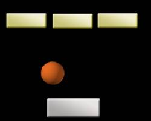
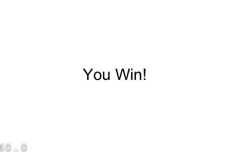

# 如何使用Cocos2d-x3.0和物理引擎来制作一个Breakout游戏：第二部分

## 前言

## 碰撞检测

就像之前几个教程一样注册碰撞begin回调函数。

	void HelloWorld::onEnter()
	{
		Layer::onEnter();
	
		auto listener = EventListenerTouchOneByOne::create();
		listener->setSwallowTouches(true);
	
		listener->onTouchMoved = CC_CALLBACK_2(HelloWorld::onTouchMoved, this);
	
		auto contactListener = EventListenerPhysicsContact::create();
		contactListener->onContactBegin = CC_CALLBACK_2(HelloWorld::onContactBegin, this);
		
	
		auto dispatcher = Director::getInstance()->getEventDispatcher();
	
		dispatcher->addEventListenerWithSceneGraphPriority(listener, this);
		dispatcher->addEventListenerWithSceneGraphPriority(contactListener, this);
	}

	bool HelloWorld::onContactBegin(EventCustom* event, const PhysicsContact& contact)
	{
	
		return true;
	}

## 添加Game Over场景

增加GameOverScene.h and GameOverScene.cpp files两个文件，它们可以在《如何使用Cocos2d-x3.0制作一个简单的游戏教程》中找到。

然后，在HelloWorldScene.cpp文件中加入下列代码：

	#include "GameOverScene.h"

在onContactBegan下加入如下代码：
	
	if (ball->getPositionY() <= 50)
		{
			auto gameOverScene = GameOverScene::create();
			gameOverScene->getLayer()->getLabel()->setString("You Lose!");
			Director::getInstance()->replaceScene(gameOverScene);
		}

好了，我们已经实现得差不多了。但是，如果你游戏你永远不能赢，那有什么意思呢？

## 增加一些方块

	for (int i = 0; i < 4; i++) {

		static int padding = 100;

		// 创建方块并添加到层中
		auto block = Sprite::create("blocks.png");
		auto blockBody = PhysicsBody::createBox(block->getContentSize(), PHYSICSBODY_MATERIAL_DEFAULT);
		blockBody->getShape(0)->setDensity(10.0f);
		blockBody->getShape(0)->setFriction(0.0f);
		blockBody->getShape(0)->setRestitution(1.f);
		blockBody->setDynamic(false);
		int xOffset = padding + block->getContentSize().width / 2 +
			((block->getContentSize().width + padding)*i);
		block->setPosition(xOffset, 450);
		block->setPhysicsBody(blockBody);
		block->setTag(3);
		this->addChild(block);
	}

现在，你应该可以很好地理解上面的代码了。就像之前我们为paddle创建一个body类似，这里，我们每一次也会一个方块创建一个body。注意，我们把方块精灵对象的tag设置为3，这样将来可以用到。

编译并运行，你应该可以看到篮球和方块之间有碰撞了。

销毁方块

为了使breakout游戏是一个真实的游戏，当篮球和方块有交集的时候，我们需要销毁这些方块。

在onContactBegan下加入如下代码：

	auto spriteA = (Sprite*)contact.getShapeA()->getBody()->getNode();
		auto spriteB = (Sprite*)contact.getShapeB()->getBody()->getNode();
		int tagA = spriteA->getTag();
		int tagB = spriteB->getTag();
	
		if (tagA == 3)
		{
			spriteA->removeFromParentAndCleanup(true);
		}
	
		if (tagB == 3)
		{
			spriteB->removeFromParentAndCleanup(true);
		}

编译并运行，现在你可以销毁bricks了！

## 加入游戏胜利条件

接下来，我们需要添加一些逻辑，让用户能够取得游戏胜利。修改你的tick方法的开头部分，像下面一样：

	void HelloWorld::tick(float dt)
	{	
		bool isWin = true;
		Vector<PhysicsBody*> bodies = m_world->getAllBodies();
		for each(PhysicsBody* body in bodies)
		{
			if (body->getNode()->getTag() == 3)
			{
				isWin = false;
			}
		}
		if (isWin == true)
		{
			auto gameOverScene = GameOverScene::create();
			gameOverScene->getLayer()->getLabel()->setString("You Win!");
			Director::getInstance()->replaceScene(gameOverScene);
		}
	}

这里，如果方块都消失了，我们就会显示一个游戏结束的场景。编译并运行，看看，你的游戏现在有胜利终止条件了！

恩，终于完成了！你现在拥有一个使用Box2d物理引擎制作的breakout游戏了

And there you have it – your own simple breakout game with physics!

## 给我代码！

　　这里是本系列教程的[完整源代码](./breakout2.zip)