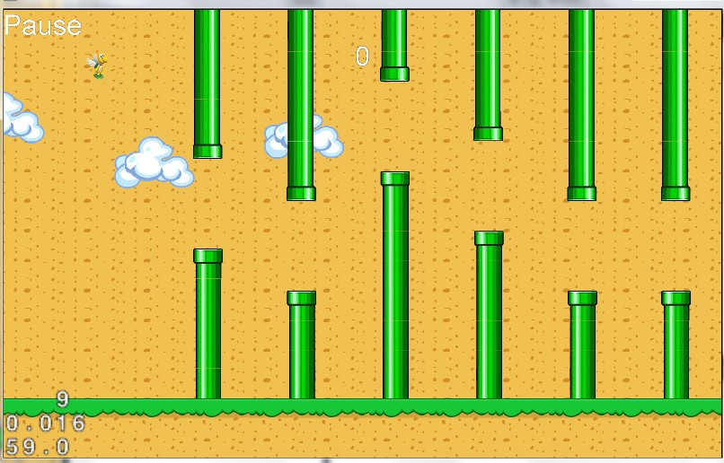
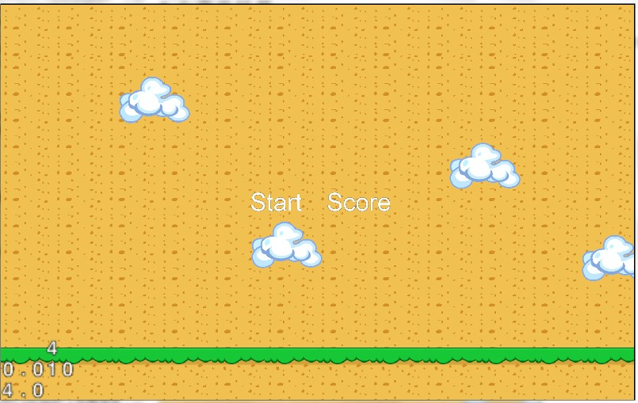
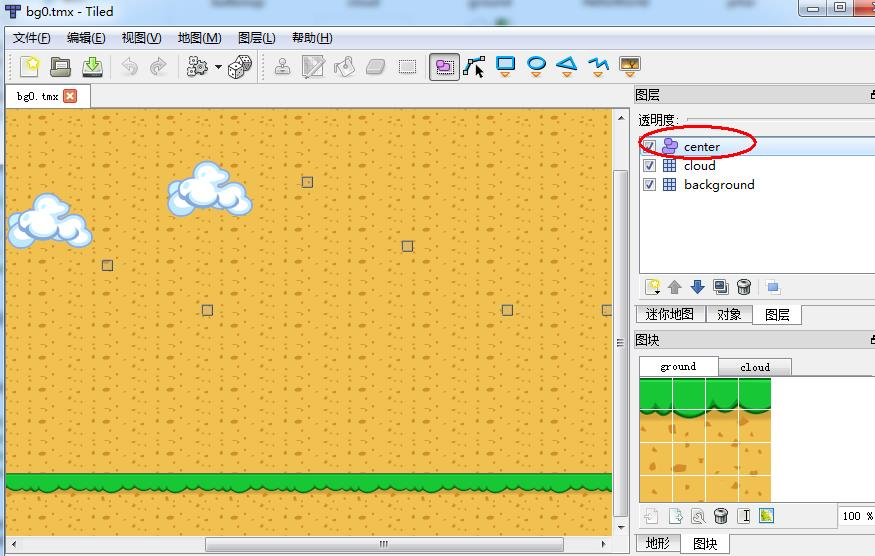
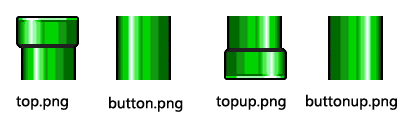
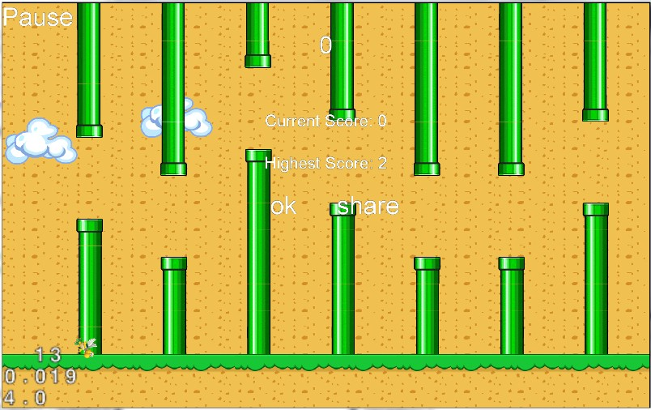

# 使用cocos2d-x实现一款类似《Flappy Bird》的游戏

最近，一只8比特位像素的小鸟霸占了IOS免费游戏排行榜的第一名，这款《Flappy Bird》游戏可谓是一夜爆红，简单并不粗糙的画面、超级玛丽游戏中的绿色通道、眼神有些呆滞的小鸟和几朵白云便构成了游戏的一切。不过可惜的是，如此受欢迎的笨鸟又在一夜之间火速下架了，让很多还没来得及被《Flappy Bird》虐过的玩家千方百计下载《Flappy Bird》，不过，就算如此也没关系，一只囧鸟倒下了，立马会有千千万万只高仿真山寨货崛起，下面，就和大家分享一款类似《Flappy Bird》的游戏Demo。

源代码下载地址：     

效果图：   


## 1 项目介绍
为了使项目的代码结构清晰，好的前期规划是很有必要的，下图是该游戏工程的主要类结构。先从整体看一下，项目的组织结构，然后会对其中内部实现做些必要的解说。    
   

游戏共有3个场景，主菜单场景、游戏场景、结束场景，其中主菜单场景和结束场景都很简单，下面的介绍中将一笔带过，我们的重点会放到游戏场景。下图是该游戏的逻辑场层关系图：   


## 2 前期准备

### 2.1 分辨率适配
为了适应移动终端的各种分辨率大小和屏幕宽高比，一款游戏能够很好的支持多屏幕多分辨率是必须的。打开AppDelegate.cpp文件添加如下代码：以方便我们在设计游戏时，能够更好的适应不同的运行环境。


	// 分辨率适配
	pEGLView->setDesignResolutionSize(320, 480, kResolutionFixedHeight);
	std::vector<std::string> searchPath;
	searchPath.push_back("h960");
	pDirector->setContentScaleFactor(960 / 480);
	// set searching path
	CCFileUtils::sharedFileUtils()->setSearchPaths(searchPath);


setDesignResolutionSize()设计分辨率大小及模式，setContentScaleFactor()内容缩放因子，setSearchPaths()设置资源搜索路径。如果不是很了解分辨率的适配，推荐阅读[Cocos2d-x 多分辨率适配完全解析](http://www.ityran.com/archives/4809)。 

### 2.2 Tiled Map的应用

在该游戏中的地图利用瓦片地图编辑器（Tiled Map Editor）编辑制作，它可保存为TMX格式的文件，可以被Cocos2d-x很好的支持。瓦片地图(Tile Map)不但生成简单，并且可以灵活的用于引擎中。不论你的游戏是角色扮演游戏, 平台动作游戏或仿打砖块游戏，这些游戏地图都可以使用开源的瓦片地图编辑器Tiled Map Editor生成。在像《Flappy Bird》之类的游戏中，地图运用Tiled Map在合适不过了。[【cocos2d-x官方文档】瓦片地图 Tiled Map](http://www.ityran.com/archives/3480)

将tmx文件加载到游戏中需要用CCTMXTiledMap类，方法很简单，这部分我们将在介绍游戏背景层的时候做详细的讲解。

## 3 主菜单场景

打开AppDelegate.cpp文件，在applicationDidFinishLaunching()函数中设置第一个启动的游戏场景为主菜单场景：


	CCScene *pScene = MenuLayer::scene();
	pDirector->runWithScene(pScene);


在场景中添加背景图片和按钮，截图如下：   
    


## 4 游戏场景 

游戏的主场景中包括了物理世界层（PhysicWorldLayer）、暂停层（PauseLayer）、分数层（ScoreLayer）和结束场景层（GameOverLayer），在物理世界层中又加入了游戏背景层（BackgroundLayer）。其中物理世界层（PhysicWorldLayer）是整个游戏的主要逻辑层，也是游戏的灵魂。其余几个层都非常简单，这里不做详细的讲解。
 
### 4.1 物理世界层
#### 4.1.1 chipmunk
该游戏中采用chipmunk引擎来模拟物理世界的运行。   

代表Chipmunk空间的对象是cpSpace，在这个空间里可容纳cpBody, cpShape，cpPolyShape等，它基本等同于Box2D里面的World。cpBody表示刚体，可在刚体上添加cpShape，刚体具有质量，转动惯量，位置，线性速度，加速度，角度，角速度，角加速度等属性；cpShape决定刚体的碰撞外形。  
   
chipmunk使用的一般流程：   
 
1. 构建chipmunk的空间（cpSpace），在这个空间内，我们放置需要的刚体（cpBody)，并且可以为刚体设置它的形状(cpShape)，刚体和形状都有它们的属性。
2. 更新空间的状态：在update函数中调用cpSpaceStep方法，计算空间内刚体的位置坐标，角度等等属性值，引擎会根据值重绘精灵。
 
我们可以通过下面的方式来创建一个cpSpace。切换到头文件（这里是：PhysicWorldLayer.h），做如下更改：


	#include "chipmunk.h"
	cpSpace *space;
   

在这里，我们只需要引入chipmunk头文件，然后声明一个实例变量来记录Chipmunk空间，再在PhysicWorldLayer.cpp 文件中创建物理空间，并添加精灵和层：

	void PhysicWorldLayer::createPhysicWorld()
	{
		// 1
		cpInitChipmunk();
	    space = cpSpaceNew();
	    space->gravity = cpv(0, -300);
	
	    // 2
	    cocos2d::extension::CCPhysicsDebugNode* debugLayer = cocos2d::extension::CCPhysicsDebugNode::create(space);
		addChild(debugLayer, 100);
		
		// 3
		wallBottom = cpSegmentShapeNew(this->space->staticBody,
	                                   cpv(0, 50),
	                                   cpv(4294967295, 50),
	                                   0);
	    wallBottom->e = 0;
	    cpSpaceAddStaticShape(this->space, wallBottom);
		this->wallBottom->collision_type = 3;
	    this->wallBottom->sensor = false;
	    cpShapeSetUserData(wallBottom, this);
	
		// 4
		CCSpriteFrameCache::sharedSpriteFrameCache()->addSpriteFramesWithFile("sprites.plist");
	    spriteSheet = CCSpriteBatchNode::create("sprites.png");
	    addChild(spriteSheet, 100);
	    
		// 5
	    bird = Bird::create(space);
	    spriteSheet->addChild(bird,10);
	 
		// 6   
	    backgroundLayer = BackgroundLayer::create(spriteSheet,space);
	    addChild(backgroundLayer);
	}


1. 使用Chipmunk方法之前，第一件必须做的事情是调用cpInitChipmunk方法。然后，你可以调用cpSpaceNew()方法来创建一个新的Chipmunk虚拟空间，将其存放到实例变量space中。gravity设置Chipmunk空间内的重力，这里cpv()的参数分别是：x轴方向重力分量，y轴方向重力分量。  
   
2. CCPhysicsDebugNode是为了让开发者方便调试而设计的一个类，将它设置为显示之后，在场景内定义的精灵的碰撞形状块就能显示出来了，如下图所示。当然，在游戏发布的时候应该删去。    


3. cpSegmentShapeNew用来建立一个段状形状，它的第一个参数用的space的staticBody来创建一个static shape，作为关卡的物理环境。这个body不需要加入到space中，否则会受重力作用。但这个body的shape需要加入到space中，用作碰撞检测。这里cpSegmentShapeNew创建了一个长度很长的段状横线，用来作为物理空间中的地面。    
cpSpaceAddStaticShape将这个shape作为静态刚体添加到space中去。shape的collision_type属性，为自定义的一个类型，这里把地面的collision_type设为3。

4. 加载精灵纹理。CCSpriteFrameCache一般用来处理plist文件，该文件对应一张包含多个精灵的大图。CCSpriteBatchNode用于批处理绘制精灵，可以提高精灵的绘制效率。plist文件可以使用TexturePacker制作。如下图所示：     
 

5. 在物理世界层中加入笨鸟精灵。

6. 添加背景层，背景层中包含了游戏地图和管道。

7. 模拟结束后，在析构函数中要调用pSpaceFree进行内存释放，即：```cpSpaceFree(space);```

#### 4.1.2 Bird笨鸟类

现在来看Bird类，它继承于CCPhysicsSprite类，从名称上就可以看出来这个CCPhysicsSprite类是与物理引擎相关的类，它定义一个物理类绑定的精灵，并且继承至CCSprite精灵类。   
 
显然地，在《Flappy Bird》的世界中，笨鸟也应是一个刚体。

这里可以通过使用cpBodyNew方法来生成代表笨鸟的动态（可移动的）刚体，这个方法需要两个参数：质量(mass)和惯性力矩(moment of inertia)。惯性力矩决定着刚体移动时遇到的阻力，它可以通过cpMomentForBox方法来获取，cpMomentForBox以刚体的质量和笨鸟的尺寸作为参数。如下代码所示：


	void Bird::initBody()
	{
	    CCSize size = CCDirector::sharedDirector()->getWinSize();
	    body = cpBodyNew(1.0f, cpMomentForBox(1.0f,this->runningSize.width, this->runningSize.height));
	    body->p = cpv(100, 50 + size.height / 2);
	    body->v = cpv(100, 0);
	    cpSpaceAddBody(space, body);
	}


body->p设置刚体重心的坐标；   
body->v设置刚体重心的速度；   
cpSpaceAddBody(space, body)将物体添加到空间内,这样物体才能受到空间重力的影响。

	void Bird::initShape()
	{
	    shape = cpBoxShapeNew(body, runningSize.width, runningSize.height);
	    shape->e = 0;
	    shape->u = 0;
	    cpSpaceAddShape(space, shape);
	}


cpBoxShapeNew给刚体定义一个盒子形状；    
shape->e设置形状的弹性系数，也就是物体碰撞到这个形状的反弹力度；    
shape->u设置形状的摩擦系数；cpSpaceAddShape(space, shape)将形状作为活动物体添加到空间里。   

初始化刚体和形状后，接下来需要把Bird精灵关联到刚体中去，调用```setCPBody(body);```函数实现。

Bird是一个动画精灵，所以应实现它的动画:


	void Bird::initAction()
	{
	    CCArray *animFrames = CCArray::create();
	    for (int i = 1; i < 4; i++)
	    {
	        CCString *name = CCString::createWithFormat("wugui_%d.png",i);
	        CCSpriteFrame *frame = CCSpriteFrameCache::sharedSpriteFrameCache()->spriteFrameByName(name->getCString());
	        animFrames->addObject(frame);
	    }    
	    CCAnimation *animation = CCAnimation::createWithSpriteFrames(animFrames, 0.1);
	    runningAction =CCRepeatForever::create(CCAnimate::create(animation));
	    runningAction->retain();
	}


#### 4.1.3 Bar管道类 

Bar类同Bird类相似，都继承于CCPhysicsSprite类，在游戏中也是刚体。只是，管道是由不同的部分组成的，我们必须分情况来创建它。下面的函数是Bar的一个构造函数，它可创建管道的特定部分。


	Bar::Bar(CCSpriteBatchNode *spriteSheet,cpSpace* node, CCPoint position, int barTag)
	{
	    this->space = node;
	    if (barTag == 0) {
	        this->initWithSpriteFrameName("top.png");
	    }
	    else if (barTag == 1){
	        this->initWithSpriteFrameName("button.png");
	    }
	    else if (barTag == 2){
	        this->initWithSpriteFrameName("topdown.png");
	    }
	    else if (barTag == 3){
	        this->initWithSpriteFrameName("buttonup.png");
	    }
	    
	    pipeSize = getContentSize();
	    body = cpBodyNewStatic();
	    body->p = cpv(position.x, position.y);
	    setCPBody(body);
	    shape = cpBoxShapeNew(body, pipeSize.width, pipeSize.height);
	    cpSpaceAddStaticShape(space, shape);
	    spriteSheet->addChild(this,2);
	    this->shape->collision_type = 2;
	    this->shape->sensor = false;
	    cpShapeSetUserData(shape, this);
	}


在游戏中，把Bar设置为静态的刚体，因为Bar在游戏中不用受到重力的影响，它和地面一样，只参与碰撞检测。


#### 4.1.4 对象管理类

ObjectManager类用于管理场景中的Bar对象。

在Tiled Map Editor中打开游戏中用到的tmx文件，你会发现，它们都有一层命名为center的图层，在这个图层中放置了一些不规则的小矩形，我们将会利用这些小矩形来计算并加载一根根完整的管道。如下图所示：    


"center"是tmx文件中一个图层的名字。

注意： tmx地图文件的大小是1920*960，但我们在前面的分辨率适配中设置了内容缩放因子，即pDirector->setContentScaleFactor(960 / 480)，所以整个场景中的内容都缩小了一倍。相应地，下面函数中的值也都缩小了一半。

管道由如下的4部分资源构成：    
    
资源图片中top.png的标签值被设为0，button.png的标签值为1，topdown.png的标签值为2 buttonup.png的标签值为3。  

**创建管道**


	#define Delta 128  //上下管道之间的固定距离
	void ObjectManager::initObjectOfMap(int mapIndex, float mapWidth)	//mapIndex为地图的标识号
	{
	    // x = 200 y = 160~672 in tiled map deltaY = 32n
	    int x = sPosition.x;
	    int y1 = sPosition.y - Delta / 2; //上部分管道口的y坐标
	    int y2 = sPosition.y + Delta / 2; //地面部分管道口的y坐标
	    CCLog("y1 = %d", y1);
	    
	    // add bar on the ground
	    int num = (y1 - 64) / 32 + 1; //计算地面可创建几节管道
	
	    if (num > 1)
	    {
	        upbar = Bar::create(pSpriteSheet, space, ccp(x, y1), 0);//创建地面部分的管道口，即创建top.png部分的管道
	        upbar->setTag(mapIndex);
	        objects->addObject(upbar);  //把它加入到数组中，方便管理
	        
	        for (int i = 1; i < num - 1; i++)
	        {
	            buttonbar = Bar::create(pSpriteSheet, space, ccp(x, y1 - 32 * i), 1);
	            buttonbar->setTag(mapIndex);
	            objects->addObject(buttonbar);
	        }
							
	        if (y1 - 32 * (num - 1) <= 80) { //80 = 64的地面 + 管道图（32*32）高度的一半（因为描点在中点）。
	            buttonbar = Bar::create(pSpriteSheet, space, ccp(x, 80), 1);//如果最后一节管道的Y坐标值小于80，那么将在Y = 80处创建管道
	            buttonbar->setTag(mapIndex);
	            objects->addObject(buttonbar);
	            CCLog("height < 96");
	        }
	        else
	        {
	            buttonbar = Bar::create(pSpriteSheet, space, ccp(x, y1 - 32 * (num - 1)), 1);
	            buttonbar->setTag(mapIndex);
	            objects->addObject(buttonbar);
	            CCLog("height >= 96");
	            buttonbar = Bar::create(pSpriteSheet, space, ccp(x, 80), 1);
	            buttonbar->setTag(mapIndex);
	            objects->addObject(buttonbar);
	        }
	    }
	    else
	    {
	        upbar = Bar::create(pSpriteSheet, space, ccp(x, 80), 0);
	        upbar->setTag(mapIndex);
	        objects->addObject(upbar);
	    }    
	    
	    // add bar in the sky
		//解释同上
	    int num2 = (464 - y2) / 32 + 1; //464 = 480 - 32 / 2
	    
	    if (num2 > 1)
	    {
	        down_upbar = Bar::create(pSpriteSheet, space, ccp(x, y2), 2);
	        down_upbar->setTag(mapIndex);
	        objects->addObject(down_upbar);
	        
	        for (int i = 1; i < num2 - 1 ; i++)
	        {
	            down_buttonbar = Bar::create(pSpriteSheet, space, ccp(x, y2 + 32 * i), 3);
	            down_buttonbar->setTag(mapIndex);
	            objects->addObject(down_buttonbar);
	        }
	        if (y2 + 32 * (num2 - 1) >= 464) {
	            down_buttonbar = Bar::create(pSpriteSheet, space, ccp(x, 464), 3);
	            down_buttonbar->setTag(mapIndex);
	            objects->addObject(down_buttonbar);
	            CCLog("height >= 464 num2 = %d", num2);
	        }
			else
	        {
	            down_buttonbar = Bar::create(pSpriteSheet, space, ccp(x, y2 + 32 * (num2 - 1)), 3);
	            down_buttonbar->setTag(mapIndex);
	            objects->addObject(down_buttonbar);
	            down_buttonbar = Bar::create(pSpriteSheet, space, ccp(x, 464), 3);
	            down_buttonbar->setTag(mapIndex);
	            objects->addObject(down_buttonbar);
	            CCLog("num2 = %d", num2);
	        }
	    }
	    else
	    {
	        down_upbar = Bar::create(pSpriteSheet, space, ccp(x, 464), 2);
	        down_upbar->setTag(mapIndex);
	        objects->addObject(down_upbar);
	    }
	    
	}


以地面部分的管道为例，它的基本原理如下图所示:
     

图中sPosition点是从center层中获得的小矩形的坐标点，以sPosition点为中心，向上向下各减去64的长度，分别得到上管道和下管道的贴图坐标初始位置，即height=y2和y1处。y1到y2的距离为上下管道口之间的固定位置，可调。    
地面部分的高度为64，各部分管道资源的大小都为32*32。    
y1`是最后一节管道的Y坐标值，当这个值小于80（地面部分的高度 + 管道资源的宽度 /2）时，将在 y=80 处创建最后一节管道。

**移除管道**    

为了不让我们的游戏越跑越卡，我们需要移除“跑出”了视线范围的管道。下面是实现方法：


	void ObjectManager::removeObjectOfMap(int mapIndex)
	{
	    CCArray *toBeRemove = CCArray::create();// autorelease in next game frame
	    
	    CCObject *obj = NULL;
	    CCPhysicsSprite* sprite = NULL;
	    CCARRAY_FOREACH(this->objects, obj)
	    {
	        //sprite = (CCSprite *)obj;
	        sprite = (CCPhysicsSprite *)obj;
	        if (mapIndex == sprite->getTag()) {
	            toBeRemove->addObject(sprite);
	            sprite->removeFromParent();
	        }
	    }
	    
	    //remove objects here
	    this->objects->removeObjectsInArray(toBeRemove);
	    CCLog("remove all objects");
	}


#### 4.1.5 背景层   

在背景层中我们需要添加地图和管道。  
   
游戏中地图是tmx格式的文件，它的加载需要调用CCTMXTiledMap类的一些方法。在本游戏中通过三张不同的tmx地图文件来创建这个游戏的地图，也就是要用到三个CCTMXTiledMap对象。

	map00 = CCTMXTiledMap::create("bg0.tmx");
	map00->setPosition(ccp(0, 0));
	addChild(map00);
	
	map01 = CCTMXTiledMap::create("bg1.tmx");
	map01->setPosition(ccp(bgWidth, 0));
	addChild(map01);
	
	map02 = CCTMXTiledMap::create("bg2.tmx");
	map02->setPosition(ccp(bgWidth * 2, 0));
	addChild(map02);

把这三个CCTMXTiledMap对象依次拼起来，再通过更新视角的方法就可以达到地图循环滚动的效果了。后面我们会详细介绍。

CCTMXTiledMap是一个CCNode节点，你可以设置它的坐标和比例等。它的子集是一些层，你可以通过该对象的objectGroupNamed()方法来获得子集层，它会为你返回一个特殊的CCTMXObjectGroup对象。如：

```
CCTMXObjectGroup* topBar = map->objectGroupNamed("center");
```


#### 4.1.6 重载触屏事件

因为我们需要不断控制点击屏幕来调节小鸟的飞行高度和降落速度，所以在这里我们需要重载触屏事件。
在PhysicWorldLayer.h中添加


	virtual bool ccTouchBegan(CCTouch *pTouch, CCEvent *pEvent);
    virtual void ccTouchMoved(CCTouch *pTouch, CCEvent *pEvent);
    virtual void ccTouchEnded(CCTouch *pTouch, CCEvent *pEvent);
    virtual void ccTouchCancelled(CCTouch *pTouch, CCEvent *pEvent);

在PhysicWorldLayer.cpp中实现：


	bool PhysicWorldLayer::ccTouchBegan(CCTouch *pTouch, CCEvent *pEvent){
	    cpBodyApplyImpulse(bird->body, cpv(0, 300), cpv(0, 0));
	    return true;
	}

cpBodyApplyImpulse函数为刚体添加一个冲量，控制刚体的运动，与之相关的函数还有cpBodyApplyForce函数。    
cpBodyApplyForce会在刚体上施加一个力，可以让刚体慢慢动起来。但应注意的是刚体不会立马动起来，因为力不会直接影响速度。cpBodyApplyImpulse不会产生力，但它会直接影响刚体的速度。通过cpBodyApplyForce方法添加的速度会与刚体原有的速度叠加，产生新的速度。


#### 4.1.7 更新

**Chipmunk模拟世界的更新**

在创建完基本的Chipmunk世界后，我们需要每帧运行更新一次模拟屏幕。这里可以在update函数中，调用了chipmunk的cpSpaceStep方法，这个方法根据时间刷新刚体的位置和形态角度，cocos2d-x依据这些数据来重新绘制精灵,从而达到移动精灵的目的。


	void PhysicWorldLayer::update(float delta)
	{
	    cpSpaceStep(space, delta);
	}

以上方法只是简单的调用cpSpaceStep，从而让chipmunk每帧都运行一次物理仿真。

**摄像机的更新**

本例中利用移动摄像机来实现地图的循环滚动，摄像机对应的类是CCCamera类。所有节点都拥有一个该摄像机类的对象属性，只有通过摄像机类，节点才会被渲染出来。CCCamera类可以实现节点对象的移动、旋转和缩放等等。所以，我们可以通过控制物理世界层（PhysicWorldLayer）的摄像机属性来实现相应的视觉效果。这里可以用getCamera方法来获得节点的摄像机。CCCamera使用OpenGL的gluLookAt函数来设置位置。gluLookAt 函数有三组关于坐标的参数，其中“Eye”系列的x、y、z 坐标参数是视角的位置，而“Center”系列的x、y、z 坐标参数是所视目标的坐标位置，“Up”系列的x、y、z 坐标参数是摄像机方向的向量坐标。

在update函数中添加：

	CCCamera *camera = this->getCamera();
	float eyeZ = camera->getZEye(); //等到z轴位置
	camera->setEyeXYZ(lastEyeX, 0, eyeZ);
	camera->setCenterXYZ(lastEyeX, 0, 0); 

**分数的更新**

分数的更新同样在update函数中实现：

	void ScoreLayer::update(float dt){
	    
	    nScore = CCUserDefault::sharedUserDefault()->getIntegerForKey("LastScore", 0); //得到键为LastScore的整数值
	    sprintf(strScore, "%d",nScore);
	    label->setString(strScore);  //把分数值设置到文本
	}

#### 4.1.8 碰撞检测

Chipmunk的碰撞检测是由回调方法来处理的，而且在chipmunk中有两种设定碰撞回调函数的方法，一种是cpSpaceSetDefaultCollisionHandler，另一种是cpSpaceAddCollisionHandler。    
cpSpaceSetDefaultCollisionHandler是为物理空间设定默认的碰撞回调函数，它的设置是针对全局的，也就是物理空间里任何对象的碰撞都会执行设定的回调函数：

	void cpSpaceSetDefaultCollisionHandler(  
	    cpSpace *space,  
	    cpCollisionBeginFunc begin,  
	    cpCollisionPreSolveFunc preSolve,  
	    cpCollisionPostSolveFunc postSolve,  
	    cpCollisionSeparateFunc separate,  
	    void *data  
	); 


cpSpaceSetDefaultCollisionHandler参数很多，分别代表的是：

- 当前space，表示在这个空间发生的碰撞；
- 碰撞开始前的回调；
- 碰撞开始时的回调；
- 碰撞结束时的回调；
- 碰撞分离后的回调；
- 传递给回调函数的参数。 

cpSpaceAddCollisionHandler用来设定自定义的碰撞回调规则，比上面多出了两个参数，用来指定物理空间中哪类对象碰撞时执行回调函数：

    void cpSpaceAddCollisionHandler(  
        cpSpace *space,  
        cpCollisionType a, cpCollisionType b,  
        cpCollisionBeginFunc begin,  
        cpCollisionPreSolveFunc preSolve,  
        cpCollisionPostSolveFunc postSolve,  
        cpCollisionSeparateFunc separate,  
        void *data  
    );  

多的两个参数分别表示：

- 碰撞类型a；
- 碰撞类型b；

在我们的游戏中，我们需要指定物理空间中的特定对象来进行碰撞检测，所以我们使用自定义碰撞回调规则的 cpSpaceAddCollisionHandler 方法来设置碰撞检测回调函数。碰撞回调函数会在cpSpaceStep中的某个阶段被调用，这里添加collisionBegin和postStepRemove这两个静态方法，用它们作为回调的方法，实现碰撞检测的相关操作。

	cpSpaceAddCollisionHandler(this->space, 2, 1, collisionBegin, NULL, NULL, NULL, this->bird->body);
    cpSpaceAddCollisionHandler(this->space, 1, 3, collisionBegin, NULL, NULL, NULL, this->bird->body);

1代表小鸟，2代表管道，3代表地面，4代表顶端屏幕。因为该教程是基于Demo版的游戏撰写，所以代码还不是很完善，这里建议用宏定义碰撞对象的类型。

collisionBegin是碰撞开始前的回调方法： 

	int PhysicWorldLayer::collisionBegin(cpArbiter *arb, cpSpace *space, void *param)
	{
	    CP_ARBITER_GET_SHAPES(arb, a, b);
	    cpSpaceAddPostStepCallback(space, (cpPostStepFunc)PhysicWorldLayer::postStepRemove, b, param);
	    return 0;
	}

CP_ARBITER_GET_SHAPES取出发生碰撞的两个cpShape，a代表用cpSpaceAddCollisionHandler添加碰撞回调时的碰撞对象类型a，b亦然。a、b与cpSpaceAddCollisionHandler函数的第2，3个参数的顺序有关。

cpSpaceAddPostStepCallback 设置cpSpace在结束当前动作时的回调函数，用于安全释放对象，此调用只会在完成当前动作后调用一次。
return 0 表示不需要chipmunk再处理后续的回调过程了。 

postStepRemove的实现如下：

	void PhysicWorldLayer::postStepRemove(cpSpace *space, cpShape *shape, void *param)
	{
	    CCLOG("check");
	    cpBody* body = (cpBody*)param;
	    switch (shape->collision_type) {
	        case 1:
	            CCLog("Get pipe");
	            body->a = 180;
	            body->v = cpv(0, -500);
	            break;
	        case 3:
	            CCLog("Get ground");
	            CCUserDefault::sharedUserDefault()->setBoolForKey("IS_GAMEOVER", true);//设置IS_GAMEOVER的值为true，告诉用户游戏结束
	            break;
	        default:
	            break;
	    }
	}

### 4.2 游戏结束层
在GameOverLayer中添加分数榜成绩，用来显示历史最高分和当局分数。在该游戏中通过CCUserDefault来存取游戏数据，简单实用。

	void GameOverLayer::addScoreBoard(){
	
	    CCSize size = CCDirector::sharedDirector()->getWinSize();
	    sprintf(strScore, "Current Score: %d",lastScore);
	    currLabel = CCLabelTTF::create(strScore, "Arial", 20);
	    currLabel->setPosition(CCPoint(size.width/2,size.height/2+100));
	    addChild(currLabel);
	    
	    if (lastScore > currScore) {
	        CCUserDefault::sharedUserDefault()->setIntegerForKey("HighestScore", lastScore);
	        currScore = lastScore;
	    }else{
	        CCUserDefault::sharedUserDefault()->setIntegerForKey("HighestScore", currScore);
	    }
	    
	    sprintf(strScore, "Highest Score: %d",currScore);
	    highLabel = CCLabelTTF::create(strScore, "Arial", 20);
	    highLabel->setPosition(CCPoint(size.width/2,size.height/2+50));
	    addChild(highLabel);
	    CCLOG("CurrentScore:%d",currScore);
	}


 


