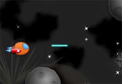
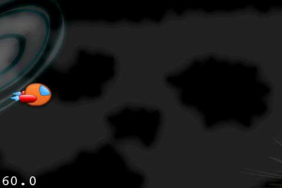
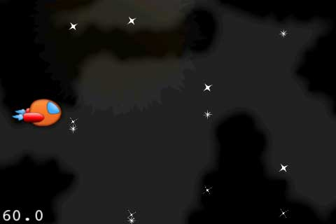
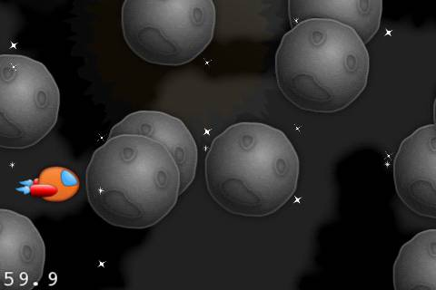
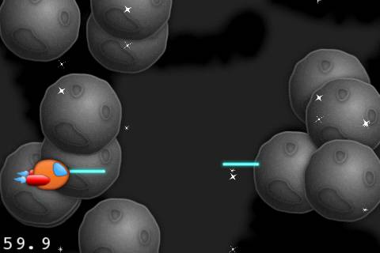
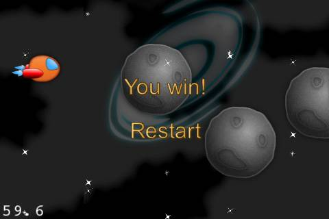

# 如何使用cocos2d-x 3.0制作一个太空射击游戏

## 前言

程序截图：

在这个教程里面，你将会学习到如何开发一个太空射击游戏！

你可以使用加速计（重力感应）来控制飞船的移动，并且可以点击屏幕来发射激光武器。

如果你对于如何制作基于cocos2d-x3.0的游戏完全陌生的话，这个教程可以帮助你！你将会学习到，如何从头至尾构建一个完整的游戏，不需要任何的经验！

假如你对cocos2d-x3.0编程完全陌生的话，那么你可能需要先学习一下相关的教程了。

这个教程对于中级开发者来说也非常好，因为它覆盖了一些比较高级的主题，比如视差滚动（parallax scrolling），预分配Node，加速计移动以及粒子系统的使用。

话不多说，直入主题！

#添加相关资源文件

为了做这样一个手机游戏，你将需要一些跟太空主题相关的图片资源和声音资源。

你可以直接下载我老婆制作的[太空游戏资源](http://d1xzuxjlafny7l.cloudfront.net/downloads/SpaceGameResources.zip)。

因此，请直接下载吧，并且把它解压到你的项目的Resources目录下面去。

如果你很好奇，你可以随便看看你刚刚向工程里面添加进去了一些什么东西。下面是完整的内容列表：

- Backgrounds: 一些背景图片，你等下会使用它们来制作一个滚动背景。里面包含星系，太阳，和空间异常（它移动速度比较慢），还有一组空间尘埃图片（它们会出现在背景前面，而且会移动地稍微快一点）
- Fonts: 使用 [Glyph Designer](http://71squared.com/glyphdesigner)制作的位图字体，我们将使用这些字体来在游戏中显示文字。
- Particles: 使用  [Particle Designer](http://71squared.com/particledesigner)制作的一些特殊的粒子效果。 在这里，我们用来创建星星飞动的效果。
- Sounds: 一些与太空相关的背景音乐和音效。使用 [Garage Band](http://www.apple.com/mac/garageband/) 和 [cxfr](http://thirdcog.eu/apps/cfxr)制作的。
- Spritesheets: 一张格式为pvr.ccz的大图片，里面包含了游戏中将要用到的许多小图片，比如陨石，太空船等。这个文件使用 Texture Packer制作的---如果你想使用pvr.ccz文件格式的话，你可能就需要使用这个工具。当然pvr.ccz格式的优点就是文件小，加载速度快。

如果你还没安装上面任何一款工具的话，也不用担心！对于这个教程来说，你完全不需要他们，你可以使用我已经制作好的这些资源就够了。以后，如果有条件，你可以再去试试上面提到的工具。

下面就是Sprites.pvr.ccz文件，它看起来如下图所示：

你可能会奇怪，为什么要把所有的这些图片都弄成这样一张大图呢？因为，首先，它可以帮助节省内存，同时还可以提高性能。

接下来，让我们开始coding吧！：）

#添加一个太空船

首先，让我们在屏幕上添加一艘太空船吧！

让我们试试，看是否工作！打开HelloWorld.h，在HelloWorld类开头加入下面代码（在已有public:行的上面）

	SpriteBatchNode *_batchNode;
	Sprite *_ship;

上面的代码创建了两个私有实例变量 – 一个是SpriteBatchNode，一个是太空飞船精灵。
现在切换到HelloWorldScene.cpp，在init()方法里，删除从注释“2. add a menu item”到方法最后的所有代码，加入下面代码：

	_batchNode = SpriteBatchNode::create("Sprites.pvr.ccz"); // 1
	this->addChild(_batchNode); // 2
	SpriteFrameCache::getInstance()->addSpriteFramesWithFile("Sprites.plist"); // 3

	_ship = Sprite::createWithSpriteFrameName("SpaceFlier_sm_1.png"); // 4
	auto winSize = Director::getInstance()->getWinSize(); // 5
	_ship->setPosition(Point(winSize.width *0.1, winSize.height *0.5)); // 6
	_batchNode->addChild(_ship,1); // 7

注意这些代码与你过去使用的Objective-C版的cocos2d 非常类似。API是有很多相同的地方的，仅仅是有一些与C++的语法不同。

编译运行，你应该可以看到你的船出现在屏幕上

#增加视差滚动

接下来，我们会加入宇宙背景，使它以视差滚动这种很酷的方式来滚动。

首先，我们不得不在所有的类名前面加上cocos2d::这个名字空间，这太烦人了！所以在HelloWorld.h类声明前加入下面行:

USING_NS_CC;

接着在HelloWorld的private部分加入一些新的变量（注意我们不再需要加cocos2d前缀）:

ParallaxNodeExtras *_backgroundNode;
Sprite *_spacedust1;
Sprite *_spacedust2;
Sprite *_planetsunrise;
Sprite *_galaxy;
Sprite *_spacialanomaly;
Sprite *_spacialanomaly2;

然后，在HelloWorldScene.cpp的init方法中，return语句前加入下面代码：

	// 1) Create the ParallaxNodeExtras
	_backgroundNode = ParallaxNodeExtras::node();
	this->addChild(_backgroundNode,-1);

	// 2) Create the sprites we'll add to the ParallaxNodeExtras
	_spacedust1 = Sprite::create("bg_front_spacedust.png");
	_spacedust2 = Sprite::create("bg_front_spacedust.png");
	_planetsunrise = Sprite::create("bg_planetsunrise.png");
	_galaxy = Sprite::create("bg_galaxy.png");
	_spacialanomaly = Sprite::create("bg_spacialanomaly.png");
	_spacialanomaly2 = Sprite::create("bg_spacialanomaly2.png");

	// 3) Determine relative movement speeds for space dust and background
	Point dustSpeed = Point(0.1, 0.1);
	Point bgSpeed = Point(0.05, 0.05);

	// 4) Add children to ParallaxNodeExtras
	_backgroundNode->addChild(_spacedust1,0,dustSpeed,Point(0, winSize.height / 2));
	_backgroundNode->addChild(_spacedust2,0,dustSpeed,Point(_spacedust1->getContentSize().width, winSize.height / 2));
	_backgroundNode->addChild(_galaxy, -1, bgSpeed,Point(0, winSize.height *0.7));
	_backgroundNode->addChild(_planetsunrise, -1, bgSpeed,Point(600, winSize.height * 0));
	_backgroundNode->addChild(_spacialanomaly, -1, bgSpeed,Point(900, winSize.height *0.3));
	_backgroundNode->addChild(_spacialanomaly2, -1, bgSpeed,Point(1500, winSize.height *0.9));

编译运行，你应该可以看到一个宇宙场景的启动

然而，这还不是很有趣，因为还没有任何东西在动！

为了移动太空尘埃和相关背景层，你只需要移动一样东西就可以了，ParallaxNodeExtras。对于移动parallax node的每一个y值，灰尘就会移动0.1y值，同时背景会移动0.05y值。

为了移动parallax节点，你只需要飞一帧更新一下它的位置就可以了。打开HelloWorldLayer.m文件，加入下列的代码：（添加位置注意看注释）

	this->scheduleUpdate();

	void HelloWorld::update(float dt)
	{
		Point backgroundScrollVel = Point(-1000, 0);
		_backgroundNode->setPosition(_backgroundNode->getPosition()+backgroundScrollVel*dt);
	}

编译并运行工程，你会看到，使用parallax来做视差滚动效果真是太简洁了！

然后，运行几秒钟之后，你会发现一个问题：背景滚动完之后没有了！我们只得到了一个黑色的屏幕！那真是太糟糕了！好，接下来，看看我是怎么解决的吧！

#连续地滚动

这时，你应该注意到了背景滚出屏幕后没有循环，那么我们来修这个bug

在我们的[《如何使用cocos2d制作一个太空射击游戏》](http://www.cnblogs.com/zilongshanren/archive/2011/06/09/2074962.html)教程中，我们通过

Objective-c的分类(category)扩展了CCParallaxNode类来实现。

不幸的是，C++中是不存在分类的，所以我们需要借助继承来实现之。

我们将去定义一个CCParallaxNode扩展类来扩展标准的CCParallaNode。这样做虽然不如Objective-C优雅，但是有时我们需要为软件可移植性做一些

牺牲。

在Xcode中，在Glasses group上单击右键，选择New File。选择iOS\C and C++\C++文件末尾，点击Next，为他命名为ParallaxNodeExtras.cpp存储到$PROJECT_HOME\Classes，然后点击创建。然后重复上述过程，但要选择iOS\C and C++\Header文件模板，来创建ParallaxNodeExtras.h

用下面的代码替换ParallaxNodeExtras.h中的内容

	#ifndef Cocos2DxFirstIosSample_CCParallaxNodeExtras_h 
	#define Cocos2DxFirstIosSample_CCParallaxNodeExtras_h 
	#include "cocos2d.h" 
	
	USING_NS_CC; 
	
	class ParallaxNodeExtras : public ParallaxNode
	{
	public: // Need to provide our own constructor 
		ParallaxNodeExtras() ; // just to avoid ugly later cast and also for safety
	
		static ParallaxNodeExtras * node(); // Facility method (we expect to have it soon in COCOS2DX) 
		void incrementOffset(CCPoint offset, Node* node);
	}; 
	#endif

这里我们为ParallaxNode添加一个新的方法(incrementOffset)，我们用它来更新parallax node 每个 child 的位置。当背景移动出屏幕左端的时

候我们会使用它来将背景放到屏幕的右端，来实现持续的滚动。 将下面的代码替换到ParallaxNodeExtras.cpp

	#include "ParallaxNodeExtras.h"

	// Hack to access CCPointObject (which is not a public class)
	
	class PointObject : Object
	{
	public:
		static PointObject * create(Point ratio, Point offset)
		{
			PointObject *ret = new PointObject();
			ret->initWithPoint(ratio, offset);
			ret->autorelease();
			return ret;
		}
	
		bool initWithPoint(Point ratio, Point offset)
		{
			_ratio = ratio;
			_offset = offset;
			_child = nullptr;
			return true;
		}
	
		inline const Point& getRatio() const { return _ratio; };
		inline void setRatio(const Point& ratio) { _ratio = ratio; };
	
		inline const Point& getOffset() const { return _offset; };
		inline void setOffset(const Point& offset) { _offset = offset; };
	
		inline Node* getChild() const { return _child; };
		inline void setChild(Node* child) { _child = child; };
	
	private:
		Point _ratio;
		Point _offset;
		Node *_child; // weak ref
	};
	
	// Need to provide our own constructor
	ParallaxNodeExtras::ParallaxNodeExtras() {
		ParallaxNode::create(); // call parent constructor
	}
	
	ParallaxNodeExtras* ParallaxNodeExtras::node() {
		return new ParallaxNodeExtras();
	}
	
	void ParallaxNodeExtras::incrementOffset(CCPoint offset, CCNode* node)
	{
		for (unsigned int i = 0; i < _parallaxArray->num; i++)
		{
			PointObject *point = (PointObject*)_parallaxArray->arr[i];
			Node* curNode = point->getChild();
			if (curNode->isEqual(node)) 
			{
				point->setOffset(point->getOffset()+offset);
				break;
			}
		}
	}

注意，很不幸的是PointObject在Cocos2d-x3.0中并不是公共的类，所以我们需要借住一些小手段来hack。(重定义它为我们的类，并具有相同的签名)。

虽然它能工作的很好，但是他的缺点是，如果PointObject改动了，你这里也要跟着改动，否则程序会崩溃。

代码的重点是incrementOffset方法，他和 [《如何使用cocos2d制作一个太空射击游戏》](http://www.cnblogs.com/zilongshanren/archive/2011/06/09/2074962.html)中的实现相同，只是用了不同的语言。

下一步，选择HelloWorldScene.h，在文件顶部的#include 语句之后添加这些代码：
	
	#include "ParallaxNodeExtras.h"

然后像下面的代码一样，将private区域中_backgroundNode定义由CCParallaNode改为ParallaxNodeExtras

	ParallaxNodeExtras *_backgroundNode;

然后选择HelloWorldScene.cpp 用下面的代码替换掉section #1(_backgroundNode创建的地方)的第一行。

	_backgroundNode = ParallaxNodeExtras::node();

最后，添加下面的代码，到update 方法的底部。

	Vector<Sprite*> spaceDusts;
	spaceDusts.pushBack(_spacedust1);
	spaceDusts.pushBack(_spacedust2);
	for each(Sprite *spaceDust in spaceDusts)
	{
		if ((_backgroundNode->convertToWorldSpace(spaceDust->getPosition()).x < -spaceDust->getContentSize().width))
		{
			_backgroundNode->incrementOffset(Point(2 * spaceDust->getContentSize().width, 0),spaceDust);
		}
	}

	Vector<Sprite*> backgrounds;
	backgrounds.pushBack(_planetsunrise);
	backgrounds.pushBack(_galaxy);
	backgrounds.pushBack(_spacialanomaly);
	backgrounds.pushBack(_spacialanomaly2);
	for each(Sprite *background in backgrounds)
	{
		if ((_backgroundNode->convertToWorldSpace(background->getPosition()).x < -background->getContentSize().width))
		{
			_backgroundNode->incrementOffset(Point(2000, 0),background);
		}
	}

编译并运行工程，这时你可以看到有一个无限连续滚动的背景了！

#添加星星

没有哪一个太空射击游戏是没有星星在旁边飞的！

同样的，我们也可以创建相应的星星图片，并且把它当作paralla节点的一个孩子添加进去。但是，这里我们不想这么做，因为星星是一个非常好的介绍粒子系统的例子。

粒子系统能够让你使用同样的精灵创建大量的小对象，并且非常高效。cocos2d-x3.0给了你很多配置粒子系统的参数， Particle Designer这个工具可以使这些参数的配置可视化。

但是，这个教程里面，我们不会涉及如何调整粒子系统的各项参数，我们使用已经做好的星星的粒子效果。只需要在init方法中把它简单地添加进来即可：

	HelloWorld::addChild(CCParticleSystemQuad::create("Stars1.plist"));
	HelloWorld::addChild(CCParticleSystemQuad::create("Stars2.plist"));
	HelloWorld::addChild(CCParticleSystemQuad::create("Stars3.plist"));

编译运行，漂亮！他已经开始看起来像一个太空游戏了。

#使用加速计来移动飞船

使用加速计来移动飞船

在之前的Cocos2D space shooter tutorial里面，我们使用ios的加速计api来检测加速计输入。很明显，ios下面的加速计api是不可以跨平台的，那

么我们怎么办呢？

幸运的是，cocos2d-x3.0对加速计进行了封装，我们可以不用关心具体平台api，直接使用抽象后的加速计api就可以了。让我们看看它是怎么工作的吧

。

首先，在HelloWorldScnee.H头文件里面添加一个新的私有成员变量：

	float _shipPointsPerSecY;

然后，添加一个新的public方法声明：

	virtual void onAcceleration(Acceleration* acc, Event* unused_event);

然后在HelloWorldScene.cpp的init方法的return语句之前添加下列代码：

	this->setAccelerometerEnabled(true);

接下来，在HelloWorldScene.cpp文件底部添加下面这些新方法定义：

	void HelloWorld::onAcceleration(Acceleration* acc, Event* unused_event)
	{
		#define KFILTERINGFACTOR 0.1
		#define KRESTACCELX -0.6
		#define KSHIPMAXPOINTSPERSEC (winSize.height*0.5)
		#define KMAXDIFFX 0.2
	
		double rollingX;
	
		// Cocos2DX inverts X and Y accelerometer depending on device orientation
		// in landscape mode right x=-y and y=x !!! (Strange and confusing choice)
		acc->x = acc->y;
		rollingX = (acc->x * KFILTERINGFACTOR) + (rollingX * (1.0 - KFILTERINGFACTOR));
		float accelX = acc->x - rollingX;
		auto winSize = Director::getInstance()->getWinSize();
		float accelDiff = accelX - KRESTACCELX;
		float accelFraction = accelDiff / KMAXDIFFX;
		_shipPointsPerSecY = KSHIPMAXPOINTSPERSEC * accelFraction;
	}

最后，在update方法的底部添加如下代码：

	auto winSize = Director::getInstance()->getWinSize();
	float maxY = winSize.height - _ship->getContentSize().height / 2;
	float minY = _ship->getContentSize().height / 2;

	float diff = (_shipPointsPerSecY * dt);
	float newY = _ship->getPosition().y + diff;
	newY = MIN(MAX(newY, minY), maxY);
	_ship->setPosition(ccp(_ship->getPosition().x, newY));

这里的onAcceleration回调函数包含一个Acceleration对象，它包含加速计的x、y和z三个方向的数据。我们目前只需要使用x方向的加速计数据就

行了，因为我们是沿着设备的x轴进行运动的。

注意: cocos2d-x3.0会根据你的设备是处于portait模式还是landscape模式来切换加速计的x和y方向的值。

如果是Landscape right（也就是我们目前的情况），接收到的x值其实是-y，而y值是x。如果是Landscape left那么接收到的x值是y，而y值是-x。

有点头晕了？呵呵

编译，然后在你的iphone和android设备上测试一下吧，现在你可以倾斜你的设备来移动飞船啦！当然，此时，你不能在模拟器上进行测试，必须使

用真机。

#添加陨石

是时候给游戏添加一些陨石了！首先在 HelloWorldScene.h里面添加下面一些实例变量：

	Vector<Sprite*> _asteroids;
	int _nextAsteroid = 0;
	float _nextAsteroidSpawn;

然后，添加一些新的公有方法声明：

	float randomValueBetween(float low, float high);
	void  setInvisible(Node * node);
	float getTimeTick();

接下来，回到HelloWorldScene.cpp，然后在文件最后添加刚刚的那些辅助方法的实现：

	float HelloWorld::randomValueBetween(float low, float high) {
	return ((float)CCRANDOM_0_1() * (high - low)) + low;
	}
	
	float HelloWorld::getTimeTick() {
		timeval* time = new timeval();
		cocos2d::timezone* z = new cocos2d::timezone();
		gettimeofday(time, z);
		unsigned long millisecs = (time->tv_sec * 1000) + (time->tv_usec / 1000);
		return (float)millisecs;
	}

randomValueBetween 是一个可以获得指定范围内的随机浮点数的辅助方法。而 getTimeTick 是一种可移植的

方式来得到毫秒级别的时间。

接下来，在init方法的最后创建一个陨石的数组：

	#define KNUMASTEROIDS 15
	for (int i = 0; i < KNUMASTEROIDS; ++i) 
	{
		Sprite *asteroid = Sprite::createWithSpriteFrameName("asteroid.png");

		asteroid->setVisible(false);
		_batchNode->addChild(asteroid,5);
		_asteroids.pushBack(asteroid);
	}

最后，在update方法底部添加下列代码：

	float curTimeMillis = getTimeTick();
	if (curTimeMillis > _nextAsteroidSpawn) 
	{

		float randMillisecs = randomValueBetween(0.20, 1.0) * 1000;
		_nextAsteroidSpawn = randMillisecs + curTimeMillis;

		float randY = randomValueBetween(0.0, winSize.height);
		float randDuration = randomValueBetween(2.0, 10.0);

		Sprite *asteroid = _asteroids.at(_nextAsteroid);
		_nextAsteroid++;

		if (_nextAsteroid >= _asteroids.size())
			_nextAsteroid = 0;

		asteroid->stopAllActions();
		asteroid->setPosition(Point(winSize.width +asteroid->getContentSize().width / 2, randY));
		asteroid->setVisible(true);
		asteroid->runAction(Sequence::create(
			MoveBy::create(randDuration, Point(-winSize.width - asteroid->getContentSize().width, 0)),
			CallFuncN::create(this, callfuncN_selector(HelloWorld::setInvisible)),
			NULL
			));
	}

再一次说明，这里的代码跟之前的cocos2d代码太像了！注意，这里的callfuncN_selector调用跟objc里面的selector机制太像了！

注意：由于Sequence::create方法的参数列表采用的是变长参数，你其实可以忽略掉最后一个NULL参数，因为对于c++来讲，这个参数没有意义。

但是，考虑到兼容性的原因，因为cocos2d-x开发者想保持跟cocos2d的高度一致，所以，这里需要一个NULL终止符。如果你在你的代码里面不提供的

话，那么你的程序将会崩溃。

最后一步就是添加setInvisible回调函数的实现：

	void HelloWorld::setInvisible(CCNode * node) 
	{
	node->setVisible(false);
	}

编译并运行，有陨石！下面是效果截图：

#发射激光

是时候让我们的飞船发射激光了！在HelloWorldScene.h里面添加下列私有成员变量：

	Vector<Sprite*> _shipLasers;
	int _nextShipLaser = 0;

现在，添加一个新的公有方法声明：

	bool onTouchBegan(Touch *touch, Event *event);

然后，在HelloWorldScene.cpp的init方法的return语句之前添加下列代码：

	#define KNUMLASERS 5
	for (int i = 0; i < KNUMLASERS; ++i) 
	{
		auto *shipLaser = Sprite::createWithSpriteFrameName("laserbeam_blue.png");

		shipLaser->setVisible(false);
		_batchNode->addChild(shipLaser);
		_shipLasers.pushBack(shipLaser);
	}

最后，在文件的底部实现onTouchBegan方法:

	bool HelloWorld::onTouchBegan(Touch *touch, Event *event)
	{
		auto winSize = Director::getInstance()->getWinSize();
	
		auto *shipLaser = _shipLasers.at(_nextShipLaser++);
	
		SimpleAudioEngine::getInstance()->playEffect("laser_ship.wav");
		if (_nextShipLaser >= _shipLasers.size())
			_nextShipLaser = 0;
		shipLaser->setPosition(_ship->getPosition()+Point(shipLaser->getContentSize().width / 2, 0));
		shipLaser->setVisible(true);
		shipLaser->stopAllActions();
		shipLaser->runAction(Sequence::create(
			MoveBy::create(0.5, Point(winSize.width, 0)),
			CCCallFuncN::create(this, callfuncN_selector(HelloWorld::setInvisible)),
			NULL  // DO NOT FORGET TO TERMINATE WITH NULL
			));
	
		return true;
	}

编译并运行代码，现在你可以发射激光武器了。

#基本的碰撞检测

恩，到目前为止，这看起来有点像一个游戏了，但是，还不够完整，因为没有爆炸！

而且我天性不听话，喜欢搞破坏，所以是时候往游戏里面添加一些破坏啦！：）

打开HelloWorldLayer.h，然后添加下面的实例变量：

	int _lives = 0;

接着，在HelloWorldScene.h的update函数的底部添加如下代码：

	Vector<Sprite*>::iterator itAster, itLaser;
	for (itAster = _asteroids.begin(); itAster != _asteroids.end(); itAster++) {
		auto *asteroid = (Sprite *)*itAster;
		if (!asteroid->isVisible())
			continue;
		for (itLaser = _shipLasers.begin(); itLaser != _shipLasers.end(); itLaser++) {
			auto *shipLaser = (Sprite *)*itLaser;
			if (!shipLaser->isVisible())
				continue;
			if (shipLaser->boundingBox().intersectsRect(asteroid->boundingBox())) {
				shipLaser->setVisible(false);
				asteroid->setVisible(false);
				continue;
			}
		}
		if (_ship->boundingBox().intersectsRect(asteroid->boundingBox())) {
			SimpleAudioEngine::getInstance()->playEffect("explosion_large.wav");
			asteroid->setVisible(false);
			_ship->runAction(Blink::create(1.0, 9));
			_lives--;
		}
	}

编译并运行，现在你可以使小行星爆炸了！

#胜利/失败检测

将胜利或失败的检测代码转换到Cocos2d-x3.0也是直截了当的。

切换回HelloWorldScene.h并在类的声明前添加一个枚举变量：

	typedef enum {
	KENDREASONWIN,
	KENDREASONLOSE
	} EndReason

现在在HelloWorld类添加两个私有变量：

	double _gameOverTime;
	bool _gameOver = false;

接下来，添加两个私有方法的声明:

	void endScene(EndReason endReason);
	void restartTapped(Object* sender);

接着，切换到HelloWorldScene.cpp并在init函数的return前添加如下代码：

	_lives = 3;
	double curTime = getTimeTick();
	_gameOverTime = curTime + 30000;

在update的结尾，添加如下代码：

	if (_lives <= 0)
	{
		this->stopAllActions();
		_ship->setVisible(false);
		this->endScene(KENDREASONLOSE);
	}
	else if (curTimeMillis >= _gameOverTime) 
	{
	 this->endScene(KENDREASONWIN);
	}

最后，在文件的结尾添加新方法的实现：

	void HelloWorld::restartTapped(Object* sender)
	{
		Director::getInstance()->replaceScene(TransitionZoomFlipX::create(0.5, HelloWorld::createScene()));
		this->scheduleUpdate();
	}
	
	void HelloWorld::endScene(EndReason endReason) 
	{
		if (_gameOver)
			return;
		_gameOver = true;
	
		auto winSize = Director::getInstance()->getWinSize();
		char message[10] = "You Win";
		if (endReason == KENDREASONLOSE)
			strcpy(message, "You Lose");
		LabelBMFont * label;
		label = LabelBMFont::create(message,"fonts/Arial.fnt");
		label->setScale(0.1);
		label->setPosition(Point(winSize.width / 2, winSize.height*0.6));
		this->addChild(label);
	
		LabelBMFont * restartLabel;
		restartLabel = LabelBMFont::create("Restart", "fonts/Arial.fnt");
		auto *restartItem = MenuItemLabel::create(restartLabel,CC_CALLBACK_1(HelloWorld::restartTapped,this));
		restartItem->setScale(0.1);
		restartItem->setPosition(Point(winSize.width / 2, winSize.height*0.4));
	
		Menu *menu = Menu::create(restartItem, NULL);
		menu->setPosition(Point::ZERO);
		this->addChild(menu);
	
		// clear label and menu
		restartItem->runAction(ScaleTo::create(0.5, 1.0));
		label->runAction(ScaleTo::create(0.5, 1.0));
		// Terminate update callback
		this->unscheduleUpdate();
	}

如果你不理解endScene方法的话，也没关系---那些代码是我过去用来快速地判断游戏胜利或失败的方式。

真正重要的是，你要理解其它部分的代码---在每一个update循环中，你只检测玩家是否胜利或失败，然后相应地调那个方法就可以了。

编译并运行代码，看看你会不会输？

#免费的音乐和音效

安卓不支持CAF格式的声音文件，所以我们要做的第一件事就是把原始声音文件替换为一种可在安卓上使用的格式。

打开终端，输入如下命令（不要忘记在第一个命令中用安卓项目的真实路径替换$PROJECT_HOME，否则命令将无法运行）:

	cd $PROJECT_HOME/Resources
	afconvert -f WAVE -d UI8 SpaceGame.caf SpaceGame.wav
	afconvert -f WAVE -d UI8 explosion_large.caf explosion_large.wav
	afconvert -f WAVE -d UI8 laser_ship.caf laser_ship.wav

就像你可能猜到的那样，上面的命令将把文件从CAF格式转换为WAV格式。

一旦你转换完文件，回到你的Xcode项目并将转化好的文件添加到你的Resources文件夹（从Android目录中）——同你之前添加图片和其他资源一样

。

困难的部分已经完成，现在播放这些声音吧！在HelloWorldScene.cpp的顶部添加如下代码：

	#include "SimpleAudioEngine.h"
	using namespace CocosDenshion;

这里，我们导入了SimpleAudioEngine的头文件，同时声明了相应的名字空间。

下面的代码就很简单了，跟之前的教程没区别，只是语法表示上的差异。我们只需要在init方法的最后添加下列代码即可：

	SimpleAudioEngine::getInstance()->playBackgroundMusic("SpaceGame.wav", true);
	SimpleAudioEngine::getInstance()->preloadEffect("explosion_large.wav");
	SimpleAudioEngine::getInstance()->preloadEffect("laser_ship.wav");

接下来，在update行星部分用CGRectIntersectsRect检测是否一束激光和行星相撞的地方添加如下代码

（当飞船和激光碰撞你也应该添加一种音效，这将在相同的模块进行下个intersectsRect测试，但飞船不能爆炸，你可能想要设置另一种声音)

	SimpleAudioEngine::getInstance()->playEffect("explosion_large.wav");

最后，在onTouchBegan函数添加如下代码：

	SimpleAudioEngine::getInstance()->playEffect("laser_ship.wav");

好了！编译并运行，这就是一个我们从头至尾一步步开发出来的完整的游戏啦！：）

这里有本项目的[完整源代码](./SpaceGame.zip)。

