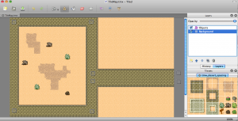

# 如何使用Cocos2d-x来制作一个塔防游戏：第一部分

## 前言

教程截图：




在引子教程中，我们已经花时间讨论了最终要完成一个什么样的作品。现在，让我们开始写代码吧。对任何塔防游戏来说，第一步就是创建“爬行怪（Creeps）”。这些怪物会入侵你的塔防世界，你需要把它们击退。因此，我们将在这个教程里学些什么东西呢？因为，这只是教程的第一部分，所以不可能全部涉及到，下面是我们将要实现的功能列表：

- 怎么制作waypoint，其实就是敌人沿着固定路径的点.
- 如何加载一个tile map，并能从中加载对象，而不是硬编码那些对象。
- 怎么创建爬行怪（Creep）/坏家伙（Bad Guy））/敌人（Enemy）对象。
- 怎样使敌人沿着我们预先设定好的路径行走。

如果没有上述这些功能特性，这个游戏就不能称之为一个合格的塔防游戏。首先，我将向大家展示，如何创建一个enemy，并让它沿着预先设定好的路径行走，具体方式就是沿着一系列的waypoint前进。到这个系列教程结束的时候，你将拥有制作塔防游戏的全部知识了，尽情发挥，去创造更加好玩的TD吧！

这里有本教程的[完整源代码](./TowerDefensePart1.zip)

一个“waypoint”在维基百科里面被定义为“一组坐标集合，它标识了物理空间的一个点”。我喜欢这个定义，所以我就使用它啦。我们可以把一个舞台想像成一个物理空间，而waypoint的位置就是舞台上面的x，y值。

我们会在舞台上创建一系列的waypoint，然后让敌人沿着这些waypoint移动，直到行进至终点！听起来很复杂？其实并不是很复杂。现在，为了让我们的塔防游戏起点更高一些，我们将使用Tiled地图来做舞台，你可以从 [http://www.mapeditor.org](http://www.mapeditor.org)下载tile 地图编辑器。当然，我们也需要下载Cocos2d-x，从[http://www.Cocos2d-x.org/](http://www.cocos2d-x.org/)可以下载。这两个工具都会帮助我们完成一些让人感到很自豪的事，并且可以充分利用iphone的一些特性。

好，你之前已经下载本教程源代码了，你可能看到我们写了一大堆的类。大部分都比较清楚明了，下面是它们的列表以及功能说明：

1. AppDelegate – 创建窗口，加载CCDirector，同时加载第一个Scene。
2. TutorialScene – 我们主要的视图对象，负责加载地图并且设置creep的位置
3. DataModel –一个简单的数据接口，存储了游戏的主要数据，方便查找用。 
4. Creep – 游戏中的坏蛋，刚开始有两个，随着游戏的进行，会越来越多。
5. Waypoint –可以和tile map编辑器发生联系的类，跟预定义路径有关。
6. Wave – 控制某一个时刻Creep出现的顺序的类。

看起来好像有好多类，但是，AppDelegate是cocos2d模板自带的类，而Waypoint和Wave目前为止，它们的功能也非常简单。实际上，Waypoint只是从Node继承而来，它们只需要x，y值就行了，从tile map中读取。

如果你们不相信我的话，可以打开Waypoint类的头文件和实现文件看一看，下面是它们的定义：
Waypoint.h:
```
	#pragma  once
	#include "cocos2d.h"
	
	USING_NS_CC;
	
	class WayPoint:public Node
	{
	public:
		virtual bool init();
		CREATE_FUNC(WayPoint);
	};
```

Waypoint.cpp:

```
	#include "WayPoint.h"

	USING_NS_CC;
	
	bool WayPoint::init()
	{
		if (!Node::init())
		{
			return false;
		}
	
		return true;
	}
```	

对于DataModel类，让我们直接看看代码吧：

```
	#pragma once
	#include "cocos2d.h"
	#include "CCVector.h"
	#include "WayPoint.h"
	#include "Creep.h"
	#include "Tower.h"
	#include "projectile.h"
	#include "GameHUD .h"
	#include "TutorialSence.h"
	
	USING_NS_CC;
	
	class DataModel 
	{
	public:
		TutorialSence* _gameLayer;
		GameHUD*       _gameHUDLayer;
		Vector<WayPoint*> waypoints;
		Vector<Creep*> targets;
		Vector<Wave*> waves;
		Vector<Tower*> towers;
		Vector<Projectile*> projectiles;
		static DataModel* getModel();
	private:
		DataModel(){};
		static DataModel * m_pInstance;
	};
```

所以，这里大部分代码都是很直白的。DataModel是一个单例的类.我们这样做有两个原因：其一，我们这样做的目的是用来保存之后游戏的状态，其二，我们把它做成单例是因为整个游戏中，我们只想让一个DataModel对象存在。我们可以从任何类中访问DataModel，只需要包含相应的头文件，然后调用下面的方法就行了：
```
	DataModel *m = DataModel::getModel();
```

下面是单例的具体实现：
```
	DataModel* DataModel::getModel()
	{
		if (m_pInstance == NULL)
			m_pInstance = new DataModel();
		return m_pInstance;
	}
```
我们也保存了游戏里面所有的主要角色--“targets”是我们的缓慢爬行的敌人，“waypoints”是敌人要沿着走的路径点，而“waves“则存储wave类，wave类包含了已经出了多少个敌人了，出现敌人的速度是多少等等。

那么 UIPanGestureRecognizer和CCLayer对象呢？呃，CCLayer是指向game layer的一个引用，所有的游戏逻辑都在这个层里面发生。这里保存一个引用的话，你在其它类中可以非常方便地访问到主GameScene。而 UIPanGestureRecognizer类是用来实现平滑地滚动iphone屏幕用的。因为塔防游戏不能局限于480×320的范围，经常需要滑动地图。有了这个类，我们就可以定义任何大小的地图了。

现在，我们已经消除了对上面给出的这么多类的恐惧了。那么具体代码看起来怎么样呢。首先，让我们来看看”坏人“吧！我们已经知道”Wave“和”DataModel“类是干嘛用的了，这两个类对大家来说应该不会陌生了。先看看Creep的代码：

```
	#pragma once
	#include "cocos2d.h"
	#include "WayPoint.h"
	
	USING_NS_CC;
	
	class Creep: public Sprite 
	{
	public:
		int curHp;
		int moveDuration;
		int curWaypoint;
		int tag;
		Sprite* sprite;
		void creepLogic(float dt);
		virtual bool init();
		Creep* initWithCreep(Creep* copyFrom);
		WayPoint* getNextWaypoint();
		WayPoint* getCurrentWaypoint();
		CREATE_FUNC(Creep);
	};
	
	class FastRedCreep: public Creep 
	{
	public:
		static Creep* creep();
	};
	
	class StrongGreenCreep: public Creep
	{
	public:
		static Creep* creep();
	};
```

我们创建了一个creep类，里面定义了生命值，移动速度和当前处于地图上的哪个点。这里包含了我们目前为止需要了解的全部信息。我们还定义了其他两种类型的creep，因为，哪个塔防游戏没有不同类型的敌人呢？有一个快速移动的红色creep和一个行动缓慢，但是生命值很多的creep---我们还可以添加更多其它类型的creep类型，但是，这里为了简单，我们只实现这3种。

现在，因为我们已经看到头文件了，我想你肯定想知道实现文件是什么样的。但是，也是考虑简单的因素，目前我只向你展示那些对我们来说比较重要的内容。首先，让我们看看，具体creep类是怎么实现的：
```
	Creep* FastRedCreep::creep()
	{
		auto creep = Creep::create();
		creep->sprite = Sprite::create("Enemy1.png");
		creep->addChild(creep->sprite, 0);
		creep->curHp = 10;
		creep->moveDuration = 4;
		creep->curWaypoint = 0;
		return creep;
	}
```

这就是我们怎么实现creep的-我们只定义了一个类方法，可以用 “[FastRedCreep creep]”的方式来调用，调有之后会返回一个creep对象，然后我们就可以把它加到scene里面去，并让它工作了。因为，Creep是从CCSprite派生出来的，所以我们可以自动获得CCSprite的所有好处。当然，你也可以从CCNode派生，然后里面包含一个CCSprite的引用。具体是从CCSprite派生还是CCNode，这两者都各有利弊。（我本人喜欢从CCNode继承，因为符合”优先使用组合而不是继承“的面向对象原则，但是，有时候，为了使之能加到CCSpriteBatchNode里面去，而选择继承CCSprite，反正各有好处，大家自己去权衡）。

　　接下来，在Creep类中，我们要用到DataModel类和WayPoint类，先看下面代码：
```
	WayPoint* Creep::getCurrentWaypoint()
	{
		DataModel* m = DataModel::getModel();
		WayPoint* waypoint = (WayPoint *)m->waypoints.at(this->curWaypoint);
		return waypoint;
	}
	
	WayPoint* Creep::getNextWaypoint()
	{
		DataModel* m = DataModel::getModel();
		int lastWaypoint = (int)m->waypoints.size();
		this->curWaypoint++;
		if (this->curWaypoint > lastWaypoint)
			this->curWaypoint = lastWaypoint - 1;
	
		WayPoint *waypoint = (WayPoint *)m->waypoints.at(curWaypoint);
		return waypoint;
	}
```

这里定义了creep的获得当前位置点的方法，还有得到下一个行进点的方法。你可以看到两处同样的  “WayPoint *waypoint = (WayPoint *) [m._waypoints objectAtIndex:self.curWaypoint];” 调用，它调用DataModel类来查找并返回一个”curWayPoint“所指示的WayPoint对象。当我们想走下一步的时候，我们就递增”curWaypoint”的值，然后看它是否超过数组的最大值。如果是，则减1.然后从DataModel类中查找出具体的WayPoint。这样子可以循环获得waypoint。这样的话，在还没有塔的情况下，我们的creep会一波接一波的循环进攻。

creep创建之后并能够前进的代码在TutorialScene类中，如下所示：
```
	void TutorialSence::FollowPath(Node* sender)
	{
		Creep *creep = (Creep *)sender;
	
		WayPoint * waypoint = creep->getNextWaypoint();
	
		int moveDuration = creep->moveDuration;
		auto actionMove = MoveTo::create(moveDuration,waypoint->getPosition());
		auto actionMoveDone = CallFuncN::create(this,callfuncN_selector(TutorialSence::FollowPath));
		creep->stopAllActions();
		creep->runAction(Sequence::create(actionMove,actionMoveDone,NULL));
	}
```

基于我们前面所讨论过的，这里面的代码应该比较容易懂。但是，这里面执行动画的方法，如果你之前没有看到一些教程的话，可能会觉得有点陌生。在AddTarget方法被调用之后，一个creep对象被创建了。上面这个函数会重复地调用自身。它不断地判断“sender”参数，这个参数在任何情况下都等于creep对象，因为是creep对象run的action。得到creep对象之后，就计算得到下一个waypoint。这时，我们让creep运行两个action，从当前点移动到下一点，并且在移动结束后又递归调自身。“MoveTo”action把精灵从一个（x，y）点变换到目标点的（x，y）处。

我们将要涉及到的大部分内容都在“TutorialScene”类中。它的头文件目前还比较干净，但是，它需要和我们的txm文件地图系统关联起来，因此，定义成下面的样子：
```
	#pragma  once
	#include "cocos2d.h"
	#include "Creep.h"
	#include "WayPoint.h"
	#include "Wave.h"
	#include "GameHUD .h"
	
	USING_NS_CC;
	
	class TutorialSence: public Layer
	{
	public:
		TMXTiledMap* tileMap;
		TMXLayer* background;
		int currentLevel;
		Point position;
	
		GameHUD* gameHUD;
	
		static Scene* createScene();
		void addWaypoint();
		void addWaves();
		void addTower(Point pos);
		Point tileCoordForPosition(Point position);
		bool canBuildOnTilePosition(Point pos);
		virtual bool init();
		virtual void update(float dt);
		void FollowPath(Node* sender);
		Wave* getCurrentWave();
		Wave* getNextWave();
		void gameLogic(float dt);
		void addTarget();
		Point boundLayerPos(Point newPos);
		CREATE_FUNC(TutorialSence);
	};
```

下面是TutorialScene的init方法：
```
	bool TutorialSence::init()
	{
		if (!Layer::init()) 
		{
			return false;
		}
	
		this->tileMap = TMXTiledMap::create("TileMap.tmx");
		this->background = tileMap->layerNamed("Background");
		this->background->setAnchorPoint(ccp(0, 0));
		this->addChild(tileMap, 0);
	
		this->addWaypoint();
		this->addWaves();
	
		this->scheduleUpdate();
		this->schedule(schedule_selector(TutorialSence::gameLogic), 1.0f);
		this->currentLevel = 0;
		this->position = ccp(-228, -122);
	
		return true;
	}
```

我们加载并保存了新创建的“CCTMXTiledMap”对象，然后在第四步的时候加到游戏层里面去了。然后，调用“addWayPoint”方法，下面会有详细说明。同时，还调用了“addWaves”方法，这里我们设定的游戏总共有2波。

然后，我们使用scheduler来做游戏主循环，更新游戏逻辑，下面有阐述。最后，我们把当前的关卡设置为0，并且把layer的位置移动到一个位置好的视角。

现在，我们需要看看真正有意思的代码了。打开下载工程resource文件夹下面的.tmx文件。记住，你可以从 [mapeditor.org](http://www.mapeditor.org/)下载地图编辑器。（你也可以从我的博客翻译的Ray的tiled map教程里面找到下载链接，我上传的是java版的，qt版的貌似下载不到了）


好，开始工作---我们不能把教程搞得60页长。所以，上面这个图我特意把它缩小了，这样我们的教程看起来就很短啦：）。这里面定义了我们的creep将要行走的路径。因为，它太小了，我们可能看不出什么东西来，所以直接打开.tmx文件，看看里面有些什么对象。（就是上图中的灰色矩形，很小的，在路径的每个拐弯处）

```
	<objectgroup name="Objects" width="27" height="20">
	<object name="Waypoint0" x="887" y="292"/>
	<object name="Waypoint1" x="438" y="296"/>
	<object name="Waypoint2" x="429" y="22"/>
	<object name="Waypoint3" x="22" y="23"/>
	<object name="Waypoint4" x="24" y="493"/>
	<object name="Waypoint5" x="433" y="497"/>
	<object name="Waypoint6" x="437" y="337"/>
	<object name="Waypoint7" x="888" y="339"/>
	</objectgroup>
```

现在，这里坐标点倒底能干什么呢？在解释之前，先让我们看一看“addWaypoint”方法：

```
	void TutorialSence::addWaypoint()
	{
		DataModel *m = DataModel::getModel();
		auto *objects = this->tileMap->objectGroupNamed("Objects");
		WayPoint *wp = NULL;
		std::string stringWithFormat = "Waypoint";
		int wayPointCounter = 0;
		ValueMap wayPoint;
		wayPoint = objects->objectNamed(stringWithFormat + std::to_string(wayPointCounter));
		while (wayPoint.begin()!= wayPoint.end())
		{
			int x = wayPoint.at("x").asInt();
			int y = wayPoint.at("y").asInt();
			wp = WayPoint::create();
			wp->setPosition(ccp(x, y));
			m->waypoints.pushBack(wp);
			wayPointCounter++;
			wayPoint = objects->objectNamed(stringWithFormat + std::to_string(wayPointCounter));
		}
		wp = NULL;
	}
```

我们将遍历TMX文件中所有的对象，然后把相应的数据拿出来！每一个对象都被命名为“WayPoint＃”，因为这个顺序，所以加载进行非常方便。然后，我们创建一个WayPoint类，并且设置它的位置，然后把它加到DataModel的_waypoints数组中去，方便后来查找。

　　好，那你又是怎么加载creep的呢？容易吗？你看看吧：
```
	void TutorialSence::addTarget()
	{
	
		DataModel *m = DataModel::getModel();
		Wave* wave = this->getCurrentWave();
		if (wave->totalCreeps < 0) {
			 return;
		}
		wave->totalCreeps--;
	
		Creep *target = NULL;
		int random = CCRANDOM_0_1() * 2;
		if (random == 0)
		{
			target = FastRedCreep::creep();
		}
		else
		{
			target = StrongGreenCreep::creep();
		}
	
		WayPoint *waypoint = target->getCurrentWaypoint();
		target->setPosition(waypoint->getPosition());
		waypoint = target->getNextWaypoint();
		this->addChild(target, 1);
	
		int moveDuration = target->moveDuration;
		auto actionMove = CCMoveTo::create(moveDuration, waypoint->getPosition());
		auto actionMoveDone = CallFuncN::create(this, callfuncN_selector(TutorialSence::FollowPath));
		target->runAction(CCSequence::create(actionMove, actionMoveDone, NULL));
		target->tag = 1;
		m->targets.pushBack(target);
	}
```

当addTarget被调用的时候，我们首先获得当前的波数，然后判断是否结束。然后，我们随机产生一个“Fast Creep”或者是一个“Strong Creep”，然后基于第一个waypoint来设置它的位置。（你应该记得，如果curWayPoint是0的话，那么就会得到tmx文件中的Waypoint0所代表的位置）。最后，我们把对象tag设置为1，然后把它添加到DataModel里去。

但是，谁来调addTarge方法呢？好吧，在下面的scheduler方法中调用：
```
	void TutorialSence::gameLogic(float dt)
	{
		DataModel *m = DataModel::getModel();
		Wave * wave = this->getCurrentWave();
		static double lastTimeTargetAdded = 0;
	
		double now = 0;
		if (lastTimeTargetAdded == 0 || now - lastTimeTargetAdded >= wave->spawnRate) 
		{
			this->addTarget();
			lastTimeTargetAdded = now;
		}
	}
	
	void TutorialSence::update(float dt)
	{
		DataModel *m = DataModel::getModel();
		Vector<Projectile*> projectilesToDelete;
	
		for each(Projectile *projectile in m->projectiles) 
		{
			Rect projectileRect = Rect(projectile->getPositionX() - (projectile->getContentSize().width / 2),
				projectile->getPositionY() - (projectile->getContentSize().height / 2),
				projectile->getContentSize().width,
				projectile->getContentSize().height);
	
			Vector<Creep*> targetsToDelete;
	
			for each(Creep *target in m->targets) 
			{
				Rect targetRect = Rect(target->getPositionX() - (target->sprite->getContentSize().width / 2),
					target->getPositionY() - (target->sprite->getContentSize().height / 2),
					target->sprite->getContentSize().width,
					target->sprite->getContentSize().height);
	
				if (projectileRect.intersectsRect(targetRect)) 
				{
					projectilesToDelete.pushBack(projectile);
	
					Creep *creep = target;
					creep->curHp -= 1;
	
					if (creep->curHp <= 0) 
					{
						targetsToDelete.pushBack(creep);
					}
					break;
				}
			}
	
			for each(Creep *target in targetsToDelete)
			{
				m->targets.eraseObject(target);
				this->removeChild(target, true);
			}		
		}
	
		for each(Projectile *projectile in projectilesToDelete)
		{
			m->projectiles.eraseObject(projectile);
			this->removeChild(projectile,true);
		}
	}
```

因此，目前”gameLogic“决定什么时候添加一个新的target，考虑的因素就是”spawnRate“，也就是怪物出现的频率。我们的update方法这里只是列出来，并没有实现，因为暂时还不需要用到。


因此，我们学到了什么呢？

- 怎么制作waypoint，其实就是敌人沿着固定路径的点.
- 如何加载一个tile map，并能从中加载对象，而不是硬编码那些对象。
- 怎么创建爬行怪（Creep）/坏家伙（Bad Guy））/敌人（Enemy）对象。
- 怎样使敌人沿着我们预先设定好的路径行走。

我们还没有涉及到的有：

我们怎么处理creep的旋转，主要是在它行进过程中改变面朝方向。
当我们到达waypoints的尾部的时候，该怎么做呢？
　　上面这两个问题，会在下一个教程中予以解答。