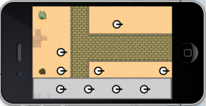

# 如何使用Cocos2d-x来制作一个塔防游戏：第二部分

## 前言

教程截图：

欢迎来到《如何使用cocos2d制作一个塔防游戏》的第二部分--今天，我们将添加代码来放置炮塔。哈哈，放置炮塔，很hgih吧！如果你还没有读过[如何使用Cocos2d-x来制作一个塔防游戏：第一部分](../chapter1/zh.md)，你可能要先看看再继续。

好吧，你从上个教程可能学到了，那个还不是完整真实的游戏--我们需要使之更真实。但是，我们并不需要一个复杂的A*算法，或者DFS/BFS（深度优先和广度优先），或者Best-first算法来查找路径。实际上，我们根本不需要基于tile的地图。但是，为了遵循KISS原则（keep it simple,stupid），我们还是采用tild map的做法。

所以，让我们来看看如何放置炮塔，以及炮塔是怎么工作的----请原谅我的烂枪法。

这里有本教程的[完整源代码](./TowerDefensePart2.zip)

炮塔放置的方式就是，玩家从Game HUD 中点选中一个塔，然后拖动到某个可以放置的位置，然后松手就ok了。塔也有自己的攻击范围，用一个带阴影的圆表示。这个圆会在你点选中Hud中的炮塔的时候显示出来，放置好炮塔之后就消失了，表明不可以再移动了，除非把它卖掉！现在，有意思的部分来了----如果用户把塔拖到沙漠地带，我们就在那个位置显示一个”机关炮“。如果拖到其他地方（比如creep行走的路上面），我们就让它不可以放置，如果松手，塔就会回到hud里面。 

你可以看到，好多地方都有沙子，一个塔可以放置在一个给定的tile上面。我们实现的方式就是两个函数---”tileCoordForPosition“和”addTower“方法。  “tileCoordForPosition” 是一种快速定位给定point是哪个tile的坐标点，而“addTower”函数就是实际放置炮塔的方法。具体实现如下：

	Point TutorialSence::tileCoordForPosition(Point position)
	{
		int x = position.x / this->tileMap->getTileSize().width;
		int y = ((this->tileMap->getMapSize().height * this->tileMap->getTileSize().height) - position.y) / this->tileMap->getTileSize().height;
		return ccp(x, y);
	}

	void TutorialSence::addTower(Point pos)
	{
		DataModel *m = DataModel::getModel();
		Tower *target = NULL ;
		Point towerLoc = this->tileCoordForPosition(pos);
	
		int tileGid = this->background->tileGIDAt(towerLoc);
		Value props = this->tileMap->propertiesForGID(tileGid);
		ValueMap map = props.asValueMap();
	
		int type_int = map.at("buildable").asInt();
		if (1 == type_int) 
		{
			target = MachineGunTower::tower();
			target->setPosition(ccp((towerLoc.x * 32) + 16, this->tileMap->getContentSize().height - (towerLoc.y * 32) - 16));
			this->addChild(target,1);
			target->setTag(1);
			m->towers.pushBack(target);
		}
		else 
		{
			log("Tile Not Buildable");
		}
	}

你可能看到“addTower”方法在我们用户想让他放置在某个位置的时候被调用了---然后我们使用“tileCoordPosition”方法来得到tile位置，并且使用这个位置来得到tile本身。然后查找tile的属性是不是“buildable”的。如果属性值==1，那么就可以放置。相应的，我们就创建一个tower，然后计算一下放置的位置，然后把塔加到层里去。如果属性“buidable”==null或者0的话，那么就什么也不做，只输出一句话。

由于我们刚刚提到了tower类，所以，它的实现非常重要，让我们来看一看：

	#pragma once
	#include "cocos2d.h"
	#include "Creep.h"
	#include "projectile.h"
	
	class Tower: public Sprite 
	{
	public:
		int range;
		Sprite* sprite;
		Creep* target;
		Sprite * selSpriteRange;
		Creep* getClosesTarget();
		CREATE_FUNC(Tower);
	};
	
	class MachineGunTower : public Tower 
	{
	public:
		Projectile* nextProjectile;
		static Tower* tower();
		bool virtual init();
		void towerLogic(float dt);
		void finishFiring();
		void creepMoveFinished(Node* sender);
	};

这是一个非常基础的类---我们定义了炮塔可以攻击的范围，同时还有选中一个炮塔并移动它的时候，会出现的一个虚拟的射程范围精灵。你可能也注意到了，我们还定义了一个MachineGunTower类，它从Tower派生过来的。因为，每一种tower都有一些特殊的属性，所以我们定义不同的类来使得事情变得更加简单，并且更容易管理。基本上，所有的tower都有一些共同的特点，比如射程是多少，杀伤力是多少等。

接下来，看它的实现：

	#include "Tower.h"
	#include "DataModel.h"
	
	Tower* MachineGunTower::tower()
	{
		Tower* tower = Tower::create();
		tower->sprite = Sprite::create("MachineGunTurret.png");
		tower->addChild(tower->sprite, 0);
		tower->range = 200;
		tower->schedule(schedule_selector(towerLogic), 0.2);
		return tower;
	}

	bool MachineGunTower::init()
	{
		if (!Sprite::init()) 
		{
			return false;
		}
		return true;
	}

	Creep* Tower::getClosesTarget()
	{
		Creep *closestCreep = NULL;
		double maxDistant = 99999;
	
		DataModel *m = DataModel::getModel();
	
		for each(Sprite *target in m->targets) 
		{
			Creep *creep = (Creep *)target;
			double curDistance = ccpDistance(this->getPosition(), creep->getPosition());
	
			if (curDistance < maxDistant) {
				closestCreep = creep;
				maxDistant = curDistance;
			}
		}
		if (maxDistant < this->range)
			return closestCreep;
		return NULL;
	}

	void MachineGunTower::towerLogic(float dt)
	{
		this->target = this->getClosesTarget();
	
		if (this->target != NULL) 
		{
			// Rotate player to face shooting direction
			Point shootVector = this->target->getPosition() - this->getPosition();
			float shootAngle = ccpToAngle(shootVector);
			float cocosAngle = CC_RADIANS_TO_DEGREES(-1 * shootAngle);
	
			float rotateSpeed = 0.5 / M_PI;
			float rotateDuration = fabs(shootAngle * rotateSpeed);
	
			this->runAction(Sequence::create(RotateTo::create(rotateDuration,cocosAngle),NULL));
	
			this->runAction(Sequence::create(RotateTo::create(rotateDuration, cocosAngle), CallFunc::create(this, callfunc_selector(MachineGunTower::finishFiring)), NULL));
		}
	}

	void MachineGunTower::finishFiring()
	{
		DataModel *m = DataModel::getModel();
	
		if (this->target != NULL && this->target->curHp > 0 && this->target->curHp < 100)
		{
			this->nextProjectile = Projectile::projectile();
			this->nextProjectile->setPosition(this->getPosition());
	
			this->getParent()->addChild(this->nextProjectile, 1);
			m->projectiles.pushBack(this->nextProjectile);
	
			float delta = 1.0f;
			Point shootVector = -(this->target->getPosition() - this->getPosition());
			Point normalizedShootVector = ccpNormalize(shootVector);
			Point overshotVector = normalizedShootVector * 320;
			Point offscreenPoint = (this->getPosition() - overshotVector);
	
			this->nextProjectile->runAction(Sequence::create(MoveTo::create(delta, offscreenPoint), CallFuncN::create(this, callfuncN_selector(MachineGunTower::creepMoveFinished)), NULL));
	
			this->nextProjectile->setTag(2);
	
			this->nextProjectile = NULL;
	
		}
		
	}

	void MachineGunTower::creepMoveFinished(Node* sender)
	{
		DataModel * m = DataModel::getModel();
		Sprite *sprite = (Sprite *)sender;
		this->getParent()->removeChild(sprite,true);
	
		m->projectiles.eraseObject((Projectile*)sprite);
	}

这里也没太多好说的---只是一个基类，我们甚至不需要实现init方法。因为，我们将在下一个教程中添加一些代码，这里暂时空白，不过并没有关系。我们加载炮塔的图片，同时设置射程，并且创建了一个towerLogic调度器，时间间隔是0.2秒。这样，塔就可以坐在那儿了，但是，这个towerLogic方法还是空的，不过下个教程中，我们将添加一些代码！

现在，你看到了tower的代码，接下来一件比较重要的事，就是向你展示如何实现游戏的hud--它里面包含了可以被选中的tower，而且可以把它们拖到游戏layer中去。这时，我们有两个层被加到场景中去了，下面是gameHud的代码：

	#pragma once
	#include "cocos2d.h"
	
	USING_NS_CC;
	
	class GameHUD: public Layer 
	{
	public:
		Sprite* background;
		Sprite* selSpriteRange;
		Sprite* selSprite;
		Vector<Sprite*> movableSprites;
		static GameHUD* _sharHUD;
		virtual bool init();
		static GameHUD* shareHUD();
		CREATE_FUNC(GameHUD);
		virtual void onEnter();
		bool onTouchBegan(Touch *touch, Event *event);
		void onTouchMoved(Touch *touch, Event *event);
		void onTouchEnded(Touch* touch, Event* event);
	};

这里，我们定义了层的背景图片，selSprite是tower图片的一个拷贝，可以选中它，并在屏幕上拖动。而selSpriteRange是一个射程图片，当我们选中一个塔在屏幕上移动的时候，在塔的周围会有一个圆形的阴影，代表了塔的射程。最后，我们定义了movableSprites数组，它是gameLayer中可以供玩家选取的所有的炮塔图片的集合。

让我们看看gameHud的具体实现吧：

	bool GameHUD::init()
	{
		if (!Layer::init()) 
		{
			return false;
		}
	
		Size winSize = CCDirector::getInstance()->getWinSize();
	
		// Draw the background of the game HUD
		CCTexture2D::setDefaultAlphaPixelFormat(kCCTexture2DPixelFormat_RGB565);
		background = Sprite::create("hud.png");
		background->setScaleX (2);
		background->setAnchorPoint(ccp(0, 0));
		this->addChild(background);
		CCTexture2D::setDefaultAlphaPixelFormat(kCCTexture2DPixelFormat_Default);
	
		// Load the images of the towers we'll have and draw them to the game HUD layer
		Vector<String*> images;
		images.pushBack(StringMake("MachineGunTurret.png"));
		images.pushBack(StringMake("MachineGunTurret.png"));
		images.pushBack(StringMake("MachineGunTurret.png"));
		images.pushBack(StringMake("MachineGunTurret.png"));
		for (int i = 0; i < images.size(); ++i)
		{
			String* image = images.at(i);
			auto *sprite = Sprite::create(image->getCString());
			float offsetFraction = ((float)(i + 1)) / (images.size() + 1);
			sprite->setPosition(ccp(winSize.width*offsetFraction, 35));
			this->addChild(sprite);
			movableSprites.pushBack(sprite);
		}
	
		return true;
	}

我希望代码中那两行注释已经解释清楚所有的一切了。首先，我们为gameLayer加载了一张背景图片，然后我们循环遍历一个图片名字数组，并用这些图片名字创建精灵，然后把这些精灵存到movableSprites数组中去。你可以从Ray的教程中找到一种方法来把四个图片放置到同一行上面。

现在，让我们来处理一下gameLayer的touch事件：

	bool GameHUD::onTouchBegan(Touch *touch, Event *event)
	{
		Point touchLocation = this->convertToWorldSpace(this->convertTouchToNodeSpace(touch));
	
		Sprite * newSprite = NULL;
		for each(Sprite* sprite in this->movableSprites)
		{
			Rect pos_rect = Rect((sprite->getPositionX()-sprite->getContentSize().width/2), (sprite->getPositionY()-sprite->getContentSize().height/2), sprite->getContentSize().width, sprite->getContentSize().height);
			float xMin = pos_rect.getMinX();
			float xMax = pos_rect.getMaxX();
			float yMIn = pos_rect.getMinY();
			float yMax = pos_rect.getMaxY();
			if (pos_rect.containsPoint(touchLocation))
			{
				DataModel *m = DataModel::getModel();
				//m.gestureRecognizer.enabled = NO;
				selSpriteRange = Sprite::create("Range.png");
				selSpriteRange->setScale(4);
				this->addChild(selSpriteRange, -1);
				selSpriteRange->setPosition(sprite->getPosition());
	
				newSprite = Sprite::createWithTexture(sprite->getTexture()); //sprite;
				newSprite->setPosition(sprite->getPosition());
				selSprite = newSprite;
				this->addChild(newSprite);
			}
		}
			
		return true;
	}

上面这段代码做了些什么事呢--首先，遍历“movableSprite”数组，然后使用CCRectContainsPoint方法来判断touchLocation是不是在图片的范围之内。如果是的话，那么就通知Model对象，把gestureRecognizer禁用掉。这个变量是指向  "UIPanGestureRecognizer"的。当我们选中一个炮塔的时候，就存储当前选中的炮塔放到selSprite中，并且加载射程范围图片。这样的话，当你放置一个炮塔，你就知道它能够射击多远了。

	void GameHUD::onTouchMoved(Touch* touch,Event* event) 
	{
		Point touchLocation = this->convertToWorldSpace(this->convertTouchToNodeSpace(touch));
	
		Point oldTouchLocation = touch->getPreviousLocationInView();
		oldTouchLocation = Director::getInstance()->convertToGL(oldTouchLocation);
		oldTouchLocation = this->convertToNodeSpace(oldTouchLocation);
	
		Point translation = ccpSub(touchLocation,oldTouchLocation);
	
		if (selSprite) 
		{
			Point newPos = selSprite->getPosition()+translation;
			selSprite->setPosition(newPos);
			selSpriteRange->setPosition(newPos);
	
			DataModel *m = DataModel::getModel();
			Point touchLocationInGameLayer = m->_gameLayer->convertTouchToNodeSpace(touch);
	
			BOOL isBuildable = m->_gameLayer->canBuildOnTilePosition(touchLocationInGameLayer);
			if (isBuildable) 
			{
				selSprite->setOpacity(200);
			}
			else 
			{
				selSprite->setOpacity(50);
			}
		}
	}

现在，上面的代码可以移动炮塔在屏幕上来回移动，并且可以知道哪些地方可以放塔，哪些地方不可以。这里更有趣的地方是，我添加了 canBuildOnTilePosition方法，它可以帮助我们判断那个地方是否可以放置一个炮塔。

	bool TutorialSence::canBuildOnTilePosition(Point pos)
	{
	 	Point towerLoc = this->tileCoordForPosition(pos);
		int tileGid = this->background->getTileGIDAt(towerLoc);
		Value props = this->tileMap->getPropertiesForGID(tileGid);
		ValueMap map = props.asValueMap();
		int type_int;
		if (map.size() == 0)
		{
			type_int = 0;
		}
		else
		{
			type_int = map.at("buildable").asInt();
		}
	
		if (1 == type_int)
		{
			return true;
		}
		return false;
	}

这里还是采用检查对于位置tile的属性的值，如果是1，则表明可以放置，返回yes。否则就返回no。如果是不可以建筑的，我们就把选中的精灵设置透明度为50，如果是的话，则把透明度设置为200.我们也可以这样，显示红色的圈，则表示不能建筑，如果是绿色的，则表示可以建筑。这个功能留给读者自行添加。

现在回到touchEnd事件处理：
	
	void GameHUD::onTouchEnded(Touch* touch, Event* event)
	{
		Point touchLocation = this->convertTouchToNodeSpace(touch);
		DataModel *m = DataModel::getModel();
	
		if (selSprite) 
		{
			Rect backgroundRect = Rect(background->getPositionX(),
				background->getPositionY(),
				background->getContentSize().width,
			 	background->getContentSize().height);
	
			if (!backgroundRect.containsPoint(touchLocation) && m->_gameLayer->canBuildOnTilePosition(touchLocation))
			{
				Point touchLocationInGameLayer = m->_gameLayer->convertTouchToNodeSpace(touch);
				m->_gameLayer->addTower(touchLocationInGameLayer);
			}
	
			this->removeChild(selSprite,true);
			selSprite = NULL;
			this->removeChild(selSpriteRange,true);
			selSpriteRange = NULL;
		}
	}

这里需要检查的就是，我们可能取消我们的放置操作。如果玩家把tower又放置到hud 背景上，那么就应该把这个选中的精灵和射程图片都清除掉。

我们又一次做到了！现在，我们定义了一个hud层，上面放置了一些炮塔，我们可以从hud里面拖一塔出来，放置在地图中。接下来，我们会把第一部分和第二部分教程合起来，然后添加tower射击的功能。

创建游戏HUD。

显示了把炮塔从一个地方拖到另一个地方。
还有一些内容请参考这个链接：[tile map editor tool!](http://www.mapeditor.org/2011/04/tiled-qt-061-released.html)

仍然有待解决的问题：

1.如何让炮塔开火并杀死creep。
2.如何制作一波一波的creep，如何制作特殊creep。