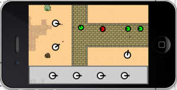

# 如何使用Cocos2d-x来制作一个塔防游戏：第四部分

## 前言

教程截图：

这部分教程，我们将实现我们刚开始所讨论的完整的塔防游戏。这是本系列教程的第四部分，也是最后一部分，在继续阅读之前，建议你先查看前3个教程，可以从[这里](../chapter3/zh.md)开始。

今天，我们将学习到新的东西--“让炮塔开火！”。这是塔防游戏中最重要的组成部分，也是本程序中最有意思的部分。我当然不可能在这个教程中覆盖塔防游戏中所有好玩的东西，但是，我保证我们会在不将的将来创建各式各样的tower。我想，在学习完这个系列教程之后，你自己也可以制作出非常好玩的塔防游戏。我会尽量让代码的robust性更好的！

这里有本教程的[完整源代码](./TowerDefensePart4.zip)。

首先，我们需要做的就是创建实际的子弹（projectile）--projectile类目前有一点点简单，它里面什么也没有，但是，不代表它将来也没有内容。

Projectile.h

	#pragma once
	#include "cocos2d.h"
	
	USING_NS_CC;
	
	class Projectile: public Sprite 
	{
	public:
		static Projectile* projectile();
	};

Projectile.cpp

	#include "Projectile.h"

	Projectile* Projectile::projectile()
	{
		Projectile* projectile = (Projectile*)Sprite::create("Projectile.png");
		if (projectile != NULL)
		{
			return projectile;
		}
		return NULL;
	}

我们现在添加新的方法到update函数中，此函数在TowerScene中。那里面处理当前的子弹和creep的碰撞检测。这个基本的逻辑很简单：

1.遍历所有的projectiles

2.对于每一个projectiles，遍历所有的targets

3.看projectile的边界是否和target的边界有交叉

4.如果交叉了，减少creep的生命值，同时把projectile加到一个即将被删除的数组 
projectilesToDelete里面去

5.如果creep的生命值==0，那么就把它加到targetToDelete数组里面。

具体代码如下：（其实这段代码和Ray的教程《如何使用cocos2d制作一个简单的iphone游戏》里面的忍者发射飞盘一样的）

	void TutorialSence::update(float dt)
	{
		DataModel *m = DataModel::getModel();
		Vector<Projectile*> projectilesToDelete;
	
		for each(Projectile *projectile in m->projectiles) 
		{
			Rect projectileRect = Rect(projectile->getPositionX() - (projectile->getContentSize().width / 2),
				projectile->getPositionY() - (projectile->getContentSize().height / 2),
				projectile->getContentSize().width,
				projectile->getContentSize().height);
	
			Vector<Creep*> targetsToDelete;
	
			for each(Creep *target in m->targets) 
			{
				Rect targetRect = Rect(target->getPositionX() - (target->sprite->getContentSize().width / 2),
					target->getPositionY() - (target->sprite->getContentSize().height / 2),
					target->sprite->getContentSize().width,
					target->sprite->getContentSize().height);
	
				if (projectileRect.intersectsRect(targetRect)) 
				{
					projectilesToDelete.pushBack(projectile);
	
					Creep *creep = target;
					creep->curHp -= 1;
	
					if (creep->curHp <= 0) 
					{
						targetsToDelete.pushBack(creep);
					}
					break;
				}
			}
	
			for each(Creep *target in targetsToDelete)
			{
				m->targets.eraseObject(target);
				this->removeChild(target, true);
			}		
		}
	
		for each(Projectile *projectile in projectilesToDelete)
		{
			m->projectiles.eraseObject(projectile);
			this->removeChild(projectile,true);
		}
	}

最后，我们回到tower代码，看看我们是怎么处理开火机制的。在towerLogic代码里面，我们在RotateTo action之后再添加了一个action，叫做CCCallFunc。它会触发一个finishFiring方法。

this->runAction(Sequence::create(RotateTo::create(rotateDuration, cocosAngle), CallFunc::create(this, callfunc_selector(MachineGunTower::finishFiring)), NULL));

finishFiring只是在我们知道tower朝着正确的方向的时候才开火。它主要是创建一个新的子弹，然后把它加到DataModel的projectile数组中，同时给它一个位置和目的点。

	void MachineGunTower::finishFiring()
	{
		DataModel *m = DataModel::getModel();
	
		if (this->target != NULL && this->target->curHp > 0 && this->target->curHp < 100)
		{
			this->nextProjectile = Projectile::projectile();
			this->nextProjectile->setPosition(this->getPosition());
	
			this->getParent()->addChild(this->nextProjectile, 1);
			m->projectiles.pushBack(this->nextProjectile);
	
			float delta = 1.0f;
			Point shootVector = -(this->target->getPosition() - this->getPosition());
			Point normalizedShootVector = ccpNormalize(shootVector);
			Point overshotVector = normalizedShootVector * 320;
			Point offscreenPoint = (this->getPosition() - overshotVector);
	
			this->nextProjectile->runAction(Sequence::create(MoveTo::create(delta, offscreenPoint), CallFuncN::create(this, callfuncN_selector(MachineGunTower::creepMoveFinished)), NULL));
	
			this->nextProjectile->setTag(2);
	
			this->nextProjectile = NULL;
	
		}
	}

你可以看到上面的代码，我们在projectile上面运行另一个CCMoveTo action，使之朝一个特定的方向移动。这样就会使得看起来是tower在发射子弹，但是，现在默认的距离是320.一旦子弹到达目的地后， "creepMoveFinished"方法就会被调用，它会从DataModel projectile数组中把这个projectile移除掉，并且把它从舞台中剔除。

	void MachineGunTower::creepMoveFinished(Node* sender)
	{
		DataModel * m = DataModel::getModel();
		Sprite *sprite = (Sprite *)sender;
		this->getParent()->removeChild(sprite,true);
	
		m->projectiles.eraseObject((Projectile*)sprite);
	}

恩，就这些了，编译并运行，你现在可以旋转炮塔了，而且它们可以攻击被杀死creep了。很酷吧？其实，我们的工作还没有完成，我们其实还需要添加一些塔的威力，还需要一个买卖系统，同时还要一个波数控制系统（可以控制当前波的速度快慢，总共多少波数等问题）。很多事情要做，不过我们已经上路了。。。

　　继续完善吧！