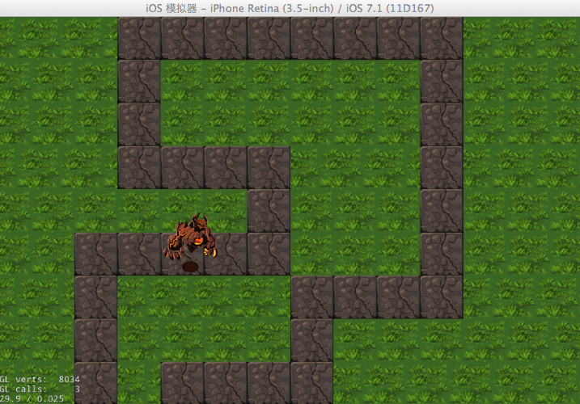

# Cocos2d-x塔防游戏_贼来了1——基础知识储备


## 介绍
塔防是指一类通过在地图上建造炮塔或类似建筑物，以阻止游戏中敌人进攻的策略型游戏。近年来《植物大战僵尸》、《兽人必须死》、《保卫萝卜》等题材五花八门的塔防游戏发展速度可谓迅猛。所以为了成为游戏界的新一代潮人，我们必须紧跟时代的步伐，分享一款基于Cocos2d-x-3.0rc0引擎的标准塔防游戏的制作教程，让你也过把塔防瘾。

你可以先下载第一部分的游戏代码，下载地址：     

运行该部分demo，你将看到一个小偷在指定的地图路线上行走。效果图如下所示：    
    
]      

在本章文章中，我们会先介绍一些简单的基础知识，为塔防开发做个预热，其中包括的内容如下:

- 辅助工具的介绍，帮助你简化和优化Cocos2d-x游戏开发。
- 分辨率适配，使游戏能够很好的支持多屏幕多分辨率的移动设备。
- 创建游戏场景。


## 前期知识储备

为了更好更方便的实现程序中的某些功能，我们往往都会用到一些Cocos2dx引擎配套或支持的编辑器来辅助完成这些模块。如果你没听说过这些编辑器，那你都不好意思说你会Cocos2d游戏开发。尽管这些工具在我之前的教程中已经不厌其烦的讲了好多次了，但是为了照顾一些初学者，下面我们还是先来简单的介绍下，大神可直接绕过本段。

### Tiled Map编辑器

顾名思义，Tiled Map编辑器用于制作地图，可以叫它瓦片地图编辑器。

它制作的地图可保存为TMX格式的文件，可以被Cocos2d-x很好的支持。瓦片地图(Tile Map)不但生成简单，并且可以灵活的用于引擎中。在塔防类游戏中，用它来制作场景地图再适合不过了。

你可以在[官网下载](http://www.mapeditor.org/)该编辑器，不清楚怎么使用的同学可以在网上搜索它的使用教程，你也可以参考[【cocos2d-x官方文档】瓦片地图](http://www.ityran.com/archives/3480)这篇文章。

###TexturePacker

游戏中一般会有比较多的图片资源，如果有很多很多的资源，那加载这些资源是非常费时间和内存的，所以如何高效地使用图片资源对于一款游戏是相当重要的。在cocos2d中，我们一般会将图片资源打包成一张大图，这样加载图片不仅节省了空间，而且还提升了速度。

在cocos2d-x引擎开发中，常又到的两种图片编辑打包工具，即 Zwoptex 和 Texturepacker。我们的教程里用到的是Texturepacker，你可以到它的[官方网站](http://www.codeandweb.com/texturepacker/download)下载并安装。   

Texturepacker工具的每个设置项都给出了相应的提示信息，使用起来非常简单，打包过后你会得到两个文件，其中一个是plist文件，它是图片信息的属性列表文件；另一个则是打包后的图片文件，可以是png,jpg,pvr.ccz等等格式。建议打包为pvr.ccz格式，因为使用这种图片格式的好处有两点：1、可以使你的应用程序更小，因为图片是被压缩过了的。2、你的游戏能够启动地更快。


### 粒子编辑器

Cocos2d-x引擎提供了强大的粒子系统，它在模仿自然现象、物理现象及空间扭曲上具备得天独厚的优势，为我们实现一些真实自然而又带有随机性的特效（如爆炸、烟花、水流）提供了方便。  

常用的粒子编辑器也有两种，一种是ParticleDesigner，另一种是ParticleEditor。尽管ParticleDesigner编辑器要比ParticleEditor美观的多，但就我个人而言，我还是觉得ParticleEditor更好用一些，它比较适合新手。之前我也写过一篇关于[如何使用ParticleEditor编辑器](http://www.ityran.com/archives/5496)相关的文章，大家可以参考一下。

提示：ParticleDesigner不支持Windows系统，所以如果你是Windows系统，最好还是选择使用ParticleEditor吧。


## 分辨率适配

分辨率适配是我们教程中必讲的一块内容，这在我之前的游戏教程中也已经讲过很多次了。虽然Cocos2dx中提供了方便的函数接口供开发者们调用实现分辨率的适配，简单的几句代码就可以搞定一切，但是很多人都没用弄清它的原理，包括之前的我。所以，我强烈的建议大家阅读一下：[Cocos2d-x 多分辨率适配完全解析](http://www.ityran.com/archives/4809)这篇文章，虽然它不是针对最新版Cocos2dx引擎，但它还是能很清楚的告诉你分辨率适配的原理和方法。     

下面是实现分辨率的适配的方法，打开AppDelegate.cpp文件，在applicationDidFinishLaunching方法中添加以下几行代码：

```
glview->setDesignResolutionSize(480.0f, 320.0f, ResolutionPolicy::FIXED_HEIGHT);
std::vector<std::string> searchPath;
searchPath.push_back("height_864");
CCFileUtils::getInstance()->setSearchPaths(searchPath);
director->setContentScaleFactor(864.0f / 320.0f);
```

特别要说明的是，本游戏的地图资源大小为1536 * 864。我们要制作一个高度方向上全部显示的游戏，所以选择分辨率模式为：FIXED_HEIGHT。故此，计算内容缩放因子时的参数为：资源高度 / 屏幕分辨率高度。height_864是搜索的文件夹名。

关于分辨率模式的最新讲解你可以参考[使用Cocos2d-x制作三消类游戏Sushi Crush(第一部分)](http://www.ityran.com/archives/5839)这篇文章的分辨率适配部分。

## 游戏场景

新建一个PlayLayer类，该类将是我们的游戏主场景。打开AppDelegate.cpp文件，在applicationDidFinishLaunching()函数中将它设置为第一个启动的游戏场景：

```
CCScene *pScene = PlayLayer::scene();
pDirector->runWithScene(pScene);
```	

PlayLayer的定义如下：

```
class PlayLayer : public Layer
{
public:
    PlayLayer();
    ~PlayLayer();
    
    virtual bool init() override;
    static Scene* createScene();
    CREATE_FUNC(PlayLayer);

private:
    SpriteBatchNode *spriteSheet;
    TMXTiledMap* map;
    TMXObjectGroup* objects;
    Vector<Node*> pointsVector;
    
    void initPointsVector(float offX);
    void addEnemy();
};
```

在第一部分demo中，我们只需要在PlayLayer场景中加载一幅游戏地图和一个敌人，所以PlayLayer的内容不会很多，后文中我们会详细的介绍它。到此本章的内容就介绍完毕了。

当然本章我们还没有讲解完第一部分demo的全部内容，这里由于篇幅的原因，我们也留在了后面的章节。