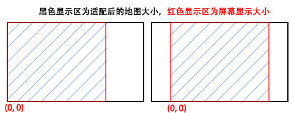
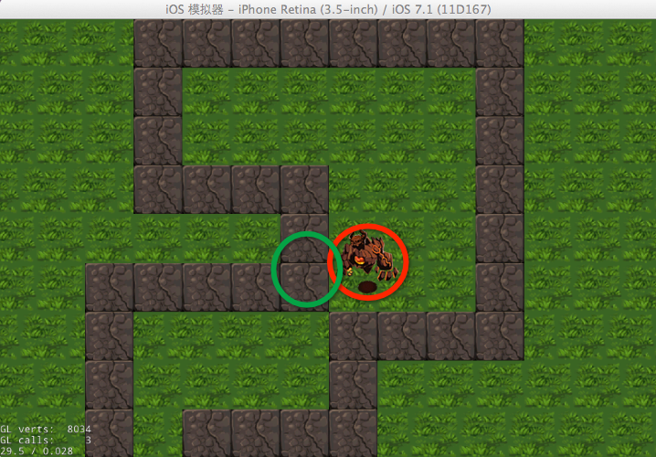
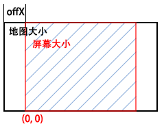

# Cocos2d-x塔防游戏_贼来了2——地图的创建加载

本章我们继续[第一章]()的内容，主要实现地图的创建和加载。在创建地图时，我们会在其上标记出一些点来表示敌人的行进路线，同时会在程序中获取这些标示的路径点对象。在后续的文章中，敌人会一个一个的搜索这些路径点，并依次朝着搜索到的点移动。

## 地图

### 地图的创建
下面我们先来用地图编辑器制做一幅地图，你可以在地图上设置塔防游戏地形的布局，同时为敌人铺设一条行走的道路，让它有路可走。       
这里你可能会想：道路弯弯曲曲的，毫不规则，我怎么知道怎样让敌人沿着它走啦！——这的确是个令人困惑的问题。

不过不用担心，Tiled Map编辑器牛逼的功能就要派上用场了，它支持对象组（ObjectGroups）功能，我们可以在地图上创建一个对象层，用对象来标示敌人移动轨迹的途经点。如下图所示：      
    


创建一幅地图可分为两个步骤：   

1. 创建普通图层“bg”，它是我们的背景层，你可以根据自己的喜好，任意设置地图的布局。
2. 创建对象层“obj”，并添加对象。这里对象就是指图中的小矩形，用这些矩形对象就可以计算敌人的行进路线，它们记录了敌人们移动的顺序和位置坐标。也正因为如此，我们在添加这些对象时是不需要在乎其大小的，注意摆放位置和顺序就行了。这里我们可以为矩形对象添加属性名来标示它的顺序，从0开始，依次增加，Cocos2d-x会为我们创建ValueMap类型的结构来保存相关的数据。打开.txm文件，会更有利于你清楚的理解。如下所示：  
       
```
 <objectgroup name="obj" width="48" height="27">
  <object name="0" x="333" y="861"/>
  <object name="1" x="339" y="497"/>
  <object name="2" x="727" y="494"/>
  <object name="3" x="726" y="306"/>
  <object name="4" x="427" y="303"/>
  <object name="5" x="436" y="54"/>
  <object name="6" x="1106" y="48"/>
  <object name="7" x="1097" y="588"/>
  <object name="8" x="821" y="597"/>
  <object name="9" x="803" y="815"/>
  <object name="10" x="458" y="815"/>
 </objectgroup>
```

### 加载地图到场景
创建好地图后，接下来我们需要把地图加载到场景中去，具体代码在PlayLayer的init方法中实现：

```
// 1
map = TMXTiledMap::create("map1.tmx");
// 2
auto bgLayer = map->getLayer("bg");
bgLayer->setAnchorPoint(Point(0.5f, 0.5f));
bgLayer->setPosition(Point(winSize.width / 2 ,winSize.height / 2));
// 3
objects = map->getObjectGroup("obj");
this->addChild(map, -1);
```

1. 将TMX地图文件加载到游戏中需要用Cocos2dx提供的TMXTiledMap类，直接通过.txm文件就可以创建瓦片地图。
2. Tiled Map编辑器中每一个Layer都可以用TMXLayer类表示，获取地图的层可以通过getLayer("层名")来得到。      
获取背景层以后，我们需要重新设置它的显示位置和锚点。因为按我们前面的分辨率适配方案来看，在默认情况下，如果把地图直接添加到场景中，地图会从屏幕的左下角为起点开始显示，超出屏幕的后半段部分将被裁剪，如下方左图所示状态。      
      
显然地，这是不合理的，地图应该位于屏幕正中，所以我们设置它的显示位置和锚点把它放在正中。另外，`winSize = Director::getInstance()->getWinSize();`  
3. 获取地图的对象组TMXObjectGroup通过getObjectGroup("层名")来得到。
       


### 获取路径点信息
PlayLayer中，我们定义了Node类型的Vector来保存从地图中获取的路径点，之所以用Node表示路径点，那是因为对于路径点这一概念而言，我们只需要知道它的坐标信息就可以了，它不需要有太多的功能，所以Node类型的对象足已。其定义为：`Vector<Node*> pointsVector;`

TMXObjectGroup对象objects中存放了我们需要的所有路径点信息，我们需要遍历objects中所有的对象，把相应的数据值取出来保存在向量pointsVector中。具体方法如下：


```
void PlayLayer::initPointsVector(float offX)
{
    Node *runOfPoint = NULL;
	// 1
	int count = 0;
	ValueMap point;
	point = objects->getObject(std::to_string(count));
	// 2
	while (point.begin()!= point.end())
	{
		// 3
		float x = point.at("x").asFloat();
		float y = point.at("y").asFloat();
		// 4
		runOfPoint = Node::create(); 
		runOfPoint->setPosition(Point(x - offX , y  ));
		this->pointsVector.pushBack(runOfPoint);
		count++;
		point = objects->getObject( std::to_string(count));
	}
	runOfPoint = NULL;
}
```

理解这个方法非常重要，所以让我们一部分一部分代码来看。

1. 调用getObject("对象名")方法获取对象组中的对象，它将返回ValueMap类型的值。     
在TXM中，我们为每一个对象都取了名字，从0开始，按路径顺序依次加1，这里的count就标示了对象的名称。        
ValueMap的定义为：`std::unordered_map<std::string, Value> ValueMap;`
它其实就是键-值对的集合，我们可使用键作为参数来获取某个属性的值。关于Vaule，请参考文章：[Vaule](http://blog.csdn.net/start530/article/details/21651751)。
2. 遍历每一个对象；
3. 获取每个对象的X值，Y值；
4. 创建一个Node来保存路径点，并且设置它的坐标位置，然后把它加到pointsVector向量中去，方便以后查找。          
要注意的是，我们需要修正路径点的坐标值，瓦片地图的背景层我们已经放置到了屏幕正中，但对象层开始显示的位置依旧是从屏幕最左端开始，如果不修正就会造成如下所示的错位状况：      
分辨率适配时，我们选择了FIXED_HEIGHT 模式作为分辨率适配模式，它会纵向放大地图以适应屏幕的高度，横向按原始宽高比放大，所以这里我们只需要修正X轴的坐标就可以了。为了和地图背景层位置保持一致，我们修正X轴坐标把它放在正中。如下图所示：        
      
X轴的偏差值offX为：（地图宽 － 屏幕宽）／2，即：`( map->getContentSize().width - winSize.width )/ 2; ` 

好了，到现在我们已经能成功的在场景中加载地图了，下一章中我们将会继续围绕第一部分demo，讲解如何在场景中添加敌人。