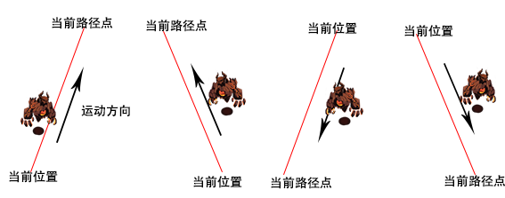

# Cocos2d-x塔防游戏_贼来了3——进攻的敌人

经过前两章的学习，我们已经成功的加载了地图，获得了地图的信息。本章我们主要的任务是在游戏中添加敌人，并让敌人沿着固定的路径行走。

## 敌人
接下来我们来创建进攻的敌人，试想一下，在一款塔防游戏中怎么可能只有一种进攻的敌人啦，如果真是那样，那这款游戏也未免太无聊了。所以为了创建形形色色的敌人类型，这里我们可以先创建一个敌人的基类，这样不管你的游戏中有多少种类的敌人，都可以通过继承这个基类来创建。

关于创建基类，我们还是先来思考下敌人有什么特征。这里我们的敌人它是动态的，会沿着固定的路径点行走，并会根据地形情况改变身体方向。了解了这些特征以后，审时度势，就可以开始我们的工作了。
### 创建敌人基类
这里我们先来创建了一个叫做EnemyBase的基类，下面是其定义：

```
class EnemyBase : public Sprite
{
public:    
    virtual bool init() override;
    CREATE_FUNC(EnemyBase);

    Animation* createAnimation(std::string prefixName, int framesNum, float delay);
    void changeDirection(float dt);
    Node* currPoint();
    Node* nextPoint();
    void runFllowPoint();
    void setPointsVector(Vector<Node*> points);    
private:
    Vector<Node*> pointsVector;
protected:
    int pointCounter;
    Animation *animationRight;
    Animation *animationLeft;
    CC_SYNTHESIZE(float, runSpeed, RunSpeed);    
};
```
在EnemyBase类中，我们定义了敌人的各种属性。包括敌人移动的路径点集，当前移动路径点，移动速度，左右方向动画等等目前为止我们需要的所以信息。

pointsVector属性是为了把敌人和地图数据很好的关联起来，这样我们就可以把从地图中获取的路径点赋值给敌人，然后敌人就可以通过它方便的计算行进路线和方向了。        
这么一来，获得敌人当前所处的路径点和下一个移动点就显得至关重要了，下面来看看它的实现方法：

```
Node* EnemyBase::currPoint()
{
    return this->pointsVector.at(pointCounter);
}

Node* EnemyBase::nextPoint()
{
    int maxCount = this->pointsVector.size();
	pointCounter++;
	if (pointCounter < maxCount  ){
		auto node =this->pointsVector.at(pointCounter);
        return node;
    }
    else{
        pointCounter = maxCount -1 ;
    }
    return NULL;
}
```

你也看到了，其实这并不难，我们通过变量pointCounter的值就能获得它们。当我们想获取下一个移动点的时候，我们就递增pointCounter的值，如果它没有超过pointsVector的最大尺寸，则返回该处的路径点。


### 让敌人动起来
#### 1. 动画
Cocos2dx中，一个动画是由一些精灵帧序列组成的。下面我们就来教你将多张图片打包到一起，并利用打包好的图片生成一个动画。
在此之前先让我们来了解以下几个概念：

- SpriteFrame(精灵帧):包含纹理与纹理中的一个矩形区域，表示纹理的一部分。一个精灵显示的内容就可以用精灵帧表示，同时精灵帧还是帧动画的基本元素。
- SpriteFrameCache（精灵帧缓存类） 用来存储精灵帧，缓存精灵帧有助于提高程序的效率。 SpriteFrameCache是一个单例模式，不属于某个精灵，是所有精灵共享使用的。
- AnimationFrame(动画帧)：由精灵帧与单位延时组成，可以表示变速动画中的一帧。通常，匀速动画的单位延时为1。
- Animation(动画):由动画帧组成，表示一个动画的内容。
- Animate(动画动作): 动画的播放器，使用动画对象创建，只能作用于精灵。为了播放一个动画，通常先创建动画帧或框帧，然后用它们创建动画，最后利用动画创建动画动作，并指派一个精灵来执行此动作。

现在不理解没有关系，我们的代码中将会帮助大家进一步的理解这些概念。

图片打包用上文中提到的TexturePacker工具完成，下面我们来看看创建动画具体怎么实现：

```
Animation* EnemyBase::createAnimation(std::string prefixName, int framesNum, float delay)
{
	// 1
    Vector<SpriteFrame*> animFrames;   
    // 2 
	for (int i = 1; i <= framesNum; i++)
    {
        char buffer[20] = { 0 };
        sprintf(buffer, "_%i.png",  i);
        std::string str =  prefixName + buffer;
        auto frame = SpriteFrameCache::getInstance()->getSpriteFrameByName(str);
        animFrames.pushBack(frame);
    }
    // 3
    return Animation::createWithSpriteFrames(animFrames, delay);
}
```

这里我们定义的createAnimation(prefixName, framesNum, delay)方法中，参数分别表示精灵纹理的前段名称，动画帧数，每帧间隔时间。

1. 创建一个帧缓存Vector向量存储动画的每一帧。
2. 遍历每一帧，通过getSpriteFrameByName（“纹理名”）方法中创建动画的每一帧，同时把它加到 animFrames向量里面去。
3. createWithSpriteFrames方法基于一个精灵帧向量，返回一个Animation对象。


接下来，我们来让我们的动画都起来，下面的方法中，我们不光让我们的敌人动了起来，还会让它在某些位置改变自身的方向：

```
void EnemyBase::changeDirection(float dt)
{
    auto curr = currPoint();
    
    if(curr->getPositionX() > this->getPosition().x )
    {
        runAction( Animate::create(AnimationCache::getInstance()->getAnimation("runright"))) ;
    }else{
        runAction( Animate::create(AnimationCache::getInstance()->getAnimation("runleft"))  );
    }
}
``` 

获取当前敌人所处的路径点，比较当前路径点的x坐标值与实际x坐标值，如果前者更大，则敌人方向朝右，反之朝左。如下图所示：      
       
所以在创建txm地图文件时，我们要特别地根据路径方向创建对象。

#### 2. 按固定路线移动
让敌人能够前进的代码，如下所示：

```
void EnemyBase::runFllowPoint()
{
    auto point = currPoint();
    setPosition(point->getPosition());
    point = nextPoint();   
    if( point!= NULL ){
        runAction(CCSequence::create(MoveTo::create(getRunSpeed(), point->getPosition())
                                        , CallFuncN::create(CC_CALLBACK_0(EnemyBase::runFllowPoint, this))
                                        , NULL));
    }
}
```

基于我们前面所讨论过的，这里面的代码应该比较容易懂。这里，我们对EnemyBase对象使用了３种类型的action： 

- MoveTo: 让敌人从一点移动到另一点，getRunSpeed()是移动过程花费的时间，point->getPosition()是移动地目标位置。
- CallFuncN: 它可以让你为某个执行此action的对象指定一个回调函数，这里我们指定的回调函数是：runFllowPoint本身。所以这个函数就会重复地调用自身，不断地判断计算得到下一个路径点，让敌人MoveTo到那个路径点地位置，其中CC_CALLBACK_0宏是将函数与对象绑定在一起，0表示这个函数有0个参数。
- Sequence: 它允许我们把一系列的action组成一个action序列，并且这些acton可以按顺序执行。一次执行完所有的action。在上面的例子中，我们让对象首先执行MoveTo，等MoveTo完成后，马上就会执行CallFuncN　action。 接下来, 为CallFuncN　action增加一个回调函数。

### 创建敌人子类－小偷
最后，我们来新建一个Thief类，其继承于EnemyBase。

Thief.h定义如下：

```
class Thief : public EnemyBase
{
public:
    virtual bool init() override;    
    static Thief* createThief(Vector<Node*> points);
    
};
```
由于EnemyBase类中已经给出了敌人的各种逻辑方法，所以在Thief中，我们只需要初始化变量，实现具体的方法，就可以实现一个很普通的敌人了。       
下面是小偷的init方法： 

```
bool Thief::init()
{
	if (!Sprite::init())
	{
		return false;
	}
	// 1
    setRunSpeed(6);
    animationRight = createAnimation("enemyRight1", 4, 0.1f);
	AnimationCache::getInstance()->addAnimation(animationRight, "runright");
    animationLeft = createAnimation("enemyLeft1", 4, 0.1f);
	AnimationCache::getInstance()->addAnimation(animationLeft, "runleft");
	// 2
    schedule(schedule_selector(EnemyBase::changeDirection), 0.4f);
	return true;
}
```
1. 初始化小偷的移动速度，左右方向的动画。
2. 调用定时器schedule刷新自定义的changeDirection函数，0.4为刷新间隔时间。只有这样我们的小偷才会动起来，并且在路径点处判断是否反向。

createThief方法是我们创建小偷的接口函数。在场景中，你可以直接调用createThief方法创建一个小偷，参数points是地图上获取的路径点集合。

```
Thief* Thief::createThief(Vector<Node*> points)
{
    Thief *pRet = new Thief();
    if (pRet && pRet->init())
    {
    	// 设置小偷的路径点集
        pRet->setPointsVector(points);
        // 让小偷沿着路径点移动
        pRet->runFllowPoint();
        pRet->autorelease();
        return pRet;
    }
    else
    {
        delete pRet;
        pRet = NULL;
        return NULL;
    }
}
```


现在敌人就创建好了，你还可以添加更多其它不同类型的敌人。为了让我们的教程更简洁，这里我们只添加了Thief这1种。


