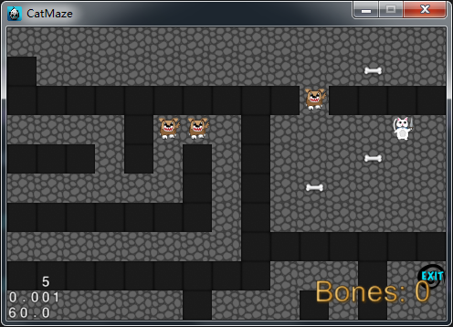
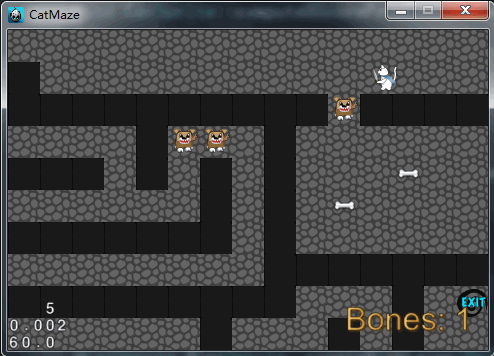
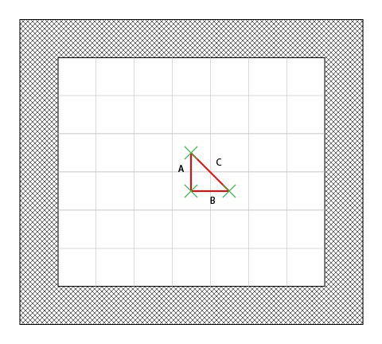
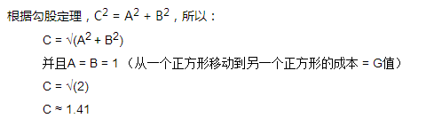
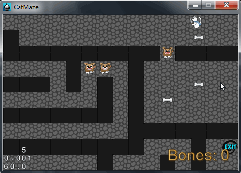

# 如何基于cocos2dx3.x实现A星寻路算法


在学习本篇教程之前，如果你有cocos2d-x的开发经验，将会有所帮助。如果没有也没关系，因为你可以将这里讲解的例子迁移到其他的语言或者框架中。

找到到达你键盘的最短路径，开始吧！

## Maze猫

首先介绍下我们将要在本篇教程中开发的简单游戏。

前往下载本篇教程的[工程代码](./code.zip)。编译运行工程，你将看到以下画面。


在这款游戏中，你扮演着一只小偷猫，在一个由危险的狗守护着的地牢里小心穿行。如果你试图穿过一只狗，他会把你吃掉 – 除非你可以用骨头去贿赂它！

所以在这款游戏中，你的任务是尝试以正确的顺序捡起骨头，然后 寻找路线 穿过狗逃离。

注意到猫只能水平或者垂直的移动（例如不能斜线移动），并且会从一个方块的中心点移动到另一个中心点。每个方块既可以是可通行的也可以是不可通行的。

尝试下这款游戏，看看你能否找到出路！建议你阅读代码以熟悉它的原理。这是一款相当普通的方块-地图式游戏，我们会在接下来的教程中修改它并使用上A星寻路算法。

## Maze猫和A星概览

正如你所看到的，当你点击地图某处时，猫会沿着你点击的方向跳到相邻的方块上。

我们想对程序做修改，让猫持续的往你点击的方块方向前进，就像许多RPGs或者point-and-click冒险类游戏。

让我们看下控制触摸事件代码的工作原理。如果你打开HelloWorldScene.cpp文件，你将看到像下面这样去实现触摸操作：

```
auto listener = EventListenerTouchOneByOne::create();
listener->setSwallowTouches(true);
listener->onTouchBegan = [this](Touch *touch, Event *event){
	if (_gameOver)
 	{
		return false;
	}
	Point touchLocation = _tileMap->convertTouchToNodeSpace(touch);
	_cat->moveToward(touchLocation);
	return true;
};
_eventDispatcher->addEventListenerWithSceneGraphPriority(listener, this);
```

你可以看到这里只是对猫精灵调用了一个方法，让猫在方块地图上往你点击的地方移动。

我们现在要做的是修改在CatSprite.m文件中的以下方法，寻找到达该点的最短路径，并且开始前进：

```
void CatSprite::moveToward(const Point &target)
{
   // Figure out the shortest path to the target, and start following it!
}
```

## 创建ShortestPathStep类

我们开始创建一个内部类，代表路径上的一步操作。在这种情况下，它是一个方块和由A星算法计算出来的的F,G和H scores。

```
class ShortestPathStep : public cocos2d::Object
{
public:
	ShortestPathStep();
	~ShortestPathStep();
	static ShortestPathStep *createWithPosition(const cocos2d::Point &pos);
	bool initWithPosition(const cocos2d::Point &pos);
	int getFScore() const;
	bool isEqual(const ShortestPathStep *other) const;
	std::string getDescription() const;
	CC_SYNTHESIZE(cocos2d::Point, _position, Position);
	CC_SYNTHESIZE(int, _gScore, GScore);
	CC_SYNTHESIZE(int, _hScore, HScore);
	CC_SYNTHESIZE(ShortestPathStep*, _parent, Parent);
};
```

现在添加以下代码到CatSprite.cpp文件的顶部。

```
CatSprite::ShortestPathStep::ShortestPathStep() :
    _position(Point::ZERO),
    _gScore(0),
    _hScore(0),
    _parent(nullptr)
{
}
CatSprite::ShortestPathStep::~ShortestPathStep()
{
}
CatSprite::ShortestPathStep *CatSprite::ShortestPathStep::createWithPosition(const Point &pos)
{
    ShortestPathStep *pRet = new ShortestPathStep();
    if (pRet && pRet->initWithPosition(pos))
    {
        pRet->autorelease();
        return pRet;
    }
    else
    {
        CC_SAFE_DELETE(pRet);
        return nullptr;
    }
}
bool CatSprite::ShortestPathStep::initWithPosition(const Point &pos)
{
    bool bRet = false;
    do
    {
        this->setPosition(pos);
        bRet = true;
    } while (0);
    return bRet;
}
int CatSprite::ShortestPathStep::getFScore() const
{
    return this->getGScore() + this->getHScore();
}
bool CatSprite::ShortestPathStep::isEqual(const CatSprite::ShortestPathStep *other) const
{
    return this->getPosition() == other->getPosition();
}
std::string CatSprite::ShortestPathStep::getDescription() const
{
    return StringUtils::format("pos=[%.0f;%.0f]  g=%d  h=%d  f=%d",
                               this->getPosition().x, this->getPosition().y,
                               this->getGScore(), this->getHScore(), this->getFScore());
}
```

正如所见，这是一个很简单的类，记录了以下内容：

- 方块的坐标
- G值（记住，这是开始点到当前点的方块数量）
- H值（记住，这是当前点到目标点的方块估算数量）
- Parent是它的上一步操作
- F值，这是方块的和值（它是G+H的值）

这里定义了getDescription方法，以方便调试。创建了isEquals方法，当且仅当两个ShortestPathSteps的方块坐标相同时，它们相等（例如它们代表着相同的方块）。

## 创建Open和Closed列表

打开CatSprite.h文件，添加如下代码：

```
cocos2d::Vector<ShortestPathStep*> _spOpenSteps;
cocos2d::Vector<ShortestPathStep*> _spClosedSteps;
```

## 检查开始和结束点

重新实现moveToward方法，获取当前方块坐标和目标方块坐标，然后检查是否需要计算一条路径，最后测试目标方块坐标是否可行走的（在这里只有墙壁是不可行走的）。打开CatSprite.cpp文件，修改moveToward方法，为如下：

```
void CatSprite::moveToward(const Point &target)
{
    Point fromTileCoord = _layer->tileCoordForPosition(this->getPosition());
    Point toTileCoord = _layer->tileCoordForPosition(target);
    if (fromTileCoord == toTileCoord)
    {
        CCLOG("You're already there! :P");
        return;
    }
    if (!_layer->isValidTileCoord(toTileCoord) || _layer->isWallAtTileCoord(toTileCoord))
    {
        SimpleAudioEngine::getInstance()->playEffect("hitWall.wav");
        return;
    }
    CCLOG("From: %f, %f", fromTileCoord.x, fromTileCoord.y);
    CCLOG("To: %f, %f", toTileCoord.x, toTileCoord.y);
}
```

编译运行，在地图上进行点击，如果不是点击到墙壁的话，可以在控制台看到如下信息：

```
From: 24.000000, 0.000000
To: 20.000000, 0.000000
```

其中 **From** 就是猫的方块坐标，**To**就是所点击的方块坐标。

## 实现A星算法

根据算法，第一步是添加当前坐标到open列表。还需要三个辅助方法：

- 一个方法用来插入一个ShortestPathStep对象到适当的位置（有序的F值）
- 一个方法用来计算从一个方块到相邻方块的移动数值
- 一个方法是根据"曼哈顿距离"算法，计算方块的H值

打开CatSprite.cpp文件，添加如下方法：

```
void CatSprite::insertInOpenSteps(CatSprite::ShortestPathStep *step)
{
    int stepFScore = step->getFScore();
    ssize_t count = _spOpenSteps.size();
    ssize_t i = 0;
    for (; i < count; ++i)
    {
        if (stepFScore <= _spOpenSteps.at(i)->getFScore())
        {
            break;
        }
    }
    _spOpenSteps.insert(i, step);
}
int CatSprite::computeHScoreFromCoordToCoord(const Point &fromCoord, const Point &toCoord)
{
    // 这里使用曼哈顿方法，计算从当前步骤到达目标步骤，在水平和垂直方向总的步数
    // 忽略了可能在路上的各种障碍
    return abs(toCoord.x - fromCoord.x) + abs(toCoord.y - fromCoord.y);
}
int CatSprite::costToMoveFromStepToAdjacentStep(const ShortestPathStep *fromStep, const ShortestPathStep *toStep)
{
    // 因为不能斜着走，而且由于地形就是可行走和不可行走的成本都是一样的
    // 如果能够对角移动，或者有沼泽、山丘等等，那么它必须是不同的
    return 1;
}
```

接下来，需要一个方法去获取给定方块的所有相邻可行走方块。因为在这个游戏中，HelloWorld管理着地图，所以在那里添加方法。打开HelloWorldScene.cpp文件，添加如下方法：

```
PointArray *HelloWorld::walkableAdjacentTilesCoordForTileCoord(const Point &tileCoord) const
{
    PointArray *tmp = PointArray::create(4);
    // 上
    Point p(tileCoord.x, tileCoord.y - 1);
    if (this->isValidTileCoord(p) && !this->isWallAtTileCoord(p))
    {
        tmp->addControlPoint(p);
    }
    // 左
    p.setPoint(tileCoord.x - 1, tileCoord.y);
    if (this->isValidTileCoord(p) && !this->isWallAtTileCoord(p))
    {
        tmp->addControlPoint(p);
    }
    // 下
    p.setPoint(tileCoord.x, tileCoord.y + 1);
    if (this->isValidTileCoord(p) && !this->isWallAtTileCoord(p))
    {
        tmp->addControlPoint(p);
    }
    // 右
    p.setPoint(tileCoord.x + 1, tileCoord.y);
    if (this->isValidTileCoord(p) && !this->isWallAtTileCoord(p))
    {
        tmp->addControlPoint(p);
    }
    return tmp;
}
```

可以继续CatSprite.cpp中的moveToward方法了，在moveToward方法的后面，添加如下代码：

```
bool pathFound = false;
_spOpenSteps.clear();
_spClosedSteps.clear();
// 首先，添加猫的方块坐标到open列表
this->insertInOpenSteps(ShortestPathStep::createWithPosition(fromTileCoord));
do
{
    // 得到最小的F值步骤
    // 因为是有序列表，第一个步骤总是最小的F值
    ShortestPathStep *currentStep = _spOpenSteps.at(0);
    // 添加当前步骤到closed列表
    _spClosedSteps.pushBack(currentStep);
    // 将它从open列表里面移除
    // 需要注意的是，如果想要先从open列表里面移除，应小心对象的内存
    _spOpenSteps.erase(0);
    // 如果当前步骤是目标方块坐标，那么就完成了
    if (currentStep->getPosition() == toTileCoord)
    {
        pathFound = true;
        ShortestPathStep *tmpStep = currentStep;
        CCLOG("PATH FOUND :");
        do
        {
            CCLOG("%s", tmpStep->getDescription().c_str());
            tmpStep = tmpStep->getParent(); // 倒退
        } while (tmpStep);                  // 直到没有上一步
        _spOpenSteps.clear();
        _spClosedSteps.clear();
        break;
    }
    // 得到当前步骤的相邻方块坐标
    PointArray *adjSteps = _layer->walkableAdjacentTilesCoordForTileCoord(currentStep->getPosition());
    for (ssize_t i = 0; i < adjSteps->count(); ++i)
    {
        ShortestPathStep *step = ShortestPathStep::createWithPosition(adjSteps->getControlPointAtIndex(i));
        // 检查步骤是不是已经在closed列表
        if (this->getStepIndex(_spClosedSteps, step) != -1)
        {
            continue;
        }
        // 计算从当前步骤到此步骤的成本
        int moveCost = this->costToMoveFromStepToAdjacentStep(currentStep, step);
        // 检查此步骤是否已经在open列表
        ssize_t index = this->getStepIndex(_spOpenSteps, step);
        // 不在open列表，添加它
        if (index == -1)
        {
            // 设置当前步骤作为上一步操作
            step->setParent(currentStep);
            // G值等同于上一步的G值 + 从上一步到这里的成本
            step->setGScore(currentStep->getGScore() + moveCost);
            // H值即是从此步骤到目标方块坐标的移动量估算值
            step->setHScore(this->computeHScoreFromCoordToCoord(step->getPosition(), toTileCoord));
            // 按序添加到open列表
            this->insertInOpenSteps(step);
        }
        else
        {
            // 获取旧的步骤，其值已经计算过
            step = _spOpenSteps.at(index);
            // 检查G值是否低于当前步骤到此步骤的值
            if ((currentStep->getGScore() + moveCost) < step->getGScore())
            {
                // G值等同于上一步的G值 + 从上一步到这里的成本
                step->setGScore(currentStep->getGScore() + moveCost);
                // 因为G值改变了，F值也会跟着改变
                // 所以为了保持open列表有序，需要将此步骤移除，再重新按序插入
                // 在移除之前，需要先保持引用
                step->retain();
                // 现在可以放心移除，不用担心被释放
                _spOpenSteps.erase(index);
                // 重新按序插入
                this->insertInOpenSteps(step);
                // 现在可以释放它了，因为open列表应该持有它
                step->release();
            }
        }
    }
} while (_spOpenSteps.size() > 0);
if (!pathFound)
{
    SimpleAudioEngine::getInstance()->playEffect("hitWall.wav");
}
```

添加以下方法：

```
ssize_t CatSprite::getStepIndex(const cocos2d::Vector<CatSprite::ShortestPathStep *> &steps, const CatSprite::ShortestPathStep *step)
{
    for (ssize_t i = 0; i < steps.size(); ++i)
    {
        if (steps.at(i)->isEqual(step))
        {
            return i;
        }
    }
    return -1;
}
```

编译运行，在地图上进行点击，如下图所示：


```
From: 24.000000, 0.000000
To: 23.000000, 3.000000
PATH FOUND :
pos=[23;3]  g=10  h=0  f=10
pos=[22;3]  g=9  h=1  f=10
pos=[21;3]  g=8  h=2  f=10
pos=[20;3]  g=7  h=3  f=10
pos=[20;2]  g=6  h=4  f=10
pos=[20;1]  g=5  h=5  f=10
pos=[21;1]  g=4  h=4  f=8
pos=[22;1]  g=3  h=3  f=6
pos=[23;1]  g=2  h=2  f=4
pos=[24;1]  g=1  h=3  f=4
pos=[24;0]  g=0  h=0  f=0
```

注意该路径是从后面建立的，所以必须从下往上看猫选择了哪条路径。

## 跟随路径前进。

现在已经找到了路径，只需让猫跟随前进即可。需要创建一个数组去存储路径，打开CatSprite.h文件，添加如下代码：

```
cocos2d::Vector<ShortestPathStep*> _shortestPath;
```

打开CatSprite.cpp文件，更改moveToward方法，注释掉语句**bool pathFound = false**;，如下：

```
//bool pathFound = false;
```

替换语句**pathFound = true;**为如下：

```
//pathFound = true;
this->constructPathAndStartAnimationFromStep(currentStep);
```

并且注释掉下方的调试语句：

```
//ShortestPathStep *tmpStep = currentStep;
//CCLOG("PATH FOUND :");
//do
//{
//    CCLOG("%s", tmpStep->getDescription().c_str());
//    tmpStep = tmpStep->getParent(); // 倒退
//} while (tmpStep);                  // 直到没有上一步
```

替换语句**if (!pathFound)**为如下：

```
//if (!pathFound)
if (_shortestPath.empty())
```

现在创建一个方法，用来存储整个路径，并且负责动画的播放。添加方法如下：

```
void CatSprite::constructPathAndStartAnimationFromStep(CatSprite::ShortestPathStep *step)
{
    _shortestPath.clear();
    do
    {
        // 起始位置不要进行添加
        if (step->getParent())
        {
            // 总是插入到索引0的位置，以便反转路径
            _shortestPath.insert(0, step);
        }
        step = step->getParent();   // 倒退
    } while (step);                 // 直到没有上一步
    for (const ShortestPathStep *s : _shortestPath)
    {
        CCLOG("%s", s->getDescription().c_str());
    }
}
```

编译运行，点击，就可以在控制台看到如下信息：

```
From: 24.000000, 0.000000
To: 24.000000, 3.000000
pos=[24;1]  g=1  h=2  f=3
pos=[23;1]  g=2  h=3  f=5
pos=[22;1]  g=3  h=4  f=7
pos=[21;1]  g=4  h=5  f=9
pos=[20;1]  g=5  h=6  f=11
pos=[20;2]  g=6  h=5  f=11
pos=[20;3]  g=7  h=4  f=11
pos=[21;3]  g=8  h=3  f=11
pos=[22;3]  g=9  h=2  f=11
pos=[23;3]  g=10  h=1  f=11
pos=[24;3]  g=11  h=0  f=11
```

这些信息跟之前的很类似，除了它是从开始到结束，而不是相反的，并且步骤都被很好的存储在数组中以供使用。最后要做的是遍历shortestPath数组，让猫沿着路径动画前进。为了实现这一点，创建一个方法，从数组中获取步骤，让猫移动到那个位置，然后添加一个回调函数去重复调用这个方法直到路径完成。添加方法如下：

```
void CatSprite::popStepAndAnimate()
{
    // 检查是否仍有路径步骤需要前进
    if (_shortestPath.size() == 0)
    {
        return;
    }
    // 得到下一步移动的步骤
    ShortestPathStep *s = _shortestPath.at(0);
    // 准备动作和回调
    MoveTo *moveAction = MoveTo::create(0.4f, _layer->positionForTileCoord(s->getPosition()));
    CallFunc *moveCallback = CallFunc::create(CC_CALLBACK_0(CatSprite::popStepAndAnimate, this));
    // 移除步骤
    _shortestPath.erase(0);
    // 运行动作
    this->runAction(Sequence::create(moveAction, moveCallback, nullptr));
}
```

在constructPathAndStartAnimationFromStep方法里的最下面添加如下代码：

```
this->popStepAndAnimate();
```

编译运行，点击地面，可以看到猫自动移动到所点击的位置了。如下图所示：



然而，会发现到以下问题：

- 猫看起来有点僵硬
- 猫没有带走骨头
- 猫可以穿过狗（没有带着骨头），而不被吃掉
- 当在猫走完路径之前，点击了一个新的路径的话，猫会有奇怪的行为

因此，为了解决猫的僵硬行为，还有游戏逻辑（胜利/失败，狗，骨头，等等......），必须加上之前实现的旧游戏逻辑。

## 重新添加游戏逻辑

为了修复这些问题，替换popStepAndAnimate方法为如下：

```
void CatSprite::popStepAndAnimate()
{
    Point currentPosition = _layer->tileCoordForPosition(this->getPosition());

    if (_layer->isBoneAtTilecoord(currentPosition))
    {
        SimpleAudioEngine::getInstance()->playEffect("pickup.wav");
        _numBones++;
        _layer->showNumBones(_numBones);
        _layer->removeObjectAtTileCoord(currentPosition);
    }
    else if (_layer->isDogAtTilecoord(currentPosition))
    {
        if (_numBones == 0)
        {
            _layer->loseGame();
            return;
        }
        else
        {
            _numBones--;
            _layer->showNumBones(_numBones);
            _layer->removeObjectAtTileCoord(currentPosition);
            SimpleAudioEngine::getInstance()->playEffect("catAttack.wav");
        }
    }
    else if (_layer->isExitAtTilecoord(currentPosition))
    {
        _layer->winGame();
        return;
    }
    else
    {
        SimpleAudioEngine::getInstance()->playEffect("step.wav");
    }
    // 检查是否仍有路径步骤需要前进
    if (_shortestPath.size() == 0)
    {
        return;
    }
    // 得到下一步移动的步骤
    ShortestPathStep *s = _shortestPath.at(0);
    Point futurePosition = s->getPosition();
    Point diff = futurePosition - currentPosition;
    if (abs(diff.x) > abs(diff.y))
    {
        if (diff.x > 0)
        {
            this->runAnimation(_facingRightAnimation);
        }
        else
        {
            this->runAnimation(_facingLeftAnimation);
        }
    }
    else
    {
        if (diff.y > 0)
        {
            this->runAnimation(_facingForwardAnimation);
        }
        else
        {
            this->runAnimation(_facingBackAnimation);
        }
    }
    // 准备动作和回调
    MoveTo *moveAction = MoveTo::create(0.4f, _layer->positionForTileCoord(s->getPosition()));
    CallFunc *moveCallback = CallFunc::create(CC_CALLBACK_0(CatSprite::popStepAndAnimate, this));
    // 移除步骤
    _shortestPath.erase(0);
    // 运行动作
    Sequence *moveSequence = Sequence::create(moveAction, moveCallback, nullptr);
    moveSequence->setTag(1);
    this->runAction(moveSequence);
}
```

这里只是对原来的代码进行重构。接着在moveToward方法里面的最上面添加如下代码：

```
this->stopActionByTag(1);
```

编译运行，可以看到一切正常了，如下图所示：



## 如何实现对角线移动

在A星算法中实现对角线移动十分简单，只需要更改以下两个方法：

- walkableAdjacentTilesCoordForTileCoord：更改以便包括对角线方块
- costToMoveFromStepToAdjacentStep：更改以让对角线移动跟水平/垂直移动有不一样的成本

如何计算出在对角线方向上的成本值？使用简单的数学即可。猫从一个方块的中心移动到另一个方块的中心，并且因为方块是正方形，A、B和C形成了一个三角形，如下图所示：





所以对角线的移动成本等于1.41，这低于向左移动再向上移动的成本值2（1+1）。正如所知的，使用整型计算远比浮点型更高效，所以不是使用浮点型来标示对角线移动的成本值，而是简单地对成本值乘以10，然后四舍五入，所以水平/垂直移动的成本值为10，而对角线移动的成本值为14。更改costToMoveFromStepToAdjacentStep方法为如下:

```
int CatSprite::costToMoveFromStepToAdjacentStep(const ShortestPathStep *fromStep, const ShortestPathStep *toStep)
{
    return ((fromStep->getPosition().x != toStep->getPosition().x)
            && (fromStep->getPosition().y != toStep->getPosition().y)) ? 14 : 10;
}
```

更改walkableAdjacentTilesCoordForTileCoord方法为如下：

```
PointArray *HelloWorld::walkableAdjacentTilesCoordForTileCoord(const Point &tileCoord) const
{
    PointArray *tmp = PointArray::create(8);
    bool t = false;
    bool l = false;
    bool b = false;
    bool r = false;
    // 上
    Point p(tileCoord.x, tileCoord.y - 1);
    if (this->isValidTileCoord(p) && !this->isWallAtTileCoord(p))
    {
        tmp->addControlPoint(p);
        t = true;
    }
    // 左
    p.setPoint(tileCoord.x - 1, tileCoord.y);
    if (this->isValidTileCoord(p) && !this->isWallAtTileCoord(p))
    {
        tmp->addControlPoint(p);
        l = true;
    }
    // 下
    p.setPoint(tileCoord.x, tileCoord.y + 1);
    if (this->isValidTileCoord(p) && !this->isWallAtTileCoord(p))
    {
        tmp->addControlPoint(p);
        b = true;
    }
    // 右
    p.setPoint(tileCoord.x + 1, tileCoord.y);
    if (this->isValidTileCoord(p) && !this->isWallAtTileCoord(p))
    {
        tmp->addControlPoint(p);
        r = true;
    }
    // 左上
    p.setPoint(tileCoord.x - 1, tileCoord.y - 1);
    if (t && l && this->isValidTileCoord(p) && !this->isWallAtTileCoord(p))
    {
        tmp->addControlPoint(p);
    }
    // 左下
    p.setPoint(tileCoord.x - 1, tileCoord.y + 1);
    if (b && l && this->isValidTileCoord(p) && !this->isWallAtTileCoord(p))
    {
        tmp->addControlPoint(p);
    }
    // 右上
    p.setPoint(tileCoord.x + 1, tileCoord.y - 1);
    if (t && r && this->isValidTileCoord(p) && !this->isWallAtTileCoord(p))
    {
        tmp->addControlPoint(p);
    }
    // 右下
    p.setPoint(tileCoord.x + 1, tileCoord.y + 1);
    if (b && r && this->isValidTileCoord(p) && !this->isWallAtTileCoord(p))
    {
        tmp->addControlPoint(p);
    }
    return tmp;
}
```

重要提示：添加对角线方块的代码和添加水平/垂直方块的代码有些不同。事实上，例如，只有当顶部和左侧的方块被添加时，左上对角线才能够被添加。这是为了防止猫穿过墙壁的角落。以下是所有的详细情况处理：

- O = Origin
- T = Top
- B = Bottom
- L = Left
- R = Right
- TL = Top – Left
- …


就拿上面图像的左上部分来进行举例。猫想要从原始点（O）到左下对角线方块（BL）。如果在左侧或者底部（或者都有）有一面墙，然后尝试走对角线，算法将会封掉墙壁的角落（或者两面墙壁的角落）。所以只有当左侧和底部没有墙壁时，左下对角线方块才可行走。如下图所示：



完整源码请下载[CatMazeStarter](CatMazeStarter.zip)。
##引用：
本文改编自iOS Tutorial Team的成员[Johann Fradj](http://www.raywenderlich.com/about#johannfradj)的文章[如何使用coocs2d-x 3.x中实现A*寻路算法](http://www.ityran.com/archives/2200)。以及博主[无幻](http://blog.csdn.net/akof1314/article/details/19333255#comments)的部分资源。
