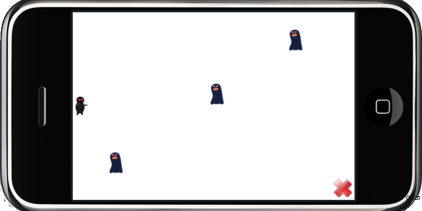
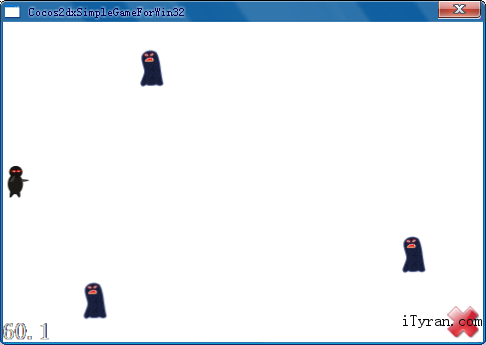

我们已经在[Chapter 2 – How to Add a sprite](http://www.cocos2d-x.org/projects/cocos2d-x/wiki/Chapter_2_-_How_to_Add_a_sprite)场景中添加了一个英雄。但是这个英雄有点孤独，所以我们要添加一些敌人来给英雄练级。下面的void addTarget()函数将会完成这个工作，敌人们被从右往左随机速度地添加进场景中。

在HelloWorldScene.h中添加void addTarget()声明，然后将以下代码添加进HelloWorldScene.cpp。（不要忘了在HelloWorldScene.cpp开头添加using namespace cocos2d）

一如既往的C++与objc代码：

	// cpp with Cocos2d-xvoid HelloWorld::addTarget()
	
	{
	
	CCSprite *target = CCSprite::create(“Target.png”,
	
	CCRectMake(0,0,27,) );
	
	    // Determine where to spawn the target along the Y axis 
	
	CCSize winSize = CCDirector::sharedDirector()->getWinSize();
	
	int minY = target->getContentSize().height/2;
	
	int maxY = winSize.height-target->getContentSize().height/2;
	
	int rangeY = maxY – minY;
	
	// srand( TimGetTicks() );
	
	int actualY = ( rand() % rangeY ) + minY;
	
	   // Create the target slightly off-screen along the right edge,
	
	// and along a random position along the Y axis as calculated
	
	target->setPosition(
	
	ccp(winSize.width + (target->getContentSize().width/2),
	
	actualY) );
	
	this->addChild(target);
	
	 // Determine speed of the target
	
	int minDuration = (int)2.0;
	
	int maxDuration = (int)4.0;
	
	int rangeDuration = maxDuration – minDuration;
	
	// srand( TimGetTicks() );
	
	int actualDuration = ( rand() % rangeDuration ) + minDuration;
	
	  // Create the actions
	
	CCFiniteTimeAction* actionMove =
	
	CCMoveTo::create( (float)actualDuration,
	
	ccp(0 – target->getContentSize().width/2, actualY) );
	
	CCFiniteTimeAction* actionMoveDone =
	
	CCCallFuncN::create( this,callfuncN_selector(HelloWorld::spriteMoveFinished));
	
	target->runAction( CCSequence::create(actionMove,actionMoveDone, NULL) );
	
	}
	 // objc with Cocos2d-iphone-(void)addTarget
	
	{
	
	CCSprite *target = [CCSprite spriteWithFile:@"Target.png" rect:CGRectMake(0, 0, 27, )]; 
	
	// Determine where to spawn the target along the Y axis 
	
	CGSize winSize = [[CCDirector sharedDirector] winSize];
	
	int minY = target.contentSize.height/2;
	
	int maxY = winSize.height – target.contentSize.height/2;
	
	int rangeY = maxY – minY;
	
	 int actualY = (arc4random() % rangeY) + minY;
	
	// Create the target slightly off-screen along the right edge,
	
	// and along a random position along the Y axis as calculated
	
	target.position = ccp(winSize.width + (target.contentSize.width/2),    actualY);
	
	[self addChild:target];
	
	 // Determine speed of the target
	
	int minDuration = 2.0;
	
	int maxDuration = 4.0;
	
	int rangeDuration = maxDuration – minDuration;
	
	 int actualDuration = (arc4random() % rangeDuration)  + minDuration;
	
	 // Create the actions
	
	id actionMove = [CCMoveTo actionWithDuration:actualDuration position:ccp(-target.contentSize.width/2, actualY)];
	
	id actionMoveDone = [CCCallFuncN actionWithTarget:self                selector:@selector(spriteMoveFinished:)];
	
	[target runAction:[CCSequence actions:actionMove,
	
	actionMoveDone, nil]];
	
	}
 

这里，callfuncN_selector(HelloWorld::spriteMoveFinished)回调的spriteMoveFinished()函数，我们需要在HelloWorldScene.h中声明它，并在.cpp中定义如下：

	// cpp with Cocos2d-xvoid HelloWorld::spriteMoveFinished(CCNode* sender)
	
	{
	
	CCSprite *sprite = (CCSprite *)sender;
	
	this->removeChild(sprite, true);
	
	}
	 // objc with Cocos2d-iphone-(void)spriteMoveFinished:(id)sender
	
	{
	
	CCSprite *sprite = (CCSprite *)sender;
	
	[self removeChild:sprite cleanup:YES];
	
	}
 

注意：

1.关于rand函数，srand和rand都是C标准函数。对于任何一个开发平台，你可以花费极少的系统时间就能获取到一个随机数。在iPhone平台，你可以通过使用arc4random()来直接获取到一个随机数。

2.在objc中的“YES”“NO”对应在cpp中是“true”“false”。

3.objc中的回调函数selector:@selector(spriteMoveFinished)，在cpp中实现起来有点复杂。你可以参考cocos2dx\include\selector_protocol.h，里面有5个不同的回调类型：

- schedule_selector
- callfunc_selector
- callfuncN_selector
- callfuncND_selector
- menu_selector

在使用他们时需要根据回调函数的定义。例如：当使用CCTimer::initWithTarget函数（这个函数第二个参数是SEL_SCHEDULE的类型）时，我们可以在selector_protocol.h中找到它的宏定义schedule_selector(_SELECTOR)，然后我们声明一个回调函数void MyClass::MyCallbackFuncName(float)，修改它的第二个参数CCTimer::initWithTarget。

	// cpp with Cocos2d-x// Call game logic about every second
	
	this->schedule( schedule_selector(HelloWorld::gameLogic), 1.0 );
	 // objc with Cocos2d-iphone// Call game logic about every second
	
	[self schedule:@selector(gameLogic:) interval:1.0];
 

HelloWorldScene.cpp中的实现。注意gameLogic()需要使用public来修饰，否则它将无法被调用。

	// cpp with Cocos2d-xvoid HelloWorld::gameLogic(float dt)
	
	{
	
	this->addTarget();
	
	}
	 // objc with Cocos2d-iphone-(void)gameLogic:(float)dt
	
	{
	
	[self addTarget];
	
	}
 

好了，编译运行，享受你的果实吧。

iPhone 

 Android

 Win32

