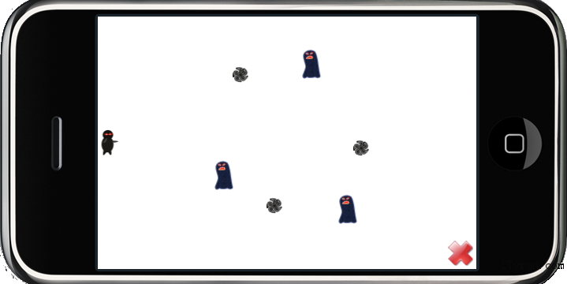

 现在，我们想要让英雄发射一些子弹来杀死那些怪物。添加下面的代码来设置layer的触摸。

	// cpp with Cocos2d-x
	 this->setTouchEnabled(true);
	 or this->setIsTouchEnabled(true); // objc with Cocos2d-iphone
	 self.isTouchEnabled = YES; 

现在我们可以获得触摸事件了。

 在HelloWorldScene.h中声明

	void ccTouchesEnded(cocos2d::CCSet* touches, cocos2d::CCEvent* event);

回调函数，并在.cpp中实现它。

	// cpp with Cocos2d-x
	void HelloWorld::ccTouchesEnded(CCSet* touches, CCEvent* event)
	{
		// Choose one of the touches to work with
		CCTouch* touch = (CCTouch*)( touches->anyObject() );
		CCPoint location = touch->locationInView();
		location = CCDirector::sharedDirector()->convertToGL(location);
	 
		// Set up initial location of projectile
		CCSize winSize = CCDirector::sharedDirector()->getWinSize();
		CCSprite *projectile = CCSprite::create("Projectile.png", 
			CCRectMake(0, 0, 20, 20));
		projectile->setPosition( ccp(20, winSize.height/2) );
	 
		// Determinie offset of location to projectile
		int offX = location.x - projectile->getPosition().x;
		int offY = location.y - projectile->getPosition().y;
	 
		// Bail out if we are shooting down or backwards
		if (offX <= 0) return;
	 
		// Ok to add now - we've double checked position
		this->addChild(projectile);
	 
		// Determine where we wish to shoot the projectile to
		int realX = winSize.width + (projectile->getContentSize().width/2);
		float ratio = (float)offY / (float)offX;
		int realY = (realX * ratio) + projectile->getPosition().y;
		CCPoint realDest = ccp(realX, realY);
	 
		// Determine the length of how far we're shooting
		int offRealX = realX - projectile->getPosition().x;
		int offRealY = realY - projectile->getPosition().y;
		float length = sqrtf((offRealX * offRealX) 
	                                        + (offRealY*offRealY));
		float velocity = 480/1; // 480pixels/1sec
		float realMoveDuration = length/velocity;
	 
		// Move projectile to actual endpoint
		projectile->runAction( CCSequence::create(
			CCMoveTo::create(realMoveDuration, realDest),
			CCCallFuncN::create(this, 
	 
			callfuncN_selector(HelloWorld::spriteMoveFinished)), 
		NULL) );
	}

好了，编译运行，触摸屏幕，享受吧！
PS：代码上为了跟Object-C保持一致，上述代码会有诸如‘float’转成‘int’的警告，不要在意它们。

Win32 截图

iPhone  截图

Android  截图

