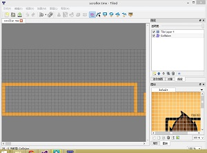

# 使用cocos2d-x3.0和物理引擎制作滚动背景

## 前言

本次教程的内容主要是如何使用cocos2d-x3.0的物理引擎接口来制作一个滚动背景，同时把视角固定在玩家身上。在游戏画面中，玩家几乎总是固定在屏幕的某个地方，但是，背景在移动。所以，你看起来好像就是玩家在游戏世界里面以第一视角在走一样。

如果您对cocos2d-x3.0的新物理引擎接口的一些基础知识还不了解的话，建议您先看[基础教程](http://www.ityran.com/archives/5531)。

对于这个简单的教程，我将使用Tile Map编辑器来做（因为超级玛利的关卡也是使用TileMap制作的）。如果你对于如何下载和使用TiledMap编辑器不熟悉的话，建议你先看我翻译的关于[TiledMap的教程](http://www.cnblogs.com/andyque/archive/2011/04/11/2012852.html)。上图中可以看出，我要制作的地图有2个层。一个是地图层，另外一个是对象层，对象层里面定义了一些对象，用来处理碰撞检测。在这个教程中，我只是简单地画了两个矩形盒子。而本游戏中的地图层完全是空的，没有任何地图信息，大家可以用我提供的超级玛利的图片资源来画一关。然后，在代码里面，我将把对象层里面的对象的位置信息读出来，然后创建相应的物理对象。下面是添加tiledMap的代码：

	void HelloWorld::addScrollingBackgroundWithTileMap()
	{
		tileMapNode = TMXTiledMap::create("scroller.tmx");
		tileMapNode->setAnchorPoint(Point(0, 0));
		this->addChild(tileMapNode);
	}

上面的代码加载“scroller.tmx”，然后把它加载到当前层中，注意要把“scroller.tmx”添加到resource目录下去。如果你去查看TMXTiledMap的源码的话，你会看到，那些tiles实际上都被创建成了Sprite对象。接下来的代码是根据对象层中的对象来创建物理对象。

	void HelloWorld::drawCollisionTiles()
	{
		TMXObjectGroup *objects = tileMapNode->objectGroupNamed("Collision");
	
		float x, y, w, h;
		ValueVector objectsPoint = objects->getObjects();
		Value objPointMap;
		for each(objPointMap in objectsPoint)
		{
			ValueMap objPoint = objPointMap.asValueMap();
			x = objPoint.at("x").asFloat();
			y = objPoint.at("y").asFloat();
			w = objPoint.at("width").asFloat();
			h = objPoint.at("height").asFloat();
	
			Point _point = Point(x + w / 2.0f, y + h / 2.0f);
			Size _size = Size(w, h);
	
			this->makeBox2dObjAt(_point,_size, false, 0, 0.0f, 0.0f, 0, -1);
		}
	}

这里的drawCollisionTiles方法把tileMap中的碰撞矩形读出来，然后位置和长宽信息创建相应的物理对象。这里需要注意的是，读取坐标点使用的数据类型一定要是float型，否则会出现你在tileMap编辑器中画出来的矩形区域与你程序生成的矩形区域大小不一致的问题！！！大家一定要记住！还有，这里我把friction设置成了0。这会使我们的主角（其它就是个圆）沿着平台滑动。如果你把这个值设置成非0值，比如0.4，那么球会在平台上面滚动。

下面我们看看makeBox2dObjAt方法：

	void HelloWorld::makeBox2dObjAt(Point p, Size size, bool d, float r, float f, float dens, float rest, int boxId)
	{
		auto sprite = Sprite::create();
		auto body = PhysicsBody::createBox(size, PHYSICSBODY_MATERIAL_DEFAULT);
		body->setTag(boxId);
		body->getShape(0)->setRestitution(rest);
		body->getShape(0)->setFriction(f);
		body->getShape(0)->setDensity(dens);
		body->setDynamic(d);
		sprite->setPhysicsBody(body);
		sprite->setPosition(p);
		this->addChild(sprite);
	}

## Let’s Continue…

现在，把所有的代码都拿出来吧。。。

	bool HelloWorld::init()
	{
	    //////////////////////////////
	    // 1. super init first
	    if ( !Layer::init() )
	    {
	        return false;
	    }
	
		auto visibleSize = Director::getInstance()->getVisibleSize();
		auto origin = Director::getInstance()->getVisibleOrigin();
	    
		this->addScrollingBackgroundWithTileMap();
		this->drawCollisionTiles();
	
		auto sprite = Sprite::create("Icon-Small.png");
		sprite->setPosition(50.0f, 600.0f);
		playerBody = PhysicsBody::createCircle(1.0f);
		playerBody->getShape(0)->setRestitution(1.0f);
		playerBody->getShape(0)->setFriction(0.0f);
		playerBody->getShape(0)->setDensity(1.0f);
		Vect impulse = Vect(1000.0f, 0);
		playerBody->applyImpulse(impulse);
		sprite->setPhysicsBody(playerBody);
		this->addChild(sprite);
	
		auto edgeSp = Sprite::create();
		Size size = Size(tileMapNode->getMapSize().width * 16, visibleSize.height);
		auto boundBody = PhysicsBody::createEdgeBox(size, PHYSICSBODY_MATERIAL_DEFAULT, 3);
		edgeSp->setPosition(Point(tileMapNode->getMapSize().width*16/2, visibleSize.height/2));
		edgeSp->setPhysicsBody(boundBody); 
		this->addChild(edgeSp);
		edgeSp->setTag(0);
		
		this->scheduleUpdate();
	    
	    return true;
	}

调用addScrollingBackgroundWithTileMap和drawCollisionTiles，用来加载tiledMap及创建相应的物理对象。我们使用cocos2d-x3.0的log来作为我们的主角精灵。前面已经提到了，它只是一个圆形的body。接下来，我们给它一个冲力。你可以把这个力改大一点，那么主角就会走得更快。

	void HelloWorld::update(float dt)
	{
		Point pos = playerBody->getPosition();
		this->setPosition(-1 * pos.x + 50, this->getPositionY());
	}

接下来，是给背景添加滚动的代码。

## Sample Code

这里有本教程的[完整源代码](http://www.uchidacoonga.com/SimpleBox2dScroller.zip)。